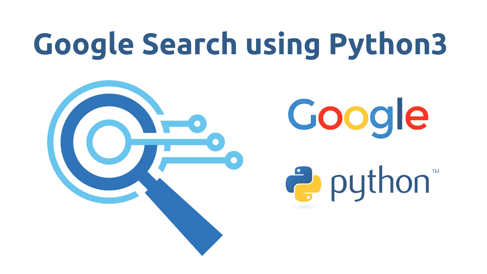
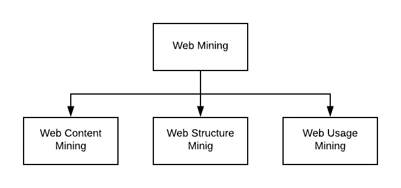
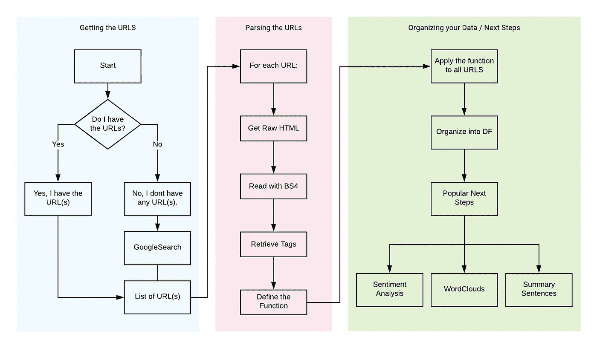
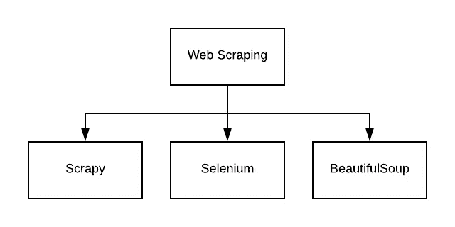

# 当前使用 Python3.7 的 Google 搜索包:简单教程。

> 原文：<https://towardsdatascience.com/current-google-search-packages-using-python-3-7-a-simple-tutorial-3606e459e0d4?source=collection_archive---------5----------------------->

## **简介**

本文总结了当前使用 Python 3.7 实现 Google 搜索查询的常用库和包。写这篇文章的动机来自于我收到或看到的关于这个主题的异常多的请求。这背后的原因是 Google 的 SOAP 和 AJAX API 的停止使用——这两者都是为此目的而设计的。围绕数据科学和 python 的许多领域都有很好的文档记录，但是我发现在 Python 中使用 Google 搜索并没有很好的文档记录，这也是我写这篇文章的动机。



## **谷歌搜索——现代的必需品**

使用谷歌搜索已经成为我们时代的一种主要方式，可以在几毫秒内从互联网的各个角落释放信息。在过去的 20 年中，我们一直依靠这种常见的方法来查询从新闻文章到研究主题的各种信息。随着过去几年数据科学的兴起，搜索互联网的两个最常见的原因是(1)解决堆栈溢出问题，或(2)数据挖掘——第二个原因将是本文的重点。

无论是为了科学目的还是商业智能项目，Python 和数据挖掘都被证明是一对非常有效的工具。数据挖掘被定义为检查大量数据以提取新信息或见解的方法。就本文的目的而言，因为它与 web 有关，所以从 internet 挖掘数据的方法称为 web 挖掘，它可以分为三类:(1) Web 内容挖掘，(2) Web 使用挖掘，以及(3) Web 结构挖掘。



## **谷歌搜索——事物的大计划**

在我最近看到的许多与 web 挖掘相关的项目中，检索数据的首选方法是使用 google search 来检索 URL，以便进行 web 抓取。大部分项目都遵循这种通用格式，在这种格式中，URL 被获取，每个 URL 被解析和抓取，最后所有的数据被组织起来。出于本文的目的，我们现在只关注 URL 检索过程(蓝色部分)。需要强调的是，根据您正在寻找的数据类型；使用 RSS 源可能更合适。这当然很大程度上取决于您考虑的数据源是否提供 RSS 提要。我们稍后将再次讨论这个问题。



The general flow of thought in this article begins with the retrieval of URLs, which are then parsed, and then set up for future analysis.

现在让我们检查一个具体的用例。**我们希望识别和量化某个公司的新闻文章或感兴趣的话题**。**在这种情况下，我想找到所有与人们对苹果公司新款 iPhone 的评论相关的文章**

## **我们开始吧——我们有 3 个选项可以通过 Python 进行搜索**

在本文发表之日，有三个公共库允许通过 Python 进行谷歌搜索。我们将从最简单的开始，转到最复杂的，因为我想确保所有数据科学家和所有非技术读者能够跟上。也就是说，你会注意到我概述的代码并不完全是最“皮托尼卡”。在写这篇文章的时候，我试图在“简单”和“高效”之间保持一个健康的平衡，以确保所有的读者都从中受益。

**选项 1——谷歌图书馆(免费，但有限制)**

我们首先在终端命令行上使用 pip 安装[谷歌](https://pypi.org/project/google/)库:

```
pip install google
```

在我们的 Jupyter 笔记本中，我们可以通过以下方式导入库:

```
from googlesearch import search
```

然后，我们概述我们想要查询的内容。在我们的案例中，我们希望监控一个特定的公司或话题。让我们以“苹果”公司和“苹果手机”为例，检索关于它们的新闻文章。

```
query = "apple iphone news 2019"
```

下一步是创建一个空列表，并使用“for 循环”迭代代码:

```
my_results_list = []for i in search(query,        # The query you want to run
                tld = 'com',  # The top level domain
                lang = 'en',  # The language
                num = 10,     # Number of results per page
                start = 0,    # First result to retrieve
                stop = None,  # Last result to retrieve
                pause = 2.0,  # Lapse between HTTP requests
               ): my_results_list.append(i)
    print(i)
```

就这样！结束了。

这个库运行良好，并可靠地返回结果(而且是免费的！).然而，有一个方面我们没有考虑。“暂停”参数每次都会将查询延迟 2 秒。如果您要查找更多的结果，这将大大增加您的搜索时间。删除这个参数通常会在几秒钟内导致 403 错误(也就是谷歌阻止你)。除了遵守第二条规则之外，没有任何好的方法来解决这个问题(至少对于这个特定的包来说)。

**选项 2-谷歌搜索结果库(非免费，无限制)**

这里的第二个选择是使用 [SERP](https://pypi.org/project/google-search-results/) 的谷歌搜索功能。

```
from serpapi.google_search_results import GoogleSearchResultsclient = GoogleSearchResults(
                  {"q" : "apple iphone news 2019",  # The query
            "location" : "Boston,MA",               # Location
      "secret_api_key" : "secretKey"}           # API Key from SERP
                            )
result = client.get_dict()
result
```

虽然这个库有相关的成本，但它值得研究，因为它允许您避开上面选项 1 中 google 库中 HTTP 请求的 2 秒暂停。总之，这是一个伟大的图书馆，但它不是免费的。

**选项# 3——谷歌应用编程接口客户端(大部分免费，大部分无限制)**

据我所知，[谷歌 API 客户端](https://github.com/googleapis/google-api-python-client/blob/master/docs/README.md)，*，是我们目前为止看到的唯一一个谷歌拥有的项目。当涉及到导航这个空间时，它们提供了广泛的能力。我把它们列在最后，因为对于一些人来说，建立一个完整的账户并准备好是一个困难的过程。但是，如果您正在开发一个严重依赖搜索查询的模型，我建议您优先选择这个选项。*

*在过去，我试图介绍注册的基本步骤，但是过程中的小步骤似乎经常改变。我建议你首先阅读最新的“[入门](https://github.com/googleapis/google-api-python-client/blob/master/docs/start.md)”页面。一旦你建立了一个帐户，你将需要获得两个项目:(1)一个私人的 [API](https://cloud.google.com/docs/authentication/api-keys) 密钥，和(2)一个[自定义搜索引擎](https://cse.google.com/cse/all) ID。*

*设置好帐户后，继续安装库:*

```
*pip install google-api-python-client*
```

*安装了库之后，您可以继续运行您的第一个查询:*

```
*from googleapiclient.discovery import build   #Import the libraryapi_key = "my-secret-api-key"
cse_id = "my-secret-custom-search-id "def google_query(query, api_key, cse_id, **kwargs):
    query_service = build("customsearch", 
                          "v1", 
                          developerKey=api_key
                          )  
    query_results = query_service.cse().list(q=query,    # Query
                                             cx=cse_id,  # CSE ID
                                             **kwargs    
                                             ).execute()
    return query_results['items']my_results_list = []my_results = google_query("apple iphone news 2019",
                          api_key, 
                          cse_id, 
                          num = 10
                          ) for result in my_results:
    my_results_list.append(result['link'])
    print(result['link'])*
```

*我认为最后一个选项是检索 URL 列表的最佳方式(甚至是一些原始的 HTML 数据！)以一种可靠且免费的方式。*

*总结了这三种方法后，我们以一个 URL 列表结束，我们现在可以解析这个列表来检索感兴趣的信息。我想指出的一个方面是，我们运行了 google 搜索来检索关于感兴趣的公司或主题的信息。有人可能会说 RSS 提要更适合检索新闻——事实也的确如此。然而，从商业智能的角度来看，我们希望确保所有相关的结果都出现在我们的查询中，并且数据不会偏向一个新闻源而不是另一个。一种常见的方法是将查询结果和 RSS 提要结合在一起，不过，我们将在另一个时间讨论这个问题。*

## ***向前移动&下一步***

*既然已经设置好了 URL 列表，下一个目标就是解析 URL 并检索数据。抓取 web 是数据科学的一个记录良好的领域，近年来随着文章和教程的出现而蓬勃发展。也就是说，我不会在本文中涉及它。但是，我会提供一些后续步骤的指导。*

*回头看看前面提到的框架，下一步是从 web 上搜集数据，然后相应地组织内容，为要开发的模型做准备。有几个不同的库可以用于这个过程。Scrapy 是一个优秀的抓取框架，当涉及到网页抓取时，它被称为“一体化”包。另一方面，我们有 Selenium，这是一个为浏览器自动化设计的库，允许您在页面之间导航。最后，我们有 [BeautifulSoup](https://pypi.org/project/beautifulsoup4/) ，它是一个更加保守和用户友好的数据检索器。鉴于 BS4 更加直接，非常适合大多数数据科学家的需求，我建议继续使用它。*

**

*There are 3 main libraries commonly used for scraping websites. I find BeautifulSoup to be the easiest to learn and follow — therefore we will use this an example for this article and tutorial.*

**我希望这篇文章对 Python 3.7 中搜索查询的使用有所帮助。我鼓励任何有你希望我报道的话题或想法的人，给我发电子邮件到 salehesam@gmail.com。**