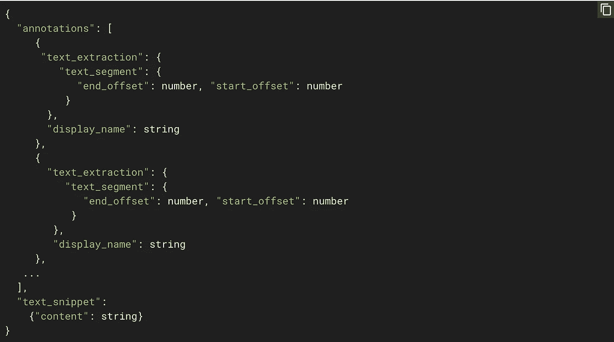

# 使用自定义实体提取解析结构化文档

> 原文：<https://towardsdatascience.com/custom-entity-extraction-e966e00f6f47?source=collection_archive---------3----------------------->

Let’s talk about parsing structured documents with entity extraction!

网上有很多很棒的教程,解释如何用机器学习对大量文本进行分类。但是，如果不仅仅是*对*文本进行分类，而是想要对单个单词进行分类，比如:

You can’t make me apologize for loving Comic Sans.

这被称为[实体提取](https://en.wikipedia.org/wiki/Named-entity_recognition)(或命名实体识别)，它非常有用。例如，您可以使用这种技术来挑选新闻文章中提到的所有人和地点，并将它们用作文章标签(新闻编辑室有时会这样做)。

实体提取(EE)对于解析结构化文档也很有用，比如表单、w4、收据、名片和餐馆菜单(这就是我们今天要用的)。

对于今年的 Google I/O，我想建立一个应用程序，它可以拍摄餐厅菜单的照片并自动解析它——提取所有的食物、它们的价格等等。(你可以在这里看到我在舞台[上演示。)](https://www.youtube.com/watch?v=OxJ-zBjVhIM&t=726s)

我希望能够上传一张这样的菜单图片:

Step one: upload a photo of a menu

然后使用机器学习从菜单中神奇地提取实体，如餐厅的地址、电话号码、所有的食物标题(“沙拉”、“主菜”)、所有的食物、它们的价格和它们的描述(即“在椒盐卷饼上”)。

这个想法是，如果你是一家想要在像 Seamless 或 Grubhub 这样的应用程序上上市的餐馆，你可以输入你的菜单，而不必手动输入整个菜单。

Step two: identify all the foods, plus the food headings (“Salads,” “Mains”) and their descriptions (“On a pretzel bun”).

那么它是如何工作的呢？

首先，我使用 [Google Cloud Vision API](https://cloud.google.com/vision/#benefits) 的文本检测功能将我的菜单图片转换成原始文本。

一旦我有了文本格式的菜单，我就使用实体提取来解析它。我用两种技术做到了这一点:

1.  我使用 [Google Cloud 自然语言 API](https://cloud.google.com/natural-language/) 提取了餐馆的地址、电话号码和所有列出的价格。
2.  为了识别食物项目、标题和食物描述，我必须建立一个定制的机器学习模型(稍后会详细介绍)。

自然语言 API 能够自动检测常见的实体。例如，如果我向它发送字符串:

> 戴尔想从加利福尼亚州山景城 ampi theatre Pkwy 1600 号的咖啡店购买一个 3.50 美元的羊角面包，该咖啡店的电话号码是(650)253–0000。

The NL API recognizes entities like people, consumer goods, addresses, price, phone numbers, and more.

接下来，我添加了一张餐馆照片、星级评定和一张地图，让我的应用程序变得更加时尚。这些信息都没有直接印在菜单上，但餐馆的电话号码是。使用这个电话号码，我可以查询 [Google Places API](https://developers.google.com/places/web-service/search) 来获取照片、星级等。

The restaurant’s star rating, photo, and GPS location come from the Places API.

# 构建自定义实体提取模型

好的，但是现在是困难的(也是最关键的)部分:我们如何提取菜单上的所有食物？我们如何区分什么是食物(“素食汉堡”)，什么是食物标题(“主菜”)，什么是食物描述(“在椒盐卷饼上”)？

这些*实体*完全是**特定领域的**。在我们的例子中，我们希望认识到“主菜”是一个食物标题。但是如果我们转而解析报纸，我们可能想要识别标题和文章正文之间的区别。或者，如果我们在分析简历，我们会想确定“高级软件工程师”是一个职位，而“Python”是一种编程语言。

虽然我之前提到的自然语言 API 可以识别电话号码和地址等等，但是它没有经过训练来识别这些特定于领域的实体。

为此，我们必须构建一个定制的实体提取模型。有很多方法可以做到这一点，但是我将向你展示一个我认为最简单的方法(代码最少)，使用 Google AutoML 自然语言。我们将使用它来训练自定义实体提取模型。

它是这样工作的:

1.  上传带标签的菜单数据集
2.  训练模特
3.  使用您的模型通过 REST API 识别定制实体

# 标签数据

但是在哪里可以找到一个标签菜单的数据集呢？

方便的是，我找到了[这个由](http://menus.nypl.org/)托管的菜单扫描的数据集(并贴上了标签！)由纽约公共图书馆提供。太棒了。

首先，我再次使用 Vision API 将数据集中的所有菜单转换为文本。

为了训练一个定制的实体提取模型，我必须将我的数据及其标签转换成 jsonl 格式([AutoML 期望的格式](https://cloud.google.com/natural-language/automl/entity-analysis/docs/prepare))。看起来是这样的:

jsonl file format

我要诚实地警告你，实际上给这些菜单贴标签是一件痛苦的事情。我使用一些粗糙的 Python 脚本将数据集的标签与 OCR 提取的菜单文本配对，但它们经常不对齐。我不得不进入 AutoML 用户界面，手工标记这些菜单，就像这样:

Hand-labeling menus using the AutoML editor.

回想起来，我可能应该使用一个[数据标签服务](https://cloud.google.com/vision/automl/docs/human-labeling)，这样我就不必浪费时间给自己(或者实习生，也许？).

我还抓取了维基百科的[美食页面](https://en.wikipedia.org/wiki/List_of_Italian_dishes)，生成了一些假菜单来帮助扩充我的数据集。

# 训练模型

使用 Google AutoML，构建模型最困难的部分是构建带标签的数据集。实际上*训练*一个有这些数据的模型非常简单——只要跳到“训练”标签，然后点击“开始训练”建立一个定制模型大约需要 4 个小时。

Behind the scenes, Google trains a neural network to extract your custom entities.

# 做预测

当我们的实体提取模型完成训练后，我们可以在 AutoML UI 中测试它:

The model tagged most of the entities, but missed “Potato Chips” and “Fish and Chips.”

如你所见，它并不完美。

但是你想要什么？！那就是机器学习。不是*完美*。

也就是说，考虑到我的数据集很小(不到 150 个菜单)，这还不错。我也没有考虑到文本的大小或它在页面上的位置(标题通常比菜名大，菜名比它们的描述大)。

但是，如果我是一家餐馆，我可以使用这个工具来导入我的菜单，而不是手动输入每一种食物，我会节省很多时间(尽管我可能需要做一些编辑)。此外，越多假设的餐厅使用我的应用程序，我就能获得越多假设的数据点来改进我的模型。

与此同时，谷歌咖啡馆的午餐来电。再见。

P.S .如果训练自己的实体提取模型，在评论里说说或者 [@dalequark](https://twitter.com/dalequark) 。

快乐造型！

想要更多这样的故事吗？更多阅读请点击**。**