# 如何使用 R 在 Power BI 中生成定制的视觉效果

> 原文：<https://towardsdatascience.com/custom-html-visuals-in-power-bi-using-r-2b0494894ff?source=collection_archive---------15----------------------->

## 在 Power BI 中轻松创建交互式 R powered HTML 视觉效果


您是否曾想通过 Power BI 显示自己定制的视觉效果？如果答案是肯定的，那么这篇文章将帮助您快速了解如何导入在 R 中创建的自定义视觉效果，并在您的常规 Power BI 报告中使用它们。

# **先决条件:**

**安装 R and R 工作室:**假设已经安装了 Power BI 桌面应用，首先需要安装 R 语言和集成开发环境(IDE)来运行 R 脚本。写这篇文章的时候，我正在使用 R-3.5.1 和 [R Studio](https://www.rstudio.com/products/rstudio/download/#download) 。

**在 Power BI 中启用 R 视觉功能:**从 Power BI 桌面，转到文件>选项和设置>选项，然后在 R 脚本选项卡中选择您的 R 主目录和 IDE。

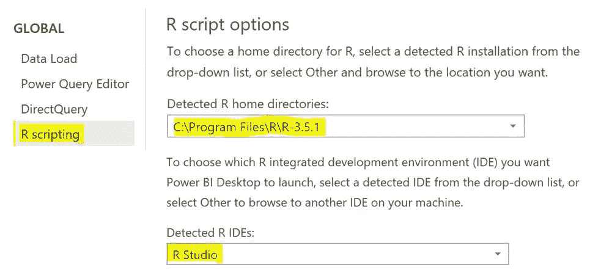

Enabling R home directory and IDE in Power BI

**安装 node.js:** 访问这个[网站](https://nodejs.org/en/)并下载最新的特性安装程序。按照向导中的安装步骤完成该过程。完成后，重新启动计算机开始。

**安装包:**打开 node.js 命令提示符，执行以下命令:

```
*npm install -g powerbi-visuals-tools*
```

要检查安装是否成功，请运行以下命令:

```
*pbiviz* 
```

您应该会看到如下所示的帮助屏幕。

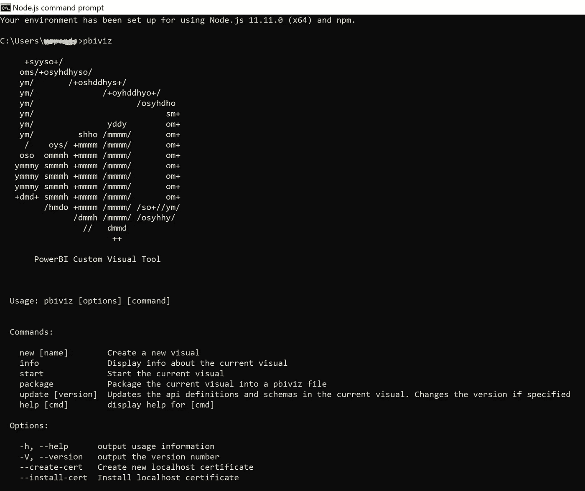

Successful installation of Power BI visual tools

**数据:**我使用了来自 UCI 机器学习知识库的老爷车评估数据集。你可以从[这里](http://archive.ics.uci.edu/ml/datasets/Car+Evaluation)下载，保存成 CSV 格式。根据该数据集，客户对汽车的接受程度取决于 6 个主要标准——购买价格、维护成本、车门数量、载客量、行李箱尺寸和汽车的预计安全性。这是数据集的一瞥:

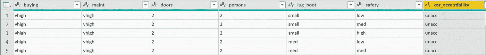

Car evaluation data set

在本文中，我将创建一个 HTML 100%堆积柱形图来显示汽车的可接受性如何随购买价格而变化。

# **使用 R 创建 HTML 视觉效果:**

**连接到数据:**首先，使用 Get Data 从 Power BI 桌面应用程序连接到您的数据。数据导入后，在可视化窗格中单击 R script 可视化图标。将要使用的列拖放到值区域。这将自动生成您将要处理的数据集。单击 R script 编辑器角落的小箭头，重定向到 R Studio，这样您就可以尝试和测试您的代码来生成定制的视觉效果。

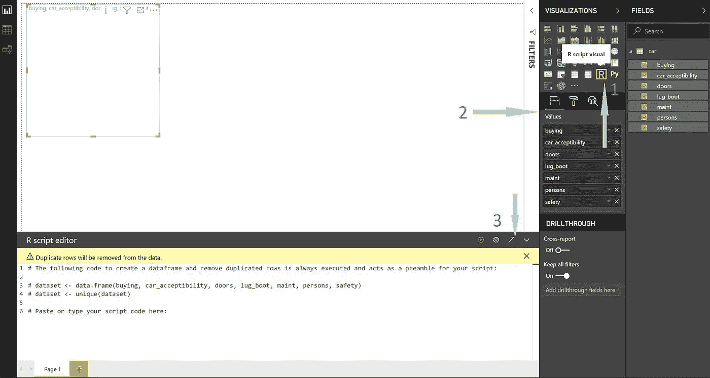

Step by step instruction on how to create R script visuals

你可以跳过以上所有步骤，直接在 R Studio 中编写 ***read.csv*** 代码，连接你保存在本地机器中的数据。

**创建常规的非 HTML 视觉效果:**一旦 R Studio 打开，您可以看到读取数据集的代码已经存在，您可以立即开始您的分析。写下你的 R 代码，运行到 R studio 中，生成你想要的视觉效果。我在 R 中使用了流行的 ***ggplot2*** 库来可视化汽车的购买价格与其可接受性之间的关系。

```
*library(ggplot2)
g <- ggplot(data=dataset, aes(x=dataset$buying,     
           fill=dataset$car_acceptibility)) + 
           geom_bar(stat=”count”) + 
           scale_x_discrete(name =”Buying Price”) +
           scale_fill_discrete(name=”Acceptability”)
g*
```

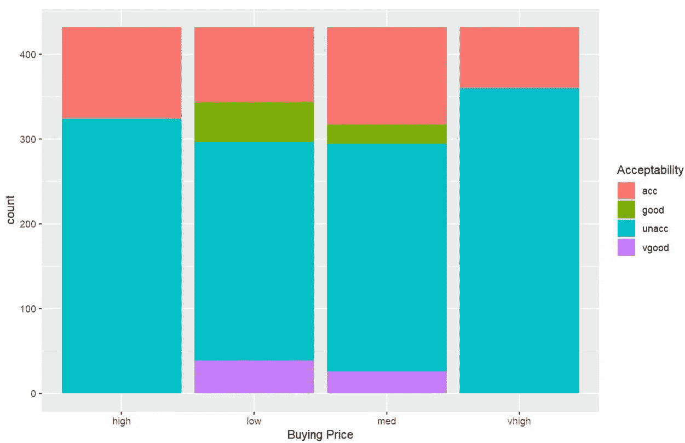

Buying price vs. Car acceptability

如果您在 Power BI 的 R 脚本编辑器中直接使用上面这段代码，它会生成一个图表，表明购买价格非常高的汽车很可能不会被大多数客户接受。您可以创建自己的过滤器来分割这个交互式图表。

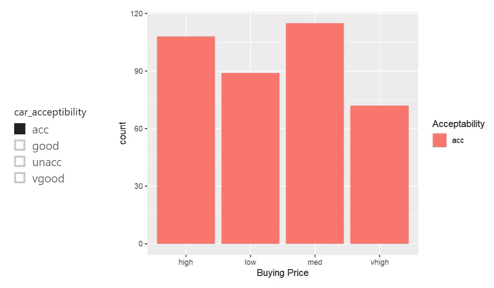

Filtered chart to display only accepted cars

例如，如果您只想查看各种购买价格类别中接受的汽车数量，您可以创建一个汽车可接受性切片器并过滤数据。请注意，这不是一个 HTML 输出。

**创建 rhtml 模板:**常规 R-powered 定制可视化将输出绘图显示为静态图像。要生成 HTML 视觉效果，您需要创建 rhtml 模板。在 node.js 命令提示符下，执行以下命令:

```
*pbiviz new demoCarEvaluation -t rhtml*
```

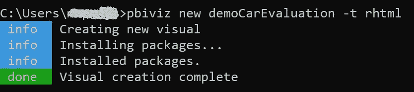

rhtml template creation

这个模板包括一个非常基本的可以运行的 R Visual，它可以创建 HTML 输出。

**使用 rhtml 模板:**导航到您的本地机器，找到创建***democare evaluation***文件夹的位置。在我的例子中，很明显这个文件夹在 c 盘> Users > username 中。找到新创建的文件夹后，打开它并在 R Studio 中编辑 ***script.r*** 文件。将您写下的代码粘贴到 ***script.r*** 的“实际代码”部分，以生成静态 R 可视化。

在下图中，你可以看到我已经粘贴了之前用来生成上面的堆积柱形图的全部代码。

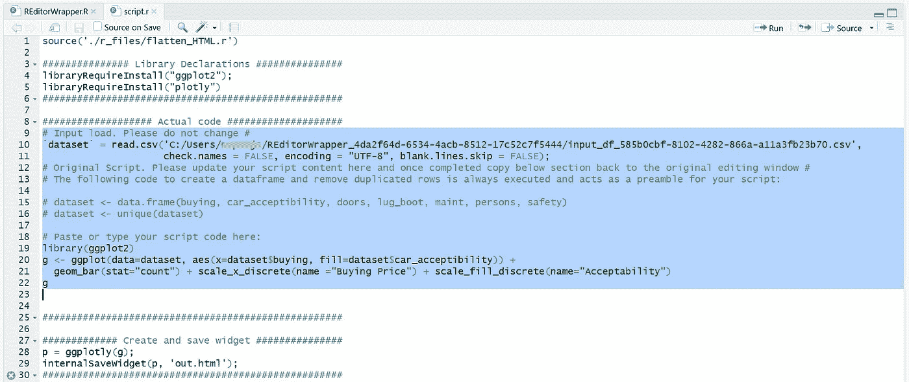

**运行 rhtml 模板:**转到 node.js 命令提示符，使用更改目录命令导航到存储 ***script.r*** 的文件夹。若要打包 visual，请执行以下命令:

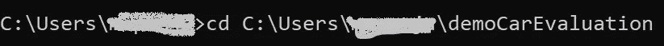

Changing the directory

```
*pbiviz package*
```

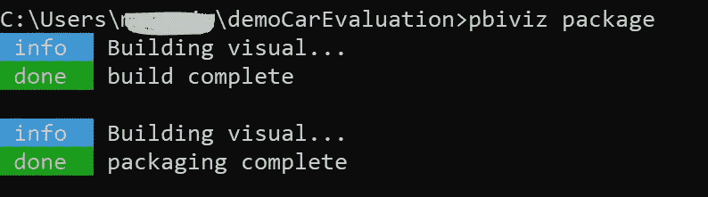

Creating the package

打包完成后，返回 Power BI 桌面应用程序，点击可视化窗格中的 ***从文件*** 导入。浏览到*内的 ***dist*** 文件夹，导入 ***pbiviz*** 文件在报告中使用。*

***在 Power BI 中创建自定义可视化:**完成上述所有步骤后，您将在可视化窗格中获得一个新图标。点击***democare evaluation***图标，在 Values 字段下拖动您想要在视觉中使用的列，您将在报告中看到您的 HTML 图表。将鼠标指针悬停在图表上，您将看到图表每个部分的更多详细信息。HTML 视觉支持一系列活动，如放大/缩小、自动缩放等。*

*如果你想在相同的数据上创建其他的视觉效果，你只需要编辑 ***script.r*** 文件，再次运行***pbi viz package***命令，你将能够非常快速和容易地创建新的视觉效果。*

*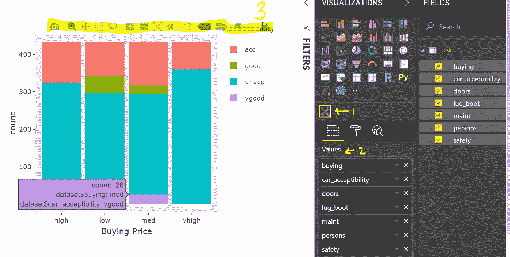*

*HTML custom visual using R*

*探索和享受！*

*<<note: this="" is="" an="" old="" article="" originally="" published="" in="" march="" as="" power="" bi="" changes="" rapidly="" please="" check="" microsoft="" documentation="" site="" for="" the="" latest="" updates.="">></note:>*