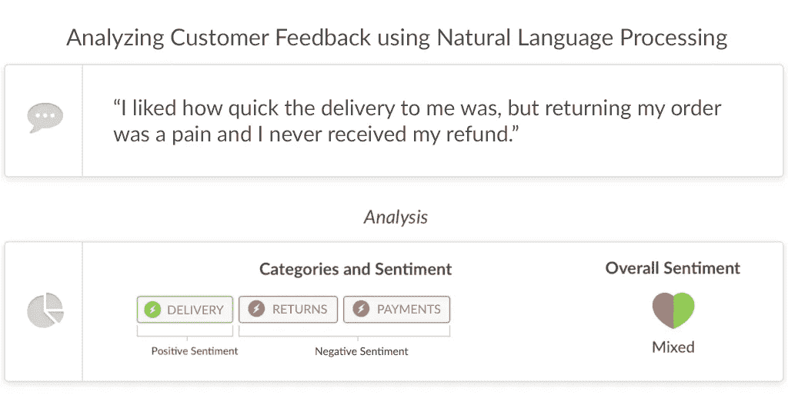
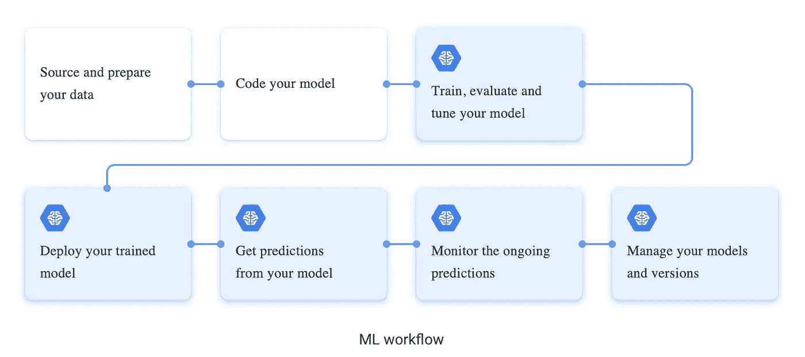
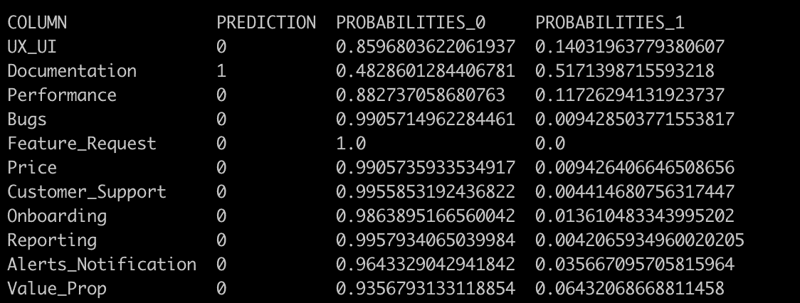

# 谷歌人工智能平台上的定制模型部署服务

> 原文：<https://towardsdatascience.com/custom-model-deployment-on-google-a-i-platform-serving-b86545ca135f?source=collection_archive---------14----------------------->


Source: Google

## 我在 Wootric 部署定制机器学习模型、管道和预测例程的经验

R 最近，谷歌云人工智能平台服务(CAIP)增加了一个新功能，机器学习(ML)从业者现在可以使用他们喜欢的框架，通过定制的预处理管道和预测例程来部署模型，所有这些都在一个**无服务器微服务**下。在这篇博文中，我详细解释了我们 Wootric 如何利用这一功能，并提到了一些需要注意的细节，因为该产品仍处于测试阶段。

# 一点背景知识



[https://engineering.wootric.com/all](https://engineering.wootric.com/all)

在我们将焦点完全转移到模型部署之前，我将花一点时间向您介绍一下我们的模型试图解决的问题的背景。在 Wootric，我们使用 NLP 和深度学习来学习和标记不同行业的客户和员工反馈中的主题。一条反馈可以与一个或多个标签相关联，如上图所示。要了解我们产品的更多信息，请访问[此](https://www.wootric.com/text-sentiment-analysis-for-customer-feedback/)链接。这可以看作是一个模型的[多标签分类](https://en.wikipedia.org/wiki/Multi-label_classification)问题，或者是 *n* 模型的两类[多类分类](https://en.wikipedia.org/wiki/Multiclass_classification)问题。出于这篇博客的目的，我们将把它视为一个多类分类问题，并为 *n* 个标签部署 *n* 个模型。

## 模型概述

当我开始研究这个问题时，我用传统的 ML 分类器进行了实验，这些分类器根据每个标签的数据的不同单词包表示进行训练，作为基线。在这些模型中，总体来说最好的是随机森林模型。在本文中，为了便于解释，我们将部署这些模型，这样我们就可以花更多的时间在 CAIP 上进行定制部署，而不会迷失在模型的复杂性中。在后面的帖子中，我们将在更高的层次上讨论基于 CNN 的模型和基于序列的多标签模型的部署，两者都是用 pytorch 编写的。

# 人工智能平台服务概述



[https://cloud.google.com/](https://cloud.google.com/) — — The blue boxes highlight where CAIP comes into play

我们将在上图下半部分的 4 个方框中快速谈论 CAIP 的优势。要了解如何使用 CAIP 来训练和评估模型，请访问此[链接](https://cloud.google.com/ml-engine/docs/technical-overview#training_service)。

在 CAIP 上，我们可以部署使用直接兼容的框架(sklearn、XGBoost、tensorflow)中的管道训练的模型，或者部署具有所需依赖关系的自定义预测器类和任何自定义的状态相关的预处理和后处理类作为**源分发包**。这里一个很大的积极因素是原始数据预处理、预测和预测后处理的耦合，所有这些都在一个模型微服务下；一切都发生在服务器端！这有几个值得一提的好处。首先，由于客户端没有进行预处理，这就将客户端从模型中分离出来。因此，我们可以在不更新客户端的情况下更新预处理代码，或者为更新提供新的端点。其次，不存在[训练-服务偏斜](https://developers.google.com/machine-learning/guides/rules-of-ml/)，因为预处理步骤中的任何变化都会迫使我们重新训练模型。

此外，CAIP 的自定义预测例程允许我们将基于规则的预测与模型预测相集成，还可以从存储在存储桶中的模型集合中聚合预测。

由于这篇博客完全专注于定制部署，如果你对从 CAIP 支持的库中部署预定义的模型管道感兴趣，请参考这篇[教程](https://cloud.google.com/ml-engine/docs/scikit/deploying-models)。

## 进入状态…

在我们继续之前，您应该:

*   熟悉 [Google Cloud SDK](https://cloud.google.com/sdk/) ，
*   在 GCP 上创建一个项目，启用计费并启用 AI 平台(“云机器学习引擎”)和计算引擎 API。

或者，您可以在谷歌云平台(GCP)控制台上重复这些步骤，或者使用 REST API。

# 让我们进入代码

我有 11 个随机的森林模型，为 11 个不同的标签训练。这些标签是消费者对 SAAS-y 公司反馈的常见主题。以下是标签:

```
["Alerts_Notification", "Bugs", "Customer_Support", "Documentation", "Feature_Request", "Onboarding", "Performance", "Price", "Reporting", "UX_UI", "Value_Prop"]
```

考虑到我们正在处理嘈杂的文本数据，拥有可以清理数据的自定义预处理帮助程序肯定是有用的，如下所示:

简而言之，清理步骤包括数据的小写、使用 wordnet pos 标签的词汇化以及删除标点符号。这里要注意的一个重要步骤就在 gist 的上面，我将所需的 NLTK 资源下载到`tmp` 文件夹中，我将它附加到 NLTK 可以查找资源的路径列表中。**在运行时**，这是此类资源的唯一可写文件夹。另一种方法是将这些资源保存在包含所有模型工件的源分发包 tarball 中作为序列化对象，并将它们直接加载到自定义预测器类中(我们将在后面讨论)。

下面是我用来训练每个模型的代码:

在上述要点中需要注意的重要一点是使用了来自 sklearn 的 **FunctionTransformer** 方法，该方法允许我们向管道添加自定义预处理例程，只要自定义例程的 I/O 与其相邻例程的 I/O 一致。本质上，上面的代码循环遍历数据帧中的每个标签，使用`LabelEncoder`将标签列转换为标签。然后，使用反馈`r_text` 和转换后的标签为每个标签训练一个模型，最终导出为酸洗对象。可以认为，在这种情况下，具有包含`clean_data_custom` 和`text_transform` *，*的公共预处理 sklearn 管道对象将是最佳的，因为每个模型都在相同的数据上被训练，具有相同的配置。然而，为了简单起见，我们允许每个模型都有自己的预处理管道。如果您最终得到了一个公共管道对象，这可以合并到自定义预测器类中，我们将在接下来讨论。

让我们快速回顾一下。到目前为止，我有 11 个酸洗的模型管道(每个标签一个)，以及一个预处理模块，带有用于清理的辅助函数。

现在的主要问题是，CAIP 如何将预测的输入反馈导入这 11 个模型？另外，我该如何处理 *preprocess.py* 以便 CAIP 可以将其链接到模型管道对象，这样他们就可以使用`clean` 函数了？

为了解决第一个问题，**自定义预测例程**开始发挥作用。参考下面我写的 CustomPredictor 类:

在我们继续之前，要知道每次我们为一个定制的预测例程创建一个新的模型版本时，我们都会将信息传递给 CAIP，它可以使用这些信息在一个存储桶中寻找模型工件。稍后我们将在代码中看到如何做到这一点，但现在要理解这些信息是使用标志传递给 gcloud 的。因此，当我们创建一个新的模型版本时，我们设置`prediction-class` gcloud 标志指向 multiTag 模块中的 CustomPredictor 类。GCP 现在所做的是在源代码发行包**、**中查找这个类，并调用带有模型目录的`from_path`类方法作为参数，它从另一个名为`origin` 的标志中选取这个参数，这个标志也是在创建模型版本时传递的。确保 GCP 在这里传递正确的目录路径是至关重要的！该方法将所有加载的模型存储到一个列表中，并用这个列表实例化一个`CustomPredictor` 对象。

现在，在创建自定义预测器类时，必须遵循以下模板:

基本上，总是让`from_path`方法返回一个带有相关参数的自定义预测器类的实例，在本例中只是一个模型列表。这也是我们可以加载自定义预处理管道对象并将其传递给自定义预测器的地方，我们在前面简单地讨论过。现在，所有的神奇都发生在 predict 函数中。这将 JSON 反序列化的输入字符串列表作为输入。如代码所示，我简单地循环每个实例，循环每个模型，并将预测结果作为 python 中的 dictionary 对象追加。返回的`results`必须是 **JSON 可序列化的**。

现在回到第二个问题(你记得是什么吗？).我如何告诉 CAIP 将 *preprocess.py* 链接到模型管道对象，以便它们可以使用`clean` 函数？另外，我如何上传 *multiTag.py* 模块？

这两个问题的答案都是一样的:作为一个**源码分发包** (SDP)！如果您没有记错的话，我曾经提到过几次，所有的工件都必须包含在 SDP 中，并且这两个文件都算作模型工件。

下面是创建 SDP 的模块 *setup.py* :

scripts 参数应该是每个相关脚本的本地路径的 iterable。要创建 SDP，请运行以下命令:

```
python setup.py dist --formats=gztar
```

这里，`dist`是 SDP 的目标目录。

现在我们已经准备好了所有的脚本和模型，剩下的就是运行几个 gcloud 命令，将模型和 SDP 复制到一个存储桶，创建一个模型资源并将其链接到这个桶，最后创建一个模型版本并进行在线预测！

首先，创建一个具有有效存储段名称和区域的存储段:

```
$BUCKET_NAME="multiTag_bucket"
gsutil mb -l $REGION gs://$BUCKET_NAME
```

为了复制模型和 SDP，我使用了`gsutil cp`命令:

```
gsutil -m cp *.pkl gs://$BUCKET_NAME
gsutil cp dist/multiTag_custom_package-0.1.tar.gz gs://$BUCKET_NAME/multiTag_custom_package-0.1.tar.gz
```

更容易将 bucket 放在注册到 AI 平台的同一个项目中，否则 bucket 将需要 [**显式访问**](https://cloud.google.com/ml-engine/docs/tensorflow/working-with-cloud-storage#setup-different-project) 到 AI 平台服务帐户。

现在我们已经将所有的工件都放在了一个存储桶中，让我们创建一个模型:

```
gcloud ai-platform models create "multiTag_model"
```

让我们也设置以下变量

```
MODEL_DIR="gs://multiTag_bucket"
VERSION_NAME="v0"
MODEL_NAME="multiTag_model"
CUSTOM_CODE_PATH="gs://multiTag_bucket/multiTag_custom_package-0.1.tar.gz"
PREDICTOR_CLASS="multiTag.CustomPredictor"
```

我将所有的模型和工件直接放入桶中，没有创建任何额外的目录，所以我的`MODEL_DIR`只是桶 URI(通用资源标识符)。如果您的模型和相关的工件有不同的目录结构，确保您为 `MODEL_DIR`和`CUSTOM_CODE_PATH`给出了正确的绝对路径。

现在，创建如下面代码所示的版本。这就是我之前的意思，当我提到在创建一个模型版本时，将所有关于模型工件的位置元数据传递给 CAIP。

```
gcloud beta ai-platform versions create $VERSION_NAME \
  --model $MODEL_NAME \
  --origin $MODEL_DIR \
  --runtime-version=1.13 \
  --python-version=3.5 \
  --package-uris=$CUSTOM_CODE_PATH \
  --prediction-class=$PREDICTOR_CLASS
```

一旦创建了版本，您现在可以发送在线预测的输入。用这种[格式](https://cloud.google.com/ml-engine/docs/tensorflow/prediction-overview#online_prediction_input_data)的输入创建一个. txt 或 JSON 文件(推荐)。

现在，您可以通过运行以下代码获得在线预测:

```
gcloud ai-platform predict --model $MODEL_NAME --version   $VERSION_NAME --json-instances $INPUT_FILE
```

并得到预测:



Predictions for a feedback

# 因此..

总的来说，我认为部署过程非常顺利，也很容易理解。然而，当我刚开始使用 CAIP 时，我面临的一个挑战是，对于部署期间或部署后(预测期间)的内部错误，回溯对调试没有太大帮助。我必须仔细检查每一点代码以了解问题，然后再次部署，这可能会让您有点紧张，因为部署过程本身需要几分钟，尤其是对于大型模型。所以调试这里或那里的小错误实际上会花费你很多时间！

等等，什么？你说用 CAIP `local predict`测试我的模型？对于那些不知道的人，在部署之前，您可以使用 CAIP `local predict`命令来测试您的模型在部署之前如何服务于预测。该命令使用本地环境中的依赖项来执行预测，并以与`[gcloud ai-platform predict](https://cloud.google.com/sdk/gcloud/reference/ai-platform/predict)`执行在线预测时相同的格式返回结果。在本地测试预测有助于您在为在线预测请求支付费用之前发现错误。但是，但是..酪这个特性不适用于定制的预测例程，所以在部署之前要非常小心你的代码！

最后，需要注意的最后一点是，CAIP 上模型工件的限制是 **250 MB** 。你可以[向](https://cloud.google.com/ml-engine/docs/scikit/quotas#requesting_a_quota_increase)谷歌申请更高的配额来部署更大的型号。

就这样，你成功了！我真的希望你喜欢阅读这篇文章，并发现它是有帮助的。如果您有任何问题，请留下您的评论！

部署愉快！