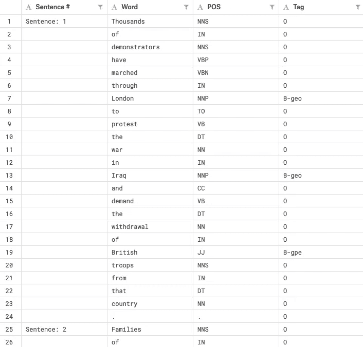
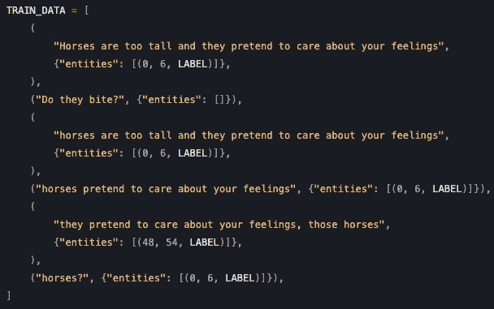
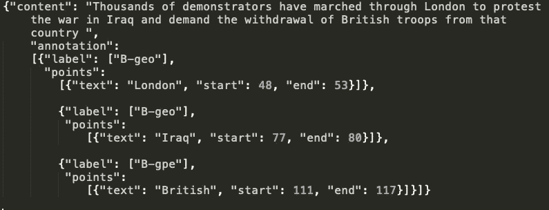

# 使用空间的自定义命名实体识别

> 原文：<https://towardsdatascience.com/custom-named-entity-recognition-using-spacy-7140ebbb3718?source=collection_archive---------0----------------------->


Figure 1: [Source](https://www.google.com/url?sa=i&source=images&cd=&cad=rja&uact=8&ved=2ahUKEwiKo-uSzffgAhXJknAKHXH4CwYQjRx6BAgBEAU&url=%2Furl%3Fsa%3Di%26source%3Dimages%26cd%3D%26ved%3D%26url%3Dhttps%253A%252F%252Fspacy.io%252Fusage%252Flinguistic-features%26psig%3DAOvVaw3H52fKKxtUkhEj4jVFkQxO%26ust%3D1552308120763958&psig=AOvVaw3H52fKKxtUkhEj4jVFkQxO&ust=1552308120763958)

# 什么是命名实体识别(NER)？

命名实体识别(NER)是信息提取(IE)的一个子任务，在一个或多个文本主体中找出指定的[实体](https://en.wikipedia.org/wiki/Named_entity)并对其进行分类。NER 也简称为实体识别、实体分块和实体提取。NER 被用于人工智能的许多领域( [AI](https://en.wikipedia.org/wiki/Artificial_intelligence) )，包括自然语言处理( [NLP](https://en.wikipedia.org/wiki/Natural_language_processing) )和[机器学习](https://en.wikipedia.org/wiki/Machine_learning)。

# NER 的空间

SpaCy 是 Python 中高级自然语言处理的开源库。它是专门为生产使用而设计的，有助于构建处理和“理解”大量文本的应用程序。它可以用于构建信息提取或自然语言理解系统，或者用于深度学习的文本预处理。spaCy 提供的一些功能包括标记化、词性(PoS)标记、文本分类和命名实体识别。

SpaCy 为 python 中的 NER 提供了一个非常有效的统计系统，它可以将标签分配给连续的标记组。它提供了一个默认模型，可以识别广泛的命名或数字实体，包括*个人、组织、语言、事件等。*除了这些默认实体之外，spaCy 还允许我们自由地向 NER 模型添加任意类别，方法是训练该模型，以便用更新的训练样本对其进行更新。

# 入门指南

## 装置

SpaCy 可以通过简单的`pip`安装来安装。您还需要下载您希望使用 spaCy 的语言的语言模型。

```
pip install -U spacy 
python -m spacy download en
```

# 我们开始吧！

## *数据集*

我们将要处理的数据集可以从[这里](https://www.kaggle.com/abhinavwalia95/entity-annotated-corpus)下载。我们将使用`ner_dataset.csv`文件，只训练 260 个句子。



Figure 2: NER Dataset

数据集由以下标签组成-

*   地理=地理实体
*   org =组织
*   per =人
*   地缘政治实体
*   tim =时间指示器
*   艺术=艺术品
*   eve =事件
*   自然现象

数据集遵循[生物](https://natural-language-understanding.fandom.com/wiki/Named_entity_recognition)类型标记。

## 数据预处理

SpaCy 要求训练数据采用以下格式-



Figure 3: spaCy Format Training Data ([Source](https://spacy.io/usage/training#ner))

所以我们必须把我们的数据从`.csv`格式转换成上面的格式。*(spaCy 也接受其他形式的训练数据。更多细节请参考* [*文档*](https://spacy.io/api/annotation#named-entities) *。)*我们首先删除列`Sentence #`和`POS`，因为我们不需要它们，然后将`.csv`文件转换为`.tsv`文件。接下来，我们必须运行下面的脚本来获取`.json`格式的训练数据。

现在数据应该是这样的，



Figure 4: Training Data in Json Format

下一步是将上述数据转换成 spaCy 需要的格式。可以使用以下脚本来完成-

现在我们已经为训练准备好了数据！让我们通过添加自定义实体来训练一个 NER 模型。

## 使用自定义实体培训空间 NER

SpaCy NER 已经支持像- `PERSON`人这样的实体类型，包括虚构的。民族、宗教或政治团体。`FAC`建筑、机场、公路、桥梁等。`ORG`公司、机关、机构等。`GPE`国家、城市、州等。

我们的目标是进一步训练这个模型，使其包含我们数据集中的自定义实体。要做到这一点，我们必须经历以下步骤-

1.  **加载模型**，或使用带有所需语言 ID 的`[spacy.blank](https://spacy.io/api/top-level#spacy.blank)`创建一个**空模型**。如果正在使用空白模型，我们必须将实体识别器添加到[管道](https://spacy.io/usage/processing-pipelines)中。如果使用现有模型，我们必须在训练期间使用`[nlp.disable_pipes](https://spacy.io/api/language#disable_pipes)`禁用所有其他管道组件。这样，只有实体识别器得到训练。

```
# Setting up the pipeline and entity recognizer.if model is not None:
    nlp = spacy.load(model)  # load existing spacy model
    print("Loaded model '%s'" % model)
else:
    nlp = spacy.blank('en')  # create blank Language class
    print("Created blank 'en' model")if 'ner' not in nlp.pipe_names:
    ner = nlp.create_pipe('ner')
    nlp.add_pipe(ner)
else:
    ner = nlp.get_pipe('ner')
```

2.**使用`[add_label](https://spacy.io/api/entityrecognizer#add_label)`方法将新的实体标签**添加到实体识别器中。

```
# Add new entity labels to entity recognizerfor i in LABEL:
    ner.add_label(i)# Inititalizing optimizerif model is None:
    optimizer = nlp.begin_training()
else:
    optimizer = nlp.entity.create_optimizer()
```

3.**循环遍历**示例，并调用`[nlp.update](https://spacy.io/api/language#update)`，逐步遍历输入的单词。在每一个单词上，它都会做出一个**预测**。然后，它查阅注释，看看它是否正确。如果它错了，它会调整它的权重，这样下次正确的动作会得到更高的分数。

```
# Get names of other pipes to disable them during training to train # only NER and update the weightsother_pipes = [pipe for pipe in nlp.pipe_names if pipe != 'ner']
with nlp.disable_pipes(*other_pipes):  # only train NER
    for itn in range(n_iter):
        random.shuffle(TRAIN_DATA)
        losses = {}
        batches = minibatch(TRAIN_DATA, 
                            size=compounding(4., 32., 1.001))
        for batch in batches:
            texts, annotations = zip(*batch) 
            # Updating the weights
            nlp.update(texts, annotations, sgd=optimizer, 
                       drop=0.35, losses=losses)
        print('Losses', losses) nlp.update(texts, annotations, sgd=optimizer, 
                       drop=0.35, losses=losses)
        print('Losses', losses)
```

4.**使用`[nlp.to_disk](https://spacy.io/api/language#to_disk)`保存**训练好的模型。

```
# Save model 
if output_dir is not None:
    output_dir = Path(output_dir)
    if not output_dir.exists():
        output_dir.mkdir()
    nlp.meta['name'] = new_model_name  # rename model
    nlp.to_disk(output_dir)
    print("Saved model to", output_dir)
```

5.**测试**模型，确保新实体被正确识别。

```
# Test the saved model
print("Loading from", output_dir)
nlp2 = spacy.load(output_dir)
doc2 = nlp2(test_text)
for ent in doc2.ents:
    print(ent.label_, ent.text)
```

使用此脚本来训练和测试模型-

执行指令-

```
python spacy_ner_custom_entities.py \
-m=en \ 
-o=path/to/output/directory \
-n=1000
```

## 结果

当对查询- `['John Lee is the chief of CBSE', 'Americans suffered from H5N1']`进行测试时，模型识别出以下实体-

```
John Lee is the chief of CBSE.B-per JohnI-per LeeB-org CBSE Americans suffered from H5N1 virus in 2002.B-gpe AmericansB-nat H5N1B-tim 2002
```

# 结论

我希望你现在已经明白了如何在斯帕西 NER 模型的基础上训练你自己的 NER 模型。感谢阅读！😊