# 面向非数据科学家的自定义对象检测— Tensorflow

> 原文：<https://towardsdatascience.com/custom-object-detection-for-non-data-scientists-70325fef2dbb?source=collection_archive---------3----------------------->

## 使用 Tensorflow 对象检测 API 用您自己的数据集训练模型。

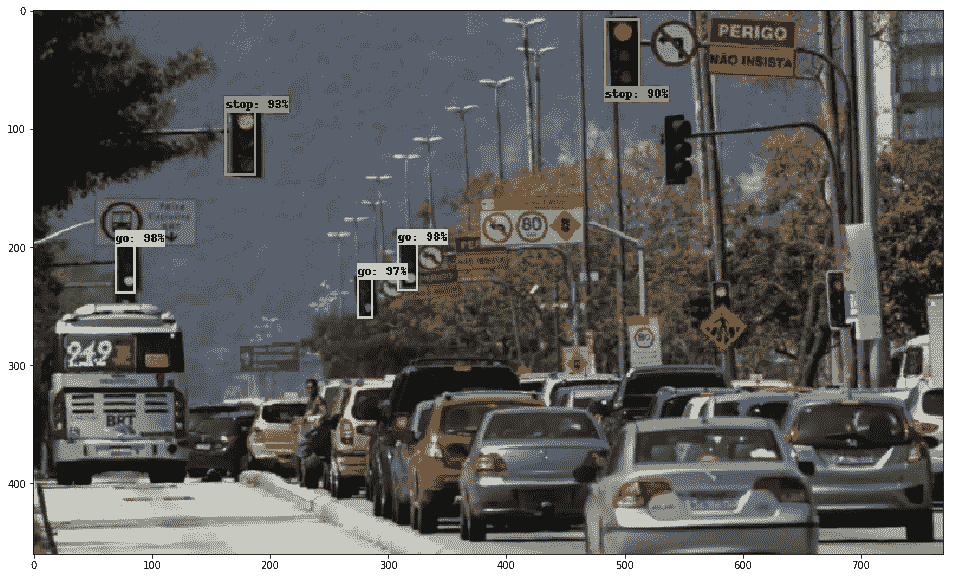

# 在这篇文章的结尾你能做什么

总的来说，在本教程结束时，你基本上能够拿起你的数据集，将其加载到 jupyter 笔记本上，训练并使用你的模型:)
上面的图片是我们要在这里玩的例子的结果。

# 警告

这篇文章只是想让你了解一下 TF 物体检测 API，但是这个内容只是我的 [jupyter 笔记本](https://colab.research.google.com/github/italojs/traffic-lights-detector/blob/master/traffic_lights_detector.ipynb)的拙劣翻版，如果你想看一些更有结构和更漂亮的东西，去我的 [jupyter 笔记本](https://colab.research.google.com/github/italojs/traffic-lights-detector/blob/master/traffic_lights_detector.ipynb)那里有和这里一样的文本，但是在一个更漂亮和更容易理解的媒介中:)

首先，让我们安装依赖项

```
!pip install pillow
!pip install lxml
!pip install Cython
!pip install jupyter
!pip install matplotlib
!pip install pandas
!pip install opencv-python
!pip install tensorflow
```

# 下载 Tensorflow 对象检测 API

首先，让我们下载 [tensorflow 模型](https://github.com/tensorflow/models/)存储库，这个存储库中的
有对象检测 api，我们将
用它来训练我们自己的对象检测模型。
我们要做的一切，都在路径 models/research/object _ detection 里面。

```
!git clone [https://github.com/tensorflow/models/](https://github.com/tensorflow/models/)
%cd models/research/object_detection
```

在这里，我们只是创建一些文件夹，我们稍后将使用它。
命令`mkdir`创建目录

```
!mkdir training
!mkdir inference_graph
!mkdir -p images/train
!mkdir -p images/test
```

# 选择我们的预训练模型。

在 [tensorflow zoo 模型](https://github.com/tensorflow/models/blob/master/research/object_detection/g3doc/detection_model_zoo.md)中，我们可以选择一个预训练的
模型来下载并使用它来训练我们自己的数据集。
在 tensorlfow zoo 模型存储库的文件夹中，我们有一个表
，它解释了模型的精度(使用 mAP-mean Average Precision)
以及该模型的速度。
您可以选择您想要的任何型号，本教程中的过程对于其他
型号是相同的。
本教程我选了更快的 _ rcnn _ inception _ v2 _ coco _ 2018 _ 01 _ 28，只是
因为我要:)

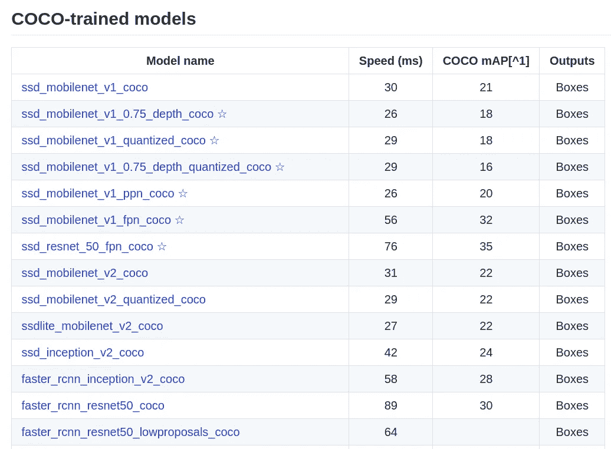

```
!wget [http://download.tensorflow.org/models/object_detection/faster_rcnn_inception_v2_coco_2018_01_28.tar.gz](http://download.tensorflow.org/models/object_detection/faster_rcnn_inception_v2_coco_2018_01_28.tar.gz)
!tar -xvzf faster_rcnn_inception_v2_coco_2018_01_28.tar.gz
!rm -rf faster_rcnn_inception_v2_coco_2018_01_28.tar.gz
```

根据文档，将 PYTHONPATH 环境变量与模型、reasearch 和 slim path 一起导出是很重要的

```
import os
os.environ['PYTHONPATH'] = "{}/content/obj_detect_api/models:/content/obj_detect_api/models/research:/content/obj_detect_api/models/research/slim".format(os.environ['PYTHONPATH'])
```

# 汇编一些东西

这里我们有一些需要编译的原型缓冲区，记住
它是编译的，所以如果你切换机器，你不能只是复制和粘贴
这个家伙生成的文件。
老实说，我无法从“/research/object _ detection”
文件夹中执行这些原型，我尝试了 N 种方法都没用，所以我只是从
“/research”文件夹中编译它们。
理解什么是 proto buffers 对于本教程来说并不是必须的，但是如果你想让
了解更多，我建议你看一下[文档](https://developers.google.com/protocol-buffers/)，基本上它是包含消息结构的文本
结构(比如 json，xml ),你可以把它转换成一些语言
,比这多一点，但是现在对于你阅读那篇文章已经足够了
。

```
%cd ..!protoc ./object_detection/protos/*.proto --python_out=.
```

我不记得 Tensroflow 异议检测 API
要求的确切版本，但我从版本> = 3.0 中得知效果很好。

```
!protoc --version
```

所以只要安装它

```
!python3 setup.py build
!python3 setup.py install
```

# 测试安装是否正常。

一旦我们安装了所有东西，我们就可以从
Tensorflow 对象检测 API 运行一些示例脚本来验证一切是否正确。这个代码不是我的，我从 object_detection 文件夹中复制了它，只是为了在 jupyter 笔记本上运行它而做了一些修改。

我不会解释这段代码，因为它只是为了测试安装，我们稍后会看到类似的代码。

只是执行这些细胞。

警告:只需证明你使用的张量流> =1.12.0

Obs:记住你可以离开这篇文章，去 [jupyter 笔记本](https://colab.research.google.com/github/italojs/traffic-lights-detector/blob/master/traffic_lights_detector.ipynb)，哪个更好:)

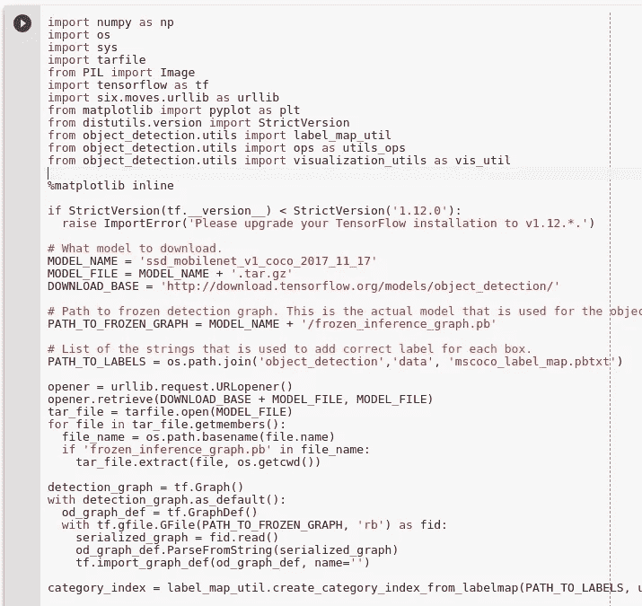

如果在你执行下面的单元格后，你可以看到一只狗的图像和一个海滩的图像，那么一切都正常！

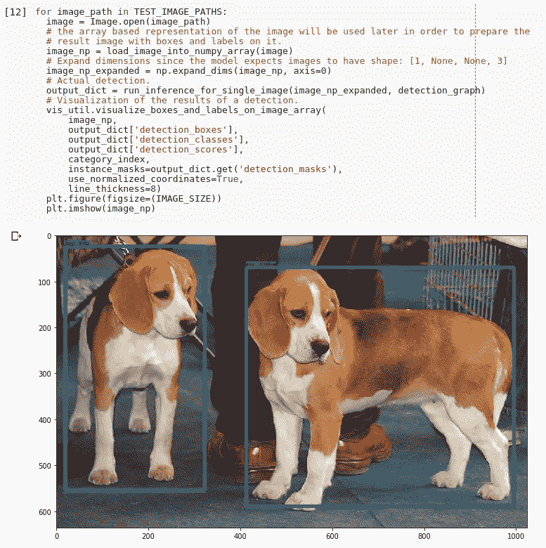

# 用我们自己的数据集训练模型。

首先，让我们下载数据集。

# 关于数据集

在这篇文章中，我们将使用 kaggle 的数据集，但是不要担心，在这篇教程中，我将把你引向另一篇教你如何创建自己的分类数据集的文章。

## 帕斯卡-VOC

在谈论数据集之前，我想提醒大家，在本教程中，我们将使用 Pascal-VOC 格式的
数据集，这是一种著名的格式，其中有:

*   jpg、jpeg、png 格式的图像…
*   注释:。以下格式的 xml 文件:

```
<annotation>
    <folder>GeneratedData_Train</folder>
    <filename>000001.png</filename>
    <path>/my/path/GeneratedData_Train/000001.png</path>
    <source>
        <database>Unknown</database>
    </source>
    <size>
        <width>224</width>
        <height>224</height>
        <depth>3</depth>
    </size>
    <segmented>0</segmented>
    <object>
        <name>21</name>
        <pose>Frontal</pose>
        <truncated>0</truncated>
        <difficult>0</difficult>
        <occluded>0</occluded>
        <bndbox>
            <xmin>82</xmin>
            <xmax>172</xmax>
            <ymin>88</ymin>
            <ymax>146</ymax>
        </bndbox>
    </object>
</annotation>
```

对于每个图像，我们都有一个。同名 xml，例子:image001.png-> image 001 . XML
注意这里面。xml 我们有关于图像的其他信息，比如位置、大小、对象以及它们在图像中的位置…

我们在本文中使用的数据集是从 kaggle 中提取的 [LISA 交通灯数据集](https://https//www.kaggle.com/mbornoe/lisa-traffic-light-dataset)，该
数据集包含交通灯的图像和分类，分类如下:

*   去；
*   停止；
*   警告；
*   goLeft
*   goForward
*   stopLeft
*   warningLeft

但是为了使本教程更简单，我修改了类，所以我们只有:

*   去；
*   停止；
*   警告；

下载后，请注意，我们将所有内容都移动到文件夹… / images 中

```
%cd object_detection
!wget --load-cookies /tmp/cookies.txt "[https://docs.google.com/uc?export=download&confirm=$(wget](https://docs.google.com/uc?export=download&confirm=$(wget) --quiet --save-cookies /tmp/cookies.txt --keep-session-cookies --no-check-certificate '[https://docs.google.com/uc?export=download&id=15WlpBbq4EpxUxZeKEAbfI_YJABASpmFs'](https://docs.google.com/uc?export=download&id=15WlpBbq4EpxUxZeKEAbfI_YJABASpmFs') -O- | sed -rn 's/.*confirm=([0-9A-Za-z_]+).*/\1\n/p')&id=15WlpBbq4EpxUxZeKEAbfI_YJABASpmFs" -O lisa608.zip
!unzip -qq ./lisa608.zip!mv images_output/* images/
!mv annotations_output/* images/
```

对于这个简单的教程，我不想处理太多的类，你可以这样做，但是为了简化这个过程，我将重命名所有最后有“Left”和“Forward”的类

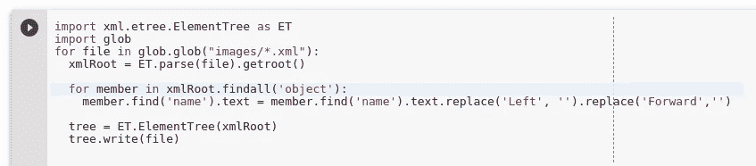

在这里，我只是在训练和测试中拆分了我的数据集

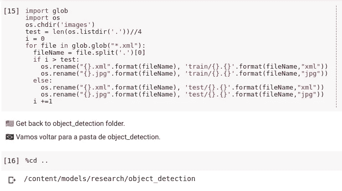

如果你的注释是 Pascal-VOC 格式的(就像我们的例子)，你需要把它们转换成 csv 格式。

我知道，我们的原始数据集之前已经是 csv 格式的了，但是我已经把它转换成了 xml，只是为了向您展示这个场景。
在这里，我们迭代每个文件夹、训练、测试和验证(如果我们有用于验证的数据)，因此我们提取数据:

*   文件名
*   宽度
*   高度
*   班级
*   xmin
*   ymin
*   xmax
*   ymax

放在我们的 csv 上。

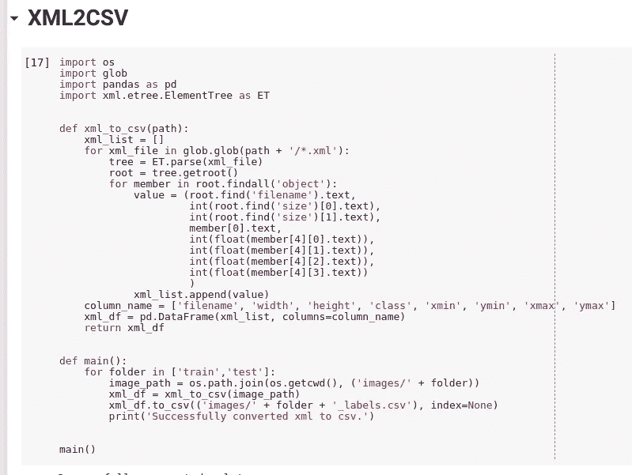

# 生成 TFRecords

要使用 TF 对象检测 API，我们需要遵循 [TFRecord](https://www.tensorflow.org/api_docs/python/tf/io) 输入格式。

当我们处理大量数据时，使用轻便快速的格式很重要，一个
选项是处理文档的二进制文件，这正是 TFRecords 所做的，但此外
针对 Tensorflow 进行了优化，因为它是为 Tensorflow 创建的，例如当
处理非常大的数据集并试图将其加载到内存中时， 显然你不会得到它
,因为你没有足够的内存 RAM 来做这件事，所以你必须处理批处理，但是
如果你使用你不需要的 TFRecords 来处理批处理，它为你抽象出如何将数据加载到内存中
,而不需要你自己编程。

[这里](https://medium.com/mostly-ai/tensorflow-records-what-they-are-and-how-to-use-them-c46bc4bbb564)有一篇文章详细解释了 TFRecords 的工作原理。

对于每个项目，必须在`class_text_to_int ()`方法中进行一些更改，注意
有一个非常简单的逻辑结构，我们必须根据这个类返回一个整数

Obs:你可以从 [jupyter 笔记本](https://colab.research.google.com/github/italojs/traffic-lights-detector/blob/master/traffic_lights_detector.ipynb)上看到完整的代码。

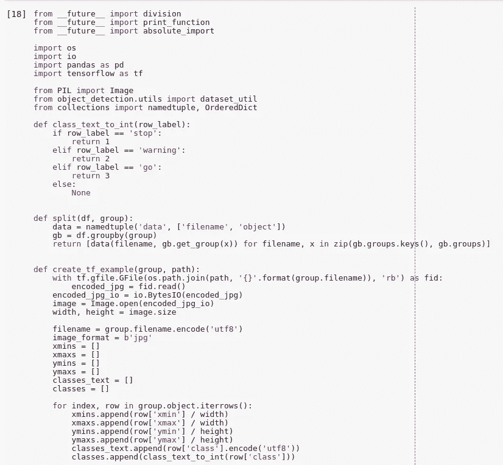

我们还需要在 TF 中输入我们的类。为此，我们将创建一个具有以下结构的. pbtxt 文件:

```
item {
  id: 1
  name: 'stop'
}
```

对于每个类，我们都有一个条目，每个条目都有一个 id 和一个名称，id 指的是我们在 TFRecords 中使用的 Id:

```
def class_text_to_int(row_label):
    if row_label == 'stop':
        return 1
    elif row_label == 'warning':
        return 2
    elif row_label == 'go':
        return 3
    else:
        None
```

记得使用相同的 id。

```
%%writefile training/labelmap.pbtxt
item {
  id: 1
  name: 'stop'
}item {
  id: 2
  name: 'warning'
}item {
  id: 3
  name: 'go'
}
```

这里我们将打印图像文件夹的长度，以便以后使用这些信息..

```
import os
test_path = "images/test"
len_dir = len(os.listdir(test_path))
print("{} imagens inside the {}".format(len_dir, test_path))
```

下一个单元格有一个文件是神经网络的配置文件，这里我们有一些[超参数](https://medium.com/@jorgesleonel/hyperparameters-in-machine-deep-learning-ca69ad10b981)
，我们必须对其进行修改。

我从 faster _ rcnn _ inception _ v2 _ pets . config 复制了这个配置文件，并根据我各自的
修改进行了编辑，对于您将使用的每个深度学习架构，您需要一个不同的配置文件，
您可以在这里找到所有这些文件`[...]/research/object_detection/samples/configs`，或者如果您喜欢的话，
通过 github 访问[。](https://github.com/tensorflow/models/tree/master/research/object_detection/samples/configs)

在这些文件中，有些东西应该被改变，比如: **num_classes**

```
faster_rcnn {
    num_classes: 3
```

**微调检查点**

```
fine_tune_checkpoint: "/home/<full_path>/research/object_detection/faster_rcnn_inception_v2_coco_2018_01_28/model.ckpt"
```

在属性 **train_input_reader** 中，将 **input_path** 和 **label_map_path** 修改为:

```
tf_record_input_reader {
    input_path: "/<full_path>/research/object_detection/train.record"
  }
  label_map_path: "/<full_path>/research/object_detection/training/labelmap.pbtxt"
}
```

请记住，train_input_reader 必须是 train.record 文件。

在 **eval_config** 属性中，在 **num_examples** 属性中更改您必须测试的实例(图像)数量(在…/images/test 文件夹中)
:

```
eval_input_reader: {
  tf_record_input_reader {
    input_path: "/full_path/research/object_detection/test.record"
  }
  label_map_path: "/full_path/research/object_detection/training/labelmap.pbtxt"
```

请注意，我使用的是**测试记录**而不是**训练记录**

Obs:记住你可以看到代码，并且已经通过 google colabotory 运行过了

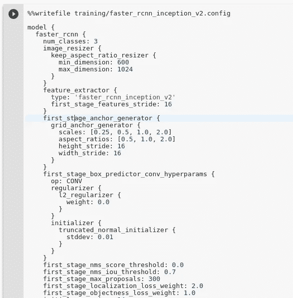

```
%cd ..
!protoc ./object_detection/protos/*.proto --python_out=.%cd object_detection
```

对此我很抱歉，但我得到了一个非常恼人的错误，它说没有找到 slim lib，
许多人说问题出在我的 PYTHONPATH 环境变量中，但我验证了一千次
并没有发现问题，所以我通过将所有/research/slim 代码复制到/object_detection
文件夹中来解决它，如果任何人发现什么做错了，请在下面评论。

```
!cp -a ../slim/. .
```

让我们训练它！

```
%run legacy/train.py --logtostderr --train_dir=training/ --pipeline_config_path=training/faster_rcnn_inception_v2.config
```

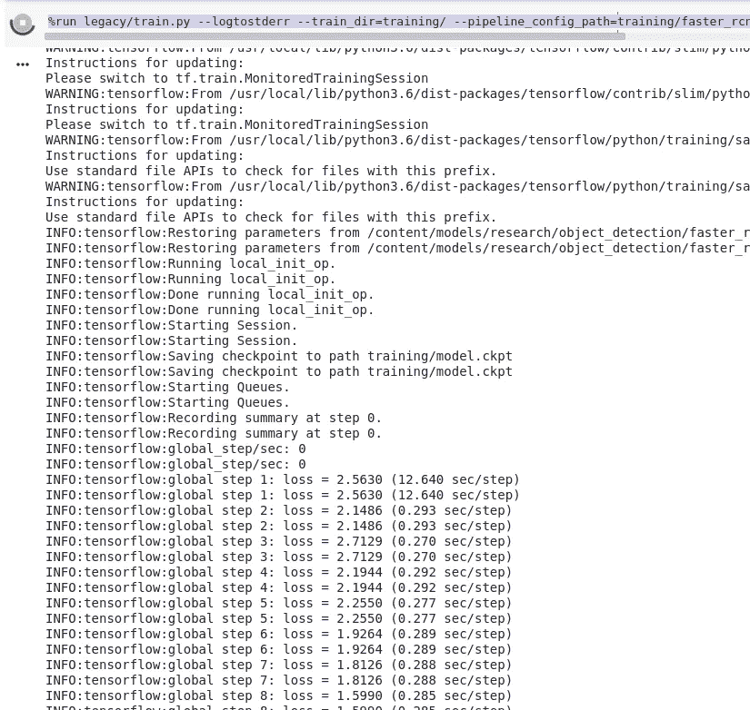

训练您的模型后，请注意在/training 文件夹中我们有一个 model . ckpt-22230 . data-00000-of-00001 文件，可能在您的
机器上会有另一个编号，该文件是您保存的训练模型！

```
!ls training
```

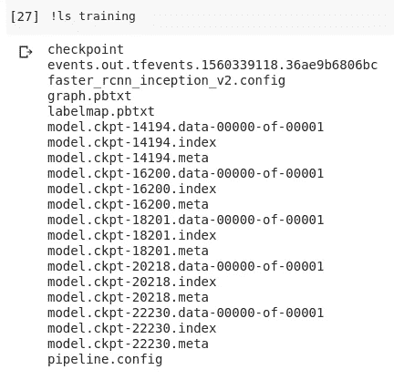

因为我们已经将整个/slim 文件夹复制到/object_detection，我们已经覆盖了
`inference_graph.py`文件，所以我们在这里重新创建了该文件。

想了解更多关于推论的知识，我推荐这几篇非常好的文章。[第一条](https://blog.metaflow.fr/tensorflow-how-to-freeze-a-model-and-serve-it-with-a-python-api-d4f3596b3adc) [第二条](https://blog.metaflow.fr/tensorflow-saving-restoring-and-mixing-multiple-models-c4c94d5d7125)

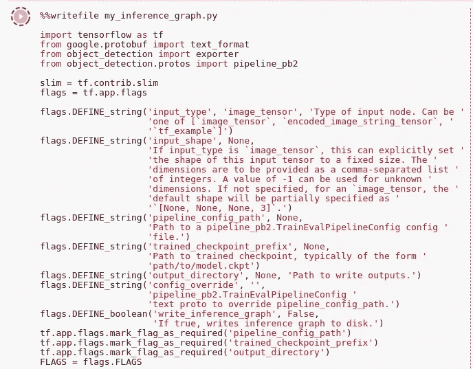

让我们运行我们的推论！记得更改 trained_checkpoint_prefix 属性，以使用/ training 文件夹中的 model.ckpt-XXX

```
!python3 my_inference_graph.py \
--input_type image_tensor \
--pipeline_config_path training/faster_rcnn_inception_v2_pets.config \
--trained_checkpoint_prefix training/model.ckpt-22230 \
--output_directory ./inference_graph
```

我们将在这里下载一些测试图像，以查看我们的模型的一些结果。

```
!wget '[http://marcusquintella.sigonline.com.br/openged/conteudos/1306/001306_59bc593899b85_Semaforos_out_2017.jpg'](http://marcusquintella.sigonline.com.br/openged/conteudos/1306/001306_59bc593899b85_Semaforos_out_2017.jpg')  -O semaforo.png
```

这段代码和测试代码很像！

```
import os
import cv2
import numpy as np
import tensorflow as tf
import sys# This is needed since the notebook is stored in the object_detection folder.
sys.path.append("..")
```

让我们定义一些常量和路径，模型的检查点，标签等等。

```
# Import utilites
from utils import label_map_util
from utils import visualization_utils as vis_util# Name of the directory containing the object detection module we're using
MODEL_NAME = 'inference_graph'
IMAGE_NAME = 'semaforo.png'# Grab path to current working directory
CWD_PATH = os.getcwd()# Path to frozen detection graph .pb file, which contains the model that is used
# for object detection.
PATH_TO_CKPT = os.path.join(CWD_PATH,MODEL_NAME,'frozen_inference_graph.pb')# Path to label map file
PATH_TO_LABELS = os.path.join(CWD_PATH,'training','labelmap.pbtxt')# Path to image
PATH_TO_IMAGE = os.path.join(CWD_PATH,IMAGE_NAME)# Number of classes the object detector can identify
NUM_CLASSES = 3
```

在这里，我们加载我们的 label_maps，这样我们就可以进行模型预测，例如，
知道数字 3 对应于类别“go”

```
label_map = label_map_util.load_labelmap(PATH_TO_LABELS)
categories = label_map_util.convert_label_map_to_categories(label_map, max_num_classes=NUM_CLASSES, use_display_name=True)
category_index = label_map_util.create_category_index(categories)
```

让我们加载我们的模型，并从模型中选择一些层

```
# Load the Tensorflow model into memory.
detection_graph = tf.Graph()
with detection_graph.as_default():
    od_graph_def = tf.GraphDef()
    with tf.gfile.GFile(PATH_TO_CKPT, 'rb') as fid:
        serialized_graph = fid.read()
        od_graph_def.ParseFromString(serialized_graph)
        tf.import_graph_def(od_graph_def, name='')sess = tf.Session(graph=detection_graph)# Define input and output tensors (i.e. data) for the object detection classifier# Input tensor is the image
image_tensor = detection_graph.get_tensor_by_name('image_tensor:0')# Output tensors are the detection boxes, scores, and classes
# Each box represents a part of the image where a particular object was detected
detection_boxes = detection_graph.get_tensor_by_name('detection_boxes:0')# Each score represents level of confidence for each of the objects.
# The score is shown on the result image, together with the class label.
detection_scores = detection_graph.get_tensor_by_name('detection_scores:0')
detection_classes = detection_graph.get_tensor_by_name('detection_classes:0')# Number of objects detected
num_detections = detection_graph.get_tensor_by_name('num_detections:0')
```

下面我们加载图像并运行我们的模型，如果你对 Tensorflow 一无所知，我建议你
阅读这篇[文章](https://danijar.com/what-is-a-tensorflow-session/)(这是一篇快速文章)并阅读[文档](https://www.tensorflow.org/guide/graphs)，如果你想了解 tensorflow 中
如何工作的更多细节。

一些参数在这里是可配置的，例如定义线条宽度的 line_thickness 和对应于您希望 Tensoflow 的置信度百分比的
min_score_thresh:嘿，
在这里有一个对象具有超过 X%的置信度。(在我们的例子中，我们将使用 0.6)

```
Load image using OpenCV and
# expand image dimensions to have shape: [1, None, None, 3]
# i.e. a single-column array, where each item in the column has the pixel RGB value
image = cv2.imread(PATH_TO_IMAGE)
image = cv2.cvtColor(image, cv2.COLOR_BGR2RGB)
image_expanded = np.expand_dims(image, axis=0)# Perform the actual detection by running the model with the image as input
(boxes, scores, classes, num) = sess.run(
    [detection_boxes, detection_scores, detection_classes, num_detections],
    feed_dict={image_tensor: image_expanded})# Draw the results of the detection (aka 'visulaize the results')vis_util.visualize_boxes_and_labels_on_image_array(
    image,
    np.squeeze(boxes),
    np.squeeze(classes).astype(np.int32),
    np.squeeze(scores),
    category_index,
    use_normalized_coordinates=True,
    line_thickness=8,
    min_score_thresh=0.6)
```

让我们用各自的分类打印我们的图像。在实际应用中，没有必要使用 visualize _ boxes _ and _ labels _ on _ image _ array()，可以分别使用盒子、类和分数。

```
%matplotlib inlineplt.figure(figsize=(20,10))
plt.imshow(image)
```

这是原始图像

```
image = cv2.imread(PATH_TO_IMAGE)
image = cv2.cvtColor(image, cv2.COLOR_BGR2RGB)plt.figure(figsize=(20,10))
plt.imshow(image)
```


现在你可以下载这个推论并在你的机器上，服务器上，任何你想要的地方使用它

```
!zip -r inference_graph.zip /content/obj_detect_api/models/research/object_detection/inference_graph
```

所以发到 google drive 上。

```
!pip install -U -q PyDrive
from pydrive.auth import GoogleAuth
from pydrive.drive import GoogleDrive
from google.colab import auth
from oauth2client.client import GoogleCredentials# 1\. Authenticate and create the PyDrive client.
auth.authenticate_user()
gauth = GoogleAuth()
gauth.credentials = GoogleCredentials.get_application_default()
drive = GoogleDrive(gauth)model_file = drive.CreateFile({'title' : 'inference_graph.zip'})
model_file.SetContentFile('./inference_graph.zip')
model_file.Upload()# download to google drive
drive.CreateFile({'id': model_file.get('id')})
```