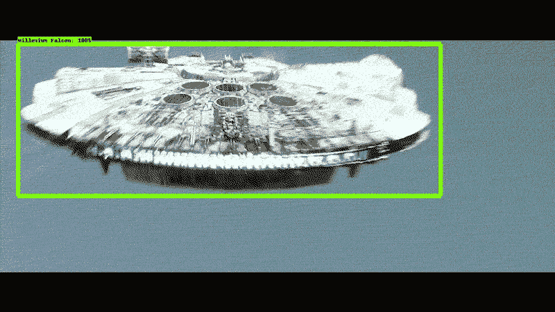
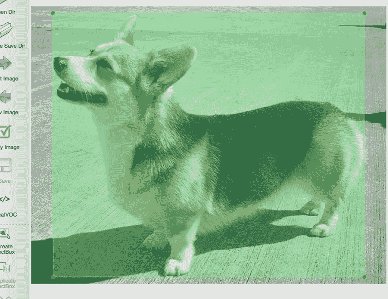
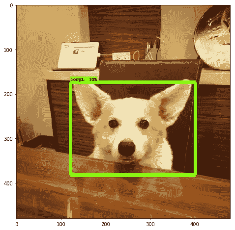

# 从头开始使用 TensorFlow 进行自定义对象检测

> 原文：<https://towardsdatascience.com/custom-object-detection-using-tensorflow-from-scratch-e61da2e10087?source=collection_archive---------0----------------------->

## [内部 AI](https://medium.com/towards-data-science/inside-ai/home)

## 基于自定义数据集的 TensorFlow 对象检测训练



Custom Object Detection source: [https://github.com/bourdakos1/Custom-Object-Detection](https://github.com/bourdakos1/Custom-Object-Detection)

在本教程中，我们将尝试使用预先训练好的 SSD MobileNet V2 模型来训练我们自己的狗(corgi)检测器。

您无需从头开始训练自己的模型，而是可以在现有模型的基础上进行构建，并根据自己的目的对其进行微调，而不需要太多的计算能力。

# 1.装置

# 1.1 张量流

使用以下命令安装 Tensorflow:

`$ pip install tensorflow`

如果您有可以与 Tensorflow 一起使用的 GPU:

`$ pip install tensorflow-gpu`

# 1.2 其他依赖关系

`$ pip install pillow Cython lxml jupyter matplotlib`

使用自制软件安装 protobuf(你可以在这里了解更多关于自制软件的信息)

`$ brew install protobuf`

对于在其他操作系统上安装 protobuf，请遵循此处的说明[。](http://google.github.io/proto-lens/installing-protoc.html)

# 1.3 克隆 Tensorflow 模型库

在本教程中，我们将使用 Tensorflow 模型存储库中的资源。因为 Tensorflow 安装没有附带它，所以我们需要从他们的 Github repo 中克隆它:

首先进入张量流目录:

```
# *For example: ~/anaconda/envs/<your_env_name>/lib/python3.6/site-packages/tensorflow*$ cd <path_to_your_tensorflow_installation>
```

克隆 Tensorflow 模型库:

`$ git clone [https://github.com/tensorflow/models.git](https://github.com/tensorflow/models.git)`

**从此时起，该目录将被称为** `**models**` **目录**

# 1.4 设置环境

每当您启动一个新的终端窗口来处理预训练的模型时，编译 Protobuf 并更改您的`PYTHONPATH`是非常重要的。

从终端运行以下命令:

```
$ cd <path_to_your_tensorflow_installation>/models/research/$ protoc object_detection/protos/*.proto --python_out=.$ export PYTHONPATH=$PYTHONPATH:`pwd`:`pwd`/slim
```

运行快速测试以确认对象检测 API 工作正常:

`$ python object_detection/builders/model_builder_test.py`

如果结果如下所示，您就可以继续下一步了！

```
...............
----------------------------------------------------------------------
Ran 15 tests in 0.123sOK
```

# 1.5 推荐的文件夹结构

为了使本教程更容易理解，在刚刚克隆的`models`目录中创建以下文件夹结构:

```
models 
    ├── annotations
    |   └── xmls    
    ├── images
    ├── checkpoints
    ├── tf_record
    ├── research
    ...
```

这些文件夹将用于存储我们的模型所需的组件。

# 2.收集图像

您可以收集图像或视频格式的数据。这里我提到了收集数据的两种方法。

# 2.1 从互联网上收集图像(谷歌搜索)

数据准备是训练自己模型最重要的部分。既然要训练一只柯基探测器，就必须收集柯基的图片！大约 200 个就足够了。

我推荐使用 [google-images-download](https://github.com/hardikvasa/google-images-download) 下载图片。它搜索谷歌图片，然后根据你提供的输入下载图片。在输入中，您可以指定搜索参数，如关键字、图像数量、图像格式、图像大小和使用权。

因为我们一次下载 100 多张图片，所以我们需要在`models`目录中有一个`chromedriver`(在这里下载)。一旦您准备好了`chromedriver`，您就可以使用这个示例命令来下载图像。**确保您所有的图像都是 jpg 格式**:

```
*# From the models directory*$ googleimagesdownload --keywords 'welsh corgi dog' \
--limit 200 \
--size medium \
--chromedriver ./chromedriver \
--format jpg
```

下载后，将所有图像保存到`models/images/`。为了使后续过程更容易，让我们通过运行以下脚本将图像重命名为数字(例如`1.jpg`、`2.jpg`):

```
import ospath = 'models/images/'
counter = 1
for f in os.listdir(path):
    suffix = f.split('.')[-1]
    if suffix == 'jpg' or suffix == 'png':
        new = '{}.{}'.format(str(counter), suffix)
        os.rename(path + f, path + new)
        counter = int(counter) + 1
```

# 2.2 从视频中收集图像

[](https://medium.com/@iKhushPatel/convert-video-to-images-images-to-video-using-opencv-python-db27a128a481) [## 使用 OpenCV (Python)将视频转换为图像以及将图像转换为视频

### 使用 Python 中的 OpenCV 库从视频生成图像(帧)和从图像(帧)生成视频

medium.com](https://medium.com/@iKhushPatel/convert-video-to-images-images-to-video-using-opencv-python-db27a128a481) 

# 3.标记您的数据集

一旦你收集了所有你需要的图片，你需要手动标记它们。有许多服务于此目的的软件包。标签是一个受欢迎的选择。

labelImg 提供了一个用户友好的 GUI。另外，它以流行的 Pascal VOC 格式保存标签文件(`.xml`)。如果你想用这些图片来训练 YOLO(你只看一次)，那就用 YOLO。只需设置当前目录，并按照我们的结构保存目录。

以下是标签图像在 labelImg 中的样子:



Example of a labeled corgi in labelImg

仔细检查每个图像是否有相应的`.xml`文件，并将其保存在`models/annotations/xmls/`中。

对于大量注释，您可以使用下面提到的不同快捷键:

```
Ctrl + u - Load all of the images from a directory
Ctrl + r - Change the default annotation target dir
Ctrl + s - Save
w - Create a rect box
d - Next image
a - Previous image
del - Delete the selected rect box
Ctrl++ - Zoom in
Ctrl-- - Zoom out
Ctrl + d - Copy the current label and rect box
Space - Flag the current image as verified
↑→↓←Keyboard arrows to move selected rect box
```

# 4.创建标签地图(`.pbtxt`)

类别需要在标签映射中列出。由于我们只检测地理信息系统，标签地图应该只包含一个项目，如下所示:

```
item {
    id: 1
    name: 'corgi'
}
```

注意`id`必须从 1 开始，因为 0 是保留 id。

将该文件另存为`models/annotations/`中的`label_map.pbtxt`

# 5.创建`trainval.txt`

`trainval.txt`是没有文件扩展名的图像名称列表。因为我们有图像名称的序列号，所以列表应该是这样的:

```
1
2
3
...
198
199
200
```

将该文件保存为`models/annotations/`中的`trainval.txt`

# 6.将 XML 转换为 CSV 文件(`.csv`)

您可以使用这个[链接](https://gist.github.com/iKhushPatel/ed1f837656b155d9b94d45b42e00f5e4)来创建 CSV 格式的 XML 文件。我们有所有的图像和它们的边界框都是 XML 格式。此外，所有的图像都有单独的 XML 文件，所以使用这个代码，我们正在创建一个 CSV 文件，其中包含所有的 XML 文件和他们的边界框坐标到一个 CSV 文件，这是创建 TFrecords 的输入。

# 7.创建 TFRecord ( `.record`)

TFRecord 是为 Tensorflow 设计的重要数据格式。(点击了解更多信息[)。在训练自定义对象检测器之前，必须将数据转换为 TFRecord 格式。](https://www.skcript.com/svr/why-every-tensorflow-developer-should-know-about-tfrecord/)

由于我们需要训练和验证我们的模型，数据集将被分成训练集(`train.record`)和验证集(`val.record`)。训练集的目的很简单——它是模型学习的样本集。验证集是在训练期间使用的一组示例，用于反复评估模型准确性。

我们将使用`create_tf_record.py`将我们的数据集转换成`train.record`和`val.record`。在这里下载[并保存到`models/research/object_detection/dataset_tools/`。](https://gist.github.com/iKhushPatel/5614a36f26cf6459cc49c8248e8b5b48)

**根据您的分类，只需更改** `if row_label == ‘Label1’:` **中的标签名称即可。**

该脚本预先配置为进行 70–30 列车阀分割。通过运行以下命令来执行它:

```
# *From the models directory*$ python research/object_detection/dataset_tools/create_tf_record.py
```

如果脚本执行成功，`train.record`和`val.record`应该会出现在您的`models/research/`目录中。将它们移动到`models/tf_record/`目录。

# 8.下载预先训练的模型

在[模型动物园](https://github.com/tensorflow/models/blob/master/research/object_detection/g3doc/detection_model_zoo.md)中有很多预先训练好的物体检测模型可用。为了使用我们的定制数据集训练它们，模型需要使用它们的检查点(`.ckpt`文件)在 Tensorflow 中*恢复*，这些检查点是以前模型状态的记录。

对于本教程，我们将在这里下载`ssd_mobilenet_v2_coco`，并将其模型检查点文件(`model.ckpt.meta, model.ckpt.index, model.ckpt.data-00000-of-00001`)保存到我们的`models/checkpoints/`目录中。

# 9.修改配置(`.config`)文件

每个预训练的模型都有一个包含模型细节的配置文件。为了检测我们的自定义类，需要相应地修改配置文件。

配置文件包含在您一开始克隆的`models`目录中。您可以在以下位置找到它们:

`models/research/object_detection/samples/configs`

在我们的例子中，我们将修改`ssd_mobilenet_v2_coco`的配置文件。先复制一份，保存在`models/`目录下。

以下是我们需要更改的项目:

1.  因为我们只试图检测柯基，所以将`num_classes`改为 1
2.  `fine_tune_checkpoint`告诉模型使用哪个检查点文件。将此设置为`checkpoints/model.ckpt`
3.  模型还需要知道训练集和验证集的 TFRecord 文件和标签映射在哪里。由于我们的`train.record`和`val.record`保存在`tf_record`文件夹中，我们的配置应该反映出:

```
train_input_reader: {
  tf_record_input_reader {
    input_path: "tf_record/train.record"
  }
  label_map_path: "annotations/label_map.pbtxt"
}eval_input_reader: {
  tf_record_input_reader {
    input_path: "tf_record/val.record"
  }
  label_map_path: "annotations/label_map.pbtxt"
  shuffle: false
  num_readers: 1
}
```

# 10.火车

此时，您的`models`目录应该如下所示:

```
models 
    ├── annotations
    |   ├── label_map.pbtxt
    |   ├── trainval.txt
    |   └── xmls
    |       ├── 1.xml
    |       ├── 2.xml
    |       ├── ...
    |
    ├── images
    |   ├── 1.jpg
    |   ├── 2.jpg
    |   ├── ...    
    |
    ├── checkpoints
    |   ├── model.ckpt.data-00000-of-00001
    |   ├── model.ckpt.index
    |   └── model.ckpt.meta
    |
    ├── tf_record
    |   ├── train.record
    |   └── val.record
    |
    ├── research
    |   ├── ...
    ...
```

如果您成功完成了之前的所有步骤，您就可以开始训练了！

请遵循以下步骤:

```
# *Change into the models directory*
$ cd tensorflow/models# *Make directory for storing training progress*
$ mkdir train# *Make directory for storing validation results*
$ mkdir eval# *Begin training*
$ python research/object_detection/train.py \
    --logtostderr \
    --train_dir=train \
    --pipeline_config_path=ssd_mobilenet_v2_coco.config
```

训练时间因机器的计算能力而异。

# 11.估价

评估可以与培训同时进行。`eval.py`脚本检查`train`目录的进度，并根据最近的检查点评估模型。

```
*# From the models directory*$ python research/object_detection/eval.py \
    --logtostderr \
    --pipeline_config_path=ssd_mobilenet_v2_coco.config \
    --checkpoint_dir=train \
    --eval_dir=eval
```

您可以使用 Tensorboard 可视化模型训练进度:

```
*# From the models directory*$ tensorboard --logdir=./
```

根据 Tensorboard 输出的图表，您可以决定何时停止训练。通常，当损失函数逐渐减少并且不再显著减少时，你可以停止这个过程。在我的例子中，我停止在步骤 3258。

# 12.模型导出

一旦完成模型的训练，就可以导出模型用于推理。如果您一直遵循文件夹结构，请使用以下命令:

```
*# From the models directory*$ mkdir fine_tuned_model$ python research/object_detection/export_inference_graph.py \    
--input_type image_tensor \    
--pipeline_config_path ssd_mobilenet_v2_coco.config \    
--trained_checkpoint_prefix  train/model.ckpt-<the_highest_checkpoint_number> \    
--output_directory fine_tuned_model
```

# 13.分类图像

现在你有了一个模型，你可以用它来检测图片和视频中的柯基犬！出于演示的目的，我们将检测图像中的 CORBA。在继续之前，选择一个您想要用来测试模型的图像。

`models`目录附带了一个笔记本文件(`.ipynb`)，我们可以使用它进行一些调整来获得推论。它位于`models/research/object_detection/object_detection_tutorial.ipynb`。按照以下步骤调整笔记本:

1.  `MODEL_NAME = 'ssd_mobilenet_v2_coco_2018_03_29'`
2.  `PATH_TO_CKPT = 'path/to/your/frozen_inference_graph.pb'`
3.  `PATH_TO_LABELS = 'models/annotations/label_map.pbtxt'`
4.  `NUM_CLASSES = 1`
5.  完全注释掉单元格#5(就在`Download Model`下面)
6.  因为我们只对一个图像进行测试，注释掉单元格#9 中的`PATH_TO_TEST_IMAGES_DIR`和`TEST_IMAGE_PATHS`(就在`Detection`下面)
7.  在单元格#11(最后一个单元格)中，删除 for 循环，取消其内容，并添加测试图像的路径:

`imagepath = 'path/to/image_you_want_to_test.jpg`

完成这些步骤后，运行笔记本，您应该会看到测试图像中的 corgi 被一个边界框高亮显示！



Corgi found by our custom object detector

那里你有你的自定义柯基探测器！

> **你可能想知道，在训练完你的第一个模型后，我想改进我的模型并跟踪我的实验细节，什么是好工具？**

然后就可以结账 [https://neptune.ai](https://neptune.ai/) 了，它提供了清晰简洁的模型追踪。您可以跟踪所有的超参数，并将模型保存在模型注册表中，并实时比较您的模型。Neptune 支持在一个地方记录、存储、查询、显示、组织和比较所有的模型元数据。更多信息，你可以参考下面的博客来训练物体检测模型。

[https://Neptune . ai/blog/tensor flow-object-detection-API-最佳实践-培训-评估-部署](https://neptune.ai/blog/tensorflow-object-detection-api-best-practices-to-training-evaluation-deployment)

# 更多细节

[Tensorflow 对象检测模型文档](https://github.com/tensorflow/models/tree/master/research/object_detection/g3doc)

请访问我的网站:【http://www.khushpatel.com】