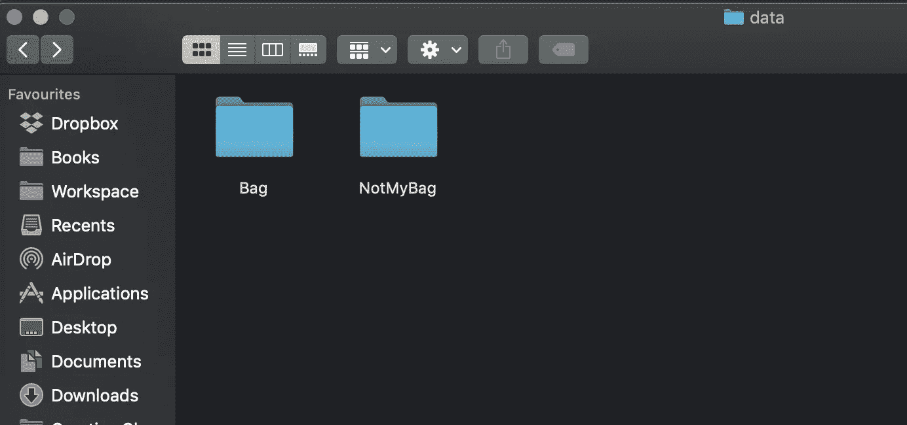

# 基于 Android 和 TensorFlow 的图像分类箱包识别

> 原文：<https://towardsdatascience.com/custom-object-detection-with-android-and-tensorflow-c412b1387352?source=collection_archive---------14----------------------->


## 问题是:

最近，当我在印度东北部旅行时，我不得不等了很长时间，我的包才出现在机场的行李传送带上。旋转木马周围挤满了通勤者。很难把我的包和其他包区分开来，因为大约有一半的包看起来很相似。我不得不亲自检查六个包，以确保没有一个是我的。

我想有人会建立一些东西来解决这个问题。我开始寻找现有的解决方案，但是什么也找不到。我偶然发现了一些使用 TensorFlow 演示自定义对象检测的博客。后来我发现了[这个非常有用的资源](https://codelabs.developers.google.com/codelabs/tensorflow-for-poets-2/#0)，并以此为基础开始着手解决问题。

## 数据:

我首先需要的是数据。我本可以点击我的包的一些图片，但是我决定捕捉对象的所有侧面和边缘的视频。我从视频中提取单独的帧，并手工挑选视觉上不连续的帧。我将选定的帧转换为灰度图像。我用的是 ffmpeg。在命令行或终端上，键入，

```
ffmpeg -i video.mp4 -qscale:v 2 image_%03d.jpg
```

video.mp4 是我的包的视频，输出图像以 image_ 为前缀。然后我需要不属于我包的照片。我发现了一个有用的谷歌
Chrome 扩展，名为 [Fatkun](https://chrome.google.com/webstore/detail/fatkun-batch-download-ima/nnjjahlikiabnchcpehcpkdeckfgnohf?hl=en) 。该扩展使我能够下载大量图像。我在谷歌图片上搜索包包，下载了一堆这样的图片。就像我包包的照片一样，我把后来下载的图片转换成了灰度。

我执行了一个 Python 脚本来将图像转换成灰度。下面的 Python 脚本有一个函数 rescale，它获取一个目录并将该目录中的所有图像转换为灰度。该脚本有一个依赖，PIL。

Python script to convert images inside a folder to grayscale

当我编排我的数据时，没有不平衡数据集的风险。我的包和我的包有相同数量的图像。

## 食谱:

一旦我有了图像，我就从这里下载[tensor flow-for-Poets](https://github.com/googlecodelabs/tensorflow-for-poets-2)。您需要在计算机上安装 TensorFlow。此外，你需要下载枕头。您可以通过键入以下命令来完成这两项工作。

```
pip install --upgrade  "tensorflow==1.7.*"

pip install PILLOW
```

在 Tensorflow-for-poets 的根目录中，我执行了，

```
python3 -m scripts.retrain --bottleneck_dir=tf_files/bottlenecks --how_many_training_steps=500 --model_dir=tf_files/models/ --summaries_dir=tf_files/training_summaries/mobilenet_v2_1.4_224 --output_graph=tf_files/retrained_graph_bags.pb --output_labels=tf_files/retrained_labels.txt --architecture="mobilenet_0.50_224" --image_dir=/Users/sumit/Desktop/carousel/Baggage-Carousel/Labs/data/
```

scripts.retrain 将一个目录作为输入。对我来说，这是命令的最后一部分。

```
image_dir=/Users/sumit/Desktop/carousel/Baggage-Carousel/Labs/data/
```

该文件夹如下所示:



名为 bag 的文件夹保存了我的包的灰度图像。另一个文件夹里有我能拿到的所有其他包的灰度照片。*‘架构’*论点是我想要重新训练的模型。我鼓励每个人都和模特一起玩耍。型号列表可以在[这里](https://github.com/tensorflow/models/tree/master/research/slim#pre-trained-models)找到。

*‘重新训练 _ 标签’*是一个生成的文本文件，带有两个文件夹的名称。这两个文件夹的行为就像两个类。同样，*' rettrained _ graph _ bags . Pb '*是该过程的结果。这两个文件都可以在以下位置找到:

```
tensorflow-for-poets-2/tf_files
```

该命令应该从 tensorflow-for-poets 的根目录执行。当命令被执行时，它将启动学习过程。


接下来，我必须将生成的图形转换成 tflite。Tflite 或 TensorFlowLite 用于将机器学习模型部署到移动设备上。转换是通过执行以下命令完成的

```
toco — graph_def_file=tf_files/retrained_graph_bags.pb — output_file=tf_files/bagdroid_graph.tflite — output_format=TFLITE — input_shape=1,224,224,3 — input_array=input — output_array=final_result — inference_type=FLOAT — input_data_type=FLOAT
```

上面的命令将*' rettrained _ graph _ bags . Pb '*作为输入，生成一个移动友好的 tflite 文件，命名为 *'bagdroid_graph.tflite '。*

## Android 应用程序:

Android 应用程序只需要一些改动。除了外观上的变化，

1.  我必须将*' rettrained _ labels . txt '*和*' bag droid _ graph . TF lite '*复制到应用程序的 assets 文件夹中。
2.  在 ImageClassifier.java，我必须将**模型路径**和**标签路径**指向正确的值。
3.  我不得不在检测上添加音频和触觉反馈。


Changes made in ImageClassifer.java

## 结果是:

完成后的应用程序应该看起来更好，并且能够检测它被训练检测的包。


The final application

最后，应用程序能够检测到我的包，给我声音和触觉反馈。


Detecting bag.

## 问题是:

一个非常明显的问题是，如果两个包是相同的，应用程序将识别这两个包。这个问题可以通过使用 NFC 芯片来缓解。

但是，实际问题是应用程序经常将随机的东西标记为我的包。我很想知道我能做些什么来减少误报。

