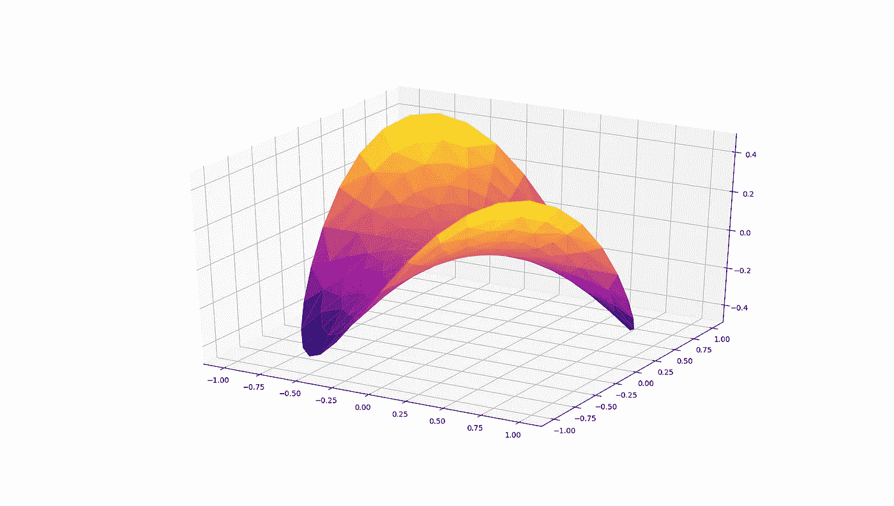
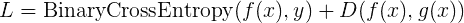
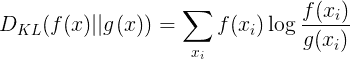

# 用于高级机器学习的定制张量流损失函数

> 原文：<https://towardsdatascience.com/custom-tensorflow-loss-functions-for-advanced-machine-learning-f13cdd1d188a?source=collection_archive---------5----------------------->

## 和少量迁移学习示例



**在这篇文章中，我们将看看:**

*   **在高级 ML 应用中使用自定义损失函数**
*   **定义自定义损失函数并集成到基本张量流神经网络模型**
*   **知识提炼学习的一个简单示例，使用高斯过程参考应用于少量学习问题**

链接到我的其他文章:

1.  [深度内核转移和高斯过程](/deep-kernels-and-gaussian-processes-for-few-shot-learning-38a4ac0b64db)
2.  [随机森林](/decision-trees-and-random-forests-for-classification-and-regression-pt-1-dbb65a458df)
3.  [Softmax 分类](/the-softmax-function-neural-net-outputs-as-probabilities-and-ensemble-classifiers-9bd94d75932)
4.  [气候分析](/analyzing-climate-patterns-with-self-organizing-maps-soms-8d4ef322705b)

**【注:**[**tensor flow 2.0**](https://www.tensorflow.org/community/roadmap)**现已发布，与本文所基于的 the 1.x 版本有较大不同。我仍在研究 TF 2.0 w.r.t 自定义损失和张量操作，如本文所述，可能会写一篇新文章或更新这篇文章。请记住这一点。】**

**简介**

机器学习的老路包括旅行到熟悉的地标和风景点。一组熟悉的界标是预定义的损失函数，为您试图优化的问题提供合适的损失值。我们熟悉分类的交叉熵损失和回归问题的均方误差(MSE)或均方根误差(RMSE)。包括前端(如 Keras)和后端(如 Tensorflow)的流行 ML 包包括一组用于大多数分类和回归任务的基本损失函数。但是，在常规方法之外，还存在自定义的损失函数，您可能需要使用它们来解决某个问题，这些损失函数只受有效张量运算的约束。

在 Keras 中，技术上你可以创建自己的损失函数，但是损失函数的形式仅限于 *some_loss* ( *y_true，y_pred* )并且仅此而已。如果您试图以 *some_loss_1* ( *y_true，y_pred，**kwargs* )的形式向损失中添加额外的参数，Keras 将会抛出一个运行时异常，并且您会丢失用于聚合数据集的计算时间。有一些方法可以解决这个问题，但一般来说，我们希望有一种可伸缩的方式来编写一个损失函数，接受我们传递给它的任何有效参数，并以标准和预期的方式对张量进行操作。我们将看到如何直接使用 Tensorflow 从头开始编写一个神经网络，并构建一个自定义的损失函数来训练它。

**张量流**

Tensorflow (TF)是一个符号和数字计算引擎，它允许我们将张量*串成计算图形，并对它们进行反向传播。Keras 是一个运行在 Tensorflow 之上的 API 或前端，它可以方便地打包使用 Tensorflow 构建的标准结构(如各种预定义的神经网络层)，并从程序员那里抽象出许多 TF 的低级机制(Keras 也可以运行在 Theano 之上，同样的概念也适用)。然而，在使这些构造‘现成’的过程中，粒度级控制和做非常具体的事情的能力丧失了。

*为了简单起见，张量是具有类似(feature_dim，n_features)的形状元组的多维数组

一个例子是定义接受任意数量参数的定制损失函数的能力，并且可以使用网络内部的任意张量*和网络外部的输入张量*来计算损失。严格来说，*TF 中的一个损失函数甚至不需要是 python 函数，只需要对 TF 张量对象进行有效的运算组合即可。前一点很重要，因为自定义损失的能力来自于计算任意张量上的损失的能力，而不仅仅是严格意义上的监督目标张量和网络输出张量，其形式为( *y_true，y_pred* )。*

*在我们讨论客户损失之前，让我们简要回顾一个基本的 2 层密集网络(MLP ),看看它是如何在 TF 中定义和训练的。虽然有预定义的 TF 层，但让我们从权重和偏差张量开始定义这些层。我们想熟悉 TF 中的**占位符**和**变量**张量。*

*那真是太酷了。通过用 soft max _ cross _ entropy _ with _ logits 替换损失，并用 tf.nn.softmax 替换最终 sigmoid 激活，可以修改上面的代码以用于多类分类。*

*接下来，为了演示如何使用具有任意张量的自定义损失函数，让我们实现一个知识提取模型，该模型对二进制分类损失以及正在训练的模型和参考模型之间的损失进行优化。知识提炼是迁移学习的一种形式，我们用目标模型(我们想要训练的模型)学习，但也间接从参考模型迁移知识表示。我们将使用来自 sklearn 的[高斯过程分类器](https://scikit-learn.org/stable/modules/generated/sklearn.gaussian_process.GaussianProcessClassifier.html#sklearn.gaussian_process.GaussianProcessClassifier) (GPC)作为我们的参考模型。我们还将通过将我们的训练数据减少到 sklearn 乳腺癌数据集… *中 569 个样本的 1%来使问题变得更有趣，无论是参考还是目标，并从头开始训练它们。** 这就是所谓的少数镜头学习问题。*

**在传统迁移学习中，参考模型通常是一个广泛和/或深入的网络，在许多示例/类上进行了预训练，而目标是一个较窄/较浅的网络，在少数可用的特定示例/类上进行了训练。*

*这个知识提炼方案的损失看起来像*

**

*二元交叉熵损失只是常规的二元分类损失，第二项涉及目标 *f(x)* 和参考 *g(x)的输出之间的另一个损失 *D* 。*我们设 *D* 为 *f(x)* 和*g(x)*之间的 [Kullback-Leibler 散度](https://en.wikipedia.org/wiki/Kullback%E2%80%93Leibler_divergence) (DKL)*

**

*DKL 简单地量化了一个分布 *f* 与 *g、*在*信息*(大致信息与确定性成反比)*方面的差异；*可以认为是分布之间的交叉熵，是可以取负值*的不对称损失。通过最小化 *f* 和 *g* 之间的 DKL，我们基本上想要增加 *f* 相对于 *g* 的信息含量。当 *f* 和 *g* 的信息量相同时，上面的对数项为 0，DKL 损失也为 0。当使用 GPC 作为参考模型时，使用 DKL 作为损失是有意义的，因为当从 GPC 进行预测时，我们从它的后验分布(softmax)进行采样，尽管我们的神经网络是这个后验分布的粗略近似，但它也是一个分布。*

**在下面的实现中，我们在组合损失中采用 abs( D_KL( f(x)，g(x))。理论上，由于对数和不等式，D_KL 将总是非负的，但是在实际计算机上用舍入误差计算 D_KL 会导致负值。*

*请注意，我们现在需要将外部输入 *g(x)* 反馈到我们的损耗中。在 Keras 中，这个过程是人为的，不可扩展的。但在 TF 中，它就像创建一个新的占位张量、向组合损失添加必要的项，以及在运行训练或预测会话时输入一样简单。*

*由于只有 5 个训练样本，上述示例比 DKL 损失被设置为零(即没有迁移学习)的网络收敛得更快，并且给出更好的原始测试准确度。**注意，测试集不平衡未被考虑！精明的读者应该在准确度读数上加上 F1 分数。**谢天谢地，我们数据集的伪随机样本给出了正类与负类的 2:3 比例。*

*同样值得注意的是，迁移学习模型的 softmax 输出在来自维持者的 100 个示例上进行了测试:*

```
*[0.5134167 ]
 [0.5767678 ]
 [0.5299671 ]
 [0.529941  ]
 [0.51807505]
 [0.4615707 ]
 [0.61761355]
 [0.5744497 ]
 [0.6092696 ]
 [0.55092424]
 [0.5866923 ]
 [0.5522269 ]
 [0.5679551 ]*
```

*相对于非迁移学习模式*

```
*[0.44836044]
 [0.99457294]
 [0.47165167]
 [0.573235  ]
 [0.94637066]
 [0.00909297]
 [0.99778605]
 [0.99487936]
 [0.99742365]
 [0.96588767]
 [0.99646676]
 [0.9843067 ]
 [0.99225134]*
```

*迁移学习模型的预测反映了*的不确定性*,给出了它被训练的有限信息。选择 GPC 作为参考模型有一个很好的理由，毕竟，当我们只从零开始训练 5 个样本的分类器时，我们怎么能如此确定一个新患者患有癌症？*

***结论***

*我们看到了如何在 TF 中从零开始实现神经网络，如何将张量运算结合到损失函数中，并触及了迁移学习的一个有趣应用。总的来说，在高级或特殊的监督学习应用中，TF 对于数据科学家来说要灵活得多。如果你喜欢阅读这篇文章和使用代码，请查看我的其他文章！*