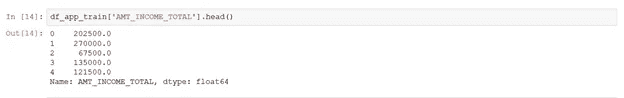
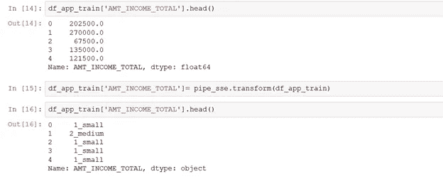
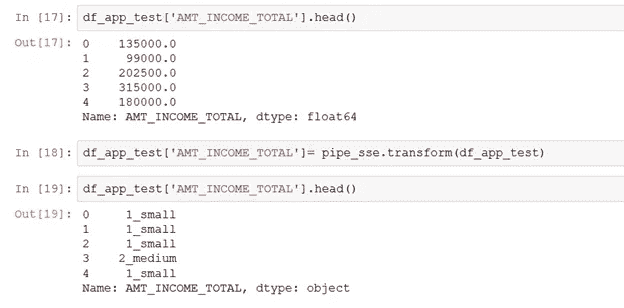
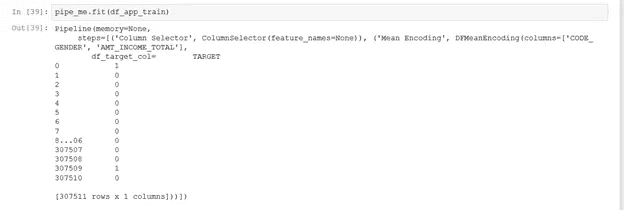
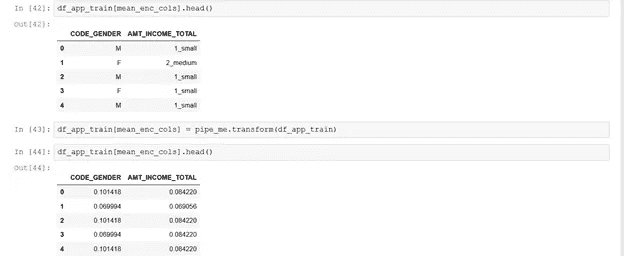
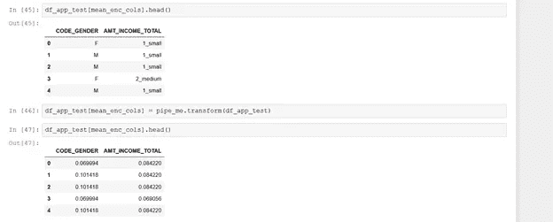

# Python 中的自定义转换器和管道

> 原文：<https://towardsdatascience.com/custom-transformers-in-python-part-ii-6fe111fc82e4?source=collection_archive---------13----------------------->

数据清理是任何机器学习项目中最重要的部分。事实上，您的数据可能有多种格式，并且分布在不同的系统中，这使得在将数据提供给 ML 模型之前，必须对其进行适当的处理。数据准备是 ML 流程中最繁琐和耗时的步骤之一(一些调查显示，数据科学家将 80%的时间花在数据准备和管理上！).然而，这也是最关键的一步，因为输入数据是模型的主要成分。Python 提供了某些包，这些包提供了不同的工具来简化数据准备过程，其中一个解决方案是使用自定义转换器和管道。在本文中，让我们看看什么是定制转换器，然后深入研究如何在管道中为均值编码和衬衫尺码编码定制转换器。

**变形金刚**

如果你研究过机器学习问题，你可能知道 Python 中的 transformers 可以用来清理、减少、扩展或生成要素。fit 方法从训练集中学习参数，transform 方法将变换应用于看不见的数据。预定义转换器的示例包括 StandardScaler、LabelEncoder、Normalize 等。在本文中，让我们来探索定制变压器。

**为什么使用定制变压器**

在不同的 Python 包中有几个预定义的转换器，允许我们轻松地对数据集应用不同的转换。那么，为什么我们需要定制的变压器呢？根据要解决的问题，自定义转换器可以帮助克服预定义转换器带来的一些无能或挑战。例如，让我们考虑标签编码。比方说，您试图用可能的值{East，Central，West}对列“Region”进行标签编码。如果训练数据集不包含区域列值为“中心”的任何数据，那么 LabelEncoder 无法处理测试或验证数据集中出现“中心”
时的转换。

**带管道的定制变压器的应用**

自定义变压器可用于顺序应用多个变压器的管道中。一个转换器的输出作为输入馈入下一个转换器，您可能会面临不兼容类型的挑战，即第一个转换器可能会输出 NumPy 数组，而后续的转换器可能会将数据帧作为输入。在这种情况下，定制变压器可以挽救局面。在我们进入编码细节之前，让我们快速刷新一下管道、衬衫尺码和编码的概念。

“**管道**表示一系列级联的数据转换。管道中的每一步都来自前一步，数据从头到尾流经管道。这有助于优化模型构建过程，从而有更多的时间来理解底层数据。定制变压器可用于均值编码和衬衫尺码的流水线。

**衬衫尺码**，以其最简单的形式，包括创建箱子并给每个箱子分配一个标签，如小号、中号、大号、超大号，因此称为衬衫尺码。通常，当我们考虑数字变量的转换器时，我们默认使用标准标量或对列应用对数转换。这与衬衫尺寸形成对比，衬衫尺寸允许您从数值变量创建分类变量，并且通常遵循其他方法，如均值编码，然后生成更有意义的特征。

类似地，对于转换分类变量，我们通常考虑标签编码或 One Hot。**标签编码**为数据分配随机值，这可能会使我们的模型误以为某列中的数据具有显式的层次结构，而实际情况可能并非如此。为了避免这种情况，我们倾向于“一次热编码”列。这可能会给我们留下一个包含太多列的结果数据集。例如，如果我们为一个“State”列创建一个热编码，我们可能最终得到 50 列，这不仅处理起来很繁琐，而且可能没有意义。克服上述挑战的一种方法是使用均值编码。**均值编码**也是分类变量的转换器，其中我们用目标列取一列的均值。如果我们的目标变量是一个二进制变量(分类问题),均值编码可以很好地工作，但它也有自己的缺点，这是另一个讨论的主题。正如大多数数据科学问题一样，没有一个解决所有问题的最佳解决方案。

# 对管道中的自定义转换器进行编码

我们使用的数据集是 Kaggle 的“家庭信用违约风险”,可以从[这里](http://kaggle.com/c/home-credit-default-risk)下载。为了简单起见，我们的代码只检查应用程序数据——“application _ { train | test }”。csv”。它侧重于衬衫尺寸的“AMT_INCOME_TOTAL”列和平均值编码的短列“AMT_INCOME_TOTAL”和“CODE_GENDER”。

首先，导入所需的包，并从文件 application_train.csv(进入变量 *df_app_train* )和 application_test.csv(进入变量 *df_app_test* )中读取数据。然后让我们定义一个定制的转换器。

**定义自定义变压器**

下面显示的“ColumnSelector”是一个自定义转换器，它从输入数据框提供的列中创建一个子集数据框。自定义转换器是从 BaseEstimator 和 TransformerMixin 类继承而来的，如下所示。“__init__”是一个构造函数。

**类<类名> (BaseEstimator，transformermixin):**

Column Selector — Custom Transformer that extracts required columns

*合体*在这种情况下什么也做不了。但是一般来说， *fit* 用于获取和存储参数以执行转换(当我们讨论衬衫尺寸时会用到更多)。*变换*用于使用*拟合*函数的参数对输入数据集进行变换。这里，它基于输入列创建了一个子集数据框。

**定义衬衫尺寸定制转换器**

***DFShirtSize*** (在上面的代码中)允许创建和标记箱子。

*Fit* 对给定的列应用对数变换，并获取给定值的截集(bin)并将它们存储在字典中，我们在上面的代码中称之为“ *settings* ”。*设置*是一个全局变量，允许在*转换*功能中重用。

在应用*配合*之前，确保*系列*数据与验证和测试数据分开。*拟合*函数应用于训练数据，然后*转换*函数用于训练、测试和验证数据集。存储参数的能力确保测试或验证数据集中没有数据泄漏。为了处理测试和验证数据集中的新值，添加了-inf 和 inf 作为 cuts(全局变量)的第一个和最后一个元素。

*转换*从设置字典中读取参数，相应地创建库并标记输入列值。这里，输入列箱根据*设置*字典中的切割创建并标记。

**定义均值编码自定义变压器**

均值编码使用要素在数据集中出现的次数占所有次数的比例。当测试或验证数据中出现看不见的标签时，目标变量的平均值会替换看不见的标签，以避免在数据中创建 Nan。

**创建管道**

管道步骤可以定义为一个单独的列表或直接在管道中。在这里,“列选择器”转换器使我们能够只将所需的子集传递给下一步。让我们创建一个将经历不同转换的列的列表，然后为管道安排步骤的列表。

SSEncoding 是一个变形金刚列表。管道对象是由 Pipeline(SSEncoding)命令创建的。一旦创建了管道对象，就可以调用 fit 和 transform 来执行数据转换。在应用 *fit 后，*所有的转换函数都应用于调用数据集，并获得和存储参数。上面的 *fit* 命令在 df_app_train 上同时应用 ColumnSelector 和 DFShirtsize。让我们看一个有数据的例子

*改造前数据:*

*转换后的列车数据:*

Train Data upon Transformation

*转换后的测试数据:*

Test Data upon Transformation

我们使用训练数据来拟合和转换训练和测试数据。这有助于避免数据泄露。如下所示，重复进行均值编码。

*调用拟合和变换:*

Fit

Transform

*对测试数据调用转换:*

因此，我们将衬衫尺寸应用于数值，以获得分类值。然后对得到的分类值进行均值编码，以准备可以被 ML 算法使用的数据。使用定制的转换器和管道可以在数据准备过程中为我们提供帮助，让我们有更多的时间进行分析和建模——这是我们应该花费大部分时间的地方。

*根据来自*[*Dennis Ignatenko*](https://www.linkedin.com/in/dennisignatenko/)*和*[*Brian Monteiro*](https://www.linkedin.com/in/monteirobrian/)*的指导，他们都是我数据科学之旅中令人敬畏的导师。*