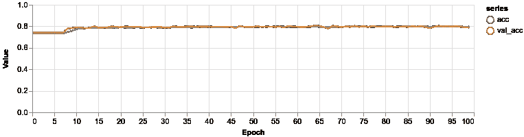

# 基于 TensorFlow.js 的神经网络客户流失预测

> 原文：<https://towardsdatascience.com/customer-churn-prediction-using-neural-networks-with-tensorflow-js-6b3dc8c21e7d?source=collection_archive---------10----------------------->

## 创建深度神经网络模型来预测客户流失


> *TL；DR 了解深度学习并使用 TensorFlow.js 创建深度神经网络模型来预测客户流失。了解如何预处理字符串分类数据。*

第一天！你在一家大型电信公司获得了这份数据科学家的实习工作。一旦你成为一名高级数据科学家，你就不能停止梦想你将得到的兰博基尼和名牌服装。

连你妈妈都打电话来提醒你把你的统计学博士文凭挂在墙上。这就是生活，谁在乎你 35 岁左右，这是你的第一份工作。

你的团队领导走过来，问你喜欢这份工作吗，并说他可能有任务给你！你开始想象从零开始实现复杂的统计模型，做研究，并添加尖端的方法，但…嗯，现实略有不同。他向您发送了一个 CSV 失败的链接，并要求您预测客户流失。他建议你可以尝试应用深度学习来解决这个问题。

你的梦想现在开始了。该做些工作了！

**在你的浏览器中运行本教程的完整源代码:**

[GitHub 上的源代码](https://github.com/curiousily/Customer-Churn-Detection-with-TensorFlow-js)

# 客户流失数据

我们的数据集*电信客户流失*来自 [Kaggle](https://www.kaggle.com/blastchar/telco-customer-churn) 。

> *“预测行为留住客户。您可以分析所有相关的客户数据，并制定有针对性的客户维系计划。”【IBM 样本数据集】*

数据集包括以下信息:

*   上个月内离开的客户—这一列称为流失
*   每位客户已注册的服务—电话、多条线路、互联网、在线安全、在线备份、设备保护、技术支持以及流媒体电视和电影
*   客户账户信息——他们成为客户的时间、合同、支付方式、无纸化账单、每月费用和总费用
*   客户的人口统计信息—性别、年龄范围，以及他们是否有伴侣和家属

它有 7，044 个示例和 21 个变量:

*   **客户 ID** :客户 ID
*   **性别**:顾客是男性还是女性
*   **老年人**:客户是否为老年人(1，0)
*   **合作伙伴**:客户是否有合作伙伴(是，否)
*   **家属**:客户是否有家属(是，否)
*   **任期**:客户在公司呆的月数
*   **电话服务**:客户是否有电话服务(是，否)
*   **多线**:客户是否有多线(是，否，无电话服务)
*   **互联网服务**:客户的互联网服务提供商(DSL、光纤、No)
*   **在线安全**:客户是否有在线安全(是，否，无互联网服务)
*   **在线备份**:客户是否有在线备份(是，否，无互联网服务)
*   **设备保护**:客户是否有设备保护(是，否，无互联网服务)
*   **技术支持**:客户是否有技术支持(是，否，无互联网服务)
*   **流媒体电视**:客户是否有流媒体电视(是，否，无互联网服务)
*   **流媒体电影**:客户是否有流媒体电影(是，否，无互联网服务)
*   **合同**:客户的合同期限(逐月、一年、两年)
*   **无纸开票**:客户是否无纸开票(是，否)
*   **付款方式**:客户的付款方式(电子支票、邮寄支票、银行转账(自动)、信用卡(自动))
*   **月费**:每月向客户收取的金额
*   **总费用**:向客户收取的总费用
*   **客户流失**:客户是否流失(是或否)

我们将使用 [Papa Parse](https://www.papaparse.com/) 来加载数据:

注意，我们忽略了最后一行，因为它是空的。

# 探测

让我们感受一下我们的数据集。有多少顾客呕吐了？


大约 74%的客户仍在使用该公司的服务。我们有一个非常不平衡的数据集。

性别在流失客户中起作用吗？


似乎没有。我们的女性和男性顾客数量差不多。资历如何？


大约 20%的客户是老年人，与非老年人相比，他们更有可能流失。

客户会在公司呆多久？


似乎你呆得越久，就越有可能留在公司。

月费如何影响流失率？


月租费低(＄30)的客户更有可能被留住。

每位顾客的总费用是多少？


公司收取的总金额越高，就越有可能留住这个客户。

我们的数据集总共有 21 个要素，我们没有全部看完。然而，我们发现了一些有趣的东西。

我们已经了解到，老年人、任期、每月费用和总费用在某种程度上与流失状况相关。我们将在我们的模型中使用它们！

# 深度学习

深度学习是机器学习的一个子集，使用[深度人工神经网络](https://en.wikipedia.org/wiki/Deep_learning#Deep_neural_networks)作为主要模型来解决各种任务。

为了获得深度神经网络，取一个具有一个隐藏层的神经网络(浅层神经网络),并添加更多层。这就是深度神经网络的定义——具有不止一个隐藏层的神经网络！

在深度神经网络中，每层神经元都在前一层的特征/输出上进行训练。因此，您可以创建一个不断抽象的特性层次结构，并学习复杂的概念。

这些网络非常善于发现原始数据(图像、文本、视频和音频记录)中的模式，这些数据是我们拥有的最大量的数据。例如，深度学习可以拍摄数百万张图像，并将其分类为你奶奶的照片、有趣的猫和美味的蛋糕。

深度神经网络是[在各种重要问题上拥有最先进的分数](https://paperswithcode.com/sota)。例子有图像识别、图像分割、声音识别、推荐系统、自然语言处理等。

所以基本上，深度学习是大型神经网络。为什么是现在？为什么深度学习之前不实用？

*   *大多数深度学习的现实应用需要大量的标记数据*:开发一辆无人驾驶汽车可能需要数千小时的视频。
*   *训练具有大量参数(权重)的模型需要强大的计算能力*:GPU 和 TPU 形式的专用硬件提供大规模并行计算，适合深度学习。
*   大公司储存你的数据已经有一段时间了:他们想利用这些数据赚钱。
*   *我们学习了(有点)如何初始化神经网络模型中神经元的权重*:主要是使用小的随机值
*   *我们有更好的正规化技术*(例如[辍学](https://www.cs.toronto.edu/~hinton/absps/JMLRdropout.pdf))

最后但并非最不重要的是，我们有高性能且(有时)易于使用的软件。像 [TensorFlow](https://www.tensorflow.org/) 、 [PyTorch](https://pytorch.org/) 、 [MXNet](https://mxnet.apache.org/) 和 [Chainer](https://chainer.org/) 这样的库允许从业者开发、分析、测试和部署不同复杂性的模型，并重用其他从业者和研究人员所做的工作。

# 预测客户流失

让我们使用“全能”的深度学习机器来预测哪些客户会流失。首先，我们需要做一些数据预处理，因为许多特征是分类的。

## 数据预处理

我们将使用所有数字(除了 *customerID* )和以下分类特征:

让我们从数据中创建训练和测试数据集:

以下是我们创建张量的方法:

首先，我们使用函数`toCategorical()`将分类特征转换成[独热码](https://en.wikipedia.org/wiki/One-hot)编码向量。我们通过将字符串值转换成数字并使用 [tf.oneHot()](https://js.tensorflow.org/api/latest/#oneHot) 来创建向量。

我们从我们的特征(分类的和数字的)中创建一个 2 维张量，然后[将其归一化](https://en.wikipedia.org/wiki/Feature_scaling)。另一个，一个热编码，张量是由流失列。

最后，我们将数据分成训练和测试数据集，并返回结果。我们如何编码分类变量？

首先，我们提取特征的所有值的向量。接下来，我们获取唯一值，并从中创建一个 string 到 int 的映射。

注意，我们检查丢失的值，并将它们编码为 0。最后，我们一次性编码每个值。

以下是剩余的效用函数:

## 构建深度神经网络

我们将把模型的构建和训练打包到一个名为`trainModel()`的函数中:

让我们使用 TensorFlow 中的[顺序模型 API](https://js.tensorflow.org/api/latest/#sequential) 创建一个深度神经网络:

我们的深层神经网络有两个隐藏层，分别有 32 个和 64 个神经元。每层都有一个 [ReLU](https://en.wikipedia.org/wiki/Rectifier_(neural_networks)) 激活功能。

是时候[编译](https://js.tensorflow.org/api/latest/#tf.LayersModel.compile)我们的模型了:

我们将使用[亚当优化器](https://js.tensorflow.org/api/latest/#train.adam)训练我们的模型，并使用[二元交叉熵](https://js.tensorflow.org/api/latest/#metrics.binaryCrossentropy)测量我们的误差。

# 培养

最后，我们将训练数据传递给我们模型的 [fit](https://js.tensorflow.org/api/latest/#tf.Sequential.fit) 方法，并训练 *100 个*时期，*混洗数据*，并使用其中的 *10%* 进行验证。我们将使用 [tfjs-vis](https://github.com/tensorflow/tfjs-vis) 可视化培训进度:

让我们训练我们的模型:



看起来我们的模型在前十个时期都在学习，在那之后就稳定下来了。

# 估价

让我们根据测试数据评估我们的模型:

```
Tensor 0.44808024168014526 
Tensor 0.7929078340530396
```

该模型对测试数据的准确率为 79.2%。让我们看看使用混淆矩阵会犯什么样的错误:


似乎我们的模型在预测保留客户方面过于自信了。根据您的需要，您可以尝试调整模型，更好地预测保留的客户。

# 结论

干得好！您刚刚构建了一个深度神经网络，它可以以大约 80%的准确率预测客户流失。以下是你学到的东西:

*   什么是深度学习
*   浅层神经网络和深层神经网络有什么区别
*   预处理字符串分类数据
*   在 TensorFlow.js 中构建和评估深度神经网络

但是深度学习会不会更厉害呢？强大到能看懂图像？

**在浏览器中运行本教程的完整源代码:**

[GitHub 上的源代码](https://github.com/curiousily/Customer-Churn-Detection-with-TensorFlow-js)

# 参考

*   [深度学习&人工神经网络](https://machinelearningmastery.com/what-is-deep-learning/)
*   [什么是深度学习？](https://www.mathworks.com/discovery/deep-learning.html)
*   [神经网络和深度学习初学者指南](https://skymind.ai/wiki/neural-network)

*原载于*[*https://www.curiousily.com*](https://www.curiousily.com/posts/customer-churn-prediction-using-deep-neural-network-with-tensorflow-js/)*。*

建立机器学习模型(特别是深度神经网络)，可以轻松地与现有或新的 web 应用程序集成。想想您的 ReactJs、Vue 或 Angular 应用程序通过机器学习模型的强大功能得到了增强:

[](https://leanpub.com/deep-learning-for-javascript-hackers) [## JavaScript 黑客的深度学习

### 建立机器学习模型(特别是深度神经网络)，您可以轻松地与现有或新的网络集成…

leanpub.com](https://leanpub.com/deep-learning-for-javascript-hackers)