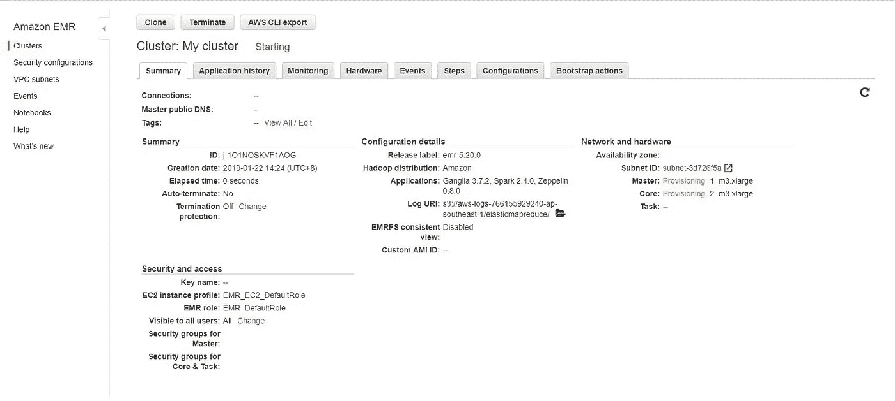
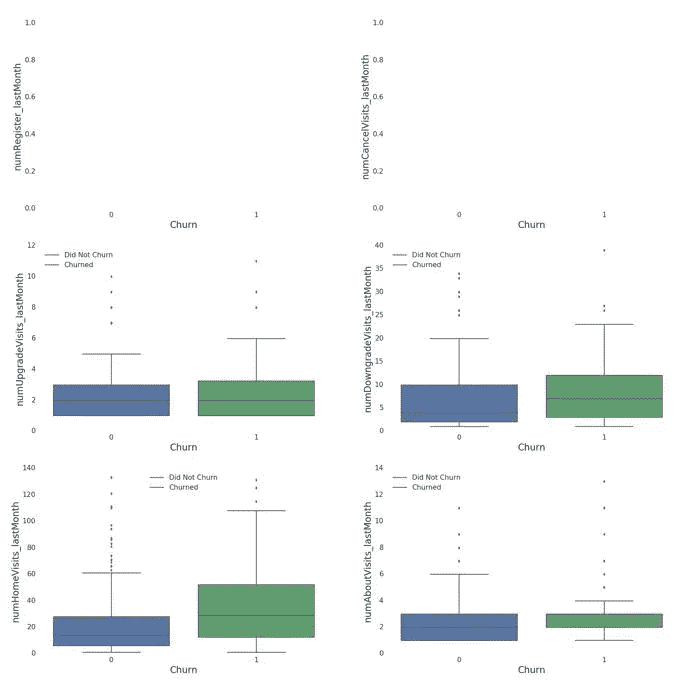

# 在 IBM Watson Studio、AWS 和 Databricks 上使用 PySpark 进行客户流失预测

> 原文：<https://towardsdatascience.com/customer-churn-prediction-with-pyspark-on-ibm-watson-studio-aws-and-databricks-de57a2ffb25b?source=collection_archive---------24----------------------->

## *使用大数据工具和云计算服务预测数字音乐服务的客户流失*


Image taken from www.thedj.co.uk

*本文附带的代码可以在这里*[](https://github.com/joshxinjie/sparkify_customer_churn)**找到。**

*客户流失指的是客户停止与一家公司做生意的情况。*

*根据《哈佛商业评论》的文章，获得一个新客户比留住一个现有客户要贵 5 到 25 倍。*

*事实上，贝恩公司的 Frederick Reichheld 进行的一项研究表明，将客户保持率提高 5%可以增加 25%到 95%的利润。*

*因此，降低客户流失率应该是公司的首要任务。如果我们能够提前成功预测客户流失，我们可以通过提供折扣和激励来吸引他们留下来。*

*在本文中，我们将解决一个名为 Sparkify 的虚拟数字音乐服务的客户流失预测问题。我们将在客户在服务上的活动的大型数据集(约 12GB)上训练我们的预测模型，并尝试根据客户过去的行为预测他们将流失的客户。*

*由于这个数据集太大，无法在单台计算机上运行，我们将使用 Apache Spark 来帮助我们分析这个数据集。*

*Apache Spark 是世界上最流行的大数据分布式处理框架(使用多台计算机)之一。Spark 比 Hadoop MapReduce 快得多，它有一个用户友好的 API，可以通过许多流行的语言访问:Scala、Java、Python 和 r。*

*对于这个任务，我们将使用 Spark 的 Python API py Spark。*

*PySpark 提供了两种操作数据帧的方法:第一种类似于 Python 的 Pandas 库，另一种使用 SQL 查询。*

*Spark ML 是 Spark 机器学习库的基于数据框架的 API，它为用户提供了流行的机器学习算法，如线性回归、逻辑回归、随机森林、梯度增强树等。*

*在本地计算机上设置 PySpark 可能会很棘手。在云服务上运行 PySpark 将简化设置过程，但可能会产生一些成本。*

*理想情况下，您应该在本地机器上用较小的数据集创建模型的原型以节省成本，然后在准备好分析较大的数据集时将代码转移到基于云的服务。最终，您将需要一个云服务来充分利用 Spark 的分布式计算框架。*

*另一种方法是用 Databricks 建立一个帐户，并使用他们的社区版来构建你的模型原型。Databricks 社区版提供免费的 6GB 微集群以及集群管理器和笔记本环境。最棒的是访问不受时间限制！*

*如果您对复制代码或尝试数据集感兴趣，我已经包括了三个云服务的设置说明，IBM Studio Watson、Amazon AWS 和 Databricks。*

# *问题的简要描述*

*Sparkify 有一个免费层和一个高级订阅计划，客户可以随时取消或从高级降级到免费层。*

*我们将客户流失事件定义为从高级降级到免费等级或取消服务。*

*理想情况下，我们希望使用过去的数据来预测客户流失事件，以避免任何前瞻性偏见。有两个月的客户活动数据可用。因此，我们将建立一个模型，利用用户第一个月的行为数据来预测用户在第二个月是否会流失。*

*完整的数据集为 12 GB。或者，您可以尝试数据集的较小实例，我已经在我的 [GitHub](https://github.com/joshxinjie/sparkify_customer_churn) 页面上包含了数据集的下载链接。*

*我现在将介绍三种云计算服务的设置说明:IBM Watson Studio、AWS 和 Databricks。如果你愿意，可以跳过它们，继续阅读“数据集”。*

# *设置 IBM Watson Studio*

*设置和运行 Spark 最简单的方法之一是通过 IBM Watson Studio 平台。它有一个用户友好的界面，并有一个免费的“建兴计划”。*

*您将获得每月 50 个容量单位的“精简计划”。默认的 Spark Python 3.5 环境每小时消耗 1.5 个容量单位，这样您就有大约 33 个小时来处理一个项目。*

*要设置 IBM Watson Studio，您需要注册一个 IBM Cloud 帐户，如果您还没有的话。*

*接下来，登录 IBM Watson Studio [主页](https://dataplatform.cloud.ibm.com/)页面并登录。*

**

*Select log in*

*登录后，您将被带到此页面。选择“创建项目”。*

**

*Select “Create a project”*

*接下来，悬停在“数据科学”周围，并单击“创建项目”。*

**

*Select “Data Science” and click “Create Project”*

*输入项目名称，然后选择“创建”。*

**

*Enter a project name and select “Create”*

*选择“添加到项目”。*

**

*Select “Add to project”*

*为您的资产类型选择“笔记本电脑”。*

**

*Select “Notebook”*

*给笔记本起个名字，选择“默认 Spark Python 3.5 xs(1 个 vCPU 和 4 GB RAM 的驱动，2 个各 1 个 vCPU 和 4 GB RAM 的执行器)”。接下来，单击“创建笔记本”。*

**

*这将创建一个新的笔记本，您可以在那里开始编码。*

**

*要插入数据文件，选择右上角的“查找和添加数据”图标。只需将您想要的数据文件拖放到框中。*

**

*要创建新的 Spark 会话并读入数据文件，选择“插入代码”并点击“插入 Spark Session 数据帧”。*

**

*这将生成一个预写单元。*

**

*Uncomment the last two lines to read in the data frame*

*您可以取消最后两行的注释，以读取数据文件。请随意更改数据框的名称。*

**

*I uncommented the last 2 lines and changed the name of the data frame from df_data_1 to df*

*您现在可以构建您的项目了！*

**

*This is what you will see after you run the first cell*

*如果您当前的群集因任何原因终止，您可以随时将先前存在的笔记本重新连接到新的群集，并继续您的工作。*

*完成项目后，您应该停止您的环境并删除您的笔记本和数据文件，以避免任何意外费用。*

*要停止您的环境，请单击项目页面顶部的“环境”选项卡。单击活动环境右侧的三个点，然后选择“停止”。*

**

*Select “Stop” to stop your environment*

*接下来，转到项目页面顶部的“资产”选项卡。点击数据文件右边的三个点，选择“删除”。对你的笔记本也重复这个步骤。*

**

*“Remove” your data file. Do the same for your notebook as well*

*您可以通过选择“管理”，然后选择“计费和使用”来查看您的计费信息。*

**

*To check your billing details*

*在 IBM Watson Studio 平台上使用 Spark 的一个优点是，它预装了常用的库，如 Pandas 和 Matplotlib 等。这与 AWS EMR 服务形成对比，后者没有预安装这些库。*

*如果您的 IBM 托管笔记本停止运行或您的互联网浏览器崩溃(是的，它确实发生了)，这可能意味着您当前在 IBM Watson Studio 上的设置没有足够的内存来处理这项任务。您可能需要选择一个更简单的模型，对数据集进行降维，或者购买付费计划来访问一个更强大的实例。*

# *设置 Amazon AWS*

*我现在将分享 Amazon Web Services Elastic MapReduce(EMR)的设置说明。*

*开始吧。你需要注册一个 AWS 账户。注册时，您需要提供一张信用卡，但不会向您收取任何费用。*

*您需要选择一个支持计划，免费的基本支持计划应该足够了。*

*接下来，进入亚马逊 [EMR](https://aws.amazon.com/emr/) 控制台，点击“亚马逊 EMR 入门”。使用您的帐户登录后，您就可以创建集群了。*

**

*Click “Get Started with Amazon EMR”*

*在右上角选择合适的位置(选择离你最近的一个)。在左侧菜单中选择“集群”，然后单击“创建集群”。*

**

*Location, on the top right hand corner, is currently Ohio. Change this to the most appropriate location. Next you can create your clusters.*

*使用以下设置配置您的群集:*

1.  *版本:emr-5.20.0 或更高版本*
2.  *应用程序::Spark 2.4.0 在 Hadoop 2.8.5 YARN 上，带有 Ganglia 3.7.2 和 Zeppelin 0.8.0*
3.  *实例类型:m3.xlarge*
4.  *实例数量:6*
5.  *EC2 密钥对:没有 EC2 密钥对也可以使用，如果你愿意的话*

*如果您想按原样运行代码，建议您使用 m3.xlarge 的 6 个实例。当然，您可以尝试更少的实例数(例如 3 个)。但是，如果您遇到诸如“会话不活动”之类的错误，这可能意味着您当前的集群设置没有足够的内存来执行该任务。您将需要创建一个具有较大实例的新集群。*

*其余的设置可以保持默认值，您可以通过单击“创建集群”来完成设置。*

****

*This picture shows the setup with 4 instances. You are recommended to use 6 instances for this project to avoid memory issues.*

**

*You will get a similar error message when running your code if your cluster has insufficient memory for the task*

*接下来，您将进入一个页面，显示集群正在“启动”。几分钟后，状态将变为“正在运行”。最后会改成“等待”。整个过程可能需要 3 到 10 分钟。此时，您可以进入下一步。*

**

*The first status will state that the cluster is “Starting”*

**

*Next, the status will change to “Running”*

**

*Finally, it will change to “Waiting”. At this point, you can move on to the next step*

*最后，你可以创建你的笔记本。*

1.  *在左侧菜单中选择“笔记本”。*
2.  *为您的笔记本命名*
3.  *选择“选择现有集群”，然后选择您刚刚创建的集群*
4.  *使用“AWS 服务角色”的默认设置—如果您以前没有这样做过，应该是“EMR_Notebooks_DefaultRole”或“创建默认角色”。*
5.  *您可以保持其他设置不变，然后单击右下角的“创建笔记本”*

**

*接下来，等待笔记本的状态从“正在启动”或“待定”变为“就绪”。此时，您可以“打开”笔记本。*

**

*现在，您可以开始编码了。*

*下面提供了创建新的 Spark 会话并读取完整数据集的起始代码:*

```
**# Starter code* **from** pyspark.sql **import** SparkSession*# Create spark session* spark = SparkSession \
	.builder \
	.appName("Sparkify") \
	.getOrCreate()*# Read in full sparkify dataset* event_data = "s3n://dsnd-sparkify/sparkify_event_data.json"df = spark.read.json(event_data)df.head()*
```

*完整的数据集位于:`s3n://dsnd-sparkify/sparkify_event_data.json`*

*这是运行代码后您将看到的内容。*

**

*如果您终止了群集并停止了笔记本，并且想要重新运行笔记本，则可以创建一个新的群集，并将笔记本重新连接到新的群集。*

*按照之前给出的说明设置新的集群，然后返回左侧菜单中的“笔记本”选项。单击您已创建的现有笔记本，选择“更改集群”并选择新创建的集群。最后选择“更改集群并启动笔记本”。*

**

*To re-connect your notebook to a new cluster, click on your existing notebook*

**

*Select “Change cluster”*

**

*Select the newly created cluster with the “Choose” button located under the “Choose an existing cluster” option. Finally select “Change cluster and start notebook”*

*为了避免 AWS 上的任何意外费用，请在完成分析后终止集群并删除笔记本。您可以在左侧菜单的“集群”和“笔记本”选项中检查这一点。*

*如果您在多个位置设置了集群，请确保检查所有这些位置，因为每个位置都有自己的集群列表！*

**

*Ensure all your clusters are terminated when you are done with your analysis*

*您可以在您的帐户名称下的“我的账单面板”选项下查看您的账单详情。*

**

*在 Amazon EMR 上运行代码时，您可能会遇到以下错误或异常:*

1.  *type error:“NoneType”类型的对象没有 len()*
2.  *KeyError: 14933 ( *数字可能不同*)*

*如果您看到这些错误，请不要担心。通常，它们并不意味着您的代码有问题，它们的出现不会影响您代码的执行。如果在执行代码块时出现这些错误，可以忽略这些错误信息。代码仍将被执行。*

**

*An example of error #1*

**

*An example of error #2*

*在 AWS EMR 上运行分析花费了我大约 20 美元。这是考虑到我不得不多次重新运行分析的事实，因为我的 AWS 托管笔记本由于内存不足而崩溃(我最初尝试使用 3、4 和 5 个 m3.xlarge 实例)。*

*因此，如果您从一个足够大的集群开始(对于这个项目，有 6 个 m3.xlarge 实例)，您可能能够运行一次代码而不会遇到任何问题。这有助于降低你的成本。*

*此外，我在本地机器上开发了模型的原型，这有助于降低最终成本。*

*需要注意的是，AWS EMR 集群没有预装 Scikit-Learn、Pandas、Matplotlib 等库。您应该能够在没有这些库的情况下完成项目，尽管您将无法执行任何数据可视化。*

*如果您确实想使用这些库，您需要按照这个[链接](https://docs.aws.amazon.com/emr/latest/ReleaseGuide/emr-jupyterhub-install-kernels-libs.html)提供的说明来安装它们。这个[视频](https://www.youtube.com/watch?v=J6CFXgyKWQ4&list=WL&index=36&t=56s)也会有帮助。*

*这是一个有点复杂的过程，模糊地涉及编写一个 bash 脚本来安装这些库，将脚本上传到 S3 桶，然后用脚本实例化一个集群。诚然，在撰写本文时，我还没有尝试过。如果我开始安装这些库，我可能会在将来更新这篇文章。*

# *设置数据块*

*为了注册 Databricks 帐户，您需要一个 AWS 帐户。Databricks 的平台依赖 AWS 作为云基础设施。你可以在这里注册一个 Databricks 账户[。](https://databricks.com/product/faq/community-edition)*

*Databricks 的注册过程比前面提到的其他两个云服务稍长，它涉及到在您的 AWS 帐户和 Databricks 帐户设置页面之间穿梭。*

*然而，一旦您完成了设置并激活了您的帐户，在 Databricks 中设置工作环境就相对容易了。*

*此外，社区版为您提供了对 6 GB 集群的免费无限制访问(无需担心时间限制！)，使其成为构建模型原型的完美环境。*

*同样，对于 IBM Watson Studio，Databricks 的工作环境预装了常用的库，如 Pandas、Matplotlib。*

*一旦你创建了你的账户，请前往 Databricks 社区版的[登录](https://community.cloud.databricks.com/login.html)页面。*

**

*Login to your account*

*您将看到一个类似的页面。*

**

*Home page of Databricks Community Edition*

*在左侧菜单中选择“集群”。*

**

*Select “Clusters”*

*选择页面左上角的“+创建集群”。*

**

*Select the blue “+ Create Cluster” button*

*为您的集群命名。您可以不修改 Databricks 运行时版本。选择要使用的 Python 版本。我为我的项目选择了 Python 3。您可以将“可用性区域”字段留空。完成后，选择“创建集群”。*

**

*等待状态从“待定”变为“正在运行”。*

**

*Cluster status is “Pending”*

**

*Cluster status is “Running”*

*接下来，在左侧菜单中选择“工作区”，然后单击“用户”。选择电子邮件旁边的箭头，点击“创建”，然后点击“笔记本”。*

**

*Creating a new notebook*

*为您的笔记本命名，您可以保持其他设置不变。*

**

*Give a name to your notebook and select “Create”*

*接下来，您需要上传数据集。在左侧菜单中选择“数据”，然后点击“添加数据”。*

*只需将您想要上传的文件拖放到灰色框中。上传文件时不要离开页面，否则你将不得不重新做整个过程。*

**

*Drag and drop your desired data file*

*上传完成后，选择“在笔记本中创建表格”。*

**

*这将打开一个带有预写单元的示例笔记本，该单元具有读取数据的代码。复制该单元格中的代码，并返回到您之前创建的原始笔记本，然后将代码粘贴到那里。*

**

*The example notebook. Copy the first cell and paste it in the notebook you created earlier*

*恭喜你，你可以开始编码了！*

**

*如果你想保存文件，点击“文件”，然后“导出”，然后“iPython 笔记本”。*

**

*如果要将代码单元格更改为降价单元格，请在单元格的第一行键入“%md”。*

*如果您已终止群集，您可以随时创建新群集，并将现有笔记本重新连接到新群集。*

*尽管 Community Edition 是一项免费服务，但终止您的集群并删除您的笔记本以避免任何意外的 AWS 费用仍然是一个好主意。您可以通过单击左侧菜单中的“集群”来检查集群的状态。*

*请注意，如果您选择使用完整的 Databricks 平台而不是社区版，您将会产生 AWS 费用。*

# *资料组*

*数据集的架构:*

**

*数据集中的一行:*

**

*在这个数据集中要注意的一个关键列是“page”列。“页面”栏记录了用户访问的页面。*

*以下是用户可以访问的页面列表:*

1.  ***取消**:用户已经访问了取消页面。并不意味着取消已完成。*
2.  ***提交降级**:用户已提交从高级层到免费层的降级*
3.  ***拇指向下**:用户给了一个拇指向下。*
4.  ***主页**:用户访问了主页*
5.  ***降级**:用户访问降级页面。不代表提交降级。*
6.  ***滚动广告**:播放广告。*
7.  ***注销**:用户注销。*
8.  ***保存设置**:用户对设置做了一些更改并保存。*
9.  ***取消确认**否:用户取消订阅。*
10.  ***关于**:用户访问了关于页面。*
11.  ***提交注册**:用户提交注册请求。*
12.  ***设置**:用户访问设置页面。*
13.  ***登录**:用户登录。*
14.  ***注册**:用户访问注册页面。并不意味着注册已经完成。*
15.  ***添加到播放列表**:用户添加歌曲到播放列表。*
16.  ***添加好友**:用户添加了一个好友。*
17.  ***下一首歌**:用户听了一首歌。*
18.  ***竖起大拇指**:用户竖起大拇指。*
19.  ***帮助**:用户访问了帮助页面。*
20.  ***升级**:用户从免费升级到高级等级。*

*其中，我们应该注意的页面可能是:“下一首歌”，它跟踪用户播放的歌曲，“提交降级”，它跟踪用户何时提交降级请求，以及“取消确认”，它跟踪用户的取消请求何时被确认。*

*通过搜索“提交降级”或“取消确认”页面，我们可以知道客户何时流失。*

*请注意，用户可以访问“降级”和“取消”页面，但不能提交降级或取消请求。*

*其余的页面相对简单。它们表明用户已经访问了相关页面。*

*如前所述，有 2 个月的数据可用。*

# *数据预处理*

*根据您使用的云计算服务，读入的数据会略有不同。每个服务在数据集中的读取方法在上面的设置说明中有所分享。*

*如果您正在读取本地计算机上的数据，这是小型数据集的代码:*

```
**# create a Spark session*
spark = SparkSession.builder \
    	.master("local") \
    	.appName("Sparkify") \
    	.getOrCreate()df = spark.read.json("mini_sparkify_event_data.json")*
```

*此代码假定数据集与您的代码位于同一文件目录中。根据数据集的存储位置，您可能需要更改数据集的路径。*

## *数据清理*

*有几列的值为空。值得注意的是，缺少`firstName`、`gender`、`lastName`、`location`、`registration`和`userAgent` 的条目属于未登录或未注册的用户。*

**

*Number of null values for each feature on the full dataset*

*由于我们不知道这些条目跟踪的是哪些用户，而且大多数条目都与登录或主页相关联，因此这些条目提供的价值很小。因此，我们可以从我们的分析中丢弃它们。*

```
**# filter out all entries with missing names.* 
*# these also removes entries with missing gender, lastName, 
# location, registration and userAgent*df = df.filter(df.firstName.isNotNull())*
```

*不是“NextSong”的页面的`artist`、`length`和`sessionId`为空值。所有这些变量只有在播放歌曲时才有效(只有当`page` ='NextSong ')时它们才不为空，因此我们可以不修改它们。*

## *特征工程*

*首先，我们将时间戳转换为日期时间。原始时间戳是以毫秒为单位的，所以我们必须在转换它们之前将它们除以 1000。*

```
**# original timestamp in milliseconds, so divide by 1000* adjust_timestamp = udf(**lambda** x : x//1000, IntegerType()) 
df = df.withColumn("ts_adj", adjust_timestamp('ts')) *# convert adjusted timestamp to datetime* 
df = df.withColumn("datetime", from_unixtime(col("ts_adj"))) *# convert registration timestamp to datetime* 
df = df.withColumn("reg_adj", adjust_timestamp('registration')) *# convert adjusted registration timestamp to datetime* 
df = df.withColumn("reg_datetime", from_unixtime(col("reg_adj"))) *# drop all the timestamp columns. Will not need them* 
columns_to_drop = ['registration', 'ts', 'ts_adj', 'reg_adj'] 
df = df.drop(*columns_to_drop)*
```

*接下来，我们可以从 0 到 N 标记月份，其中 N 表示数据集中可用月份的总数。我们可以估计分析的开始日期为“2018 年 10 月 1 日 00:00:00”。*

```
**# add start date of analysis* 
df = df.withColumn('analysis_start_date',\
		   lit('2018-10-01 00:00:00')) *# number the months starting from the very first month of the # analysis* 
df = df.withColumn("month_num",\
	      	   floor(months_between(df.datetime,\
	           df.analysis_start_date)))*
```

*用二进制(0 或 1)变量替换`gender`和`level`的字符串变量。*

```
**# engineer free or paid binary variable*
*# free: 0, paid: 1*
df = df.replace(["free", "paid"], ["0", "1"], "level")

*# engineer male and female binary binary variable*
*# male: 0, female: 1*
df = df.replace(["M", "F"], ["0", "1"], "gender")*
```

*我们可以将流失事件定义为用户访问“取消确认”或“提交降级”页面。*

```
***def** define_churn(x):     
 *"""
    	Defining churn as cancellation of service or downgrading	from premium to free tier.
	"""*     
 **if** x == "Cancellation Confirmation":
        **	return** 1
 **elif** x == "Submit Downgrade":
 **return** 1
 **else**:
 **return** 0 churn_event = udf(**lambda** x : define_churn(x), IntegerType())      
df = df.withColumn("churn", churn_event("page"))*
```

*为每个用户生成每月统计数据:*

```
**# number of register page visits*
df_register = df.select('userId', 'month_num', 'page') \
	.where(df.page=="Register") \
	.groupBy('userId', 'month_num') \
	.agg({'page':'count'}) \
	.withColumnRenamed('count(page)', 'numRegister')*# number of cancel page visits*
df_cancel = df.select('userId', 'month_num', 'page') \
	.where(df.page=="Cancel") \
	.groupBy('userId', 'month_num') \
	.agg({'page':'count'}) \
	.withColumnRenamed('count(page)', 'numCancelVisits')*# number of upgrade page visits*
df_upgrade = df.select('userId', 'month_num', 'page') \
	.where(df.page=="Upgrade") \
	.groupBy('userId', 'month_num') \
	.agg({'page':'count'}) \
	.withColumnRenamed('count(page)', 'numUpgradeVisits')*# number of downgrade page visits*
df_downgrade = df.select('userId', 'month_num', 'page') \
	.where(df.page=="Downgrade") \
	.groupBy('userId', 'month_num') \
	.agg({'page':'count'}) \
	.withColumnRenamed('count(page)', 'numDowngradeVisits')*# number of home page visits*
df_home = df.select('userId', 'month_num', 'page') \
	.where(df.page=="Home") \
	.groupBy('userId', 'month_num') \
	.agg({'page':'count'}) \
	.withColumnRenamed('count(page)', 'numHomeVisits')*# number of about page visits*
df_about = df.select('userId', 'month_num', 'page') \
	.where(df.page=="About") \
	.groupBy('userId', 'month_num') \
	.agg({'page':'count'}) \
	.withColumnRenamed('count(page)', 'numAboutVisits')*# number of setting page visits*
df_settings = df.select('userId', 'month_num', 'page') \
	.where(df.page=="Settings") \
	.groupBy('userId', 'month_num') \
	.agg({'page':'count'}) \
	.withColumnRenamed('count(page)', 'numSettingsVisits')*# number of times user save settings changes*
df_saveSettings = df.select('userId', 'month_num', 'page') \
	.where(df.page=="Save Settings") \
	.groupBy('userId', 'month_num') \
	.agg({'page':'count'}) \
	.withColumnRenamed('count(page)', 'numSaveSettings')*# number of login page visits*
df_login = df.select('userId', 'month_num', 'page') \
	.where(df.page=="Login") \
	.groupBy('userId', 'month_num') \
	.agg({'page':'count'}) \
	.withColumnRenamed('count(page)', 'numLogins')*# number of logout page visits*
df_logout = df.select('userId', 'month_num', 'page') \
	.where(df.page=="Logout") \
	.groupBy('userId', 'month_num') \
	.agg({'page':'count'}) \
	.withColumnRenamed('count(page)', 'numLogouts')*# number of songs added to playlist*
df_addPlaylist = df.select('userId', 'month_num', 'page') \
	.where(df.page=="Add to Playlist") \
	.groupBy('userId', 'month_num') \
	.agg({'page':'count'}) \
	.withColumnRenamed('count(page)', 'numAddPlaylists')*# number of friends added*
df_addFriend = df.select('userId', 'month_num', 'page') \
	.where(df.page=="Add Friend") \
	.groupBy('userId', 'month_num') \
	.agg({'page':'count'}) \
	.withColumnRenamed('count(page)', 'numFriends')*# number of thumbs up given*
df_thumbsUp = df.select('userId', 'month_num', 'page') \
	.where(df.page=="Thumbs Up") \
	.groupBy('userId', 'month_num') \
	.agg({'page':'count'}) \
	.withColumnRenamed('count(page)', 'numThumbsUp')*# number of thumbs down given*
df_thumbsDown = df.select('userId', 'month_num', 'page') \
	.where(df.page=="Thumbs Down") \
	.groupBy('userId', 'month_num') \
	.agg({'page':'count'}) \
	.withColumnRenamed('count(page)', 'numThumbsDown')*# number of advertisements rolled*
df_advert = df.select('userId', 'month_num', 'page') \
	.where(df.page=="Roll Advert") \
	.groupBy('userId', 'month_num') \
	.agg({'page':'count'}) \
	.withColumnRenamed('count(page)', 'numAdverts')*# number of songs played*
df_songsPlayed = df.select('userId', 'month_num', 'page') \
	.where(df.page=="NextSong") \
	.groupBy('userId', 'month_num') \
	.agg({'page':'count'}) \
	.withColumnRenamed('count(page)', 'numSongsPlayed')*# total amount of time user listened to songs*
df_totalListen = df.select('userId', 'month_num', 'length') \
	.groupBy('userId', 'month_num') \
	.agg({'length':'sum'}) \
	.withColumnRenamed('sum(length)', 'totalListenTime')

*# number of songs played per session*
df_songsPerSession = df.select('userId', 'month_num', 'page', 	'sessionId') \
	.where(df.page=="NextSong") \
	.groupBy('userId', 'month_num', 'sessionId') \
	.agg({'page':'count'}) \
	.withColumnRenamed('count(page)', 'SongsPerSession')*# average number of songs played per session*
df_avgSongsPerSession = df_songsPerSession.groupBy('userId', 	'month_num') \
	.agg(avg(df_songsPerSession.SongsPerSession).alias	('avgSongsPerSession'))

*# number of singers listened per month*
df_singersPlayed = df.select('userId', 'month_num', 'page', 	'artist') \
	.where(df.page=="NextSong") \
	.groupBy('userId', 'month_num') \
	.agg(countDistinct(df.artist).alias('numSingersPlayed'))

*# number of singers per session*
df_singersPerSession = df.select('userId', 'month_num', 'page', 	'artist', 'sessionId') \
	.where(df.page=="NextSong") \
	.groupBy('userId', 'month_num', 'sessionId') \
	.agg(countDistinct(df.artist).alias('SingersPerSession'))*# average number of singers per session*
df_avgSingersPerSession = df_singersPerSession.groupBy('userId', 	'month_num') \
	.agg(avg(df_singersPerSession.SingersPerSession).alias	('avgSingersPerSession'))

*# amount of time spent for each session*
df_userSession = df.groupBy("userId", "month_num", "sessionId") \
	.agg(((max(unix_timestamp(df.datetime))-min(unix_timestamp	(df.datetime)))/60.0).alias('sessionTimeMins'))*# average time per session*
df_avgUserSession = df_userSession.groupBy('userId', 	'month_num').agg(avg(df_userSession.sessionTimeMins).alias	('avgSessionMins'))

*# number of sessions per month*
df_numSession = df.select('userId', 'month_num', 	'sessionId').dropDuplicates() \
	.groupby('userId', 'month_num').agg({'sessionId':'count'}) \
	.withColumnRenamed('count(sessionId)', 'numSessions')*# if user had premium level this month
# if user had premium at any point of the month, assumer he/she has # premium for the whole month for simplicity*
df_level = df.select('userId', 'month_num', 'level') \
	.groupBy('userId', 'month_num') \
	.agg({'level':'max'}) \
	.withColumnRenamed('max(level)', 'level')*# find user's gender
# assuming nobody changes gender midway*
df_gender = df.select('userId', 'month_num', 'gender') \
	.groupBy('userId', 'month_num') \
	.agg({'gender':'max'}) \
	.withColumnRenamed('max(gender)', 'gender')

*# start of each month*
df = df.withColumn("start_of_month", expr("add_months	(analysis_start_date, month_num)"))
*# days since registration to start of each month*
df = df.withColumn("daysSinceReg", datediff(df.start_of_month, 	df.reg_datetime))
df_daysReg = df.select('userId', 'month_num', 'daysSinceReg') \
	.groupBy('userId', 'month_num') \
	.agg(min(df.daysSinceReg).alias('daysSinceReg'))*# did user churn this month*
df_churn = df.select('userId', 'month_num', 'churn') \
	.groupBy('userId', 'month_num') \
	.agg({'churn':'max'}) \
	.withColumnRenamed('max(churn)', 'churn')*
```

*将这些月度统计数据连接成一个新的数据框架:*

```
*all_data = df_register.join(df_cancel, ['userId', 'month_num'], 	'outer') \
	.join(df_upgrade, ['userId', 'month_num'], 'outer') \
	.join(df_downgrade, ['userId', 'month_num'], 'outer') \
	.join(df_home, ['userId', 'month_num'], 'outer') \
	.join(df_about, ['userId', 'month_num'], 'outer') \
	.join(df_settings, ['userId', 'month_num'], 'outer') \
	.join(df_saveSettings, ['userId', 'month_num'], 'outer') \
	.join(df_login, ['userId', 'month_num'], 'outer') \
	.join(df_logout, ['userId', 'month_num'], 'outer') \
	.join(df_addPlaylist, ['userId', 'month_num'], 'outer') \
	.join(df_addFriend, ['userId', 'month_num'], 'outer') \
	.join(df_thumbsUp, ['userId', 'month_num'], 'outer') \
	.join(df_thumbsDown, ['userId', 'month_num'], 'outer') \
	.join(df_advert, ['userId', 'month_num'], 'outer') \
	.join(df_songsPlayed, ['userId', 'month_num'], 'outer') \
	.join(df_totalListen, ['userId', 'month_num'], 'outer') \
	.join(df_avgSongsPerSession, ['userId', 'month_num'], 	'outer') \
	.join(df_singersPlayed, ['userId', 'month_num']) \
	.join(df_avgSingersPerSession, ['userId', 'month_num'], 	'outer') \
	.join(df_avgUserSession, ['userId', 'month_num'], 'outer') \
	.join(df_numSession, ['userId', 'month_num'], 'outer') \
	.join(df_level, ['userId', 'month_num'], 'outer') \
	.join(df_gender, ['userId', 'month_num'], 'outer') \
	.join(df_daysReg, ['userId', 'month_num'], 'outer') \
	.join(df_churn, ['userId', 'month_num'], 'outer')*
```

*接下来，生成 1 个月的滞后特征。这些将被用作模型的输入特征，而不是本月的统计数据，因为我们不希望有任何前瞻性偏差。*

```
*windowlag = (Window.partitionBy('userId').orderBy('month_num'))

*# generate 1 month lag features*
all_data = all_data.withColumn('numRegister_lastMonth', lag(all_data			['numRegister']).over(windowlag))all_data = all_data.withColumn('numCancelVisits_lastMonth', lag	(all_data['numCancelVisits']).over(windowlag))all_data = all_data.withColumn('numUpgradeVisits_lastMonth', lag	(all_data['numUpgradeVisits']).over(windowlag))all_data = all_data.withColumn('numDowngradeVisits_lastMonth', lag	(all_data['numDowngradeVisits']).over(windowlag))all_data = all_data.withColumn('numHomeVisits_lastMonth', lag	(all_data['numHomeVisits']).over(windowlag))all_data = all_data.withColumn('numAboutVisits_lastMonth', lag	(all_data['numAboutVisits']).over(windowlag))all_data = all_data.withColumn('numSettingsVisits_lastMonth', lag	(all_data['numSettingsVisits']).over(windowlag))all_data = all_data.withColumn('numSaveSettings_lastMonth', lag	(all_data['numSaveSettings']).over(windowlag))all_data = all_data.withColumn('numLogins_lastMonth', lag(all_data	['numLogins']).over(windowlag))all_data = all_data.withColumn('numLogouts_lastMonth', lag(all_data	['numLogouts']).over(windowlag))all_data = all_data.withColumn('numAddPlaylists_lastMonth', lag	(all_data['numAddPlaylists']).over(windowlag))all_data = all_data.withColumn('numFriends_lastMonth', lag(all_data	['numFriends']).over(windowlag))all_data = all_data.withColumn('numThumbsUp_lastMonth', lag(all_data	['numThumbsUp']).over(windowlag))all_data = all_data.withColumn('numThumbsDown_lastMonth', lag	(all_data['numThumbsDown']).over(windowlag))all_data = all_data.withColumn('numAdverts_lastMonth', lag(all_data	['numAdverts']).over(windowlag))all_data = all_data.withColumn('numSongsPlayed_lastMonth', lag	(all_data['numSongsPlayed']).over(windowlag))all_data = all_data.withColumn('totalListenTime_lastMonth', lag	(all_data['totalListenTime']).over(windowlag))all_data = all_data.withColumn('avgSongsPerSession_lastMonth', lag	(all_data['avgSongsPerSession']).over(windowlag))all_data = all_data.withColumn('numSingersPlayed_lastMonth', lag	(all_data['numSingersPlayed']).over(windowlag))all_data = all_data.withColumn('avgSingersPerSession_lastMonth', lag	(all_data['avgSingersPerSession']).over(windowlag))all_data = all_data.withColumn('avgSessionMins_lastMonth', lag	(all_data['avgSessionMins']).over(windowlag))all_data = all_data.withColumn('numSessions_lastMonth', lag(all_data	['numSessions']).over(windowlag))all_data = all_data.withColumn('level_lastMonth', lag(all_data	['level']).over(windowlag))*
```

*将用于我们预测模型的生成特征有:*

1.  *`numRegister_lastMonth`:上月用户注册次数*
2.  *`numCancelVisits_lastMonth`:上月用户访问取消页面的次数*
3.  *`numUpgradeVisits_lastMonth`:上月用户访问升级页面的次数*
4.  *`numDowngradeVisits_lastMonth`:上月用户访问降级页面的次数*
5.  *`numHomeVisits_lastMonth`:上月用户访问主页的次数*
6.  *`numAboutVisits_lastMonth`:上个月用户访问关于页面的次数*
7.  *`numSettingsVisits_lastMonth`:上月用户访问设置页面的次数*
8.  *`numSaveSettings_lastMonth`:上个月用户保存设置更改的次数*
9.  *`numLogins_lastMonth`:上月用户登录次数*
10.  *`numLogouts_lastMonth`:上月用户注销次数*
11.  *`numAddPlaylists_lastMonth`:上个月用户添加到播放列表的歌曲数量*
12.  *`numFriends_lastMonth`:上个月新增好友用户数*
13.  *`numThumbsUp_lastMonth`:上月用户点赞数*
14.  *`numThumbsDown_lastMonth`:上个月用户给出的否决数*
15.  *`numAdverts_lastMonth`:上个月播放给用户的广告数量*
16.  *`numSongsPlayed_lastMonth`:用户上个月播放的歌曲数量*
17.  *`totalListenTime_lastMonth`:用户上个月的总收听时间*
18.  *`avgSongsPerSession_lastMonth`:上个月用户每次会话平均播放的歌曲数*
19.  *`numSongsPlayed_lastMonth`:用户上个月播放的歌曲数量*
20.  *`avgSingersPerSession_lastMonth`:上个月用户平均每次播放的歌手数量*
21.  *`avgSessionMins_lastMonth`:上个月用户每次会话的平均分钟数*
22.  *`numSessions_lastMonth`:上月用户会话数*
23.  *`daysSinceReg`:每个用户从注册到当月第一天的天数*
24.  *`level_lastMonth`:跟踪用户上个月是付费用户还是免费用户。如果用户在上个月的任何时候都是付费用户，为了简单起见，我们将假设他/她整个月都是付费用户*

*所有缺少的值都被估算为 0，因为缺少的值通常表示没有页面访问、没有播放歌曲等。*

# *探索性数据分析*

*以下探索性数据分析是从数据集的中型实例中获得的。在数据集的小实例和大实例中都应该观察到类似的趋势。*

*下面显示的是第一个月的各种用户统计数据的箱线图，根据这些用户在第二个月是否有变动进行分组。*

*我们感兴趣的是看看在过去的用户行为中是否有任何可辨别的模式可以表明用户是否会在不久的将来流失。*

********

*一个令人惊讶的观察是，与没有流失的用户相比，在第二个月流失的用户似乎在第一个月更积极地使用数字音乐服务。被搅动的顾客总是有更高的页面访问量，播放更多的歌曲，听更多的歌手，竖起大拇指和竖起大拇指等等。*

*或许，这表明下个月有可能流失的用户通常会尝试在当月充分利用他们的服务。*

*此外，我们注意到注册数、访问取消页面的次数和登录次数都丢失了。*

*当用户注册或登录时，系统不知道用户的 id。因此，没有为客户记录这些活动的信息。*

*至于关于取消页面的页面访问的缺失统计，我注意到在第二个月使用该服务的用户中没有一个在第一个月访问过取消页面。很可能在第一个月访问取消页面的用户在第二个月都没有使用该服务。*

**

*Premium users are far more likely to churn*

*与免费用户相比，付费用户似乎更容易流失。请注意，在这种情况下，流失可能意味着从高级级别降级到免费级别，或者完全取消他们的帐户。*

**

*Male users are slightly less likely to churn*

*此外，与女性用户相比，男性用户似乎不太可能流失。*

**

*During the second month, the number of users who churned vs number of users who did not churn*

*第二个月流失的用户数量远远低于没有流失的用户数量。因此，我们将需要使用适当的指标来评估我们的模型，以确保我们的结果不具有欺骗性。我们还可以采用 SMOTE 等技术来处理不平衡的数据集，以提高我们的模型预测用户流失的能力。*

*总之，大多数流失很可能是由于用户从高级层降级到免费层造成的。我假设，对于新的高级用户，有一个较低的介绍性高级定价计划，不需要任何长期承诺。这些新的高级用户中的许多人可能不愿意对音乐服务做出长期承诺，并且希望在他们拥有高级服务的月份中最大化他们对服务的使用。*

*或者，也可能是付费用户在长时间使用后发现服务不令人满意，因此想要降低他们的订阅。*

# *系统模型化*

*从探索性数据分析中，我们注意到，过去的客户活动可以提供一个相对较好的迹象，表明他们是否会在不久的将来流失。我们现在将借助 Spark ML 库建立预测模型，以预测这些客户何时可能流失。*

*Spark ML 库要求输入特征为数值，所以我们必须将所有字符串变量转换为整数或浮点数。*

```
**# convert userId, gender, level, level_lastMonth to numeric*
convert_numeric = ['userId', 'level', 'gender', 'level_lastMonth']
**for** feat **in** convert_numeric:
    featName = feat + "_n"
    all_data = all_data.withColumn(featName, all_data[feat].cast	("float"))
    all_data = all_data.drop(feat)*
```

*您可以通过运行`all_data.persist()`来检查特征的数据类型。此外，确保输入要素中没有空值或“NaN”值。*

*接下来，我们删除第 0 个月的条目，因为我们没有前几个月的统计数据。我们将放弃当月的统计数据，保留上月的滞后功能和流失标签。*

```
**# first month is month 0*
model_data = all_data \
	.filter(all_data.month_num>0) \ 
	.select('userId_n', 'month_num',\         		'numUpgradeVisits_lastMonth',\
		'numDowngradeVisits_lastMonth',\
		'numHomeVisits_lastMonth',\
		'numAboutVisits_lastMonth',\
		'numSettingsVisits_lastMonth',\
		'numSaveSettings_lastMonth',\
		'numLogouts_lastMonth',\
		'numAddPlaylists_lastMonth',\
		'numFriends_lastMonth',\
		'numThumbsUp_lastMonth',\
		'numThumbsDown_lastMonth',\
		'numAdverts_lastMonth',\
		'numSongsPlayed_lastMonth',\
		'totalListenTime_lastMonth',\
		'avgSongsPerSession_lastMonth',\
		'numSingersPlayed_lastMonth',\
		'avgSingersPerSession_lastMonth',\
		'avgSessionMins_lastMonth',\
		'numSessions_lastMonth',\
		'level_lastMonth_n',\
		'gender_n', 'daysSinceReg', 'churn'         		).withColumnRenamed('churn', 'label')*
```

*我们将输入要素和标注存储在数据框`model_data`中。*

*概括地说，我们将使用第一个月的活动数据来预测第二个月的客户流失率。因此，我们将在第二个月执行简单的训练-测试分割，以获得训练和测试数据集。*

```
*train,test = model_data.randomSplit([0.8, 0.2], seed=50)*
```

*注意，一个数据点的所有输入特征都必须放在一个名为`features`的向量中。建议也缩放输入要素。列`churn`应该改名为`label`。Spark ML 库将寻找`features`和`label`向量，所以使用这个命名约定。*

```
*inputColumns = ['userId_n', 'month_num',\                 		'numUpgradeVisits_lastMonth',\
		'numDowngradeVisits_lastMonth',\                 		'numHomeVisits_lastMonth',\
		'numAboutVisits_lastMonth',\                 		'numSettingsVisits_lastMonth',\
		'numSaveSettings_lastMonth',\                 		'numLogouts_lastMonth',\
                'numAddPlaylists_lastMonth',\
		'numFriends_lastMonth',\                 		'numThumbsUp_lastMonth',\
		'numThumbsDown_lastMonth',\                 		'numAdverts_lastMonth',\
		'numSongsPlayed_lastMonth',\
                'totalListenTime_lastMonth',\
		'avgSongsPerSession_lastMonth',\
                'numSingersPlayed_lastMonth',\
		'avgSingersPerSession_lastMonth',\                 		'avgSessionMins_lastMonth',\
 		'numSessions_lastMonth',\
                'level_lastMonth_n', 'gender_n',\
		'daysSinceReg']assembler = VectorAssembler(inputCols=inputColumns,\
			    outputCol="FeaturesVec") scaler = StandardScaler(inputCol="FeaturesVec",\
			outputCol="features",\
 			withMean=True, withStd=True)*
```

*我们将尝试 3 种类型的模型:逻辑回归，线性支持向量分类机和梯度推进树(GBT)。*

```
**# set max_iter to 10 to reduce computation time * *# Logistic Regression* 
lr=LogisticRegression(maxIter=10)
pipeline_lr = Pipeline(stages=[assembler, scaler, lr]) *# Support Vector Machine Classifier* 
svc = LinearSVC(maxIter=10) 
pipeline_svc = Pipeline(stages=[assembler, scaler, svc]) *# Gradient Boosted Trees* 
gbt = GBTClassifier(maxIter=10, seed=42) 
pipeline_gbt = Pipeline(stages=[assembler, scaler, gbt])*
```

*将报告测试准确度、f1 分数、精确度和召回率。F1 分数将是首选，因为标签是不平衡的。*

********

*其中:*

1.  *TN(真实否定):我们预测不会流失的客户，以及现实中没有流失的客户。*
2.  *FP(误报):客户预测会流失，但实际上并没有流失。*
3.  *FN(假阴性):我们预测的客户不会流失，但实际上会流失。*
4.  *TP(真阳性):客户预测会流失，但在现实中会流失。*

***精确度**告诉我们**精确度**我们的预测有多精确(在那些预测会流失的客户中，有多少人流失了)，而**召回**表明我们的模型**召回**(模型设法找到了多少最初流失的客户)。*

*f1 分数可以看作是精确度和召回率的加权平均值。*

*由于流失的客户数量少于未流失的客户数量，f1-score 将提供更准确的模型表现，而不是准确性。*

*使用 PySpark 的`MulticlassClassificationEvaluator`报告二进制分类任务的 f1 分数时，需要注意的是，内置函数会将标签 0 和 1 视为单独的类，并返回两个类的加权 f1 分数。这将产生一个可能具有欺骗性的过于乐观的分数。因此，我选择定义自己的函数来计算 f1 分数。更多细节可在[代码](https://github.com/joshxinjie/sparkify_customer_churn)中找到。*

# *结果*

*我们将使用 5 个折叠进行 k-fold 交叉验证，并使用 PR 曲线下的区域优化模型。*

*使用 PR 曲线下的面积优于使用 ROC 曲线下的面积，因为数据集中类的不平衡意味着使用 ROC 曲线下的面积会导致过于乐观的情况。*

*以下结果是通过在完整数据集上训练我们的模型获得的。*

## *逻辑回归*

```
*paramGrid = ParamGridBuilder() \
	    .addGrid(lr.regParam,[0.0, 0.05, 0.1]) \
	    .build() cv_lr = CrossValidator(estimator=pipeline_lr,\
                       estimatorParamMaps=paramGrid,\
                       evaluator=\
		       BinaryClassificationEvaluator(metricName=\
						    "areaUnderPR"),\
                       numFolds=5, seed=42) cvModel_lr = cv_lr.fit(train)lr_results = cvModel_lr.transform(test)evaluate_model(lr_results)*
```

*精确度:0。58660 . 68686868661*

*F1-分数:0.3467676767767*

***精度:**0.6666666667*

*召回:0 . 10000 . 486868686865*

***混淆矩阵:***

```
*TN:2706.0 | FP:124.0 
FN:659.0  | TP: 248.0*
```

## *线性支持向量分类器*

```
*paramGrid = ParamGridBuilder() \
	    .addGrid(svc.regParam,[0.0, 0.05, 0.1]) \
	    .build()cv_svc = CrossValidator(estimator=pipeline_svc,\
                        estimatorParamMaps=paramGrid,\
                        evaluator=\
		        BinaryClassificationEvaluator(metricName=\
						    "areaUnderPR"),\
                        numFolds=5, seed=42)cvModel_svc = cv_svc.fit(train)svc_results = cvModel_svc.transform(test)evaluate_model(svc_results)*
```

***精确度:**0。46860 . 68868886861*

*F1-分数:0.18500026767767*

*精度:0。56660 . 68686888661*

*召回:0.10000000001*

***混淆矩阵:***

```
*TN:2793.0 | FP:37.0 
FN:808.0  | TP: 99.0*
```

## *梯度增强树*

```
*paramGrid = ParamGridBuilder() \             	  	 	.addGrid(gbt.minInstancesPerNode,[5]) \             	.addGrid(gbt.maxDepth,[7])\             	   	.addGrid(gbt.subsamplingRate,[0.75])\
        .build()cv_gbt = CrossValidator(estimator=pipeline_gbt,\
                        estimatorParamMaps=paramGrid,\
                        evaluator=\
		        BinaryClassificationEvaluator(metricName=\
						    "areaUnderPR"),\
                        numFolds=5, seed=42)cvModel_gbt = cv_gbt.fit(train)gbt_results = cvModel_gbt.transform(test)evaluate_model(gbt_results)*
```

*精确度:0。36860 . 68868686861*

*F1-分数:0.453638636386*

*精度:0.50000000001*

*召回:0 . 35867 . 38888883886*

***混淆矩阵:***

```
*TN:2614.0 | FP:216.0 
FN:618.0  | TP: 289.0*
```

*在测试数据集的 3 个模型中，GBT 模型获得了最高的 f1 值和最高的召回率。但是，它的精度也是最低的。尽管如此，GBT 模型在精确度和召回率之间保持了最佳平衡。*

*另一方面，线性支持向量分类器具有最高的精度，但 f1 值最低，主要归因于其低召回率。*

*最终，为预测客户流失而选择的模型将取决于您公司的需求。*

*如果你优先考虑留住客户，并且不介意在折扣和激励措施上多花一点钱来留住客户，你可以选择 GBT 模式，因为它在召回会流失的客户方面是最好的。*

*此外，如果您希望在客户维系度与折扣支出和维系客户维系度的激励措施之间保持更好的平衡，GBT 模式也将是理想之选，因为它还拥有最高的 f1 得分。*

*然而，如果您想要将折扣和激励措施的花费最小化以留住客户，线性支持向量分类器将是理想的，因为它的预测是最精确的。*

# *结论*

*在本文中，我们实现了一个模型来预测客户流失的时间(从高级层降级到免费层或者取消他们的帐户)。凭借这一款车型，我们成功取得了大约 0.4 的 f1 分数，这是一个相当不错的分数。*

*可以提高 f1 分数的另一种方法是建立单独的模型来预测这两个事件。这两个事件有可能具有不同的信号，因此使用单独的模型会导致更好的结果。*

**本文附带的代码可以在* [*这里*](https://github.com/joshxinjie/sparkify_customer_churn) *找到。**

**感谢您阅读本文！如果你有任何想法或反馈，请在下面留下评论或给我发电子邮件到 leexinjie@gmail.com。我很想收到你的来信！**