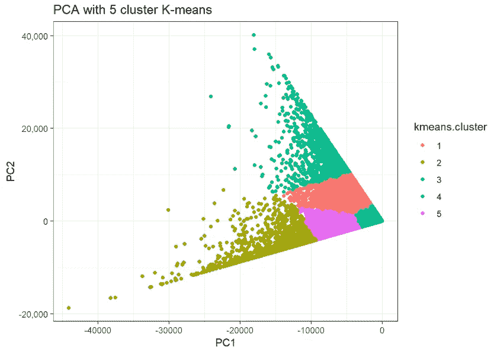

# 客户细分

> 原文：<https://towardsdatascience.com/customer-segmentation-5f25247eb7e2?source=collection_archive---------15----------------------->

## [深入分析](https://medium.com/towards-data-science/in-depth-analysis/home)

## R 中的实用介绍


Source: Image by the author

顾客是任何企业成功的关键因素。传统智慧告诉我们，留住一个现有客户的成本远远低于获得一个新客户的成本。为了使一个企业有一个可持续的增长，保留它的老客户群和扩大新客户群是非常关键的。这就需要了解与业务相关的客户行为。因此，对于寻求市场竞争优势的企业来说，全方位了解客户至关重要。这方面的一种技术是客户细分，它有助于根据客户与产品的互动来识别相似的客户群，然后针对适当的客户有效地采取不同的营销方案。

本文提供了一个循序渐进的实践介绍，重点介绍了在 r 中执行客户细分的方法之一。为了更好地了解客户细分的思想，本文不包括关于在数据集上执行的探索性数据分析和数据争论的详细信息。

**数据来源:**超市 aggr。客户
所使用的数据集是意大利最大的零售分销公司之一 *Coop* 针对一个意大利城市的零售市场数据。
超市 aggr。用于分析的客户数据集包含从客户和商店信息聚合的数据，并透视到新列。因此，数据集包含 40 个特征和 60，366 个实例，大小约为 14.0 MB。

**研究问题(RQ):** 根据客户的购买行为，有哪些不同的客户群？

**选择的算法:** K 均值，主成分分析(PCA)

**算法选择理由:** K-means 聚类是一种非常简单快速的 algorithm⁴.这是用于客户细分的流行方法，尤其是对于数字数据。K-means 还具有计算优势，可以很好地处理大型数据集。分层的和基于模型的聚类方法需要计算全距离矩阵，该矩阵表现出有限的可扩展性和对大数据集计算的大存储器需求。相比之下，K-means 聚类在运行时效率更高。考虑到这些事实，并考虑到输入数据集很大且主要包含数值数据，K-means 是客户细分的理想选择。

PCA 是一种降维算法，它通过数据分解和转换为主成分(PC)来可视化数据集的本质，最大化数据的线性方差(方差越大表示对 data)⁵.的理解越多与 K-means 相比，PCA 不是一个直接的解决方案，因此从不同的角度来看，它可以帮助检测 K-means 没有发现的客户群。主成分分析在这里用于这个研究问题，作为一个有价值的交叉检查，以 K-均值数的集群确定。

**选择的特征:**RQ 希望根据顾客的购买行为识别顾客群，即顾客喜欢购买的商店。因此，特性 customer_id、amount_purchased_shop_1、amount_purchased_shop_2、amount_purchased_shop_3、amount_purchased_shop_4、amount_purchased_shop_5 非常重要，并被选择用于此 RQ。

**分析:**

**1)估计最佳聚类数**

K-means 要求在算法开始之前指定聚类数。确定最佳聚类数对于输出更好的结果至关重要。

```
**library**(cluster)
**library**(factoextra)
**library**("metricsgraphics")*# Read file contents*
supermarket_data_clean <- read.csv("Input Dataset/Cleaned Dataset/Supermarket_DataCleaned.csv")*# Prepare data frames for clustering*
*# Select only the rows customer_id, amount_purchased_shop_1, 2, 3, 4, 5*
cluster.slice.temp <- supermarket_data_clean[,c(1,29,30,31,32,33)]
*# Remover customer_id from the clustering data frame* 
cluster.slice.data <- supermarket_data_clean[,c(29,30,31,32,33)]*# Scale the data and Determine the ideal number of clusters*
cluster.slice.scale <- scale(cluster.slice.data)wssplot <- **function**(data, nc=15, seed=1234){
  wss <- (nrow(data)-1)*sum(apply(data,2,var))
  **for** (i **in** 2:nc){
    set.seed(seed)
    wss[i] <- sum(kmeans(data, centers=i)$withinss)}
  plot(1:nc, wss, type="b", xlab="Number of Clusters",
       ylab="Within groups sum of squares")}wssplot(cluster.slice.scale)
```


Source: Image by the author

输出图描绘了群集数量从值 1 到 4 的急剧减少，以及从 4 到 5 的轻微减少，这估计了 4-群集或 5-群集解决方案。

**2)执行 K 均值聚类，聚类为 4 和 5**

```
*# Perform k-means on cluster values as 4 and 5**# On entire dataset*
set.seed(123) *# fix the random starting clusters*
kclust4 <- kmeans(cluster.slice.data, 4, nstart = 25)set.seed(123) *# fix the random starting clusters*
kclust5 <- kmeans(cluster.slice.data, 5, nstart = 25)
```

**3)执行主成分分析以可视化聚类**

```
pca <- prcomp(t(cluster.slice.data), scale. = T, center = T)
fviz_eig(pca) + 
  theme_bw() + scale_y_continuous(labels = scales::comma) +
  ggtitle(label='Principal Component Analysis')
```


Source: Image by the author

正如所观察到的，主成分分析 1 和主成分分析 2 共同解释了大部分数据差异，然后从主成分分析 2 下降到主成分分析 3。因此，这推断出用 PCA 1 和 PC 2 的可视化将给出对数据的良好理解，并且在 PCA 2 之后包括更多的 PCA 将仅导致最小的改进。

**具有 4 个聚类 K-均值的 PCA**

```
cluster.pc4 <- prcomp(cluster.slice.data, center = FALSE, scale. = FALSE)$x %>% as.data.frame()
cluster.pc4$kmeans.cluster <- factor(kclust4$cluster)p<-ggplot(cluster.pc4,aes(x=PC1,y=PC2,color=kmeans.cluster))
p+geom_point() +
  theme_bw() + scale_y_continuous(labels = scales::comma) + 
  ggtitle(label='PCA with 4 cluster K-means')
```


Source: Image by the author

**具有 5 个聚类 K 均值的 PCA**

```
cluster.pc5 <- prcomp(cluster.slice.data, center = FALSE, scale. = FALSE)$x %>% as.data.frame()
cluster.pc5$kmeans.cluster <- factor(kclust5$cluster)p<-ggplot(cluster.pc5,aes(x=PC1,y=PC2,color=kmeans.cluster))
p+geom_point() +
  theme_bw() + scale_y_continuous(labels = scales::comma) + 
  ggtitle(label='PCA with 5 cluster K-means')
```



Source: Image by the author

比较以上两个图，确定 5 个聚类的解决方案将是 K-均值聚类的理想估计。

**4)可视化数据中不同的可分离聚类**

```
fviz_cluster(kclust5, data = cluster.slice.data, geom = "point",
             stand = FALSE, ellipse.type = "norm") + 
  theme_bw() + scale_y_continuous(labels = scales::comma) +
  ggtitle(label='Customer Clusters')
```


Source: Image by the author

**5)聚类分析**

确定属于每个集群的不同客户

```
*## retrieve customer ID's in each cluster*
head(gather(data.frame(cluster.slice.temp[kclust5$cluster == 1,])))*## retrieve customer ID's in each cluster*
head(gather(data.frame(cluster.slice.temp[kclust5$cluster == 2,])))
head(gather(data.frame(cluster.slice.temp[kclust5$cluster == 3,])))
head(gather(data.frame(cluster.slice.temp[kclust5$cluster == 4,])))
head(gather(data.frame(cluster.slice.temp[kclust5$cluster == 5,])))
```

**6)客户细分**

```
*#Customer segmentation through aggeration of results by mean*
cluster.slice.kmeans.aggregate <- aggregate(cluster.slice.data, by = list(kclust5$cluster), mean)cluster<-c(cluster.slice.kmeans.aggregate$Group.1)
shop1<-c(cluster.slice.kmeans.aggregate$amount_purchased_shop_1)
shop2<-c(cluster.slice.kmeans.aggregate$amount_purchased_shop_2)
shop3<-c(cluster.slice.kmeans.aggregate$amount_purchased_shop_3)
shop4<-c(cluster.slice.kmeans.aggregate$amount_purchased_shop_4)
shop5<-c(cluster.slice.kmeans.aggregate$amount_purchased_shop_5)*# Plot a Bar graph*
Legends <-c(rep("Customers Shop 1", 5), rep("Customers Shop 2", 5), rep("Customers Shop 3", 5), rep("Customers Shop 4", 5), rep("Customers Shop 5", 5))
values <-c(shop1,shop2,shop3,shop4,shop5)
mydata <-data.frame(cluster, values)p <-ggplot(mydata, aes(cluster, values))
p +geom_bar(stat = "identity", aes(fill = Legends)) +
  xlab("Cluster") + ylab("Total") +
  ggtitle("Customer Segmentation") +
  theme_bw() + scale_y_continuous(labels = scales::comma)
```


Source: Image by the author

**观察:**根据顾客的购买行为对数据进行聚类，即从他们购物最多的商店中，发现了 5 个可分离的聚类进行分析。聚类分析有助于根据客户 id 识别每个聚类中的客户。这有助于了解在每个集群中构建客户群的不同客户。此外，客户细分有助于识别每个细分(聚类)中不同商店的客户。这进一步有助于划分集群并赋予其意义。因此，通过基于他们的购买行为识别五个客户群，并通过确定属于五个不同商店的特定客户来进一步划分这些客户群，来回答研究问题。

**应用:**集群的检测可以帮助企业为每个集群基础制定具体的策略。聚类还可以用于了解客户的购买行为，方法是跟踪数月的客户，并检测从一个聚类转移到另一个聚类的客户数量。这有助于企业更好地组织战略，以增加不同商店的收入。企业可以进一步利用所获得的客户细分洞察来更好地将他们的营销工作集中在正确的客户上，例如，与特定商店相关的折扣和优惠可以只发送给通常在该特定商店购买的那些客户，而不会打扰其他商店的客户。因此，为正确的交易锁定正确的客户有助于降低营销成本、创造更多收入并提高客户满意度。

> 客户行为分析作为一个重要领域，利用数据分析在特定于客户的业务数据中发现有意义的行为模式。本文分享的见解来自对数据源进行的端到端[市场篮子分析](https://sites.google.com/view/customerbehaviouralanalytics/home)中的一种方法，旨在了解消费者的购买决策以及影响这些决策的因素。

## 参考

[1][https://bigml . com/user/czuriaga/gallery/dataset/5559 C2 c 6200 d5a 6570000084](https://bigml.com/user/czuriaga/gallery/dataset/5559c2c6200d5a6570000084)

[2] Pennacchioli 博士、Coscia m .博士、Rinzivillo s .博士、Pedreschi 博士和 gian notti f .博士，2013 年 10 月。解释购买数据中的产品范围效应。大数据，2013 年 IEEE 国际会议(第 648–656 页)。IEEE。

[http://www.michelecoscia.com/?page_id=379](http://www.michelecoscia.com/?page_id=379)

[4]哈迪根、约翰·A 和曼切克·A·王 1979."算法 as 136:一个 K 均值聚类算法."皇家统计学会杂志。【T1 系列 C(应用统计学)】28 (1)。JSTOR:100–108。

[5]丁、克里斯和。2004." K-均值聚类通过主成分分析."在*第二十一届机器学习国际会议论文集*，29 页。ACM。