# 基于 K 均值聚类的客户细分

> 原文：<https://towardsdatascience.com/customer-segmentation-using-k-means-clustering-d33964f238c3?source=collection_archive---------1----------------------->

## 为了更好地了解你的客户

Photo by [Roman Arkhipov](https://unsplash.com/@lomogee?utm_source=unsplash&utm_medium=referral&utm_content=creditCopyText) on [Unsplash](https://unsplash.com/s/photos/customers?utm_source=unsplash&utm_medium=referral&utm_content=creditCopyText)

被困在付费墙后面？点击[这里](https://medium.com/p/customer-segmentation-using-k-means-clustering-d33964f238c3?source=email-c3f5233f3441--writer.postDistributed&sk=56ff9bed7fbca9fef4f7c865d9d6e205)阅读完整故事与我的朋友链接！

客户细分是将市场细分为具有相似特征的离散客户群。客户细分是识别未满足客户需求的有力手段。利用上述数据，公司可以通过开发独特的吸引人的产品和服务来超越竞争对手。

企业对其客户群进行细分的最常见方式有:

1.  **人口统计信息**，如性别、年龄、家庭和婚姻状况、收入、教育和职业。
2.  **地理信息**，因公司范围不同而不同。对于本地化的企业，这些信息可能与特定的城镇或县有关。对于较大的公司，这可能意味着客户的城市，州，甚至居住国。
3.  **心理图形**，如社会阶层、生活方式、性格特征。
4.  **行为数据**，如支出和消费习惯、产品/服务使用情况、期望收益等。

# 客户细分的优势

1.  确定合适的产品定价。
2.  开展定制营销活动。
3.  设计一个最优的分配策略。
4.  选择要部署的特定产品功能。
5.  优先考虑新产品开发工作。

# 挑战

你欠一个超市购物中心，通过会员卡，你有一些关于你的客户的基本数据，如客户 ID，年龄，性别，年收入和消费分数。你需要了解客户，比如谁是目标客户，这样营销团队才能获得这种感觉，并据此制定策略。

# k 均值聚类算法

1.  指定集群数量 *K* 。
2.  通过首先混洗数据集，然后为质心随机选择 *K* 个数据点来初始化质心，而无需替换。
3.  继续迭代，直到质心没有变化。也就是说，数据点到聚类的分配没有改变。

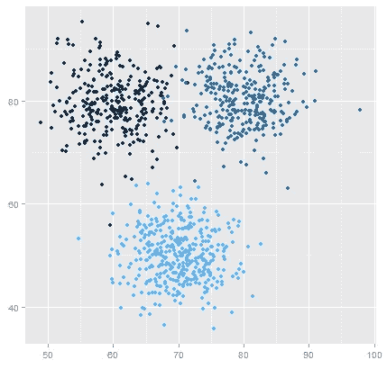

K Means Clustering where K=3

# 数据

该项目是在 Kaggle 上举办的[商城客户细分数据](https://www.kaggle.com/vjchoudhary7/customer-segmentation-tutorial-in-python)竞赛的一部分。

数据集可以从 kaggle 网站下载，该网站可以在[这里](https://www.kaggle.com/vjchoudhary7/customer-segmentation-tutorial-in-python)找到。

# 环境和工具

1.  sci kit-学习
2.  海生的
3.  numpy
4.  熊猫
5.  matplotlib

# 代码在哪里？

事不宜迟，让我们从代码开始吧。github 上的完整项目可以在这里找到[。](https://github.com/abhinavsagar/Kaggle-Solutions/blob/master/customer_segmentation.ipynb)

我从加载所有的库和依赖项开始。数据集中的列是客户 id、性别、年龄、收入和支出分数。

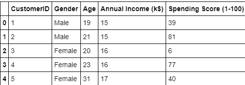

我删除了 id 列，因为它似乎与上下文无关。我还画出了顾客的年龄频率。

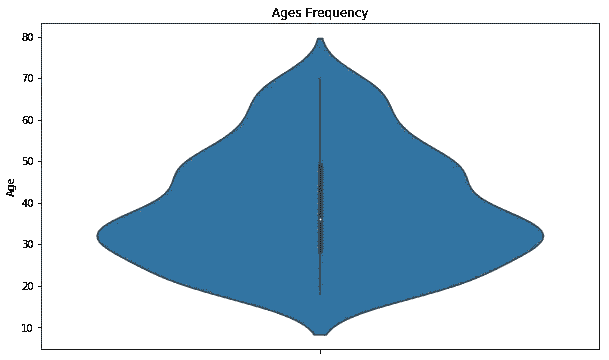

接下来，我制作了一个支出分数和年收入的方框图，以更好地形象化分布范围。支出分数的范围明显大于年收入范围。

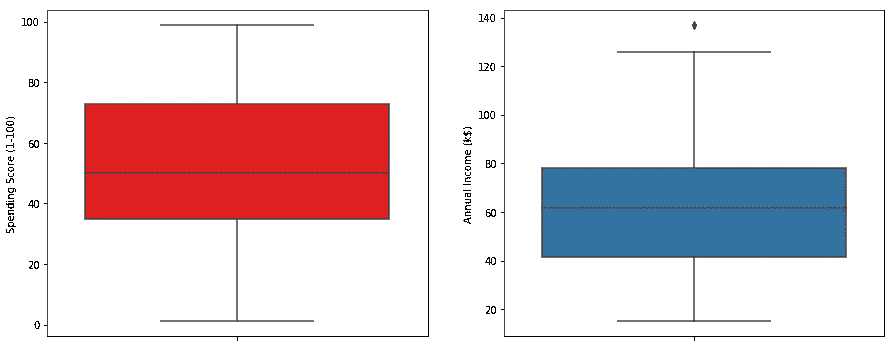

我制作了一个条形图来检查数据集中男性和女性人口的分布。女性人口明显多于男性。

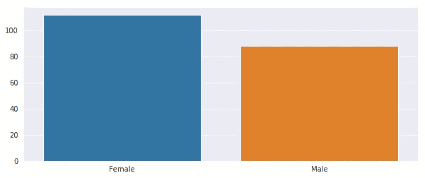

接下来，我绘制了一个条形图，以检查每个年龄组中客户数量的分布。很明显，26-35 岁年龄组的人数超过了所有其他年龄组。

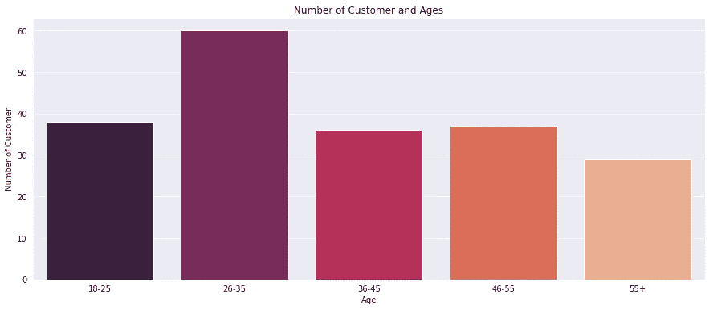

我继续制作一个柱状图，根据顾客的消费分数来可视化顾客的数量。大多数顾客的消费得分在 41-60 之间。

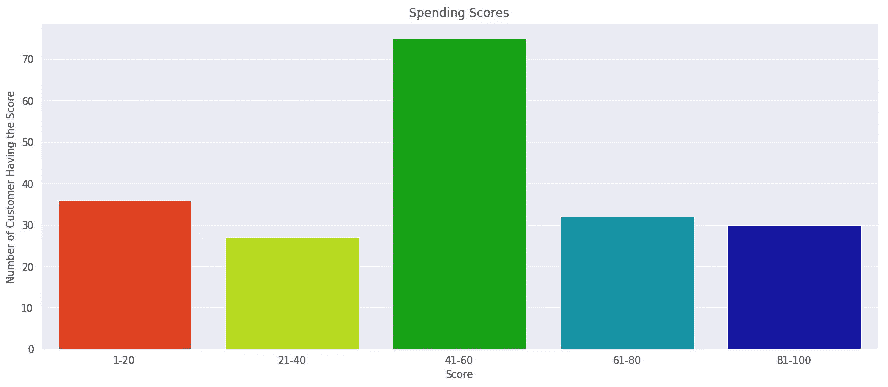

我还制作了一个柱状图，根据客户的年收入来可视化客户的数量。大多数顾客的年收入在 60000 到 90000 英镑之间。

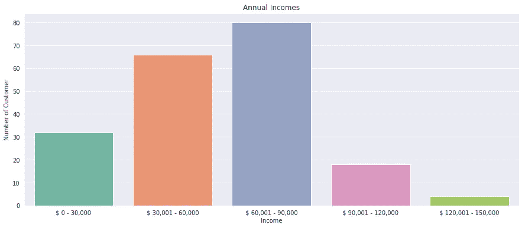

接下来，我绘制了聚类平方和(WCSS)与聚类数量(K 值)的关系图，以计算出最佳聚类数量值。WCSS 测量观测值到其聚类质心的距离总和，由以下公式给出。

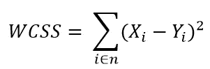

其中*易*为观察的质心 *Xi* 。主要目标是最大化聚类数量，在有限的情况下，每个数据点成为其自己的聚类质心。

# 肘法

计算不同 k 值的类内误差平方和(WSS ),并选择 WSS 最先开始减小的 k。在 WSS-对 k 的曲线图中，这可以看做一个肘部。

这些步骤可以总结为以下步骤:

1.  通过在 1 到 10 个聚类之间改变 K 值来计算不同 K 值的 K 均值聚类。
2.  对于每个 K，计算总的类内平方和(WCSS)。
3.  绘制 WCSS 相对于簇数 k 的曲线
4.  图中弯曲(拐点)的位置通常被认为是适当聚类数的指示。

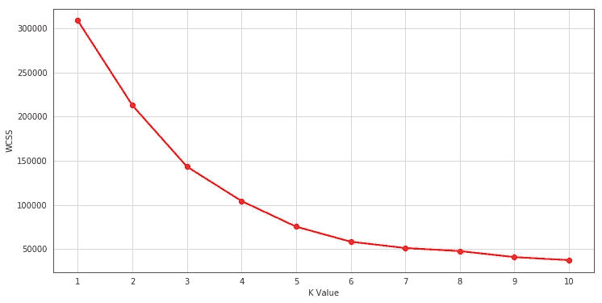

使用肘形法发现最佳 K 值为 5。

最后，我绘制了一个 3D 图，直观地显示了顾客的消费分数和年收入。数据点分为 5 类，用不同的颜色表示，如 3D 图所示。

# 结果

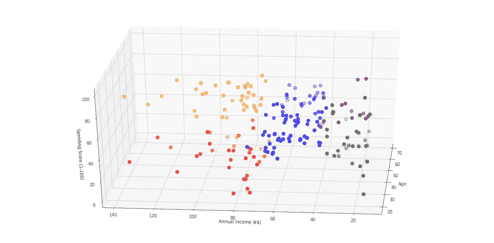

# 结论

k 表示聚类是最流行的聚类算法之一，并且通常是从业者在解决聚类任务时应用的第一件事，以了解数据集的结构。K 均值的目标是将数据点分组到不同的非重叠子组中。K 均值聚类的一个主要应用是对客户进行细分，以更好地了解他们，从而增加公司的收入。

# 参考资料/进一步阅读

 [## 客户细分的聚类算法

### 背景在当今竞争激烈的世界中，了解客户行为并根据以下因素对客户进行分类至关重要…

towardsdatascience.com](/clustering-algorithms-for-customer-segmentation-af637c6830ac)  [## 您需要的最全面的 K-Means 聚类指南

### 概述 K-Means 聚类是数据科学中一种简单而强大的算法，现实世界中有太多的…

www.analyticsvidhya.com](https://www.analyticsvidhya.com/blog/2019/08/comprehensive-guide-k-means-clustering/)  [## 机器学习方法:K 均值聚类算法

### 2015 年 7 月 21 日撰文:EduPristine k-Means 聚类(又名分割)是最常见的机器学习之一…

www.edupristine.com](https://www.edupristine.com/blog/beyond-k-means) 

# 在你走之前

相应的源代码可以在这里找到。

 [## abhinavsagar/ka ggle-解决方案

### 此时您不能执行该操作。您已使用另一个标签页或窗口登录。您已在另一个选项卡中注销，或者…

github.com](https://github.com/abhinavsagar/Kaggle-Solutions/blob/master/customer_segmentation.ipynb) 

# 联系人

如果你想了解我最新的文章和项目[，请关注我的媒体](https://medium.com/@abhinav.sagar)。以下是我的一些联系人详细信息:

*   [个人网站](https://abhinavsagar.github.io)
*   [领英](https://in.linkedin.com/in/abhinavsagar4)
*   [中等轮廓](https://medium.com/@abhinav.sagar)
*   [GitHub](https://github.com/abhinavsagar)
*   [卡格尔](https://www.kaggle.com/abhinavsagar)

快乐阅读，快乐学习，快乐编码。