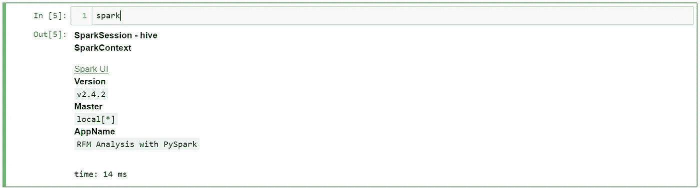
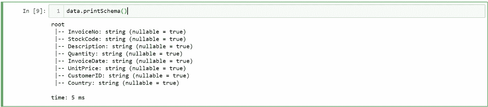
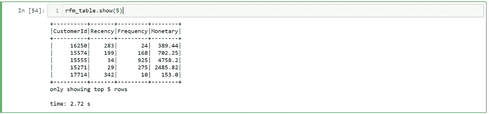
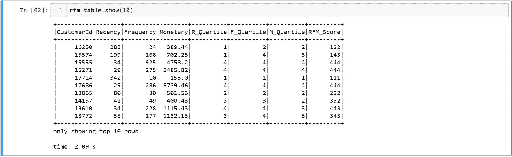
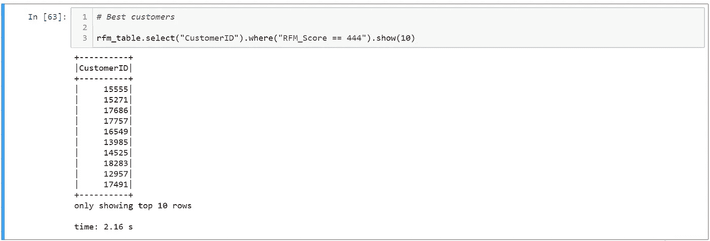
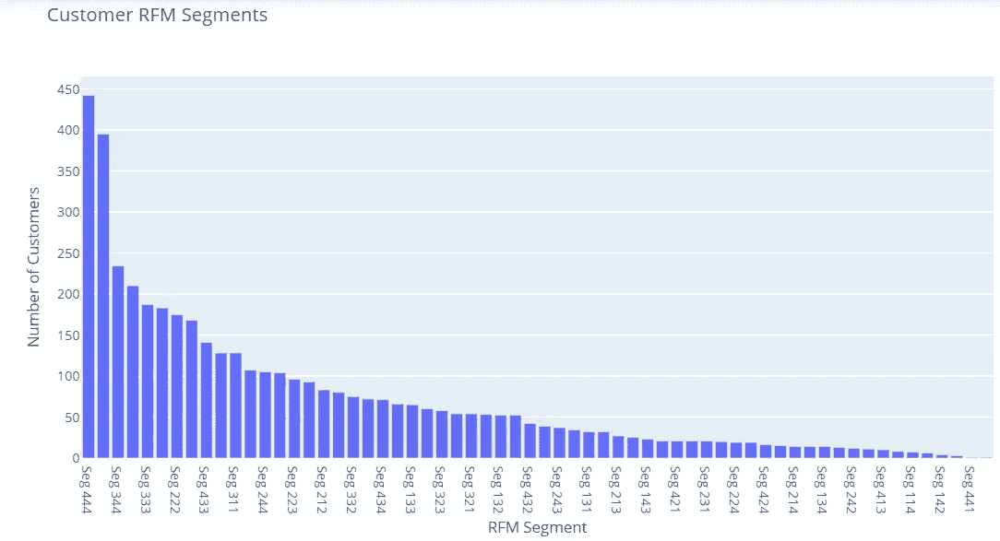

# Python 和 Spark 中的 RFM 客户细分

> 原文：<https://towardsdatascience.com/customer-segmentation-using-rfm-in-apache-spark-8865a62d1b0a?source=collection_archive---------7----------------------->

**RFM 细分**是根据三个标准(组成 RFM 的首字母缩略词)将客户划分成平等群体的好方法:

*   **新近度**。客户与公司的最后一次活动或交易已经过去了多长时间？
*   **频率**。在特定时期内，客户与公司的交易频率如何？
*   **货币**。在特定时期内，客户在该品牌上花费的金额。

在本文中，我们将看到如何将客户和 Apache Spark 中的代码划分成不同的部分。后者不再需要任何介绍；它已经成为这十年中事实上的大数据平台，我们将利用它的一些基本而深刻的功能。

我们将使用 Python 作为与 Spark 交互的编程语言。Python 正成为数据分析领域的通用语言，因此用这种语言进行 RFM 客户细分是有意义的。

让我们开始吧。

# 1 设置环境

我们将使用 Jupyter 笔记本应用程序在 Spark 中执行 RFM 细分。为了能够在我们的笔记本中使用 Spark，我们需要导入`findspark`包以及`pyspark`模块及其`sql`模块的组件:

随后，我们创建一个`SparkSession`来与 Spark 交互。SparkSession 是 Spark 应用程序的统一入口点。

为了确保 spark 连接正常，我们调用 Spark 变量并检查输出:

现在我们应该都准备好了，可以开始我们的 RFM 分析之旅了。

# 2 关于数据集

在本文中，我们将使用一个电子商务数据集，该数据集包含 2010 年至 2011 年英国注册的无店铺在线零售商的交易，由 UCI 机器学习资源库免费提供。你可以在这里下载数据[。](https://www.kaggle.com/carrie1/ecommerce-data)

数据集包含我们分析所需的以下相关列:

*   *发票号*。每次销售的唯一 id。
*   *股票代码*。每个产品的唯一 id。
*   *数量*。购买的单位数量。
*   *活体内*。销售日期。
*   *单价*。产品的零售价格。
*   *客户 ID* 。每个客户的唯一 id。

# 3 数据预处理

数据预处理是数据科学中最重要也是最繁琐的任务之一。大多数数据科学家只花 20%的时间进行实际数据分析，80%的时间用于查找、清理和重组。

我们首先通过使用 Spark 的`read`方法将 CSV 文件加载到 Spark 数据帧中，在这里我们指定文件的格式以及文件是否包含标题:

通过调用 Spark 的`printSchema`方法，我们检查 CSV 文件每一列的数据类型:

因为我们没有在列的数据类型上指示 Spark，所以它假设它们都是字符串。但是，有必要更改我们后续分析所需的几个列的数据类型，即:数量、单价、日期。我们还必须添加两个新的计算列:

*   **总计**，等于单价*数量。需要计算每个客户的货币价值。
*   **RecencyDays** ，这是一个表示 2011 年 12 月 31 日(我们选择的参考日)和发票日期之间天数差异的指标。

Spark 的一个重要特性是能够向现有数据框架添加新的计算列。这是通过它的`withColumn`方法完成的。这种方法的一个特例是当我们想要改变当前的列时，这是通过将列名放在方法的第一个参数中来实现的。

# 4 RFM 表的创建

既然我们已经预处理了数据，RFM 表的创建就非常简单了。对于每个客户，我们需要衡量以下指标:

*   *新近*。我们将把在上一步中计算的最小最近天数视为最近。这是有意义的，因为最近最少天数将为我们提供自客户上次购买以来已经过去的天数。
*   *频率*。它被计算为顾客购买的次数。
*   *货币*。它是每个客户所有购买的总价值。

新的 rfm_table 数据帧包含每个客户的 rfm 指标。

我们还没有准备好执行我们的 RFM 分析。在我们深入研究之前，我们应该首先为每个 RFM 指标计算一些有意义的分数。我们为每位客户分配 1 到 4 的分数，其中 1 表示最低分，4 表示最高分。显然，所有指标都达到 4s 的客户被认为是最佳客户。

因为我们从 1 到 4 分配分数，我们可以根据统计四分位数划分 RFM 值。PySpark 中的以下代码执行必要的操作来计算四分位数，并在 RFM 表中创建三个与 RFM 分数相对应的新列。最后，我们将 RFM 分数串联成一列，以便对客户的类型有一个即时的了解。

现在让我们来看看 RFM 表的最终版本:

# 5 RFM 分析

我们现在可以很容易地查询我们的 RFM 表中的相关业务问题。想知道谁是最好的客户吗？简单的东西:

我们可以根据 RFM 分数对客户进行细分，然后找出每个细分市场中的客户数量。为了可视化这个度量，我们需要将 Spark 数据帧转换成 Pandas 数据帧。这可以通过使用 Spark 的`toPandas`方法轻松完成。最后，我们将通过使用 [Plotly](https://plot.ly/python/) 在条形图中可视化每个细分市场的客户数量，这是一个交互式数据可视化库。

令人惊讶的是，最好的客户构成了最大的细分市场:)，但具有讽刺意味的是，最差的客户(所有得分为 1 的客户)是第二大细分市场:(。

除了最佳和最差客户，我们还可以定义以下重要的客户群:

*   **高消费新客户** —这个群体由 4-1-3 和 4-1-4 的客户组成。这些客户只交易过一次，但最近他们花了很多钱。
*   **消费最低的活跃忠诚客户** —这一群体由细分市场 3–4–1 和 4–4–1 中的客户组成(他们最近交易过，经常交易，但消费最少)。
*   **流失的最佳客户** —这个细分市场由第 1-3-3、1-4-3、1-3-4 和 1-4-4 组的客户组成(他们交易频繁，花费很多，但已经过了很长时间*)。*

*决定瞄准哪些客户群以及如何最好地与他们沟通是营销艺术的切入点。*

# *结论*

*您已到达这篇文章的结尾。在用 PySpark 编写代码的过程中，我们涉及了很多关于客户细分的细节。请到我的 [Github](https://github.com/xhentilokaraj/rfm-spark) 库访问这篇文章的笔记本代码。*

*感谢您的阅读。*

*由于这是我第一篇关于媒体的文章，我将非常感谢任何有用的反馈。*