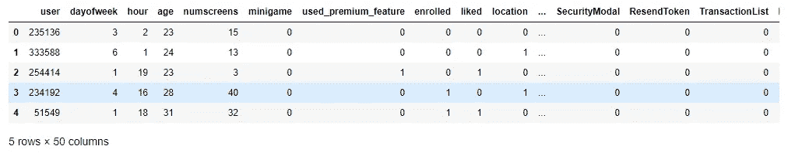
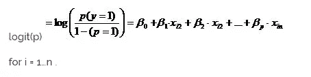
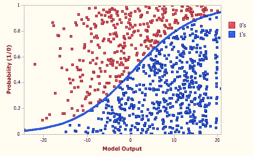
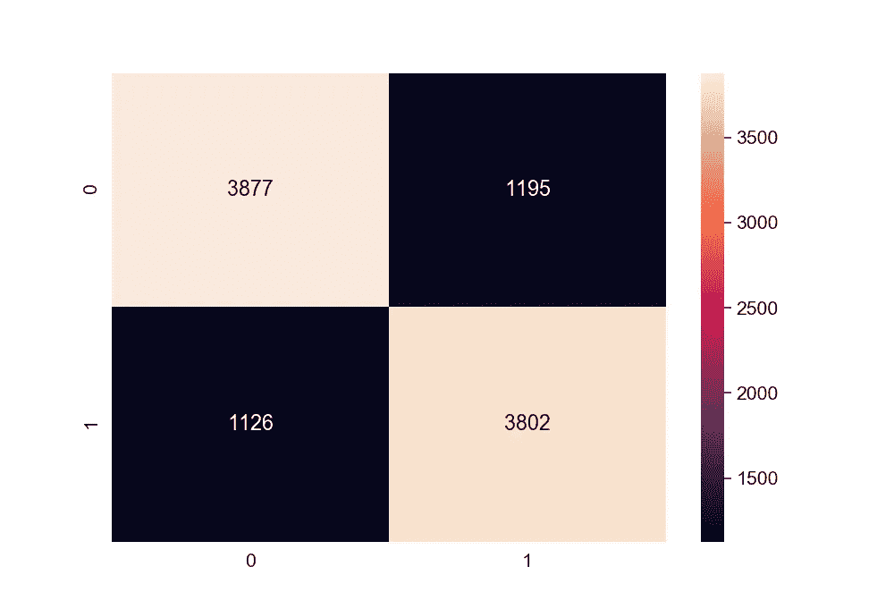

# 基于应用行为分析(逻辑回归)的客户订阅分析和预测

> 原文：<https://towardsdatascience.com/customer-subscription-analysis-and-prediction-based-on-app-behavior-analysis-logistic-regression-16a2c0def544?source=collection_archive---------20----------------------->

## 使用 scikit learn library 的逻辑回归算法对客户是否会注册付费订阅进行分类。

我们将根据网站或应用程序上的客户行为进行客户流失分析。我们会对什么样的客户有可能注册一个网站的付费订阅进行分类。在分析
并对数据集进行分类后，我们将能够对有可能注册
付费订阅计划的客户进行针对性的
营销或推荐。

对于这个问题，我们将使用 scikit-learn 库中的逻辑回归算法。这个问题的数据集已经用已经完成的必要特征工程进行了优化。如果你想知道我是如何清理数据以及特征工程是如何完成的，请继续关注，因为我将很快写另一篇关于这个特定数据集的数据清理过程的帖子。

让我们通过首先导入必要的库和数据集来开始这个过程。

```
import numpy as np 
import pandas as pd
import matplotlib.pyplot as plt
import seaborn as sns
from dateutil import parser 
%matplotlib qt5 
```

这里%matplotlib qt5 使可视化在一个新窗口中弹出。如果您希望可视化显示在同一个笔记本或控制台中，那么您可以使用%matplotlib inline

```
dataset = pd.read_csv(“appdata10.csv”) 
```

让我们来看看数据集:



a look at the datset, some of the columns are not seen here cause i couldn’t fit all considering the size

现在，让我们将数据集分为要素和目标变量。目标列名为“已注册”。

```
X = dataset.drop(columns = 'enrolled')
y = dataset['enrolled'] 
```

现在，让我们将数据集分为训练集和测试集。我们需要这样做，以便我们只能在模型训练中使用训练集数据。在有监督的机器学习中，将数据集分成训练集和测试集是很重要的，因为它可以防止过拟合。

为此，我将使用 sklearn 的 train_test_split()函数。

```
from sklearn.model_selection import train_test_split
X_train, X_test, y_train, y_test = train_test_split(X, y, test_size = 0.2, random_state = 4) 
```

你可以使用任何随机状态，它只是确保不同环境下的结果是相同的。

现在让我们删除用户列，因为我们不需要它，它也不是一个必需的特性。但是我们需要它来识别用户是否订阅。为此，我们将把用户列保存为标识符。

```
train_identifier = X_train['user']
X_train = X_train.drop(columns='user')test_identifier = X_test['user']
X_test = X_test.drop(columns='user')
```

下一步是进行特征缩放。进行要素缩放是为了归一化数据集中不同要素的值。特征缩放帮助我们更快地实现梯度下降。如果数据更加分散，这意味着如果它具有更高的标准偏差，那么与通过要素缩放来缩放数据的情况相比，计算梯度下降将花费相对更多的时间。所以我们把所有的值都放在一定的范围内。这将平等地对待所有列。在上面的数据集中，我们可以看到年龄、星期几、注册的值不在相似的范围内。

为此，我们可以使用 sklearn 的 StandardScaler 函数。

```
from sklearn.preprocessing import StandardScaler
sc_X = StandardScaler()
X_train2 = pd.DataFrame(sc_X.fit_transform(X_train))
X_test2 = pd.DataFrame(sc_X.fit_transform(X_test))
X_train2.columns = X_train.columns.values
X_test2.columns = X_test.columns.values
X_train.index = X_train.index.values
X_test.index = X_test.index.values
X_train = X_train2
X_test = X_test2
```

现在让我们进入激动人心的部分；训练数据集。为此，我们将使用来自 sklearn 库的 LogisticRegression。

逻辑回归用于分类问题。当因变量为二分变量(二元变量)时，进行回归分析是合适的。像所有回归分析一样，逻辑回归是一种预测分析。逻辑回归用于描述数据，并解释一个因变量与一个或多个名义变量、序数变量、区间变量或比率水平自变量之间的关系。



```
from sklearn.linear_model import LogisticRegression 
logreg = LogisticRegression(random_state=0, penalty=’l1')
logreg.fit(X_train, y_train)
```

在这里，我使用惩罚参数来防止一个特征与这个特定数据集中的目标变量高度相关，特别是对于最后一个屏幕变量。

既然模型已经定型，我们就可以在测试集上进行预测了。

```
y_pred = logreg.predict(X_test)
```

完成预测后，我们可以进行模型评估，看看我们的模型表现如何。为此，我们将使用五个评估指标，混淆矩阵、准确度分数、f1 分数、精确度分数和召回分数。所有这些评估指标都可以在 scikit learn 中找到。

```
from sklearn.metrics import confusion_matrix, accuracy_score, f1_score, precision_score, recall_score
cm = confusion_matrix(y_test, y_pred)
accuracy = accuracy_score(y_test, y_pred)accuracy 
0.7679
```

所以我们达到了 79%的准确率。这个模型已经完成了那个精度的下降工作。

现在，让我们绘制混淆矩阵的热图来可视化混淆矩阵。



我们可以看到，正确预测的值比混淆矩阵中的假阳性和假阴性多 3 倍左右。我们可以进一步使用交叉验证来评估模型，并确保我们的模型做了正确的工作。

```
from sklearn.model_selection import cross_val_score
accuracies = cross_val_score(estimator=logreg, X=X_train, y= y_train, cv=10)
print("Logistic accuracy: %0.3f (+/- %0.3f)(accuracies.mean(),accuracies.std()*2))Output: Logistic accuracy: 0.767 (+/- 0.010)
```

所以我们可以说，我们的模型正在做正确的工作，并且是一个逻辑回归的下降工作。

我们可以使用不同的参数调整方法进一步优化我们的模型。但是现在我不打算优化这个模型。如果你想了解参数/超参数调整，你可以搜索 GridSearch，随机搜索，向后消除。我将把这些留到下一篇文章。

这是我的第一个媒体帖子，所以请随时给我建议和建设性的批评，还有我做这个分类的方法。谢谢你。