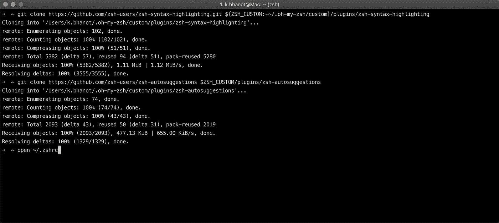

# 改进默认的 Mac 终端以提高生产率和改进界面

> 原文：<https://towardsdatascience.com/customising-the-mac-terminal-to-increase-productivity-and-improve-the-interface-894f6d86d573?source=collection_archive---------4----------------------->

## 简单的外壳定制技术


Photo by [Goran Ivos](https://unsplash.com/@goran_ivos?utm_source=medium&utm_medium=referral) on [Unsplash](https://unsplash.com?utm_source=medium&utm_medium=referral)

如果你像我一样，你从事许多项目，每个项目可能位于不同的目录中，并可能涉及多个分支。最近，我对我的终端进行了定制，使其信息量更大，更易于阅读和使用。

在本文中，我将向您介绍我定制终端的步骤。有很多方法你可以去做，但在这里我提出了一个我发现最简单，最适合我的需要。

在本文中，我们将从这里开始:


Old

到这里:


New

# 安装 iTerm2

iTerm2 扩展了 MacOS 终端，并添加了许多有用的特性。我喜欢的两个特性包括使用 Shell > Split vertical with Current Profile(水平分割也可以)垂直分割窗格的能力，以及配置该终端的众多选项。你也可以在这里找到[的其他功能。](https://www.iterm2.com/features.html)

1.  前往[https://www.iterm2.com/downloads.html](https://www.iterm2.com/downloads.html)。
2.  下载位于**稳定版本**下的版本。它将下载 zip 文件。
3.  解压 zip 文件，新文件将显示为 **iTerm.app** 。只要打开这个应用程序，你就进入了 iTerm2。


Two iTerm2 terminals opened side-by-side

# 把壳牌改成 ZSH

下一步是将我们的后端从`bash`改为`zsh`。

1.  在 iTerm2 中，键入命令`which zsh`。您应该会看到输出为`/bin/zsh`。如果没有显示，你需要使用`brew install zsh`下载它。然后输入`which zsh`，看看你是否能看到一个新的路径`/usr/local/bin/zsh`。
2.  接下来，键入命令`sudo vi /etc/shells`，然后输入您的密码。
3.  文件将会打开。按键盘上的`i`进入插入模式。在其他外壳后添加线`/bin/zsh`和`/usr/local/bin/zsh`。按 escape 退出插入模式。完成后，通过键入`:wq`保存更改，即写入并退出。我们现在可以切换到 zsh。
4.  键入命令`chsh -s $(which zsh)`。外壳现在更改为 zsh。
5.  关闭 iTerm2，然后再次打开它。


Adding zsh to the list of shells


Changing the shell to zsh

# 安装我的天啊

哦，我的 zsh 在 Zsh 上面工作。它为我们提供了一个配置文件`~/.zshrc`，并允许我们应用主题来使 iTerm2 更具吸引力和可用性。GitHub 回购可在[这里](https://github.com/robbyrussell/oh-my-zsh)获得。

1.  运行命令`sh -c “$(curl -fsSL https://raw.githubusercontent.com/robbyrussell/oh-my-zsh/master/tools/install.sh)"`来安装包。
2.  重新打开 iTerm2，它将启用 Oh My Zsh。


Installing Oh My Zsh

现在不会有视觉上的差异，但是我们会有`~/.zshrc`文件，在那里我们可以对 iTerm2 进行更新。

# 使用插件

我将使用三个插件，即 git、语法高亮和建议。

1.  Git 已经包含在插件列表中，所以我们不会下载它。
2.  对于另外两个插件，我们必须将它们克隆到正确的目录中。

```
git clone https://github.com/zsh-users/zsh-syntax-highlighting.git ${ZSH_CUSTOM:-~/.oh-my-zsh/custom}/plugins/zsh-syntax-highlightinggit clone https://github.com/zsh-users/zsh-autosuggestions $ZSH_CUSTOM/plugins/zsh-autosuggestions
```



Installing plugins

一旦完成，使用命令`open ~/.zshrc`打开`.zshrc`文件。将两个插件名`zsh-syntax-highlighting`和`zsh-autosuggestions`添加到括号内，在 git 后各占一行。只要保存文件，我们就可以开始了。


Updated plugins to include the new plugins

重新打开 iTerm2，以便新的更改生效。看看下面的图片，你可以看到文本`cd`现在是不同的颜色，在写完文本`Personal`后，它建议下一个文件夹`Important Work`。插件运行得非常好。


Plugins in action

# 实施电力线设计

我们需要更新`~/.zshrc`文件，以显示类似电力线的设计，同时显示我们所在的分支，以及分支中是否有任何更改。

1.  使用`open ~/.zshrc`打开`.zshrc`文件。
2.  然后把 ZSH 主题改成`agnoster`。


agnoster theme

正如我们所看到的，整个路径是可见的，只要我们在 git 存储库中，就会显示当前分支的名称。例如，在上面的例子中，我在`master`分支中。如果有尚未提交的更改，分支名称后会出现一个点。

# 更新颜色

考虑到文本由于颜色的选择而可读性不强，我决定将颜色改为预设的配色方案。

1.  当在活动 iTerm2 窗口中时，转到顶角，在 iTerm2 中选择首选项>配置文件>颜色。
2.  在窗口右下角的`Color Presets...`下选择`Tango Dark`，颜色将会更新。


Select Tango Dark color preset


Updated colors for the shell

# 添加介绍信息

为了好玩，我们还可以添加一条消息，每次我们都会打开一个新的 iTerm2 窗口或标签。我会显示我的名字，日期和一个随机的财富。

1.  安装`fortune`包，它将帮助我们使用`brew install fortune`显示随机财富。
2.  使用`open ~/.zshrc`打开`.zshrc`。
3.  转到最后，键入以下命令，每当我打开 iTerm2 窗口或选项卡时，该命令将显示我的姓名和当前日期。

```
echo "
|| NAME: KARAN BHANOT
|| DATE: $(date)
||
|| $(fortune)
"
```


Intro message added

# 结论

最后，我们完成了。我们已经对我们的终端做了许多修改，现在它为我们提供信息，并使它看起来更悦目。

希望你喜欢这篇文章。请分享你的想法、想法和建议。