# 通过回访定制您的培训循环

> 原文：<https://towardsdatascience.com/customize-your-training-loop-with-callbacks-9d93b415a602?source=collection_archive---------15----------------------->

在我的上一篇文章中，我们学习了如何从头开始编写 PyTorch 训练循环。我们从一个混乱的循环版本开始，如下所示:

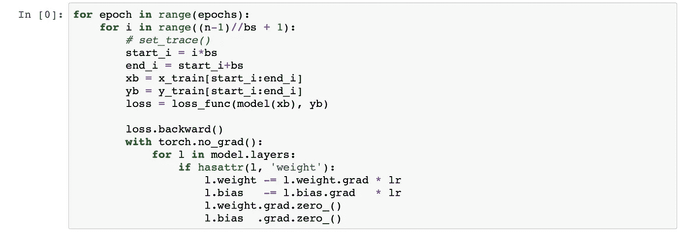

我们把它变成了一个更简洁的版本，看起来像这样:

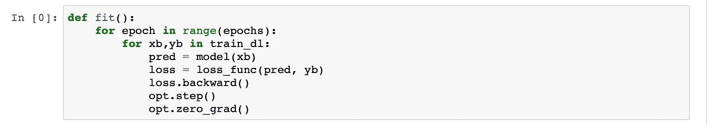

在这个过程中，我们学会了如何通过为数据集、数据加载器、优化器等等编写类来将相似的东西打包在一起。在本文中，我们将进行更多的打包，并学习如何定制我们的训练循环，以实现深度学习中的复杂技术。

先说我们的 fit 函数。

## 数据群发

我们的`fit()`函数包括我们的模型、损失函数、优化器和两个数据加载器(训练和验证)。

然而，如果我们仔细想想，训练和验证数据加载器并不是两件独立的事情。他们是我们的 ***数据*** 。它们必须是一个东西(或者至少是从它派生出来的)。因此，我们将这两个数据加载器合并成一个名为`DataBunch.`的类

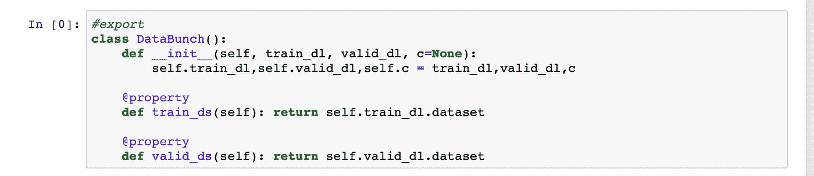

如果我们可以将数据中的 ***类的数量*** 传递给 DataBunch，那也很方便。这是通过传递`c`参数来完成的。我们现在可以创建一个 DataBunch 对象，如下所示。

然后，我们可以使用这个对象通过自动识别输入和输出单元的数量来方便地创建模型。

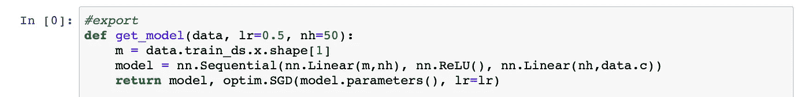

## 学习者

下一步，我们要做的是结合我们的模型，优化和损失函数。

很多时候，在进行深度学习的实验时，我们想要测试这些东西的一个 ***组合*** 。这涉及到对我们代码的各个部分进行大量的修改。但是，将它们组合成一个对象并仅对该对象进行更改是有意义的。这将有助于我们轻松做出明智的决定。

因此，我们将模型、优化器和损失函数组合成一个名为`Learner.`的类

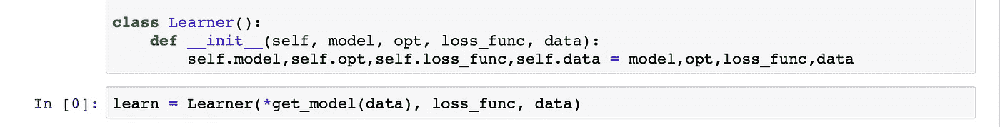

我们现在可以使用`learn.model`、`learn.opt`和`learn.loss_func.`来访问它们。我们在训练循环中进行必要的更改。

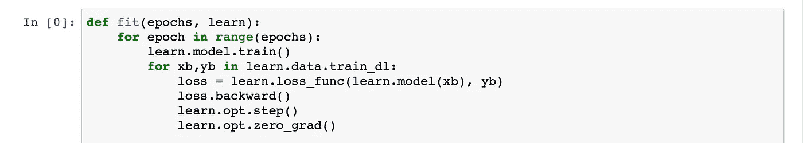

# 需要复试

在这一点上，我们有一个非常整洁的训练循环。然而，这些并不是我们想在训练循环中做的唯一事情。我们可能需要添加一些东西，比如

## ***超参数调度***

 [## 你如何找到一个好的学习率

### 你如何决定学习速度？如果太慢，你的神经网络将会花很长时间去学习(试着用…

sgugger.github.io](https://sgugger.github.io/how-do-you-find-a-good-learning-rate.html) 

## ***或*** 正规化技术

 [## 这个东西叫做重量衰减

### 了解如何使用权重衰减来训练更好的模型

becominghuman.ai](https://becominghuman.ai/this-thing-called-weight-decay-a7cd4bcfccab)  [## 神经网络中的正则化

### 用于正则化神经网络的各种方法的概述

becominghuman.ai](https://becominghuman.ai/regularization-in-neural-networks-3b9687e1a68c) 

## 或者混合精确训练

 [## 使用 fastai 的混合精确训练

### 图像分类是深度学习的 Hello World。对我来说，这个项目是使用胸部检测肺炎…

becominghuman.ai](https://becominghuman.ai/mixed-precision-training-using-fastai-435145d3178b) 

或者做更复杂的事情比如甘斯。这些只是我们现在知道的事情。更多的调整不断出现。

为了实现这些调整，我们必须为每个调整编写一个单独的训练循环。当我们想使用它们的组合时，一切都会变得一团糟。

这就是 ***回调*** 出现的地方。他们帮助我们有效地实现这些调整。让我们看看怎么做。

## 了解回访

我们首先创建自己的 ***回调对象*** 。在这些对象中，我们决定了在训练的某一点上我们想要做什么。比如 fastai 中有一个回调叫做***SaveModelCallback()***。该回调检查在每个时期结束时我们是否有更好的模型*，如果有，则 ***保存模型*** 。这样，我们不仅得到了最后的参数，而且得到了最好的参数。*

*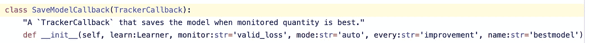**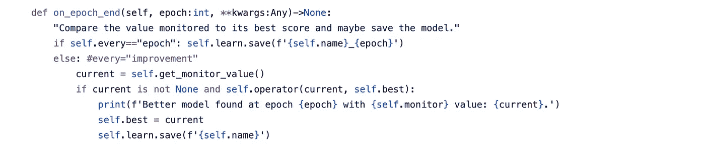*

*同样，我们可以为学习速率调度、数据增强的混合或梯度裁剪编写回调。点击查看 [fastai 回调的详细列表。](https://docs.fast.ai/callbacks.html#SaveModelCallback)*

*下一步是实现一个`CallbackHandler()`。*

*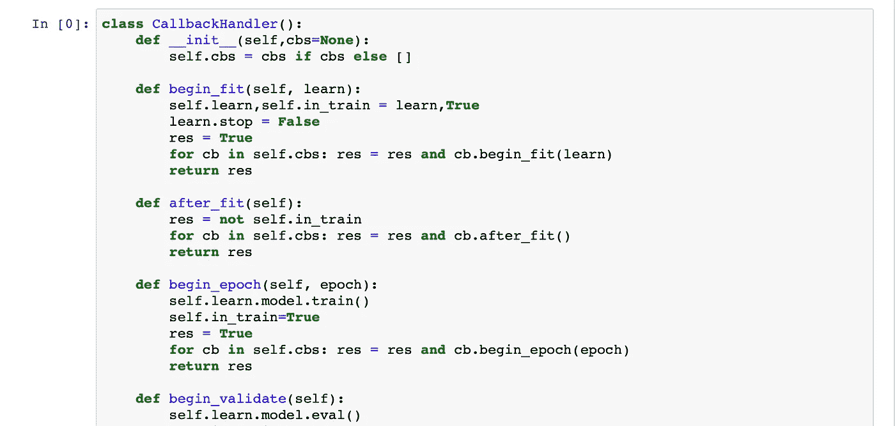*

*这个类有两个主要目的。*

1.  *它给我们一个地方来存储我们所有的回调(cbs)。*
2.  *它允许我们很容易地调用所有单独的回调函数。例如，如果我们有 3 个回调函数在一个纪元结束时做了一些事情，那么`cb.on_epoch_end()`将从每个回调对象中调用`on_epoch_end()`方法。*

*最后一步是将这些回访纳入我们的培训循环。我们使用和以前一样的循环，只是稍加修改。在我们的 fit 函数中，我们确保我们遍历了`all_batches().`，并且在所有批次中，我们编写了每个批次要遵循的步骤。*

*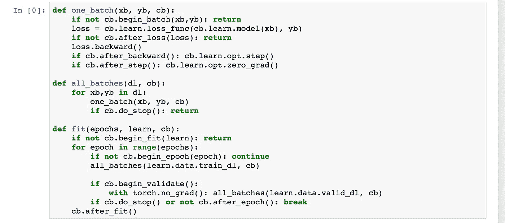*

*这给了我们很大的灵活性来实现我们想要的东西，而不需要修改原始的训练循环。它让我们在训练期间的不同时间点定义不同的行为，如提前停止或打印各种指标。*

*最后，我们还需要一个`Callback class`，我们的回调对象将从其中继承。这个类有所有可能的行为，所以如果我们的对象没有这些行为，我们的代码不会中断。*

*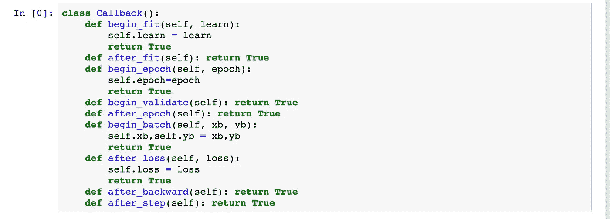*

*如果你不喜欢从超类继承，那么你可以使用`if hasattr(cb, 'on_epoch_end')`让它更加灵活。*

*我将用一个理解回调的非常简单的例子来结束这篇文章。我们从一个做一些计算的函数开始，然后休眠一段时间。这个函数代表了深度学习中的一个时代。*

*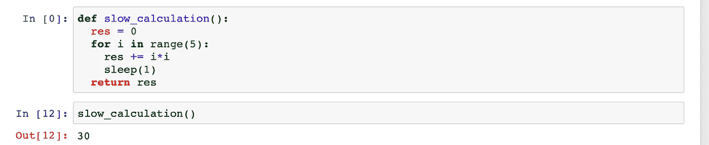*

*我们可以在计算前后向该函数添加行为，如下所示。*

*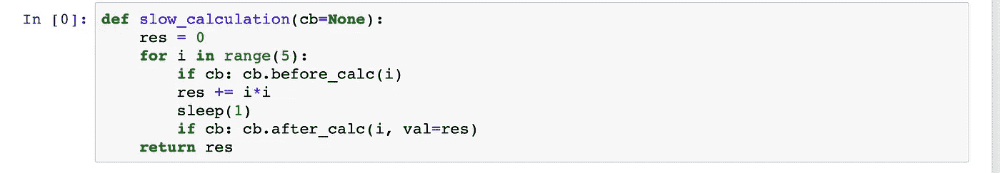*

*然后，我们可以写一个回调函数来处理这些行为。*

*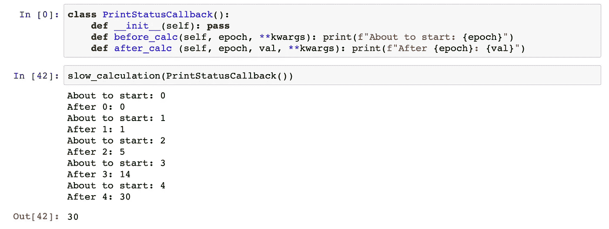*

*这就是本文的全部内容。*

*如果你想了解更多关于深度学习的知识，你可以看看我下面的深度学习系列。*

* [## 深度学习系列

### 我所有关于深度学习的文章的系统列表

medium.com](https://medium.com/@dipam44/deep-learning-series-30ad108fbe2b) 

**参考文献**:

[1][https://docs.fast.ai/callbacks.html#SaveModelCallback](https://docs.fast.ai/callbacks.html#SaveModelCallback)

[2][https://medium . com/@ Edward easling/implementing-callbacks-in-fast-ai-1c 23 de 25 b 6 EB](https://medium.com/@edwardeasling/implementing-callbacks-in-fast-ai-1c23de25b6eb)*