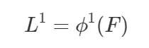

# [CVPR 2017] OpenPose:使用部分亲和力场的实时多人 2D 姿势估计

> 原文：<https://towardsdatascience.com/cvpr-2017-openpose-realtime-multi-person-2d-pose-estimation-using-part-affinity-fields-f2ce18d720e8?source=collection_archive---------2----------------------->

今天的话题是来自 **CVPR 2017** 的一篇名为**“利用局部亲和场的实时多人 2D 姿态估计”**的论文。这项工作对计算机视觉社区有着非凡的贡献，因为:

*   它基于其**自底向上的方法**而不是其他作品中基于检测的方法，为多人 2D 姿态估计提供了一种**实时方法。**
*   作者开源并将他们的工作扩展到**第一个实时多人系统，以联合检测单一图像上的人体、手、面部和脚关键点(总共 135 个关键点)——open pose**。今天，这个库被广泛用于各种研究工作和生产应用。

关于这个 OpenPose 系统有很多帖子。然而，我们的帖子有一些不同之处:

*   我们将回顾作者的[期刊文章，2018 年发表在 arXiv](https://arxiv.org/abs/1812.08008) 上，比 [CVPR 2017 版](https://arxiv.org/abs/1611.08050)更准确，速度更快。
*   对于其他博文中通常会跳过的论文后处理步骤，我们会提供**一个详细的解释。**

该文件的一些要点:

*   通过**零件亲缘关系字段(PAF)**的关联分数的**第一次自下而上展示**。
*   **不变运行时间**到图像中的**人数**。
*   精细化网络使速度和精度分别提高了 **200%** 和**7%**(2018 年期刊版)
*   可以将**推广到任何关键点关联任务**如车辆关键点检测。

# 概述

*   介绍
*   体系结构
*   置信图
*   零件亲缘关系字段(PAF)
*   多级 CNN
*   使用 PAFs 的多人解析
*   车辆姿态估计
*   履行
*   参考

# 介绍

**人体姿态估计**是理解图像和视频中人的核心问题。在单人姿态估计中，通过假设图像只有一个人，问题被简化。多人姿态估计更困难，因为在一幅图像中有多人。多年来，有许多工作致力于解决这个问题。

一种常见的方法是遵循**两步框架**，该框架使用人体检测器并解决每个人体的姿态估计。这种方法的运行时间往往会随着图像中人数的增加而增加，并使实时性能成为一个挑战。

在本文中，作者提供了一种**自底向上的方法**，其中通过模型检测身体部位，并使用最终解析来提取姿态估计结果。这种方法可以**将运行时间复杂度从图像中的人数**中分离出来。

作者也在 [OpenPose 库](https://github.com/CMU-Perceptual-Computing-Lab/openpose)开源他们的作品。这个 OpenPose 系统提供了**易于使用的管道，带有命令行接口、Python API、Unity 插件**。系统支持**NVIDIA GPU(CUDA)、AMD GPU(OpenCL)和纯 CPU**。他们甚至提供**可移植的可执行二进制文件**，可以简单地下载并在 Windows 上使用。

以下是社区分析的一些视频:

# 体系结构

Overall Pipeline of the OpenPose architecture. ([Source](https://arxiv.org/abs/1812.08008))

上图是 OpenPose 的整体流水线。有几个步骤:

*   首先，图像通过基线网络提取特征图。在论文中，作者使用了 VGG-19 模型的前 10 层。
*   然后，用多级 CNN 处理特征图，以生成: **1)一组零件置信度图**和 **2)一组零件亲和域(PAF)**
*   **部位置信度图**:一组身体部位位置的 2D 置信度图 **S** 。每个关节位置都有一张地图。
*   **零件亲和域(PAF)**:一组 2D 矢量场 **L** ，对零件之间的关联程度进行编码。
*   最后，通过贪婪算法处理**置信图**和**部分亲和场**，以获得图像中每个人的姿态。

# 置信图

置信图是一种 2D 表示法，表示特定身体部位可以在任何给定像素中定位的信念。

设 J 为身体部位(关节)的数量。然后，**置信图**是:

**总之，每个地图对应一个关节，并且与输入图像**大小相同。

# 零件亲缘关系字段(PAF)

**部位亲和场(PAF)** 是对身体部位之间的非结构化成对关系进行编码的一组流场。

每对身体部位都有一个 **(PAF)** ，即脖子、鼻子、手肘等。

设 CC 为身体部位的对数。然后，**部分关联字段(PAF)**是:

如果一个像素在一个肢体(身体部位)上，该像素的 **Lc** 中的值是从开始关节到结束关节的 2D 单位向量。

# 多级 CNN

这是来自 OpenPose 的 2018 journal 版本的多级 CNN 的架构。有如下几个步骤:

*   阶段 **1** :从基网络的特征图中计算**零件亲和域(PAF)**、 **L1** 、 **F** 。让ϕ1 成为第一阶段的 CNN。

*   阶段 **t** 到阶段 **Tp** :使用特征图 **F** 和先前的 PAF**Lt 1**改进先前阶段的 PAF 预测。让ϕt 成为舞台上的 CNN

*   在 **Tp** 迭代之后，从**最近更新的 PAF 预测**开始，对**置信图检测**重复该过程。设 **ρt** 为阶段 **t** 的 CNN。该过程重复进行 **Tc** 迭代。

*   最后的 **S** 和 **L** 是**置信图**和**零件亲和域(PAF)**，它们将由贪婪算法进一步处理。

注意:

*   这个多级 CNN 来自 2018 期刊版。在最初的 CVPR 2017 版本中，他们在每个阶段都改进了**信心图**和**零件亲和域(PAF)**。因此，它们在每个阶段都需要更多的计算和时间。在新方法中，作者发现新方法在速度和精度上分别提高了 **200%** 和 **7%** 。

# 使用 PAFs 的多人解析

在本节中，我们将向您概述贪婪算法，该算法用于从**置信度图**和**零件相似性字段**中解析多人的姿势。

许多其他博客帖子显示了这个问题有多难。然而，没有很多详细的解释这个步骤。

幸运的是，我们发现了一个由 tensorboy 完成的这篇论文的优秀实现，它有详细的文档和简单明了的代码。我们建议您检查一下这个存储库，并亲自尝试一下。

解析过程可以总结为三个步骤:

*   **步骤 1** :使用**置信图**找到**所有关节**的位置。
*   **第 2 步**:使用第 1 步中的**部件亲和域**和关节，找到哪些关节组合在一起**形成肢体(身体部位)**。
*   **第三步** : **关联属于同一个人的肢体**，得到最终的人体姿态列表。

# 步骤 1:使用置信图找到所有关节位置。

**输入**:

*   **置信图:**

*   **上采样比例**:输入图像和置信图的宽/高差异。

**输出**:

*   **joints_list** :大小为 JJ 的关节位置列表，其中每一项都是峰值列表(x，y，概率)。
*   例如，**关节 _ 列表**长度为 18，对应 18 个关节位置(鼻子、脖子等)。)并且 **joints_list** 中的项目是不同长度的列表，其存储每个关节位置的峰值信息(x，y 位置和概率分数)。

**流程**:

对于从 1 到 J 的每个关节:

*   在**置信图**中获取相应的接头 2D 热图。
*   通过对 2D 热图进行阈值处理找到峰值。
*   对于每个峰值:
*   -在堆中的峰周围取一小块
*   -使用**上采样标尺**放大补丁。
*   -在放大的补丁中获得最大峰值位置。
*   -将峰信息添加到接头的峰列表中

# 第 2 步:使用第 1 步中的“部分相似性”字段和关节，找到哪些关节组合在一起形成肢体(身体部分)。

**输入**:

*   **关节 _ 列表**:第一步的输出。
*   **零件关联性字段(PAF)**:

*   **上采样比例**:输入图像和 PAFs 贴图的宽高不同。
*   **中间点数**:获取 PAFs 值的源关节和目的关节之间的中间点数。

**输出**:

*   **connected_limbs** :大小为 CC 的连通分支列表，其中每一项都是找到的该类型的所有分支的列表。
*   每个肢体信息包含:源关节的 id、目标关节的 id 和连接程度的分数。

**流程**:

# 第三步:关联属于同一个人的肢体，得到最终的人体姿态列表。

**输入**:

*   **关节 _ 列表**:来自步骤 1
*   **连接 _ 肢体**:来自步骤 2

**输出**:

*   **姿势**:图像中每个人的姿势列表。每个项目都包含该人的关节位置。

**流程**:

对于每个肢体类型和该类型的**连接肢体**中的每个连接:

*   找到与当前连接的任一关节相关联的人
*   如果**没有**人；用当前连接创建一个新的人
*   如果有 **01** 人:将当前连接添加到该人
*   如果有 **02** 人:将这 02 人合并成 01 人。

移除关节很少的人。

# 车辆姿态估计

在 2018 年的期刊版本中，作者证明了这种方法可以应用于任何关键点标注任务。下图是车辆关键点数据集的结果:

# 履行

*   OpenPose 的最佳实现来自用 C++实现的 [OpenPose 库](https://github.com/CMU-Perceptual-Computing-Lab/openpose)。这个 OpenPose 系统提供了**易于使用的管道，带有命令行接口、Python API、Unity 插件**。系统支持**NVIDIA GPU(CUDA)、AMD GPU(OpenCL)和纯 CPU**。他们甚至提供**可移植的可执行二进制文件**，可以简单地下载并在 Windows 上使用。
*   一个优秀的 PyTorch 实现，由 tensor boy[实现，有详细的文档和简单的代码。](https://github.com/tensorboy/pytorch_Realtime_Multi-Person_Pose_Estimation)
*   [ildoonet](https://github.com/ildoonet/tf-pose-estimation) 提供了具有多个基础网络的 Tensorflow 实现。

# 参考

*   [【1】曹哲，托马斯·西蒙，施-韦恩，亚塞尔·谢赫，利用部分亲和场的实时多人 2D 姿态估计(2017)，CVPR 2017 口述](https://arxiv.org/abs/1611.08050)
*   [【2】曹哲，托马斯·西蒙，施-韦恩，亚塞尔·谢赫，OpenPose:使用部分亲和场的实时多人 2D 姿态估计(2018)，a](https://arxiv.org/abs/1611.08050) rXiv
*   [3] [OpenPose:用于身体、面部、手和脚估计的实时多人关键点检测库](https://github.com/CMU-Perceptual-Computing-Lab/openpose)
*   [4] [tensorboy 的实现](https://github.com/tensorboy/pytorch_Realtime_Multi-Person_Pose_Estimation)
*   [5] [ildoonet 的实现](https://github.com/ildoonet/tf-pose-estimation)

# 我的评论

图像分类:[【NIPS 2012】AlexNet](https://medium.com/p/alexnet-review-and-implementation-e37a8e4dab54)
图像分割:[【CVPR 2019】Pose 2 seg](/cvpr-2019-pose2seg-detection-free-human-instance-segmentation-61e4948ba6db)姿态估计:[【CVPR 2017】open Pose](/cvpr-2017-openpose-realtime-multi-person-2d-pose-estimation-using-part-affinity-fields-f2ce18d720e8)
姿态跟踪:[【CVPR 2019】STAF](/cvpr-2019-efficient-online-multi-person-2d-pose-tracking-with-recurrent-spatio-temporal-affinity-25c4914e5f6)