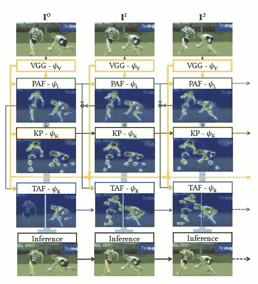

# [CVPR 2019]利用递归时空亲和场的高效在线多人 2D 姿态跟踪

> 原文：<https://towardsdatascience.com/cvpr-2019-efficient-online-multi-person-2d-pose-tracking-with-recurrent-spatio-temporal-affinity-25c4914e5f6?source=collection_archive---------13----------------------->

## 在单个 GPU 上以 30 fps 的速度实时检测和跟踪多人的 2D 姿势。

Real-time detect and track 2D poses of multiple people at 30 fps on a single GPU. [Source](https://www.youtube.com/watch?v=1Hg39MVNKBw)

在本帖中，我们将回顾来自 **CVPR 2019** 的一篇名为**“具有递归时空亲和场的高效在线多人 2D 姿态跟踪”**的新论文。

作者提出了一种在线方法，可以在单个 GPU 上以 30 fps 的速度有效地同时**检测和跟踪多人的 2D 姿势**。

根据作者的说法，这是**“目前最快和最准确的自下而上方法，它对场景中的人数和摄像机的输入帧率都是运行时不变的和准确性不变的。”**

该文件的一些要点:

*   鲁棒且**对输入帧速率**不变，即使在 6Hz 输入时也是如此
*   处理**快速移动目标**和摄像机移动
*   运行时间**对帧中的人数**不变。
*   提出**时空亲和场(STAF)** 编码跨帧的关键点之间的连接。
*   提出一种新颖的**跨肢体交叉链接的时间拓扑**，可以处理移动目标、摄像机运动和运动模糊。

这里是作者的结果。

# 概述

介绍

整体管道

*   VGG 特色
*   PAF 和关键点热图
*   时间亲和场
*   推理

交联拓扑

结果

限制

履行

参考

我的评论

# 介绍

在过去的几年中，人体姿态和跟踪受到了极大的关注。最近推出的 **PoseTrack** 数据集是一个大规模的视频数据语料库，使得这个问题在计算机视觉社区中得以发展。

关于这个问题还有其他几部作品。然而，这些方法都不能像通常那样实时运行:

1.  遵循自上而下的检测和跟踪任务方法，随着人数的增加，需要更多的计算。
2.  需要离线计算或帧堆叠，这降低了速度，并且没有获得比匈牙利算法基线更好的跟踪结果。

在本文中，作者的目标是建立一个真正在线和实时的多人 2D 姿态估计器和跟踪器。作者以循环的方式在视频上工作，以使该方法实时。它们通过组合 1)关键点热图 2)零件亲和场和 3)时空亲和场(STAF)来利用来自前一帧的信息。

作者在 2017 年 CVPR 的 OpenPose 中扩展了**零件亲和域**。这篇论文的作者也是 OpenPose 的作者。请随意查看[我们之前在 OpenPose](/cvpr-2017-openpose-realtime-multi-person-2d-pose-estimation-using-part-affinity-fields-f2ce18d720e8) 上的博文。

# 整体管道

The overall pipeline of the STAF algorithm. [Source](https://arxiv.org/abs/1811.11975)

上图是时空亲和场(STAF) 算法的**整体流水线。视频帧在时间上以**循环方式**进行处理，包括:**

*   提取 **VGG 特征**。
*   提取**零件亲缘关系字段(PAF)**
*   提取**关键点热图**
*   跨帧提取关键点之间的连接作为**时间相似性场(TAFs)** 。

# VGG 特色

VGG features. [Source](https://arxiv.org/abs/1811.11975)

每一帧由 VGG 骨干网处理，以提取 VGG 特征。这部分不需要以前的帧信息。

对于视频时间 t 处的帧 **It** ,它们计算如下:

# PAF 和关键点热图

Part Affinity Fields (PAFs). [Source](https://arxiv.org/abs/1811.11975)

Keypoints Heatmaps. [Source](https://arxiv.org/abs/1811.11975)

PAFs 和关键点热图**与开放姿态方法**非常相似，除了它们也将**使用来自前一帧**的信息。

在本文中，有三种计算 PAFs 的方法:

1.  使用 5 个先前的帧数据。
2.  仅使用 1 个前一帧。
3.  同时估计 PAF 和 taf。

在他们的实验中，他们发现:

*   方法 1 产生了好的结果，但是由于递归阶段，它是最慢的。
*   方法 2 **提高速度，而性能没有大的损失**。
*   方法 3 最难训练，但速度最快。

在这篇博客中，我们只讨论方法 2。其他方法，请查看原论文。

**方法 2 在单次通过中计算 PAF 和关键点，如下所示:**

# 时间亲和场

时间亲合场(taf)编码跨帧的关键点之间的连接。

**这些 taf 是向量场，指示每个身体关节将从帧 I t1****移动到帧 It** 的方向。Andreas Doering 等人在论文中也介绍了 taf。

在下图中，taf 表示为蓝色箭头 RtRt。

Connections between keypoints across frames. [Source](https://arxiv.org/abs/1811.11975)

Temporal Affinity Fields (TAFs). [Source](https://arxiv.org/abs/1811.11975)

taf 依赖于来自前一帧和当前帧的 VGG 特征和 PAF 以及来自前一帧的 taf，如下所示:

# 推理

Inference. [Source](https://arxiv.org/abs/1811.11975)

推断出的 PAF 和 taf 在推断出完整的姿势并将它们跨帧与唯一的 id 相关联之前，都按照它们的分数进行排序。

以下是步骤:遍历排序列表中的每个 PAF:

*   如果 PAF 的两个关键点都没有指定，初始化一个新姿势
*   **01 关键点**已分配:添加到现有姿势
*   **两个关键点都被赋值**:将姿势中 PAF 的分数更新到同一个姿势。
*   **两个关键点被分配到不同的姿态**:合并两个姿态
*   使用前一帧中最频繁出现的关键点 id**为当前帧中的每个姿势分配 id。**

以下是原始论文中的详细算法:

Algorithm: Estimation and tracking of keypoints and STAFs. [Source](https://arxiv.org/abs/1811.11975)

# 交联拓扑

STAFs 有三种可能的拓扑变体。

Topology variants for STAFs. [Source](https://arxiv.org/abs/1811.11975)

**拓扑 A** 是关键点 TAF，并且当关键点具有最小运动或者当新人出现时缺乏关联属性。

**拓扑 B** 和**拓扑 C** 是**交联分支拓扑**。作者证明了**交联肢体拓扑**可以解决来自**拓扑 A** 的运动问题。当有最小的运动时， **TAFs** 就变成了那个肢体的 **PAFs** 。

Keypoint TAF vs Cross-Linked Limb TAF. [Source](https://youtu.be/1DW1FSMs76k?t=1884)

在论文实验中，**拓扑 C** 与**拓扑 B** 相比表现不佳。

# 结果

*   该方法即使在帧率下降到 6Hz 时也能达到高精度。

Camera framerate experiments of STAFs. [Source](https://arxiv.org/abs/1811.11975)

*   该方法具有较高的准确率和较快的推理速度。

Camera framerate experiments of STAFs. [Source](https://arxiv.org/abs/1811.11975)

*   该方法可以在 PoseTrack 数据集上取得有竞争力的结果。

Camera framerate experiments of STAFs. [Source](https://arxiv.org/abs/1811.11975)

# 限制

这项工作有一些限制:

*   本文没有嵌入重新识别模块来处理人离开和重新出现在场景中的情况。
*   这种方法不能处理场景变化。因此，可能需要检测场景变化，并从该帧重新开始该过程。

# 履行

本文在作者资源库 [soulslicer/openpose](https://github.com/soulslicer/openpose/tree/staf) 开源。

这是来自 [OpenPose 库](https://github.com/CMU-Perceptual-Computing-Lab/openpose)的一个分支。在不久的将来，它们将被合并，你可以直接从 OpenPose 使用它。

# 参考

*   [[1] Yaadhav Raaj，Haroon Idrees，Gines Hidalgo，亚塞尔·谢赫，使用递归时空亲和场的高效在线多人 2D 姿态跟踪，CVPR 2019](https://arxiv.org/abs/1811.11975)
*   [【2】曹哲，托马斯·西蒙，施-韦恩，亚塞尔·谢赫，使用部分亲和场的实时多人 2D 姿态估计(2017)，CVPR 2017](https://arxiv.org/abs/1611.08050)
*   [【3】Andreas Doering，Umar Iqbal，Juergen Gall，联合流:多人跟踪的时间流场，CoRR，abs/1805.04596，2018](https://arxiv.org/abs/1805.04596)
*   [项目页面:使用递归时空亲和场的高效在线多人 2D 姿态跟踪](https://cmu-perceptual-computing-lab.github.io/spatio-temporal-affinity-fields/)
*   [Github 代码:soulslicer/openpose](https://github.com/soulslicer/openpose/tree/staf)

# 我的评论

图像分类:[【NIPS 2012】AlexNet](https://medium.com/p/alexnet-review-and-implementation-e37a8e4dab54)
图像分割:[【CVPR 2019】Pose 2 seg](/cvpr-2019-pose2seg-detection-free-human-instance-segmentation-61e4948ba6db)
姿态估计:[【CVPR 2017】open Pose](/cvpr-2017-openpose-realtime-multi-person-2d-pose-estimation-using-part-affinity-fields-f2ce18d720e8)
姿态跟踪:[【CVPR 2019】STAF](/cvpr-2019-efficient-online-multi-person-2d-pose-tracking-with-recurrent-spatio-temporal-affinity-25c4914e5f6)