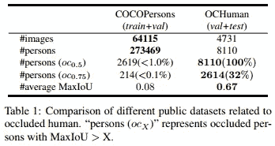
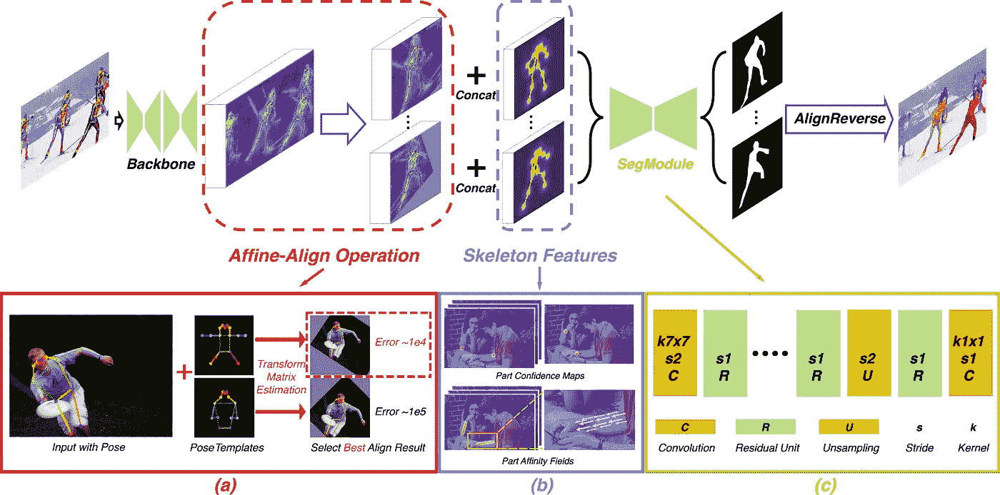
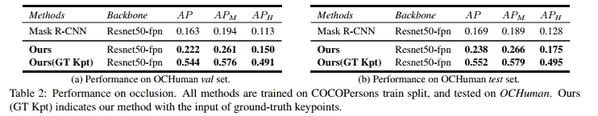
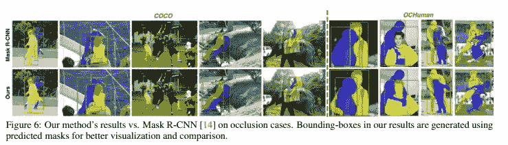
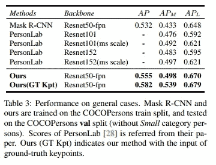

# [CVPR 2019] Pose2Seg:无检测人体实例分割

> 原文：<https://towardsdatascience.com/cvpr-2019-pose2seg-detection-free-human-instance-segmentation-61e4948ba6db?source=collection_archive---------18----------------------->

在本帖中，我们将回顾来自 **CVPR 2019** 的论文**“pose 2 seg:检测自由人体实例分割”**。提出了一种新的人体实例分割方法，该方法基于人体姿态而不是提议区域检测来分离实例。

本文的一些亮点:

*   **基于姿态的人体实例分割框架**比基于 SOTA 检测的方法能够达到**更好的准确性**并且能够**更好地处理遮挡**。
*   一个新的基准**“被遮挡的人(OCHuman)”**，它关注被遮挡的人，带有包括边界框、人姿势和实例遮罩的注释。

# 概述

*   介绍
*   被遮挡人类基准(OCHuman)
*   体系结构
*   实验
*   履行
*   参考

# 介绍

人体姿态估计和分割是更好地理解人体活动的重要信息。有很多研究集中在这个主题上。最流行的深度学习方法之一是 Mask R-CNN，它是一个简单而通用的对象实例分割框架。

即使通过像 Mask-RCNN 这样的方法，也可以检测对象并为图像中的每个实例生成分割掩模。这些方法存在一些问题:

*   这些方法首先执行对象检测，然后使用*非最大值抑制(NMS)* 移除冗余区域，并从检测包围盒中分割出对象。**当同一类别的两个对象有较大重叠时，NSM 会将其中一个作为冗余的提议区域，并将其消除**。
*   “人”是一个特殊的类别，可以基于姿态骨架来定义。目前的方法如 Mask-RCNN 没有利用姿态信息进行分割。

本文提出的方法 **Pose2Seg** ，是专门为人体实例分割而设计的，具有以下优点:

*   使用自下而上的方法，这种方法基于姿态信息而不是边界框检测。
*   旨在解决每个人类实例被一个或几个其他实例严重遮挡的问题。

# 被遮挡人类基准(OCHuman)

**遮挡人体基准(OCHuman)** 本文引入数据集，强调遮挡是研究人员研究的一个挑战性问题，并鼓励算法变得更适用于现实生活情况。

**遮挡人体基准(OCHuman)** 数据集包含 **8110** 带有 **4731** 图像的详细注释人体实例。平均而言，一个人的超过 67%的包围盒区域被一个或几个其他人遮挡。

以下是一些来自 OCHuman 数据集的图片:

Source: OCHuman Dataset

## OCHuman 数据集

这是一个比较 COCO 数据集和 OCHuman 数据集的表格。

如你所见，COCO 包含很少的被遮挡的人类案例，当面对被遮挡的人脸时，它不能帮助评估方法的能力。

OCHuman 是为与人类相关的所有三个最重要的任务而设计的:检测、姿势估计和实例分割。

奥乔曼最重要的方面是平均马西欧是 **0.67** 。这意味着超过 **67%** 的人的包围盒区域被一个或几个其他人遮挡。这在视频监控或店内人体行为分析等实际应用中是一个非常常见的问题。

# 体系结构

Pose2Seg 的结构如下图所示:

Source: Pose2Seg project page [http://www.liruilong.cn/projects/pose2seg/index.html](http://www.liruilong.cn/projects/pose2seg/index.html)

该方法的步骤可以描述如下:

*   首先，模型将**图像**和**人体姿态**作为输入。人体姿态可以是其他方法的输出，如 OpenPose 或数据集的地面实况。
*   整个图像通过**基网络**来提取图像的特征。
*   对准模块**仿射对准**用于将**感兴趣区域**对准到统一尺寸。可以想象这个模块会从大图中提取多个固定大小的区域。每个固定大小的区域对应于图像中的每个人。然后，**仿射对齐**区域将执行仿射变换，以将每个姿势与**姿势模板**之一对齐。
*   **仿射对齐**的对齐输出将与**骨架特征**连接，并馈入**分割模块**以生成分割掩模。
*   **骨架特征**:简单来说就是*零件亲和场(PAF)*，它是每个骨架的双通道矢量场图。这是 OpenPose 的输出。
*   **SegModule** :是一个 CNN 网络，以 **7 x 7 stride-2 conv 层**开始，后面是几个标准剩余单元。然后，双线性上采样层用于恢复分辨率，并且**1×1 conv 层**用于预测遮罩结果。
*   最后，使用来自**仿射对齐**的仿射变换的逆变换，将每个人的分割掩模组合成一个最终分割掩模。

# 实验

# 咬合性能

*   Pose2Seg 在 OCHuman 数据集上可以达到比 Mask R-CNN 高近 50%的性能。作者还使用地面实况关键点作为输入进行了测试，准确度提高了一倍多 **(GT Kpt)** 。

*   关于闭塞情况的一些结果:

# 一般情况下的性能

*   Pose2Seg 在 COCOPersons 数据集上也能达到比其他方法更高的准确率。

# 履行

这篇论文的官方 PyTorch 代码可以在 https://github.com/liruilong940607/Pose2Seg 找到

# 参考

*   【1】张，宋海和李，瑞龙和董，辛和松香，保罗 L 和蔡，子希和，韩和杨，丁成和黄，郝智和胡，石世民，Pose2Seg:检测自由人体实例分割(2019)，2019
*   [【2】曹哲，托马斯·西蒙，施-韦恩，亚塞尔·谢赫，OpenPose:利用局部亲和场的实时多人 2D 姿态估计(2017)，CVPR 2017 口述](https://arxiv.org/abs/1611.08050)

# 我的评论

图像分类:[【NIPS 2012】AlexNet](https://medium.com/p/alexnet-review-and-implementation-e37a8e4dab54)
图像分割:[【CVPR 2019】Pose 2 seg](/cvpr-2019-pose2seg-detection-free-human-instance-segmentation-61e4948ba6db)
姿态估计:[【CVPR 2017】open Pose](/cvpr-2017-openpose-realtime-multi-person-2d-pose-estimation-using-part-affinity-fields-f2ce18d720e8)
姿态跟踪:[【CVPR 2019】STAF](/cvpr-2019-efficient-online-multi-person-2d-pose-tracking-with-recurrent-spatio-temporal-affinity-25c4914e5f6)