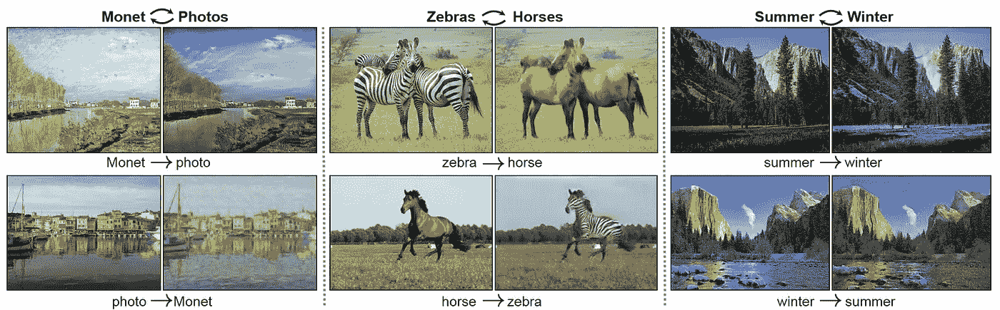
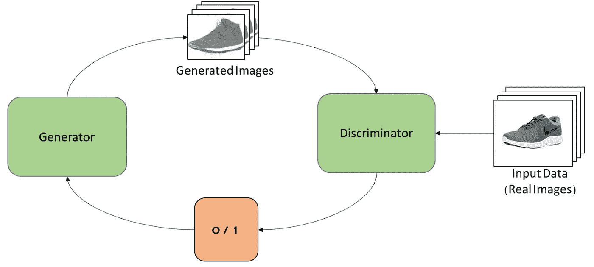
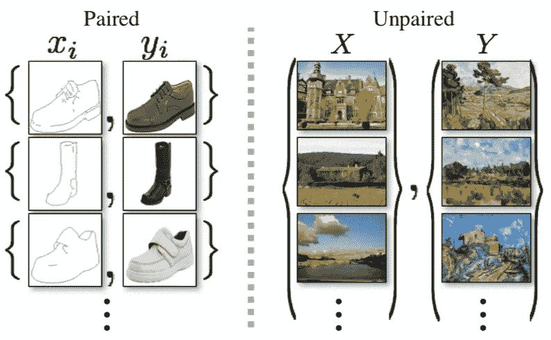

# CycleGAN:机器学习如何学习不成对的图像到图像的翻译

> 原文：<https://towardsdatascience.com/cyclegan-how-machine-learning-learns-unpaired-image-to-image-translation-3fa8d9a6aa1d?source=collection_archive---------16----------------------->

我最近读了 CycleGAN 的论文([链接](https://arxiv.org/pdf/1703.10593.pdf))，我发现它非常有趣，因为 CycleGAN 模型具有不可思议的能力，可以准确地将图像变成它们不是的东西(例如，将一匹马的图片变成一匹斑马的图片)。*非常凉爽。*让我们深入了解它的工作原理。

Some of CycleGAN’s applications (left to right): changing a Monet painting to a real-world picture, changing zebras to horses, changing a picture of a location in the summer to a picture of the same location in the winter. All of the applications can be reversed as well. Image credits to Zhu et al., the authors of the CycleGAN paper.

**甘斯。**生成对抗网络 CycleGAN 的基本思想。GANs 有一个特殊的损失函数:对抗性损失。基本上，GAN 由两种不同的机器学习模型组成。首先是发电机。这个模型就是生成图像的模型(顾名思义)。还有鉴别器。其目的是试图区分由生成器提供给它的真实图像和虚假图像。对抗损失是整体 GAN 试图优化的函数。可以把它想象成生成器和鉴别器在争夺哪个是更好的模型。当损失被优化时，发生器(理论上)正在创建鉴别器无法从真实图像中区分的图像。

 [## 金融中的机器学习——数据驱动的投资者

### 在我们讲述一些机器学习金融应用之前，我们先来了解一下什么是机器学习。机器…

www.datadriveninvestor.com](https://www.datadriveninvestor.com/2019/02/08/machine-learning-in-finance/) 

基本原理是，GAN 能够生成任何事物的假图像，只要它有足够多的该事物的现有示例。我之前使用了一个简单的 GAN 来生成鞋子的图像，你可以在这里找到。

Representation of a GAN that generates an image of a shoe.

**CycleGAN。**cycle GAN 与标准 GAN 的不同之处在于，它不会从随机噪声中生成图像。它使用给定的图像来获得该图像的不同版本；这是图像到图像的转换，允许 CycleGAN 将马变成斑马。然而，图像到图像的翻译并不是 CycleGAN 独有的功能；CycleGAN 是首批允许*不成对*图像对图像训练的型号之一。这意味着你不需要有一匹马的图片，也不需要知道这匹马作为斑马在数据集中的样子。相反，你可以分别拥有一群马和一群斑马。这在无法获得配对数据的情况下很有用(例如，如果您希望能够从一匹马生成一个斑马版本，那么为了获得配对数据而将每匹马都画成斑马是不合理的)。不成对的图像到图像翻译的特征是非常强大的，并且有许多应用。

The CycleGAN paper’s example of paired vs. unpaired data. Paired data is from changing a pencil sketch of an object to its real life counterpart. Unpaired data consists of images vs. paintings. Image credits to Zhu et al., the authors of the CycleGAN paper.

**应用**。除了把马变成斑马，还有更多方法可以应用 CycleGAN。这是一个非常通用的型号，如此通用，它还可以用来将一个苹果变成一个橙子！是啊，不是最强的例子，所以这里有一些其他的。

*   根据建筑蓝图生成建筑的真实效果图。
*   创建一个位置在每个不同季节的形象。
*   把画变成真实的图像。
*   根据警方的素描渲染出嫌疑人的真实面部表情。
*   增强照片的各个方面，使它们看起来更专业。

**方便。**光有一堆应用是不够的，还需要非常好用。CycleGAN 的可用性极高，因为它不需要成对的数据。通常很难获得大量精确的配对数据，因此使用高精度非配对数据的能力意味着无法访问复杂(且昂贵)配对数据的人仍然可以进行图像到图像的翻译。对于像我这样的机器学习爱好者来说，这是个好消息！你可以通过 GitHub 上的[官方资源库使用 CycleGAN。](https://github.com/junyanz/CycleGAN)

我在下面列出了一些你可能感兴趣的其他资源。

*   [cycle gan 的原纸](https://arxiv.org/abs/1703.10593)
*   [官方 GitHub 库](https://github.com/junyanz/CycleGAN)
*   [甘纸](https://papers.nips.cc/paper/5423-generative-adversarial-nets.pdf)