# CycleGANs 创造计算机生成的艺术

> 原文：<https://towardsdatascience.com/cyclegans-to-create-computer-generated-art-161082601709?source=collection_archive---------7----------------------->

## 对 CycleGANs 的解释和计算机生成艺术的演示

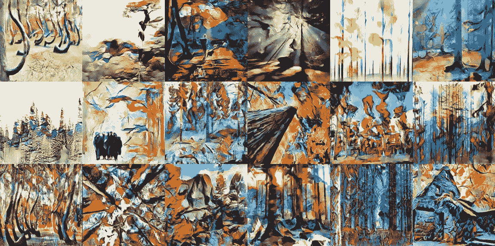

CycleGANs 是指能够拍摄图像并生成反映某种类型转换的新图像的 g an 的子集。CycleGANs 最酷的部分是**你不需要成对的图像**。这对于没有成对图像的情况非常有用。例如，如果你想把斑马的图片转换成马的图片。这种数据可能是不可能收集的，除非我猜如果你画斑马和马…有足够的创造力，它们也可以用于创建计算机生成的艺术，实际上看起来很好！

This figure is taken from the original [CycleGAN paper](https://arxiv.org/abs/1703.10593).

在这里，我将概述一下 CycleGANs 是如何工作的。这篇文章假设你至少对 GANs 有一些了解。因此，如果你不熟悉 GANs，可以看看我的博客文章[“面向初学者的生成对抗网络(GANs):生成分心司机的图像。”](/generative-adversarial-networks-gans-for-beginners-82f26753335e)

在这篇文章中，我使用了一个示例 CycleGAN，它被训练来将森林的图片转换成森林的抽象画。我用来生成这些图像的代码可以在我的 [GitHub](https://github.com/zachmonge/cyclegan_forest_abstract_art_Duke_zm) 上找到。

# 数据集

在这里，数据集由森林图像和抽象画组成。我用关键词“森林”和“著名的抽象画”从谷歌图片上刮下了这些图片为此，我使用了 Python 包[谷歌图片下载](https://github.com/hardikvasa/google-images-download)。下面是几个例子。

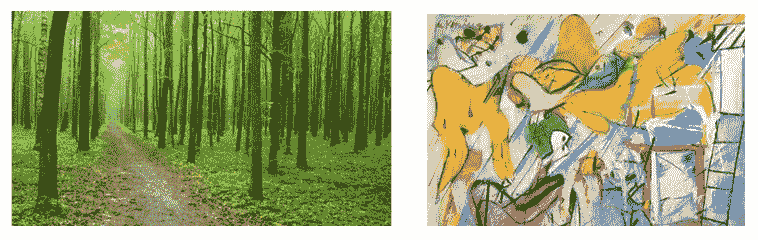

# **车型**

训练 CycleGAN 时，需要训练四个神经网络:

1.  生成抽象画图片的生成器(**抽象画** **生成器**)。
2.  生成森林图片的生成器(**森林** **图像生成器**)。
3.  能辨别真假抽象画的鉴别器(**抽象画鉴别器**)。
4.  能够辨别森林真假图片的鉴别器(**森林图像鉴别器**)。

如果你已经熟悉 GANs，你会发现这里真的没有什么新东西。新颖之处在于如何训练这些网络。

# **模特培训**

在进入细节之前，让我对如何训练 CycleGANs 做一个高层次的概述。首先，我们拍摄一个森林图像，使用抽象画生成器创建一个假的抽象画，然后我们拍摄假的抽象画，使用森林图像生成器重新创建原始的森林图像。我们还从另一个方向出发，拍摄一幅抽象画，使用森林图像生成器创建一幅假森林图像，然后拍摄假森林图像，使用抽象画生成器重新创建原始的抽象画。这个关于循环的巧妙想法是 CycleGANs 的新颖贡献，如下图所示。需要注意的是，相同的生成器用于生成假抽象画和抽象画的重建，相同的生成器也用于生成假森林图像和森林图像的重建。

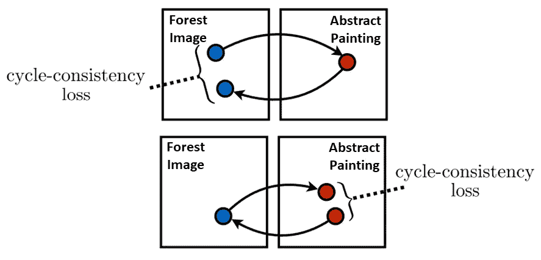

CycleGAN training. This figure is adapted from the original [CycleGAN paper](https://arxiv.org/abs/1703.10593).

下面你可以看到我们的 CycleGAN 实际上是什么样子。你可以看到真实的图像，被生成为假的，然后被重建回真实的。你可能会注意到，尤其是在抽象画中，物体的结构不会发生剧烈的变化。这是对 CycleGANs 的常见观察，可能是因为娱乐步骤。对于一个 CycleGAN 来说，彻底改变一个图像，然后又回到它的原始版本可能太过分了。

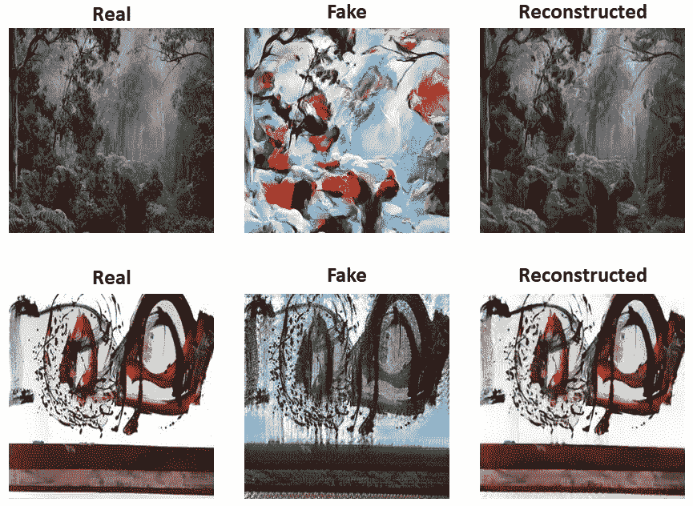

好了，现在让我们进入细节！在训练模型时，基本上有两个步骤:训练生成器，然后训练鉴别器。

1.  **训练发电机**

就像任何神经网络一样，我们需要计算损耗(在这种情况下是针对发电机)，并使用带有反向传播的随机梯度下降(即链式法则)来计算梯度，并根据这些梯度更新权重。但是我们如何计算发电机损耗呢？这种损失实际上由几个不同的部分组成。

**首先**，我们计算*抽象画生成器*的 GAN 损耗(在“循环”中我们在下图的黄色阴影部分)。这是通过拍摄一幅真实的森林图像并将其放入抽象画生成器来生成一幅假的抽象画来实现的。假的抽象画然后通过抽象画鉴别器。我们可以认为鉴别器的输出是这幅画是一幅真正的抽象画的概率。然后用[二进制交叉熵损失](https://ml-cheatsheet.readthedocs.io/en/latest/loss_functions.html)评估鉴频器的输出。这就是 ***抽象画*** ***甘损*** 。

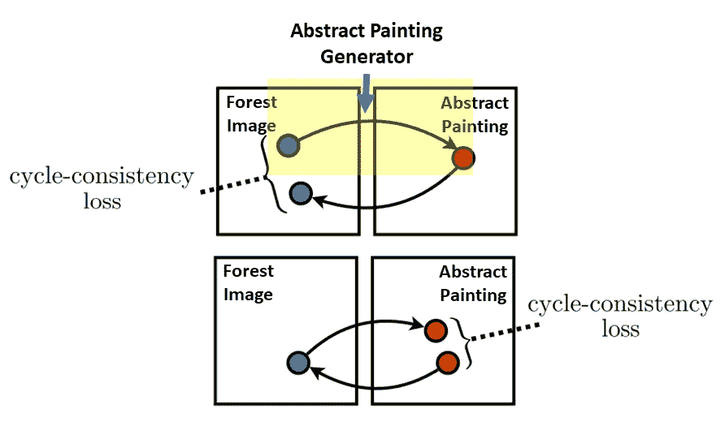

GAN loss for abstract painting generator

**第二个**，我们计算*森林影像* *发电机*的 GAN 损耗(在循环中我们在下图的黄色阴影部分)。这是通过获取一幅真实的抽象画并将其放入森林图像生成器来生成一幅假的森林图像来实现的。然后，假森林图像通过森林图像鉴别器。我们可以认为鉴别器的输出是照片是真实森林图像的概率。然后用[二进制交叉熵损失](https://ml-cheatsheet.readthedocs.io/en/latest/loss_functions.html)评估鉴频器的输出。这就是 ***森林形象甘损*** 。

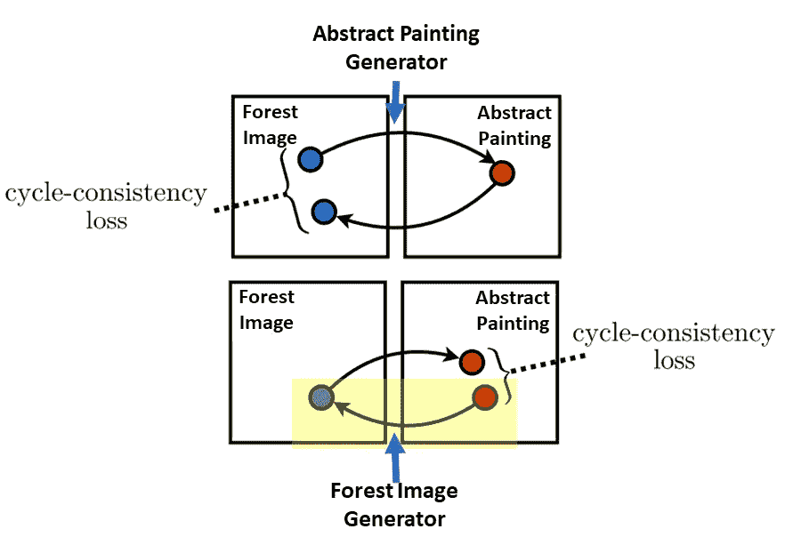

GAN loss for forest image generator

很好，现在我们有了一幅假的抽象画和一幅假的森林图像。正如上面的高级概述中所解释的，我们现在必须将这些伪图像重建回相应的真实图像。因此，**第三个**，我们将假的抽象画放入森林图像生成器，生成重建的原始真实森林图像(在下图的黄色阴影部分)。我们对照具有 L1 损失的真实森林图像来评估该重建的森林图像(注意，这里，L1 损失通常乘以某个常数，因此它与其他计算的损失处于相同的规模)。这就是 ***森林影像周期一致性损失*** 。

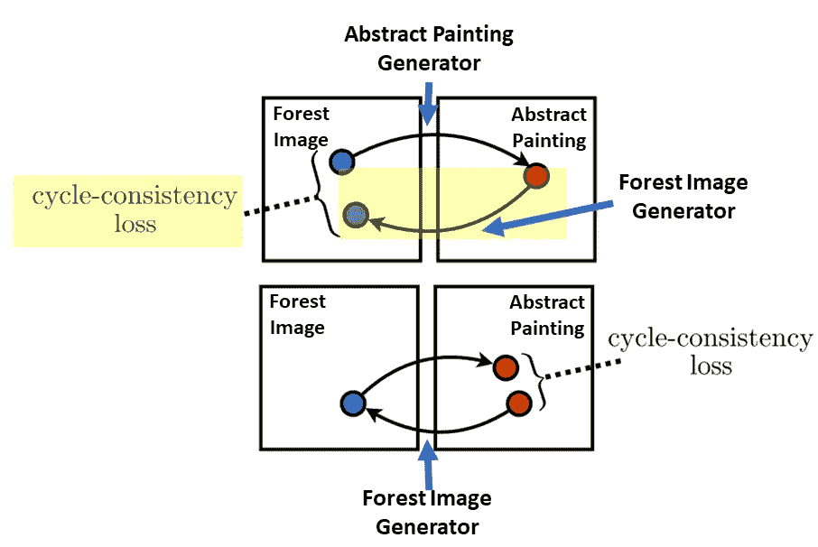

**最后**，我们将假森林图像放入抽象画生成器，生成重建的抽象画(在下图的黄色阴影部分)。我们对照具有 L1 损失的真实抽象画来评估该重建的抽象画(注意，这里 L1 损失通常乘以某个常数，因此它与其他计算的损失处于相同的规模)。这就是 ***抽象画*** ***周而复始的损失*** 。

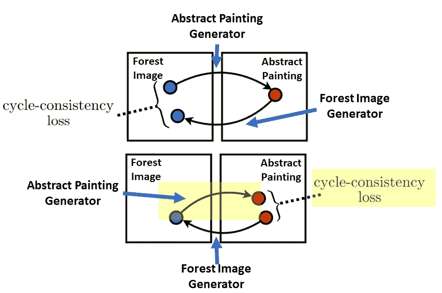

现在我们差不多可以计算发电机损耗了(是的，所有这些工作都是为了一个数字)。还有一个损失我们需要计算，就是*身份映射*。计算身份映射损失是因为，如下图所示，该步骤显示为保留原始图像的颜色。首先，我们将真实森林图像放入森林图像生成器，并计算真实森林图像和生成的森林图像的 L1 损耗。这就是 ***森林影像身份映射损失*** (注意，这个损失也是乘以常数)。第二，我们对抽象画做同样的事情，我们通过抽象画生成器来绘制真正的抽象画。这就是 ***抽象画*** ***的身份映射损失。***

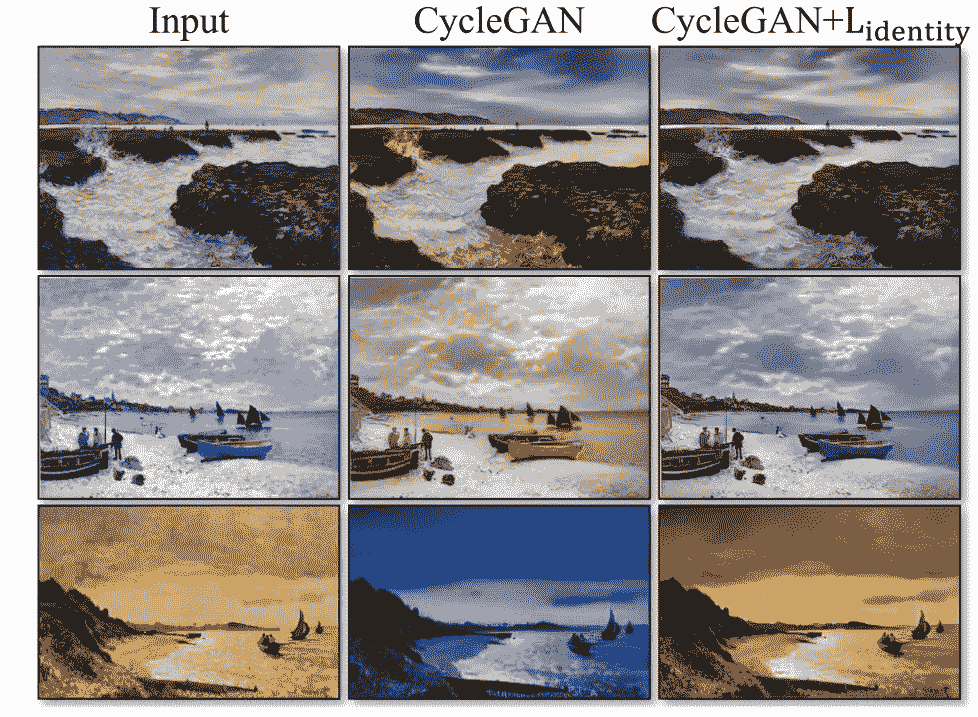

Figure 9 from the [CycleGAN paper](https://arxiv.org/abs/1703.10593).

我们终于可以计算发电机损耗了，这是所有损耗分量的总和:

**生成器损耗** = *抽象画* *甘损耗+森林图像甘损耗+森林图像循环一致性损耗+抽象画* *循环一致性损耗+森林图像身份映射损耗+抽象画* *身份映射损耗*

发电机的重量随后根据这一损失进行更新！

**2。训练鉴别员**

现在我们已经更新了生成器的权重，接下来我们需要训练鉴别器。

**首先**，我们更新抽象画鉴别器的权重。我们将一幅真实的抽象画通过抽象画鉴别器，并获取该输出，用二进制交叉熵损失对其进行评估。然后，我们取之前生成的伪抽象画，放入抽象画鉴别器，同样用二值交叉熵损失进行评估。然后我们取这两次损失的平均值。这就是 ***抽象画鉴别器损耗*** 。抽象绘画鉴别器的权重相对于该损失进行更新。

**第二个**，我们更新森林图像鉴别器的权重。我们将一幅真实的森林图像通过森林图像鉴别器，并获取该输出，用二进制交叉熵损失对其进行评估。然后，我们把先前生成的假森林图像，把它通过森林图像鉴别器，也评价它与二值交叉熵损失。然后我们取这两次损失的平均值。这就是 ***森林图像鉴别器损耗*。**森林图像鉴别器的权重根据该损失进行更新。

**架构**

到目前为止，我已经提到了这些生成器和鉴别器的存在，但我还没有说出这些神经网络的确切架构。当然，这些网络的架构有多种选择，但在这里我将简要提及用于生成森林抽象画的架构。这些架构的细节可以在[代码](https://github.com/zachmonge/cyclegan_forest_abstract_art_Duke_zm)中查看。发生器来自以前用于风格转换和超分辨率的架构(见 [Johnson et al.](https://arxiv.org/abs/1603.08155) )。网络架构基本上由一堆 ResNet 块组成，它们对网格大小进行下采样，保持网格大小不变，然后对网格大小进行上采样。请参见下图中的架构图。

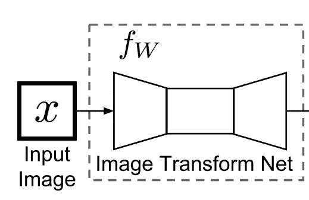

Generator architecture from [Johnson et al.](https://arxiv.org/abs/1603.08155)

对于鉴别器，我们使用 PatchGAN，它基本上试图分类图像的每个 N×N 块(这里是 70×70)是真是假。参见[代码](https://github.com/zachmonge/cyclegan_forest_abstract_art_Duke_zm)和这张[纸](https://arxiv.org/pdf/1611.07004.pdf)以获得更多补丁的细节。

# **计算机生成的森林图像**

训练一段时间后，让我们看看计算机生成的抽象森林图像是什么样子的！下面是一些例子，但是你可以在我的 GitHub 上查看它们。

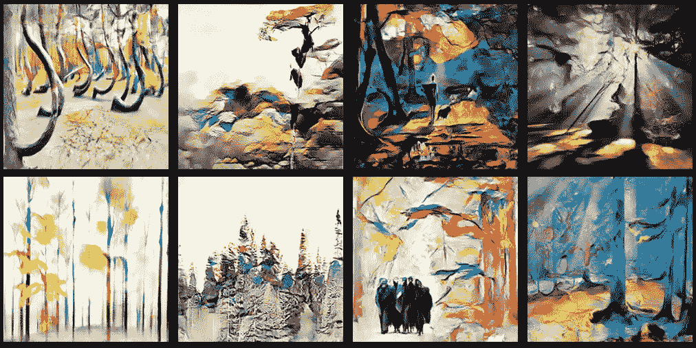

不算太差！我为杜克大学的人工智能艺术竞赛创作了这些图像，最终赢得了第一名— [点击此处](https://ece.duke.edu/about/news/how-judge-ai-art-competition)了解更多信息。

# 结论

正如你在上面看到的，在这种情况下，由于 CycleGANs，计算机确实可以产生艺术。同样，CycleGANs 真正酷的部分是，在数据集中不需要成对的图像。这是相当惊人的，这是可能的！我会很好奇，看看在其他领域，比如自然语言处理领域，不成对的机器学习是否可能存在(可能这个已经存在了！).

*** 2020 年 1 月 26 日更新* * *:我忘了早些时候发布这个，但这里展示的艺术在杜克大学的一次人工智能艺术竞赛中获得了第一名。查看[一篇描述这场比赛的文章](https://today.duke.edu/2019/03/these-works-art-were-created-artificial-intelligence)！