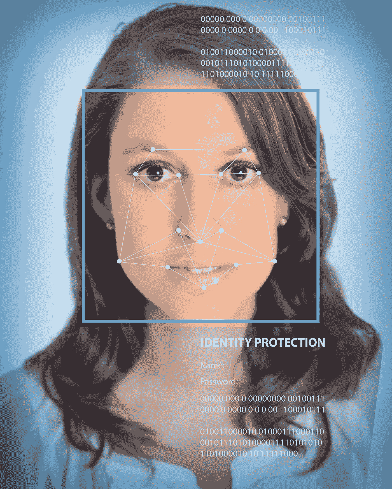
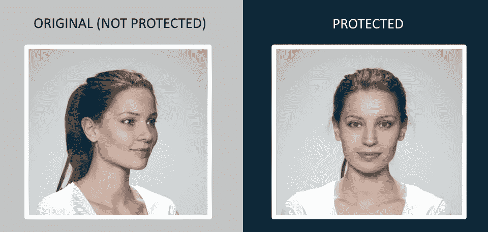

# D-ID 正在改变面部识别走向隐私的道路

> 原文：<https://towardsdatascience.com/d-id-is-altering-facial-recognitions-path-towards-privacy-a55c108dfdf?source=collection_archive---------31----------------------->

## 当世界其他地方都被自拍、面部拍照和上传照片的热潮所吸引时，三个年轻人看到了监控越来越多的未来，现在他们正在寻求改变这种状况。

DEPOSIT PHOTOS

在过去的十年里，我们目睹了网络照片分享的泛滥。从 Pinterest 到 Instagram，再到 Snapchat，照片分享的兴起使得自拍、公民新闻和即时事件的活动激增。 [Brandwatch 的最新统计显示，在 18-24 岁的人群中，超过 75%的人使用 Instagram 和 Snapchat，94%的人使用 Youtube:](https://www.brandwatch.com/blog/amazing-social-media-statistics-and-facts/)

*   在 Instagram 上，迄今已有超过 400 亿张照片被分享
*   [每天有超过 9500 万张照片被上传到 Instagram 上](http://www.wired.co.uk/article/instagram-doubles-to-half-billion-users)
*   2017 年第三季度，[发送了 35 亿次快照](https://www.statista.com/statistics/257128/number-of-photo-messages-sent-by-snapchat-users-every-day/)。

基于之前的[估计](https://www.inc.com/larry-kim/visual-content-marketing-16-eye-popping-statistics-you-need-to-know.html)，图像和视频的未来一目了然:

*   据估计，2018 年 84%的通信是视觉的。
*   据估计，2018 年 79%的互联网流量内容是视频。
*   包含图片的帖子的参与度提高了 650%

D-ID Co-founders: Eliran Kuta, Gil Perry, and Sella Blondheim

三个来自以色列的年轻人正在见证图像共享的到来。Gil Perry、Sella Blondheim 和 Eliran Kuta 当时在以色列国防军服役。当全世界都沉浸在自拍、面部拍照和上传照片的热潮中时，吉尔、塞拉和埃利兰却有着截然不同的看法。

> *我们就是做不到【免费上传照片到网上】。我们有不同的观点。即使在那时，我们也知道政府在用照片技术做什么。图像共享的全球涌入的现实，相机无处不在，谷歌眼镜承诺的兴奋——所有这些与新兴的人脸识别技术相结合，我们看到了未来。这种未来正在今天发生，并且正在走向一条越来越危险的道路。*

输入 [D-ID](https://www.deidentification.co/) ，去标识的简称。Sella Blondheim、首席运营官的首席执行官吉尔·佩里(Gil Perry)和首席技术官埃利兰·库塔(Eliran Kuta)很早就意识到，他们需要对面部识别技术的影响采取一些措施。吉尔的职业是程序员，六年前他进入大学学习计算机科学。到那时，他和塞拉已经在面部识别以及保护照片和存储照片的选项方面做了大量的研究。他们开始构建一个解决方案，让人们可以上传照片，在线使用，但内容将无法识别。当时，没有人——无论是公司还是投资者——知道人脸识别技术。

面部识别技术早在 1960 年就开始了。号称面部识别技术之父的 Woodrow Wilson Bledsoe 创造了第一个半自动面部识别系统，被称为 [Rand Tablet](https://medium.com/coinmonks/from-the-rand-tablet-to-differentiating-identical-twins-aa4ba6031bb0) 。到 20 世纪 70 年代初，戈尔茨坦、哈默和莱斯克能够通过识别 21 个标记，如头发颜色和嘴唇厚度来[提高面部识别的准确性](https://www.researchgate.net/publication/2992615_Identification_of_Human_Faces)。但直到 20 世纪 90 年代初，美国国防高级研究计划局(DARPA)和国家标准与技术研究所(NIST)才推出了[人脸识别技术(FERET)项目](https://en.wikipedia.org/wiki/FERET_(facial_recognition_technology))，以鼓励在情报、执法和安全方面的具体应用创新。吉尔解释道，

> 我们知道相机无处不在。在伦敦桥上，人们每天被抓 300 多次。几乎每个人都有智能手机，拍照，到处上传，却没有真正了解风险。因此，当你结合三个因素时:人脸识别越来越准确，到处都是照片和图像的市场，以及来自客户、员工和游客的照片的商业存储——这相当于一场完美风暴。意识到隐私没了。我们已经失去了基本的隐私权。任何人都可以跟踪你，认出你，从而窃取你的身份。

吉尔开发了一个工作原型，并接触了面部识别领域的一位顶级专家，他开发了第一个使用深度学习的算法。通过一系列的接触，他积累了足够的知识来了解政府和企业如何使用当前的技术，吉尔、塞拉和埃利兰决定将他们的解决方案带到这个世界，以恢复隐私或至少阻止这种迫在眉睫的未来发生。

> 如果没有人知道你是谁，你的孩子是谁，他们去哪里，谁是他们的朋友，他们住在哪里，你将无法走在街上。如果我们什么都不做，这将是我们的未来。

不久，塞拉、吉尔和埃利兰成立了 D-ID 公司。日期是 2017 年 1 月。他们向风投和企业推销，但无人理睬。人们认为他们多疑。他们努力解释他们的研究和经验，但没有说服投资者有市场需求。他们被告知面部识别不起作用。该团队还意识到，市场在很大程度上没有意识到面部识别技术的危险。他们毫不畏惧，继续讲述他们的故事和解决方案。

> *对我们来说，这是一个完美的时刻。我们的背景给了我们独特的个人痛点，这让我们走上了这条道路。我们相互信任，我们继续发展我们的技术，使它变得更强大。没有人以我们的方式思考，这对我们来说是好事。是什么让我们坚持下去？我们就是知道！*

然后监管发生了。2018 年 5 月 25 日，[欧洲通用数据保护和法规(GDPR)](https://eugdpr.org/) 发布，这是第一套全球公认的法律，旨在从根本上改变欧洲的数据做法。它的触角伸得很远，开始影响全球的政策和隐私变化。团队知道企业最终会感受到它的愤怒。在 GDPR，面部图像被认为是敏感的个人身份信息(PII)。D-ID 意识到他们将能够填补监管和广泛传播的图像共享现实之间的差距。D-ID 计划成为照片和视频的隐私增强技术。

D-ID 使用先进的图像处理和深度学习技术来重新合成任何给定的照片，使照片在人眼看来相似且足够好，但在面部识别算法看来不同。吉尔解释说这不是同一张照片。它看起来像你，但实际上是不同的。典型的降噪滤波器无助于降低保护。然而，通过应用 GANS 攻击(对抗性噪声注入)等解决方案，用户也可以将照片上传到社交网络，打印照片，拍摄截图——照片仍将受到保护。

> 它足够强大，可以抵御逆向工程的尝试，逆向工程可能试图通过训练新的分类器来忽略 D-ID 变化，从而克服保护。

Left– an original, unprotected image. Right — a resynthesized image of the same person, now deidentified

# 从隐私到完全匿名

D-ID 最近开发了另一种产品。他们的匿名产品不是保护照片，而是改变面部，使其与原始照片明显不同。当身份被掩盖时，剩下的是重要的属性，包括年龄、性别、种族、情感等。吉尔解释道，

> *人脸识别无处不在。当我们购物和与他人联系时，公司试图理解我们的意图和情绪。现实是我们无法阻止侧写的发生。这就是钱的所在。我们的身份在未经我们同意的情况下被使用。然而，如果公司想通过聚合数百万人的数据来改进他们的产品，身份就不应该成为这项研究的一个因素。没必要下到个人层面。*

在这个充斥着假货的市场中，假货被用于社交网络上的模仿和约会网站上的恶作剧，更不用说不存在的人的发展，吉尔很清楚 D-ID 的意图是保护人们的隐私。然而，风险在于任何人都有可能利用这项技术来维持这个市场。

> *我们并不专注于防范深层假货。我们的目标是让我们的技术如此强大，没有人可以重新识别照片。我们专注于保护隐私。在监管的同时，我们的目标是利用我们的技术来保护个人隐私。互联网巨头今天正经历着可怕的隐私问题，因为他们很晚才明白他们的决定的含义。他们需要改变他们的隐私策略，以重新赢得用户的信任。*

D-ID 的销售对象是对隐私敏感的组织，这些组织拥有大量来自员工、客户/患者或访客的照片，并且需要遵守 GDPR 等隐私法规。这包括学校、医疗保健、金融机构、政府合规部门、KYC 或物理徽章或许可证识别。

D-ID 也在向 B2B2C 销售:处理数百万消费者图像的公司，包括设备制造商、云提供商/安全提供商和安全提供商。照片可以通过它们的 API 立即得到保护。未来，D-ID 还可以安装在手机上，以保护用户照片。吉尔提到了 Ntech labs 和他们现在已经不存在的应用程序， [Findface](https://findface.ru/) ，它允许你通过简单的照片搜索来识别一个人。D-ID 试图使这些类型的应用变得无用。正如吉尔所说，这是一个市场信任的问题。

Gil 认为 D-ID 优于当前的竞争对手解决方案。匿名化领域的竞争对手使用像素化来扭曲照片的外观，以至于最终图像无法使用。[鹦鹉识别](https://www.researchgate.net/figure/Automatic-parrot-recognition-for-pixelation-We-automatically-determine-the-degree-of_fig3_226008290%20https:/www.researchgate.net/publication/226008290_Face_De-identification)用于确定像素化程度，以某种程度的准确性重新识别原始图像。他坚持认为这些方法不是为了防止人脸识别。

> 我们认为你不应该隐藏。你不必戴眼镜或帽子来阻止别人认出你。您应该能够在众目睽睽之下自由行走，同时保护您最敏感的信息。

迄今为止，D-ID 已经筹集了 1000 万美元，雇佣了 5 名博士，以及以色列顶尖的深度学习和计算机视觉专家。D-ID 的顾问验证了技术和愿景:

*Ann Cavoukian 博士，三任加拿大安大略省信息和隐私专员，设计隐私框架的创建者:*

> *人脸已经成为我们的数字标识符，因此必须受到严格保护。随着越来越多的系统采用面部识别，隐私风险急剧上升。这就是为什么每个处理图像的组织(公司、政府、安全机构)都需要快速行动，实施强大的安全、身份识别和隐私措施。D-ID 的面部识别技术是专门设计的，旨在使人工智能难以克服，并将帮助个人和组织摆脱伤害。*

Pitango Capital Venture 执行普通合伙人兼联合创始人 Rami Kalish:

> 越来越多关于我们每个人的数据正以惊人的速度从各种设备中产生。保护我们的隐私免受面部识别带来的风险，需要果断的监管和强大的技术相结合。D-ID 是技术方面的领导者之一，他们开创性的技术帮助组织确保客户、员工和公民的隐私安全。

组织和个人越来越意识到他们的信息是如何被使用和滥用的。虽然脸书等网站上的用户活动已经减少，但人天生就是群居动物。公司和消费者将继续在线交流，创建、上传、分享和存储图像和视频。D-ID 正着手让他们在这个过程中感到安全和安心。

这篇文章最初出现在[福布斯上。](https://www.forbes.com/sites/cognitiveworld/2019/07/11/d-id-is-altering-facial-recognitions-path-towards-privacy/#2ee8547835ae)