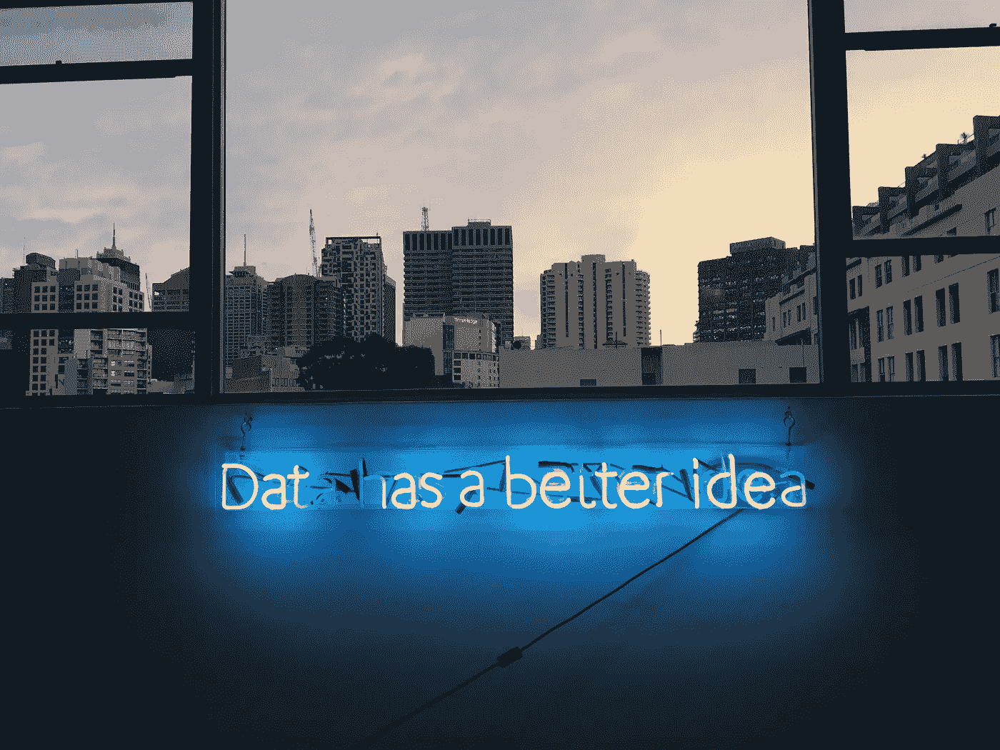

# 基于数据的日常决策:数据驱动的生活

> 原文：<https://towardsdatascience.com/daily-decisions-based-on-data-data-driven-life-566ddb381208?source=collection_archive---------15----------------------->

## 超连接最迷人的结果之一是，网络用户越来越多地基于数据做出决定，尽管这个过程被如此友好的界面所隐藏，以至于最终变得完全自然。

Photo: [Franki Chamaki](https://unsplash.com/photos/z4H9MYmWIMA)

我们日常使用的搜索引擎和社交平台的算法以我们的数据为食，并以这样一种方式返回聚合、处理和提炼的数据，即**我们不再将它们视为数据**。

从纠正我们的语法并从一亿个结果中选择十个结果的搜索引擎，到像变魔术一样出现在我们最喜欢的社交网络的时间轴中的内容，**一切都基于帮助我们做出日常决策的数据**。

专业门户网站推荐算法推荐的音乐、电影、连续剧和书籍，以及虚拟旅行指南推荐的酒店和餐馆，不仅来自我们的历史和社交图谱，还来自数千或数百万用户的数据情报。

正是**大规模收集、汇总和提炼数据的能力**，赋予了网络和智能手机给我们带来的“社交”服务永久的价值。

根据这些数据，我们每天都在为我们的生活做出决定，根据《纽约时报》杂志的说法，我们的生活已经成为“数据驱动的生活”。

虽然在企业环境中，谈论管理、决策和数据驱动的营销已经很常见，但我们仍然不太认为**个人决策过程也越来越多地受到数据的制约和丰富**，即使我们与一位聪明的演讲者“交谈”。

随着物联网扩展到智能手表和身体活动追踪器等日常设备，每个用户的个人指标都进入了海量数据的规模，这些数据的处理和可视化指导着睡眠时间、卡路里消耗、体重控制、心率和步行距离等方面的决策。

围绕我们在社交网络中所有活动的统计数据，有时到了痴迷的极端，也是我们做决定的数据。我们从*like*那里学到了，什么照片效果最好，用什么滤镜和关键词，什么时候发布…

虽然**我们将继续根据经验、推理和情感做出个人决定**，但认识到数据(伪装在友好的界面下)已经是技术促使我们与环境联系的方式的一部分是件好事。

如果通过超文本链接学习阅读和写作是生活在网络创造的世界中所需的素养，那么学习阅读、可视化和解释数据将是生活在超互联世界中的必要技能。

*Jose Luis Orihuela 是一名教授、演说家和作家，生于阿根廷，现居西班牙。他是纳瓦拉大学(潘普洛纳)通信学院的教员。26 个国家的访问学者和演讲者。作家和博客作者关注互联网对媒体、通信和文化的影响。他的最新著作有:《乳齿象手册》(2023 年)、《数字文化》(2021 年)、《互联网时代》(2015 年)、《推特世界》(2011 年)、《未来的 80 克拉维斯》(2011 年)和《博客革命》(2006 年)。从 2002 年开始在 eCuaderno(eCuaderno . com)发布，从 2007 年开始在 Twitter since)发布，从 2022 年开始在 mastosdon(mastosdon . social/@ jlo ri)发布。*