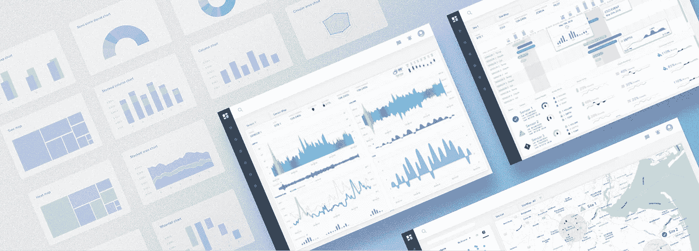
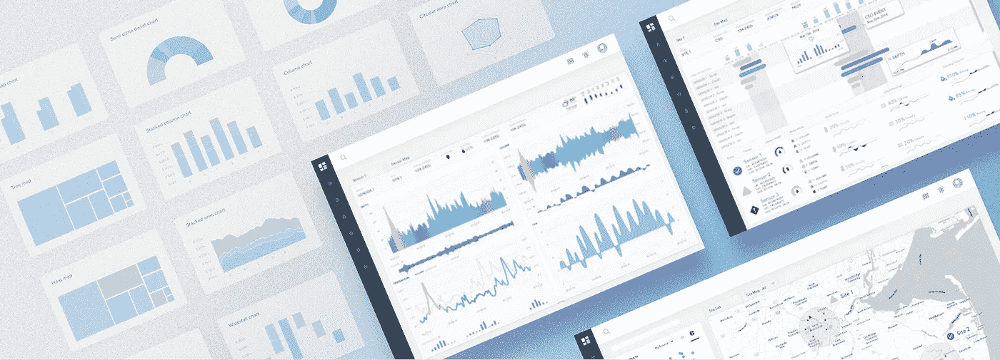
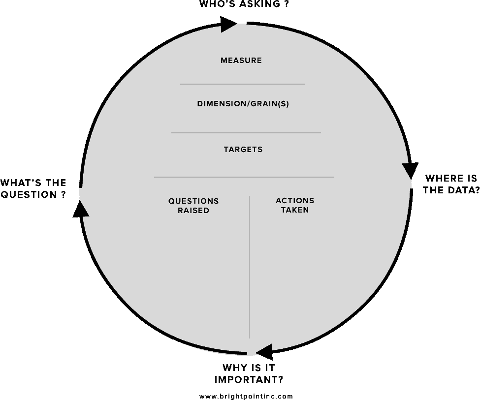

# 仪表板设计:关键绩效指标和度量标准

> 原文：<https://towardsdatascience.com/dashboard-design-key-performance-indicators-and-metrics-2b13745f5b2f?source=collection_archive---------11----------------------->

## 如何为您的仪表板选择正确的数据

设计有效的仪表板最重要的方面是确保您选择了正确的指标和 KPI 来显示。不管一个视觉设计有多棒或多聪明，如果它不能展示与受众相关的有意义的见解和数据，它最终只会是一个没人看的漂亮展示。

本文将向您展示一些行之有效的技术，这些技术将帮助您为管理层和运营层收集和定义适当的性能指标。虽然这里讨论的技术集中在仪表板设计上，但是这些相同的原则可以用于许多不同的商业智能需求收集工作。

随着各种软件产品中仪表板工具和显示的流行，人们对仪表板、指标和关键绩效指标(KPI)的组成有了不同的理解。为了确保我们说的是同一种语言，我将定义一组术语，它们将构成我们设计讨论的基础。

## 衡量标准和关键绩效指标

度量和 KPI 是许多仪表板可视化的构建块；因为它们是提醒用户相对于他们的目标他们在哪里的最有效的手段。下面的定义构成了仪表板信息设计的基本构件，它们建立在自身的基础上，因此在继续下一个定义之前，充分理解每个定义和所讨论的概念非常重要。

**Measure**:Measure 是数字上可量化的数据。销售额、利润、留存率，都是具体衡量标准的例子。

**维度**:维度表示给定度量的不同方面。例如，*时间*经常被用作分析不同度量的维度。其他一些常见的维度有*地区、产品、部门、细分市场*等。

**层次:**维度可以进一步分解为层次。例如 ***时间*** 维度也可以形成层次结构，例如*年>季>月>日*。

**粒度**:层次结构中的每一层都被称为维度的*粒度*。例如，如果您正在查看一个地理维度，那么各个颗粒(级别)可能是*区域>国家>州/省>城市>邮政编码* e

**公制:**公制是我们经常在仪表板中显示的数据类型，是一种*度量*，它表示与一个或多个特定的*尺寸*和相关的*颗粒相关的一段数据。*

> **每周总销售额**是一个指标的例子。在这种情况下，**度量**将是美元(总销售额)，而**维度**将是时间以及相关联的**谷物**(周。)

查看一个以上维度的度量，如按地域 ***和*** 时间划分的总销售额，称为多维分析。设计用于多维分析的仪表板会显著增加仪表板设计和用户体验的复杂性，因为我们使用二维表面(设备屏幕)来表示多维度。虽然有有效的布局和交互模式来处理这种类型的分析，但在设计阶段之前注意这一点很重要，因为这些类型的设计需要更复杂的方法。

**关键绩效指标(KPI)**:KPI 就是一个与目标相关的*指标*。通常，KPI 表示某个指标高于或低于预定阈值的程度。KPI 通常显示为实际与目标的比率，旨在让业务用户立即知道他们是在计划之内还是之外，而最终用户不必有意识地关注所表示的指标。

例如，我们可能会决定，为了达到季度销售目标，我们需要每周销售 10，000 美元的小部件。衡量标准是*每周小部件销售额，*目标是*10，000 美元*。如果我们使用百分比量表可视化来表示这个 KPI，并且到周三为止我们已经销售了 8000 美元的小部件，用户将立即看到他们已经完成了目标的 80%。

为 KPI 选择目标时，您需要记住，对于您想要在指标中查看的每个*颗粒*，都必须有一个目标。要有一个按日、周、月显示总销售额 KPI 的仪表板，您需要确定每种相关谷物的目标。

## 记分卡、仪表板和报表

记分卡、仪表板和报告之间的差别是细微的区别之一。这些工具中的每一个都可以结合其他工具的元素，但是在一个高层次上，它们都针对业务决策过程的不同和独立的级别。

**记分卡**:从业务决策谱的最高、最具战略性的层面开始，我们有记分卡。记分卡主要用于帮助运营执行与业务战略保持一致。记分卡的目标是通过监控现实世界的执行情况并将执行结果映射回特定的战略，使企业专注于共同的战略计划。记分卡中使用的主要衡量标准是*关键绩效指标*。这些关键绩效指标通常是衡量组织执行战略目标的能力的几个度量标准或其他 KPI 的组合。记分卡 KPI 的一个例子是一个名为“盈利销售增长”的指标，它将几个加权指标(如新客户获得量、销售量和总盈利能力)组合成一个最终得分。

**仪表板:**仪表板在业务决策过程中比记分卡低一级；因为它较少关注战略目标，而更多地与具体的运营目标联系在一起。运营目标可以直接促成一个或多个更高级别的战略目标。在仪表板中，运营目标本身的执行成为焦点，而不是更高层次的策略。仪表板的目的是以一种既直观又有见地的方式向用户提供可操作的业务信息。仪表板主要以指标和 KPI 的形式利用运营数据。

**报告:**商业中最流行的商业智能工具可能是传统的报告。报表本质上可以是非常简单和静态的，例如给定时间段的销售交易列表，也可以是更复杂的跨选项卡报表，包括嵌套分组、滚动汇总和动态钻取或链接。当用户需要以易于阅读的格式查看原始数据时，最好使用报告。当与记分卡和仪表板结合使用时，报告提供了一种巨大的方式，允许用户分析其度量和关键绩效指标背后的特定数据。

## 收集仪表板的 KPI 和指标要求:

传统的 BI 项目通常使用自下而上的方法来确定需求，重点是数据领域和数据中存在的关系。在为您的仪表板项目收集指标和 KPI 时，您将希望采用自上而下的方法。自顶向下的方法从需要首先做出的业务目标和决策开始，然后向下处理支持这些决策所需的数据。

> 为了采用自上而下的方法，您**必须**让将利用这些仪表板的实际业务用户参与进来，因为只有这些人能够确定特定业务数据与其决策过程的相关性。

当采访业务用户或利益相关者时，目标是发现引导用户做出特定决策或行动的指标和 KPI。有时用户会非常详细地了解哪些数据对他们很重要，有时他们只会有一个高层次的目标集。通过遵循下面概述的实践，您将能够将用户提供给您的信息提取到您的仪表板的一组特定的 KPI 和指标中。

## 采访商业用户:

在我们与客户直接合作并收集各种行业中执行和运营仪表板项目的需求的经验中，我们发现面试过程围绕着两个简单的问题:*“您需要回答哪些业务问题，一旦您有了这些答案，您将采取什么行动或做出什么决定？”*

> **问题 1:“你需要回答哪些商业问题？”**

这里的目的是帮助业务用户定义他们的需求，使我们能够获得他们问题背后的数据。例如，销售副总裁可能会问:*“哪些销售人员是我的首席制片人？”*或*“我们这个月的目标实现了吗？”*在“哪些销售人员是我的首席制作人”这个问题上然后，我们可能会问副总裁几个问题，问她“这个衡量标准是基于总销售额吗？您想每天、每周还是每月查看一次？”

我们希望确定构成 KPI 或指标的具体数据组件。因此，我们需要花足够的时间与用户讨论这个问题，直到我们清楚地理解将要表示的*度量*、*维度*、*粒度*和*目标*(在 KPI 的情况下)。

> **问题 2:“根据对问题 1 的回答，这会引发哪些其他问题，或者你会采取什么行动？”**

一旦我们理解了回答用户问题所需的指标或 KPI，我们就需要找出用户是否想要基于该答案执行进一步的分析，或者他们是否能够采取行动或做出决策。目标是让用户不断分解问题，直到他们有足够的信息来采取行动或做出决定。这个深入问题的过程类似于剥洋葱的皮；我们希望继续深入，直到我们到达核心，在这种情况下是用户做出决定或采取行动的能力。

作为这一由两部分组成的迭代问题流程的结果，我们将快速筛选出对用户决策过程真正关键的指标和 KPI，这些指标和 KPI 可能只是感兴趣的。这种方法与我所说的仪表板开发的“厨房水槽方法”相反，在这种方法中，产品和/或工程团队设计一个仪表板，其中包含所有可用的数据和复杂的小部件，允许用户搜索、过滤和/或钻取他们需要的数据。

在仪表板设计中采用厨房水槽的方法，往往会让你的用户不知所措，有太多的选择和认知负荷，导致仪表板无法使用。相反，提供紧密针对用户需要查看和做出决策以改善业务状况的数据将会产生一个高效且广泛使用的仪表板。

## 将所有这些放在一起 KPI 轮

为了帮助这个需求面试过程，我创建了一个简单的工具，叫做 KPI Wheel。面试过程很少是结构化的线性对话，更多时候是思想和问题的有机自由交流。KPI 轮允许我们与最终用户进行自然流畅的对话，同时让我们专注于收集具体需求的目标。

我建议把下面的图片打印在几张纸上，放在方便用户访问的地方，你可以直接在滚轮上写笔记。

You can right click on image and open in new browser window to print.

KPI Wheel 是一种工具，可用于收集定义和可视化指标或 KPI 所需的所有特定信息。我们将使用该工具收集以下信息:

1.  我们试图帮助用户回答的业务问题。
2.  这个问题适用于哪些业务用户。
3.  为什么这个问题对业务目标很重要。
4.  数据驻留在哪里来回答这个问题。
5.  此指标或 KPI 还会引发什么问题。
6.  利用这些信息可以采取什么行动或决策

## 从任何地方开始，但去任何地方

KPI 轮被设计成圆形，因为它体现了一个概念，即你可以从任何地方开始，但可以去任何地方，从而涵盖所有相关领域。在面试过程中，你需要参考转盘，以确保在讨论时，你已经填写了每个区域。随着谈话的进行，你可以在适当的部分简单地记下笔记，如果有些地方没有回答，你可以确保跟进更多的问题。这种方法背后的美妙之处在于，用户可以从非常高的层次开始“我想知道销售情况如何”，或者从非常低的层次开始“我需要看到按地区、时间和毛利润分类的产品销售情况。”在这两种情况下，您都可以从用户感觉舒适的任何点开始，然后在轮子周围移动，填充所需的细节。

> **问题 1:什么问题？**

轮盘的这个区域指的是基本的“你需要回答什么业务问题？”我们通常可以从这个问题开始访谈，或者当用户开始考虑一个特定的指标时，我们可以通过问他们“这个指标能为你回答什么业务问题？”轮盘的这一部分决定了整个指标或 KPI 的整体背景和相关性。

> **问题 2:谁在问？**

对于给定的指标，我们想知道谁将使用这些信息来制定决策和采取行动。了解组织内可能查看此指标的各种用户非常重要。我们可以记下具体的个人，也可以只是指一个有类似业务需求的普通人群。

> **问题 3:为什么它很重要？**

因为真正有效的仪表板可以成为每天都在使用的工具，所以我们希望验证所显示的每个指标和 KPI 的重要性。在这个需求收集过程中，我们经常会收集一长串潜在的度量和 KPI，在某些时候，用户将不得不选择哪些数据对他们来说是真正最重要的。我建议使用 1-10 分，并说明该指标的重要性，这样当您开始制作仪表板原型时，您就可以了解该指标的重要性。

> **问题 4:数据来源**

对于给定的指标或 KPI，我们还想确定支持数据将来自哪里。有时，为了计算一个或多个维度的指标，我们需要从几个不同的来源汇总数据。在“毛利润最高的销售产品”的情况下，我们可能需要从 CRM 系统和 ERP 系统中提取数据。在这个阶段，简单地指出保存数据的业务系统就足够了；此时没有必要深入实际的表/字段名描述。

> **上半部分:测量、尺寸和目标**

我们希望确保已经捕获了创建度量或 KPI 的三个主要属性，并让用户验证任何给定维度的粒度。如果我们无法确定指标的度量和维度，和/或 KPI 的目标，那么在设计仪表板时，我们将无法收集和可视化这些数据。

> **下半部分:提出的问题**

在 KPI 轮的这一部分，我们希望列出在我们回答了主要问题后可能会提出的任何其他问题。该列表可以作为创建后续 KPI 轮的基础，这些 KPI 轮用于定义进一步的指标和 KPI。

> **下半部分:要采取的行动**

对于任何给定的指标或 KPI，我们希望了解根据度量的状态可以做出什么类型的决策或采取什么类型的行动。通过填写此部分，我们还能够帮助验证指标的重要性，并将“必须拥有”的 KPI 与“最好拥有”的 KPI 区分开来。

## 轮子产生其他轮子

在填写 KPI 轮的过程中，通常会产生对多个 KPI 和指标的需求。这是首先进行初始分析的目的之一；让用户的所有需求浮出水面。当你在收集需求的过程中，你会发现没有正确的方法可以得到你的答案，问题会引出其他的问题，你最终会绕回来，以一种新的方式覆盖已经讨论过的领域。重要的是要有耐心，保持开放的心态，因为这是一个发现的过程。目标是具体了解如何通过使用良好的度量和 KPI 来增强用户的能力。

当您开始收集大量 KPI 轮时，您将开始看到您收集的 KPI 之间的关系。当您觉得您已经达到了一个饱和点，而您和用户都想不出任何更有意义的度量方法时，您将会想要在相互关联的上下文中检查所有 KPI 轮子。汇总 KPI 并创建逻辑分组和层次结构是一个很好的做法，这样您就可以清楚地了解各种指标之间存在的关系。一旦完成这些步骤，您将有一个坚实的基础来开始您的仪表板可视化和设计过程。

## 关于收集需求和业务用户的一句话

花费必要的时间进行正式的需求收集过程通常不被业务用户所理解，尤其是高级管理人员。这个过程有时会被视为许多不必要的繁忙工作，会打断用户已经忙碌的一天。重要的是要记住，你现在所做的关于什么数据是相关的，什么数据是不相关的决定必须在某个时候做出，唯一能够做出这个决定的人是用户自己。问题是，你是现在就花时间做出这些根本性的决定，而你只是在思考问题，还是以后在你煞费苦心地设计仪表板并围绕它们构建复杂的数据集成服务之后。

和所有的软件开发项目一样，当您经历开发周期的每个阶段时，变更的成本呈指数增长。一个很好的类比是用于房屋建筑的类比。当一面墙是图纸上的一条线时，移动它的成本是多少，而在墙上挂了一幅画后移动它的成本是多少？

## 把一切都包起来

虽然本文触及了一些可以用于收集仪表板项目需求的基本构建块，但它绝不是一个全面的方法。每个商业智能架构师在创建新的解决方案时都有一套最佳实践和设计模式。我希望我在这里提到的一些过程可以被修改，并用于补充各种利用仪表板技术的解决方案的当前最佳实践。

*如果您喜欢这篇文章，并想了解如何应用这些原则来构建数据可视化，以帮助您的产品在市场上获得更多的销量、客户参与度和吸引力，只需* [***点击此处***](http://www.brightpointinc.com/visualization-amplifier-program/?source=medium) *。*

*原载于 2019 年 7 月 22 日*[*http://www.brightpointinc.com*](http://www.brightpointinc.com/key-performance-indicators/)*。*