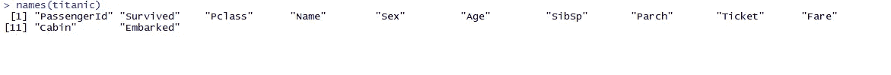

# 使用 R 进行数据分析和可视化

> 原文：<https://towardsdatascience.com/data-analysis-and-visualisations-using-r-955a7e90f7dd?source=collection_archive---------4----------------------->

## *初学者循序渐进指南*

你是从数据科学领域开始你的旅程的吗？R 需要知道怎么入门吗？你对数据可视化感兴趣吗？如果是，那么这个教程就是为你准备的！

# **概述&目的**

通过这篇文章，我们将学习如何对一个数据集进行基本的探索性分析，创建可视化并得出推论。

## **我们将要报道的内容**

1.  R 入门
2.  了解您的数据集
3.  分析和构建可视化

# **1。R** 入门

**1.1 下载并安装 R | R Studio**

r 编程提供了一组内置的库，有助于用最少的代码和灵活性构建可视化。

可以从 [R 项目网站](https://www.r-project.org/)轻松下载 R。下载时，您需要选择一个镜像。根据您的操作系统选择 R，如 Windows、Mac 或 Linux。

安装 r 非常容易。只要按照基本的安装步骤，你就可以开始了。

对于编写脚本的简单方法，我推荐使用 **R Studio** 。这是一个开源环境，以其简单和高效而闻名。

**Launch Screen after starting R Studio**

**1.2 安装 R 包**

包是由包含可复制的 R 代码的社区创建的基本单元。这些包括可重用的 R 函数、描述如何使用它们的文档和样本数据。

存储软件包的目录称为库。r 带有一套标准的软件包。其他的可以下载和安装。安装后，必须将其加载到会话中才能使用。

要在 R 中安装一个包，我们只需使用命令

> **install.packages** (“所需包的名称”)

**1.3 加载数据集**

在 R 中已经预装了一些数据集。在这里，我们将使用**泰坦尼克号**的数据集，它内置于泰坦尼克号软件包的 R 中。

在使用任何外部数据源时，我们可以使用 read 命令来加载文件(Excel、CSV、HTML 和文本文件等)。)

该数据集也可在 [Kaggle](https://www.kaggle.com/c/titanic/data) 获得。您可以下载数据集，包括训练和测试文件。在本教程中，我们将只使用训练数据集。

> titanicread . CSV(" C:/Users/Desktop/titanic . CSV "，header=TRUE，sep= "，")

上面的代码将文件 titanic.csv 读入一个数据帧 **titanic** 。Header=TRUE 时，我们指定数据包含一个标题(列名)，sep= "，"指定数据中的值用逗号分隔。

# **2。了解数据集**

我们使用了泰坦尼克号数据集，其中包含了所有登上泰坦尼克号的乘客的历史记录。以下是对数据集中 12 个变量的简要描述:

*   PassengerId:序列号
*   幸存:包含二进制值 0 & 1。乘客没有生还— 0，乘客生还— 1。
*   机票等级|一等、二等或三等机票
*   姓名——乘客的姓名
*   性别——男性或女性
*   年龄—以年为单位的年龄—整数
*   SibSp——兄弟/配偶——兄弟、姐妹和/或丈夫/妻子的数量
*   羊皮纸——父母/子女数量——母亲/父亲和/或女儿、儿子
*   票证—序列号
*   票价——乘客票价
*   客舱—客舱号
*   登船-登船港| C-瑟堡，Q-皇后镇，S-南汉普顿

## **2.1 偷看你的数据**

在我们开始处理数据集之前，让我们好好看看原始数据。

> *观(泰坦尼克号)*

这有助于我们熟悉数据集。

> **头(泰坦尼克号，n) |尾(泰坦尼克号，n)**

为了快速浏览数据，我们经常使用 head()/tail()。

**Top 10 rows of the data set.**

**Bottom 5 rows of the data set.**

如果我们没有显式地传递 n 的值，它将采用默认值 5，并显示 5 行。

**人名(泰坦尼克号)**

这有助于我们检查数据集中的所有变量。

**Familiarising with all the Variables/Column Names**

**str(泰坦尼克号)**

这有助于理解数据集的结构、每个属性的数据类型以及数据中的行数和列数。

**总结(泰坦尼克号)**

A cursory look at the data

**Summary()** 是帮助汇总数据集中每个属性的最重要的函数之一。它根据变量的类型给出了一组描述性统计数据:

*   如果是数字变量->给出平均值、中值、众数、范围和四分位数。
*   在因子变量的情况下->给出频率表。
*   在因子+数值变量的情况下->给出缺失值的数量。
*   如果是字符变量->给出长度和类。

如果我们只需要数据集中特定变量的汇总统计数据，我们可以使用

> summary(dataset name $ VariableName)-> summary(titanic $ p class)

**as.factor(数据集＄列名)**

有时候，数据集中的一些变量是因子，但可能被解释为数字。例如，Pclass(乘客类)显示值 1、2 和 3，但是，我们知道这些不能被认为是数字，因为它们只是级别。为了将这些变量视为因子而非数字，我们需要使用函数 **as.factor()** 将其明确转换为因子

# 3.分析和可视化

数据可视化是一种将数据转化为易于理解的洞察力的艺术。在本教程中，我们将分析生存模式，并检查影响相同的因素。

**思考要点**

现在我们已经了解了数据集和变量，我们需要确定感兴趣的变量。领域知识和变量之间的相关性有助于选择这些变量。为了简单起见，我们只选择了 3 个变量，即年龄、性别和阶级。

**存活率是多少？**

当谈到泰坦尼克号的数据集时，首先出现的问题是“有多少人幸存？”。让我们用一个简单的条形图来演示同样的情况。

> **ggplot(泰坦尼克号，AES(x =幸存))+ geom_bar()**

在 X 轴上我们有幸存的变量，0 代表没有幸存的乘客，1 代表幸存的乘客。Y 轴代表乘客数量。这里我们看到超过 550 名乘客没有生还，大约 340 名乘客幸存。

让我们通过检查百分比来使它更清楚

> **道具表(表(泰坦尼克$幸存))**

> 登上泰坦尼克号的乘客中只有 38.38%幸存。

**存活率基础性别**

据信，在灾害期间的救援行动中，妇女的安全是优先考虑的。那时候也发生过同样的事情吗？

> *我们看到，与男性相比，女性的存活率明显更高。女性的存活率约为 75%，而男性不到 20%。*

**存活率基础票类(Pclass)**

根据乘客乘坐的舱位等级，分为三个等级，即一等舱、二等舱和三等舱。我们看到超过 50%的乘客乘坐三等舱。

Survival Rate basis Passenger Class

> 一等舱和二等舱乘客的存活率不成比例，一等舱乘客的存活率超过 60%，二等舱乘客的存活率约为 45-50%，三等舱乘客的存活率不到 25%。

我会让你想一想……是因为对精英舱乘客的优待，还是因为距离近，因为三等舱在下层？

**存活率基础票类和性别 *(pclass)***

> 我们看到第一和第二组的雌性有很高的存活率。乘坐一等舱和二等舱旅行的女性存活率分别为 96%和 92%，男性为 37%和 16%。乘坐三等舱的男性存活率不到 15%。

到目前为止，很明显，性别和乘客级别对存活率有显著影响。现在让我们检查一下乘客年龄对存活率的影响。

**基本年龄存活率**

> 查看图表中年龄< 10 岁的部分，我们可以看到存活率很高。而且存活率很低，超过 45 岁就下降了。

在这里，我们使用的箱宽度为 5，您可以尝试不同的值，看看图形如何变化。

**存活率基础年龄、性别和船票等级**

考虑到所有这三个变量，这张图表有助于确定生存模式。

上面的 3 个部分描述了三个阶层的女性生存模式，而下面的 3 个部分代表了三个阶层的男性生存模式。在 x 轴上我们有年龄。

> 很明显，一年级和二年级学生的存活率最高。除一名女童外，乘坐一等舱和二等舱的所有儿童都幸存下来。乘坐三等舱的男性存活率最低。

我希望这篇文章对你有所帮助。不断学习，不断成长！