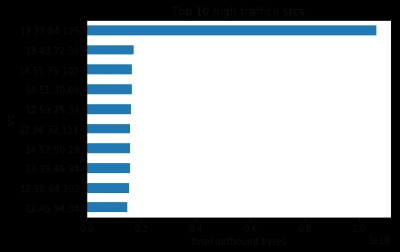

# 网络安全 101 数据分析:检测数据泄露

> 原文：<https://towardsdatascience.com/data-analysis-for-cybersecurity-101-detecting-data-exfiltration-ae887594f675?source=collection_archive---------6----------------------->

[Miguel Á. Padriñán](https://www.pexels.com/@padrinan?utm_content=attributionCopyText&utm_medium=referral&utm_source=pexels) from [Pexels](https://www.pexels.com/photo/paper-boats-on-solid-surface-194094/?utm_content=attributionCopyText&utm_medium=referral&utm_source=pexels),

## 使用网络流量数据创建基本警报来检测数据盗窃

这既是最近 [2019 趋势科技 CTF](https://ctf.trendmicro.com) 中通配符 400 挑战解决方案的演练，也是网络安全监控的一些注意事项。我建议你先试试这里的挑战。所有解决方案的实现都可以在[这个内核](https://www.kaggle.com/hawkcurry/data-analysis-for-network-security-101-solution)中找到。

# 前提

> 您是中型企业 XYZcorp 的网络安全管理员。你经常使用网络流量数据来发现异常的安全事件。该挑战提供了一些关于流的样本聚合数据，并使用异常事件的答案来构建标记。

这里的数据是合成的，不模拟典型的网络协议和行为。因此，这些挑战不需要深入了解网络协议。

# 我们要找什么？

本次挑战中的所有问题都与**后利用活动**有关，这些构成了[网络杀戮链](https://www.lockheedmartin.com/en-us/capabilities/cyber/cyber-kill-chain.html)的后半部分。

*<插入强制杀伤链图和说明>*

网络安全的现代方法并不仅仅停留在试图防止利用。利用漏洞只是攻击的第一步，最终目标通常是*数据窃取。

**勒索软件攻击等攻击除外*

## 攻击者如何从最初的立足点获取您的数据？

1.  为了获取数据，**攻击者需要破解数据**
2.  为了泄露数据，**攻击者需要到达数据** ( *横向移动*)
3.  为了横向移动，**攻击者需要与他们的立足点** ( *命令和控制)*相协调

如果我们能够在这些阶段中的任何一个阶段检测并阻止攻击者，那么我们可以认为这是一次胜利！

> “预防是理想的，但检测是必须的”——埃里克·科尔博士

当然，这是一系列更复杂事件的简化版本。如果你想在这方面了解更多，你可以浏览一下 [ATT & CK 矩阵](https://attack.mitre.org/resources/enterprise-introduction/)

# 数据泄漏

数据泄露是数据盗窃的一种奇特说法*。* **在某一点上，数据必须从您的网络内部流向攻击者手中*。**

**当然也有例外，比如数据的物理泄露*

## 公然渗透

> 我们的知识产权正大量离开这栋大楼。里面的一台机器被用来发送我们所有的小工具设计。一台主机从企业中发出的数据比其他主机多得多。它的 IP 是什么？

这里我们可以假设攻击者没有试图隐藏。他们试图传输尽可能多的数据，而不对数据传输设置限制。让我们看看出站网络流量最大的主机。

13.37.84.125 looks like a bad IP

我们将`13.37.84.125`识别为不良 IP，并观察流量出站的分布，发现这是非典型的。

13.37.84.125 is clearly an outlier

这是你能发出的最简单的警告。查看您的出站流量的每日分布，并找到一个阈值进行警告。攻击者在一个小时内将 50GB 数据上传到 Google Drive，三天后才发现数据泄露，这将是一件令人尴尬的事情。

您可能会发现正常的异常值！**成为局外人不一定等同于恶意**。您可以找到与网络其余部分相比出站流量非常大的主机，但却发现它们是正常的。

假设您的公司使用一个 *web 代理服务器，*并要求 HTTPS 流量通过该服务器进行代理。那么我们会期望这个*代理服务器*的流量比网络的其余部分大几个数量级。我们从中观察到的流量是数百个用户的 HTTPS 流量的总和。

**在这种情况下，您应该记录这些特殊的服务器，并分别进行分析。**同时，您可能还想检查那些产生或试图产生直接出站 HTTPS 流量的台式机，即使它们不消耗高带宽，因为它们应该通过代理。

## 业余活动

> *另一个攻击者计划导出我们内部 wiki 的内容。一台主机在非工作时间从企业发送的数据比其他主机多得多。它的 IP 是什么？*

通常，我们应该对工作时间和下班时间有一些概念。对于这个挑战，我们首先必须推断出营业时间

Office hours are between 16:00 to 23:00

现在我们已经确定了公司的营业时间，我们只过滤 0:00 到 16:00 之间产生的流量，并查看在非营业时间具有最多出站流量的主机。

12.55.77.96 looks suspicious

这一次，我们看到`12.55.77.96`可能是我们的坏 IP。我们查看了非工作时间总出站流量的分布，我们也看到这是一个异常值。

12.55.77.96 is an outlier

只查看非工作时间的流量很重要，因为如果只查看整体出站流量，我们可能检测不到这一点。

12.55.77.96 looks normal if we include traffic from “on” hours

很明显，我们应该分别模拟“开”和“关”的时间。这很直观，你期望在白天看到的活动类型和晚上看到的不同。这包括周末和特殊假期。

这些间歇期也是你基线的良好起点。你对你的网络的“背景辐射”有一个概念。

通常在营业时间出现的糟糕交通状况，可能会在非营业时间凸显出来。

你可能还会发现内部威胁。“*在休假、生病或在非正常时间远程访问网络*”、“*在非正常时间工作*”是内部威胁的行为指标[1]。人们对身体监视更加敏感；他们更有可能在没有人的时候尝试做坏事，而没有意识到他们的行为在网络层面是显而易见的。

> 休息时间是有价值的。如果我想识别呼叫总部、文件泄露和其他可疑活动，我喜欢在下班后观察。车流量少了，人也少了……这就是我喜欢记录一家公司自己的特殊下班时间的原因。对于某人来说，通过将所有活动保持在 9-5/M-F 来隐藏他的流量是很容易的，但是如果攻击者不知道公司给圣斯威辛放假，那么他就更有可能坚持到底。
> 
> 迈克尔·柯林斯[2]

尽管如此，如果你去打猎，你会发现这里有许多合法的(可能没有记录的)业务流程，比如那些试图在晚上卸载以在白天对业务产生最小影响的流程。例如，您可能会发现数据库团队已经安排了每周午夜 12 点将您的数据库备份到您的亚马逊 S3 存储桶。这些绝对是你应该能够察觉的事情。

## 使用通用协议的隧道

> 一些攻击者正在获取所有员工和供应商的电子邮件地址，并通过通常用于其他用途的通道发送出去。这类似于攻击者滥用 DNS 进行数据泄露。一台主机在企业的某个端口上发送的数据比其他主机多得多。它的港口是哪里？

DNS 隧道是一种用于通过 DNS 协议的功能来渗透数据的技术。如果一台主机试图通过 DNS 过滤数据，那么我们预计发送到端口 53 的请求数量会比其他只使用 DNS 解析域 IP 地址的主机多得多。因此，我们要寻找的是该特定端口的异常流量。

实际上，我们可以使用与前面部分类似的方法，查看流量的主要来源，并根据端口的单变量分布查看它们是否是异常值。然而，当您现在必须查看许多端口时，这种方法的扩展性不好。

让我们首先看几个端口，我们看到它们中的大多数是“好的”(也许太好了)，但是有不同的均值和方差。

Note that these are from synthetic data

在查看了一些分布后，它们看起来是钟形的，因此使用 Z 分数可能是合适的。然而，如果你发现分布是高度倾斜的，那么你可能想做一些变换，比如*对数变换*，使分布更像*钟形。*

对于每个端口，我们对出站流量进行标准化，并获得每个端口的最高 z 值。

Clearly port 124 has the “most outlying outlier”

并且调查 124 端口的分布，我们看到`12.30.96.87`看起来像是我们的不良 IP。

如果我们将端口 124 的总出站流量与其他端口进行比较，我们会发现，如果我们使用全局阈值，这是无法检测到的。

If looking at the long tail, then maybe

那么我们如何检测到这一点呢？与上一节相似，有一个重复出现的主题:分别对不同类型的网络活动建模。如果您可以在网络流量中识别出不同的组，那么尝试分别分析它们。如果数据是同分布的，则更容易检测出异常值。

还有，**也要考虑分析长尾。**如果您看到不常用端口的出站流量，那么您应该调查它是什么。如果合法使用，请记录下来。否则，**你一开始就不应该允许未知端口的出站连接**。

然而，对于诸如 DNS 流量之类的协议，它们是必不可少的。所以你会发现这些端口是对外开放的。类似于 *web 代理，为了让我们的生活更轻松，您应该要求所有 DNS 查询都通过内部 DNS 服务器，并阻止端口 53 上除内部 DNS 服务器之外的所有出站流量。通过来自 DNS 服务器的日志，您可以获得丰富的信息，使 DNS 隧道等检测技术变得更加容易。您不必将警报限制在频率和连接大小上，因为您可以使用唯一子域的数量或查询的唯一域的数量。*

如果你想了解更多关于 DNS 隧道的信息，你可以阅读 Akamai 的博客。另一种类似且有趣的隧道方式是通过 [ICMP](http://www.cs.uit.no/~daniels/PingTunnel/) 。

# 保护您的数据

想到**当您在出站网络流量中检测到数据泄漏时，可能已经太晚了，这有点可笑！**为了检测高出站流量，攻击者必须先窃取大量数据。

为了减轻这种情况，您必须考虑您真正关心的数据:

*   数据在哪里？
*   谁可以访问它？
*   他们如何访问它？

假设一个攻击者想要从您的 SQL 数据库中窃取 50GB 的数据。他首先必须将您的 SQL server 的表转储到他的主机，然后将这些表上传到一些外部云存储中。

如果您能够在以下任一方面发出警报，您甚至可以在攻击者泄漏数据之前就检测到他:

*   未经授权的 SQL 数据库转储
*   从 SQL server 传输的异常高的流量

例如，您查看您的 SQL server 通常会做些什么，并发现 SQL server 的大部分流量通常会与 web 应用程序服务器、一些 ETL 进程以及一些备份进程相关联。那么从 SQL server 到 SQL admin 工作站的高数据传输可能被认为是异常的。

通过一点分析，您可以集中精力于网络中的几个组件，而不是监控网络中的所有流量来寻找“任何奇怪的东西”。

将您的一些警报范围缩小到一些关键用户或系统，可以使您的模型更加高效，并且您能够检测到更微妙的高影响攻击。

# 下一个:横向运动

在下一篇博文中，我们将讨论一些关于寻找 [**横向运动的问题。**](/data-analysis-for-cyber-security-101-detecting-lateral-movement-2026216de439)

攻击者控制的初始主机可能无法访问攻击者想要的数据。然后，攻击者必须在网络中探索和导航，通过不同的主机和帐户，直到他达到最终目标。如果有合适的有利位置，这可能是我们可以探测到的

# 参考

[1] US-CERT，[对抗内部威胁](https://www.us-cert.gov/sites/default/files/publications/Combating%20the%20Insider%20Threat_0.pdf) (2014)

[2] M. Collins，通过数据分析实现网络安全(2014 年)

[3] [SEC511:持续监控和安全操作](https://www.sans.org/course/continuous-monitoring-security-operations)

**照片** : [乔希·索伦森](https://www.pexels.com/@joshsorenson?utm_content=attributionCopyText&utm_medium=referral&utm_source=pexels)来自[派克斯](https://www.pexels.com/photo/boat-deep-ocean-idyllic-leisure-570987/?utm_content=attributionCopyText&utm_medium=referral&utm_source=pexels)，[迅猎兽照片](https://www.pexels.com/@skitterphoto?utm_content=attributionCopyText&utm_medium=referral&utm_source=pexels)来自[派克斯](https://www.pexels.com/photo/sea-clouds-boat-ship-16513/?utm_content=attributionCopyText&utm_medium=referral&utm_source=pexels)