# 10.000 人工智能创业公司的数据分析

> 原文：<https://towardsdatascience.com/data-analysis-of-10-000-ai-startups-5ea7e957e90?source=collection_archive---------5----------------------->

## 从 AngelList 公司提取见解

# **简介**

AngelList 是一个将初创公司与投资者和希望在初创公司工作的求职者联系起来的地方。他们的目标是使投资过程民主化，帮助初创公司筹集资金和人才。无论是找工作、投资创业公司，甚至只是建立联系，这都是一个技术领域的每个人都应该知道的平台。自该网站于 2010 年创建以来，已有逾 400 万家公司、800 万名投资者和至少 100 万名候选人在其网站上注册。

在机器学习呈指数增长的时代，我想看看那些人工智能初创公司，并围绕它们和它们的活动领域进行探索性的数据分析。AI 领域的投资有多大？AI 创业公司如何规模化？哪些市场对他们来说最有前景？

# 数据析取

为了找到常见的相关单词，一个很好的工具是 explosion.ai 的 [SenseToVec](https://explosion.ai/demos/sense2vec) ，这是一个神经网络模型，它可以读取 2015 年发布到 Reddit 的每一条评论，并使用 [word2vec](https://en.wikipedia.org/wiki/Word2vec) 和 [spaCy](https://spacy.io/) 构建一个语义地图。您可以搜索一个单词或短语，并获得与之最相似的单词(我甚至偶尔用它来查找同义词)。所以我输入了**机器学习**，得出了这样的术语:

*   数据科学
*   自然语言处理
*   计算机视觉

还有几十个。过滤掉一些术语后，我将剩下的作为查询输入到 Angel 的搜索框中。

刮网器是用**硒**和**美汤**制成的。它创建一个驱动程序来访问 URL([https://angel.co/companies](https://angel.co/companies))，点击搜索栏并编写一个特定的查询。然后，它滚动列表中的每个公司并存储其数据。由于网站限制每次搜索 400 家公司，我选择使用过滤器并增加查询次数，以确保我得到几乎所有与每家公司相关的公司。

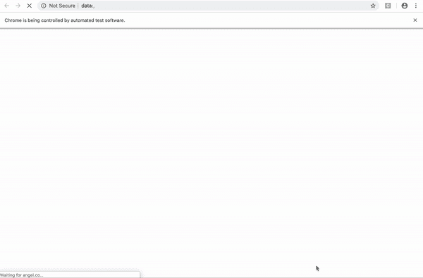

Angel Scraper

删除重复项后，结果是一个包含 10.139 个唯一数据点的 CSV 文件，包括以下特征:

*   **名称**’→公司名称
*   **加入** ' →公司加入安吉尔的日期
*   **类型**’→公司类型(初创公司、私营公司、孵化器……)
*   **地点** ' →公司所在地城市
*   **市场**’→公司的活动领域(电子商务、游戏……)
*   **推销**’→公司口号
*   **募集** ' →投资公司募集的金额
*   **科技**’→主要编程语言(Python，Javascript…)

# 数据分析

在从数据中寻找见解之前，我必须清理和预处理数据，以便对分析有用。这包括一些步骤，如格式化日期、规范化文本以及将货币字符串转换为浮点数。之后，我导入了 **Geopy** 库来从 **location** 列中提取坐标信息，这样我们以后就可以处理纬度和经度了。以下是经过处理的数据帧的示例:

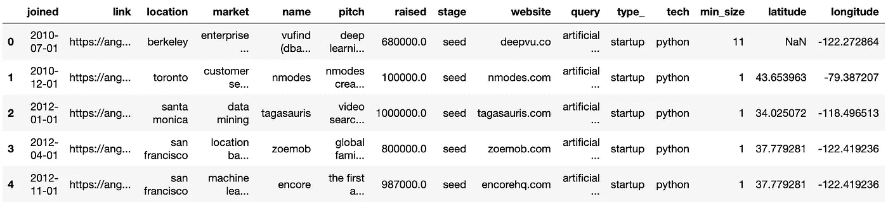

现在，我们可以用这样的数据框做很多事情。让我们从检查那些公司正在使用的编程语言开始。

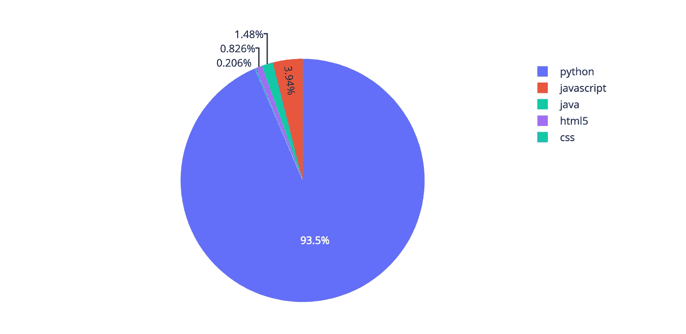

哇！这是一个巨大的差异。当谈到机器学习时，Python 是使用最多的语言之一，它看起来像是安吉尔人工智能初创公司的一个很大的最爱。请注意，根据他们的说法，我们只是在 AngelList 顶级技术中进行比较，所以其他重要的编程语言没有包括在内。

我们可以按照**加入**的日期重新排列这些数据，并检查这些技术在过去几年的发展情况:

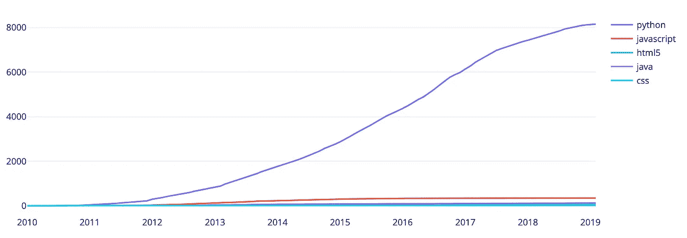

Tech growth by year

Python 确实在成长。它是一种令人惊叹的高级通用语言，拥有广泛而强大的库，可能是数据科学和机器学习领域最著名的语言。

回到我们的分析，我们来看看现在的**市频**。最常见的有哪些？

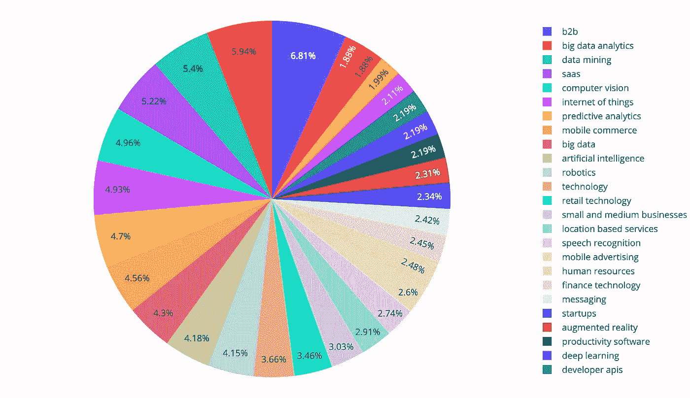

Market distribution

很好。虽然其中一些过于笼统(如 **b2b** 和 **SaaS** )，而其他一些可以归入同一类别(如**大数据分析**和**大数据**)，但我们可以对现有行业进行很好的比较。

让我们试试更有趣的东西。将我们的数据按**市场**分组，并对**增值**求和，以查看按行业划分的投资总额:

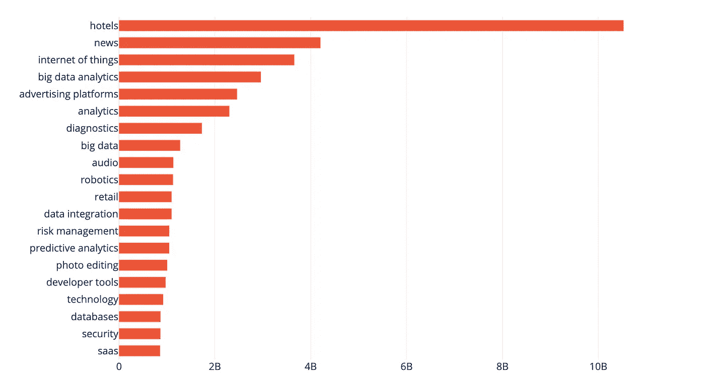

Total investment by market

这是投资最高的 20 个市场。这并不一定意味着他们拥有最多的投资公司。让我们来看看最大的公司:

> **Airbnb → 10.3 Bi(酒店)**
> 
> **网景→ 4.2 Bi(新闻)**
> 
> **Nest → 3.3 Bi(物联网)**
> 
> **Palantir → 2.1 Bi(分析)**
> 
> **Grail → 1.7 Bi(诊断)**

这解释了在酒店市场的巨大投资。一两家大公司可能在投资总额中占据太大比重。也许取每个**市场**的投资中值会给我们带来不同的结果:

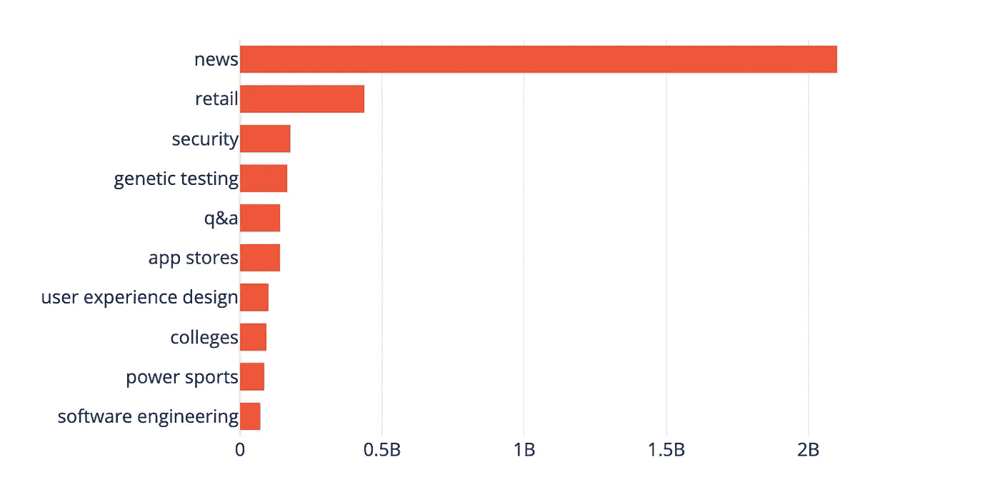

Median investment by market

这是投资中值最高的 10 个市场。酒店市场已经不复存在。尽管如此，可能还有其他方法让我们得到更有启发性的结果。

让我们用他们的**市场**来统计被投资公司的数量，而不是得出投资金额。其次，最好能在投资范围之间进行比较。例如，有多少**移动广告**公司获得了 100 万到 1000 万美元的投资？

为此，我建立了一个交互式图表，在其中你可以点击按钮进行交互(最多 100 万，从 1 到 1000 万，等等)。对于每个按钮，你会看到一个条形图，显示在这个范围内筹集了一定金额的公司数量。

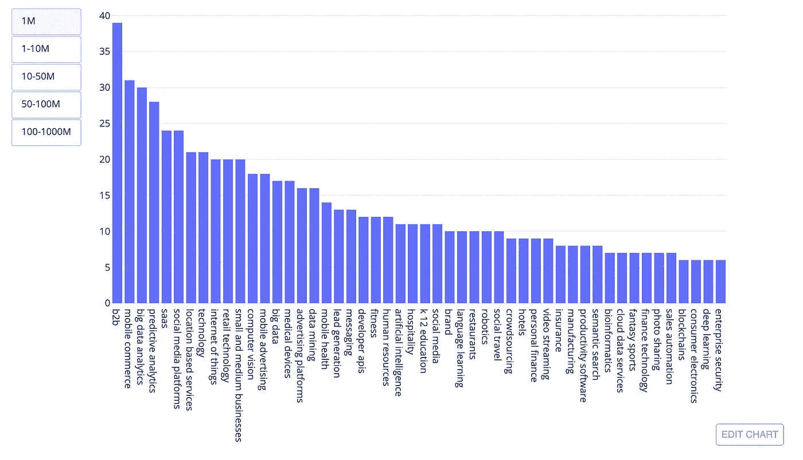

Number invested companies by market

这是一个更复杂的分析，可以让投资者和创始人更深入地了解这些市场与投资规模的关系。如果处于第一阶段(种子)，在哪些市场更容易被养起来？哪些公司成为了十亿美元的独角兽？

根据你阅读这篇文章的设备，你可能无法使用下面的图表。否则，请随意与它互动并得出自己的结论。

Interactive Chart — Number of invested companies by market

利用每个行业每年的投资金额，我们甚至可以比较一些市场自 2011 年以来的变化。

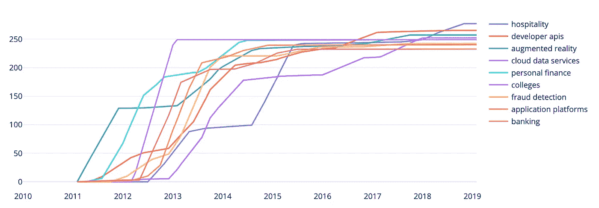

Market growth since 2011

然后我们可以按阶段查看平均投资:

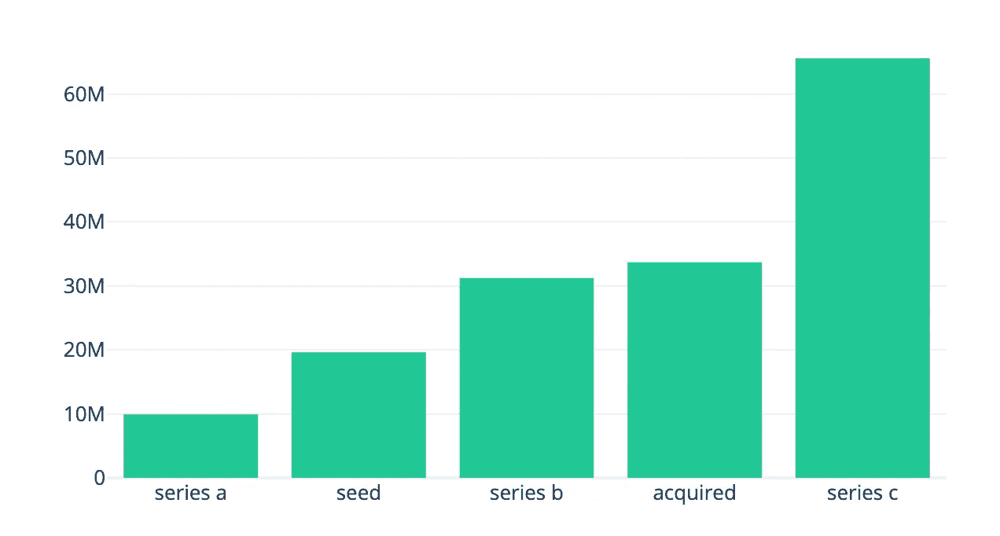

Average investment by stage

出于某种原因，**A 轮**的平均投资低于**种子**。让我们看看过去几年的投资总额(百万美元):

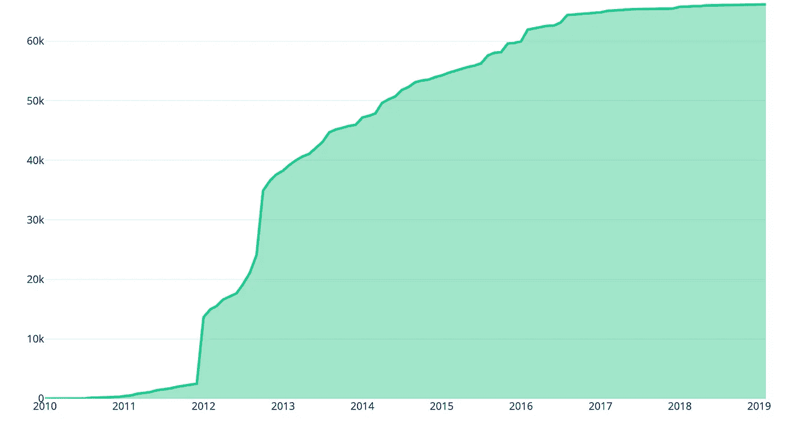

Total investments

我们清楚地看到，2012 年是 AngelList 爆发的一年，可能还有风险资本融资的增长和全球范围内越来越多的初创公司。下一张图显示了每年在网站上注册的创业公司的数量。

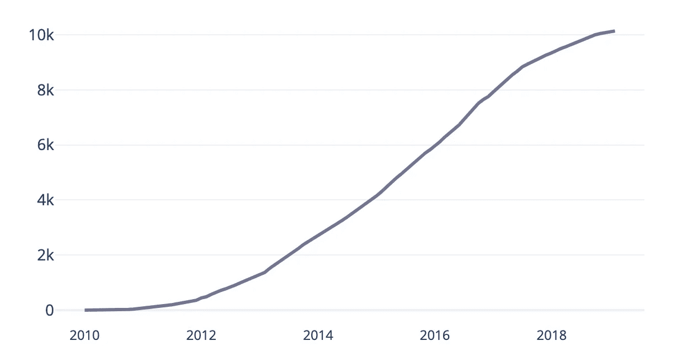

Number of startups per year

最后，我们可以使用从**位置**提取的坐标和 **Geopy** 构建一个包含这些创业公司全球分布的聚类图。结果是一个交互式地图，如下所示:

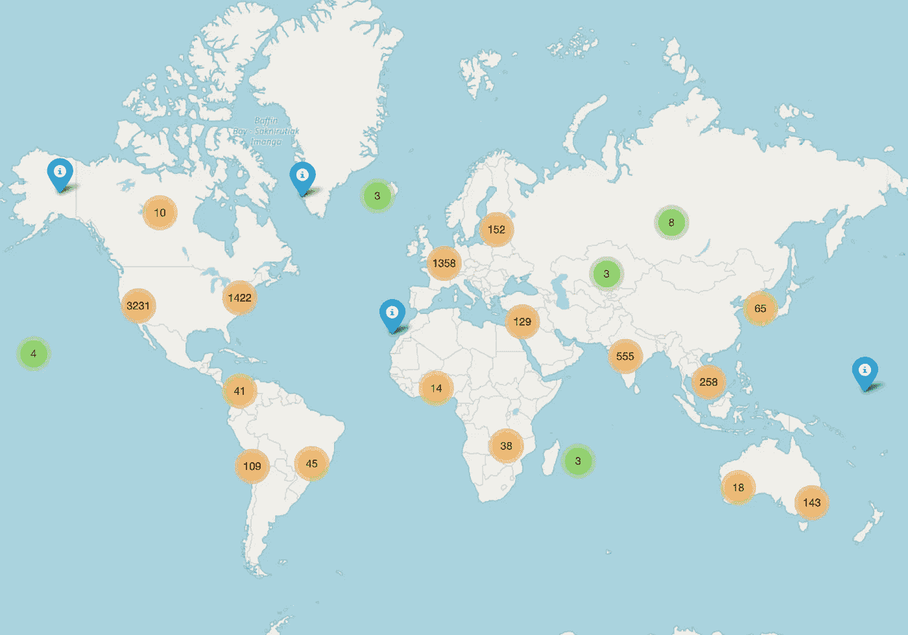

Cluster Map

这是这 10，000 家公司的位置图。即使是一个小样本，它也很好地代表了技术在国家间的分布。

为了制作它，我使用了 leav 库并将输出保存在 HTML *中。*如果你想和地图互动，就去我的 GitHub 资源库→ [点击这里](https://github.com/rodrigosnader/angel-scraper/tree/master/maps)，下载*cmap.html*，在你的电脑里打开。

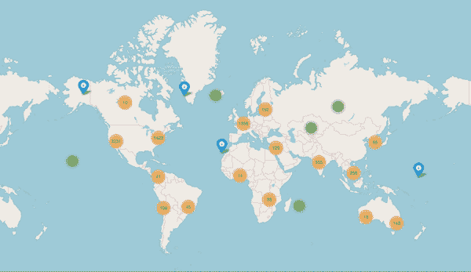

单击集群打开较小的集群，然后单击这些集群查看公司。如果你点击一家公司，你会得到他们网站的链接。

下图是按投资金额加权的热图( *hmap_weighted.html* )，或者说:AI 的钱都去哪了？

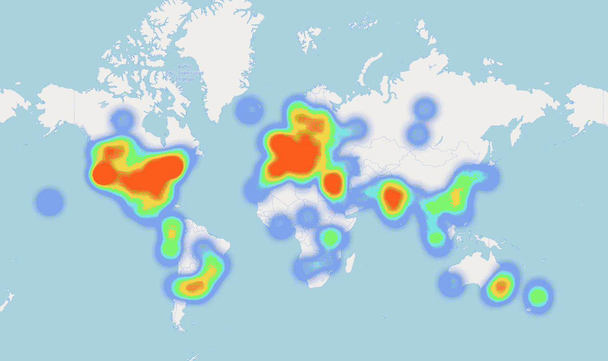

Heat Map

这还不到我们用这样的数据集所能做的一半。可以从员工数量(公司的规模)、**公司**的生命周期甚至**的广告**可以使用 NLP 进行分析。现在，让我们来看看创业口号中最常用的词。

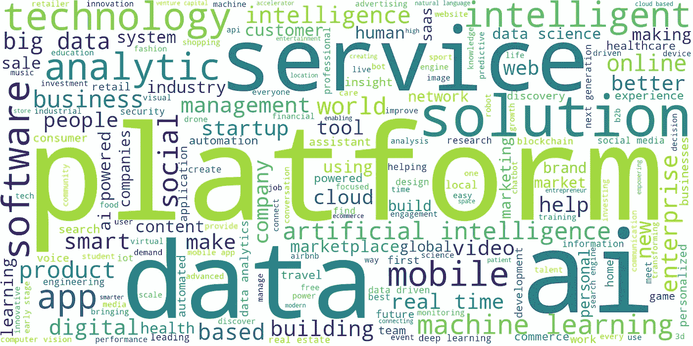

Word Cloud

你还能提取什么？创始人、联合创始人和投资者的联系信息。网络抓取是惊人的，加上数据分析和机器学习，它成为一个令人难以置信的强大工具。

如果你想访问地图、数据或笔记本，只需进入我的 GitHub 知识库→ [点击这里](https://github.com/rodrigosnader/angel-scraper)，或者在下面留下评论。随时让任何观察，关注或想法，并感谢您阅读这篇文章。