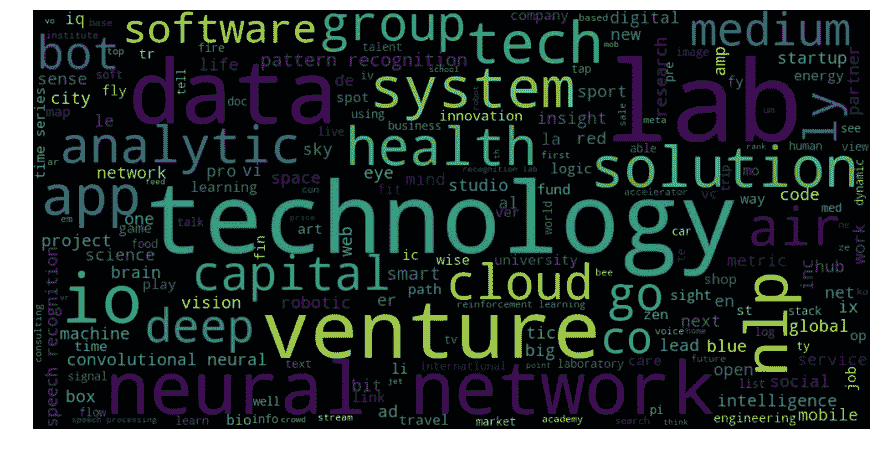

# AngelList 上人工智能创业公司名称的文本挖掘

> 原文：<https://towardsdatascience.com/data-analysis-of-most-popular-ai-startups-names-on-angellist-d645d5c51841?source=collection_archive---------21----------------------->

AngelList 是一个美国网站，面向初创公司、天使投资人和希望在初创公司工作的求职者。在本教程中，我们想看看人工智能初创公司在其名称中使用的最流行的词语。

# 步骤 1:导入数据

我们使用由 **rodrigosnader** 跳过的[数据](https://github.com/rodrigosnader/angel-scraper/blob/master/data/startups.csv)。这个数据集包括 AngelList 上人工智能初创公司的 10，151 条数据记录。

# 第二步:数据争论

我们首先需要构建我们的数据，以更好地满足我们的需求。

## 分割名称

初创公司的名称存储在`name`列中。

我们可以看到一些公司的名称是由不带空格的单词构成的(例如 MonkeyLearn、NextDeavor)，因此我们希望将这些名称拆分成单独的单词。

为此，我们可以使用我从一个 [stackoverflow](https://stackoverflow.com/questions/8870261/how-to-split-text-without-spaces-into-list-of-words) 线程中找到的 **wordninja** 包。

我们将把拆分后的名字以小写形式存储在`names`列表中。

## 词汇化

为了改进我们的分析结果，我们首先对我们的`names`列表进行术语化。

词汇化是将一个词转换成它的基本形式的过程。你可以从[这篇](https://medium.com/towards-artificial-intelligence/text-mining-in-python-steps-and-examples-78b3f8fd913b)伟大的作品中了解更多关于**文本挖掘**的过程。

用单词的基本形式更新名字列表。

## 停止言语

像`the`、`a`这样的停用词没有提供有用的意思，所以我们将把它们从列表中删除。

## 删除单个字符

同样，我们希望从列表中删除没有意义的单个字符。

# 第三步:生成单词云

## 列表中前 20 个不同的单词

现在我们已经完成了数据争论的过程，让我们来看看列表中最受欢迎的词。

我们可以看到`lab`、技术、`data`、`network`、`neural`是创业公司在名称中使用最多的词汇。

我们可以使用 WordCloud 来绘制结果，以便更好地可视化。

我们现在可以得到一个词云，即:

为了让 WordCloud 看起来更干净，我们可以自定义它的颜色主题。

我们结束了。

# 结论

所以我们可以从词云上看到，人工智能创业公司名称中使用的最有意义的**词是:**

*   实验室
*   技术
*   数据
*   网络
*   神经的
*   冒险
*   自然语言处理技术
*   超正析象管
*   技术
*   承认
*   系统
*   解决办法
*   健康
*   空气
*   分析学
*   应用
*   深的
*   云
*   组

我们可以得出这样的结论

1.  有很大一部分人工智能初创公司在**识别、系统开发、健康、空气、数据分析、云领域工作。**
2.  初创公司喜欢把他们的公司描述成一个**实验室、风险企业和团队。**
3.  **。io** 已经成为创业公司的热门域名扩展。为什么？检查这里的[和](https://www.name.com/blog/business/2013/10/why-are-startups-turning-to-io/)。

# 参考

1.  [Python 中的文本挖掘:步骤和示例](https://medium.com/towards-artificial-intelligence/text-mining-in-python-steps-and-examples-78b3f8fd913b)
2.  [天使刮刀](https://github.com/rodrigosnader/angel-scraper)
3.  [如何将不带空格的文本拆分成单词列表？](https://stackoverflow.com/questions/8870261/how-to-split-text-without-spaces-into-list-of-words)