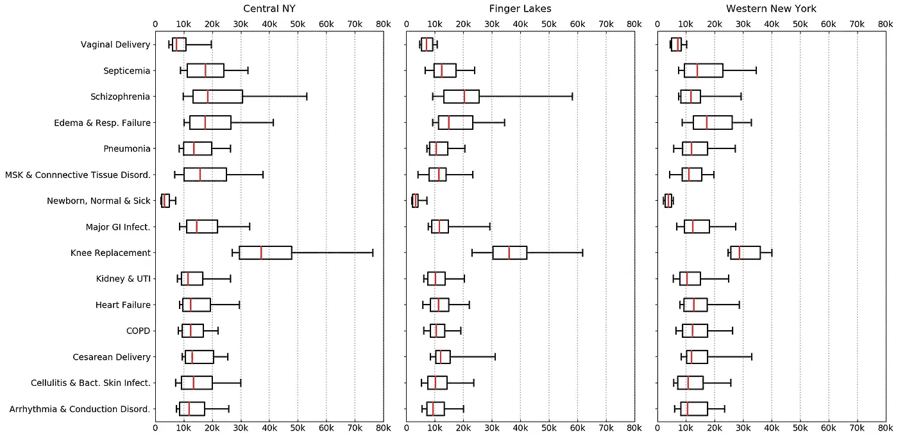
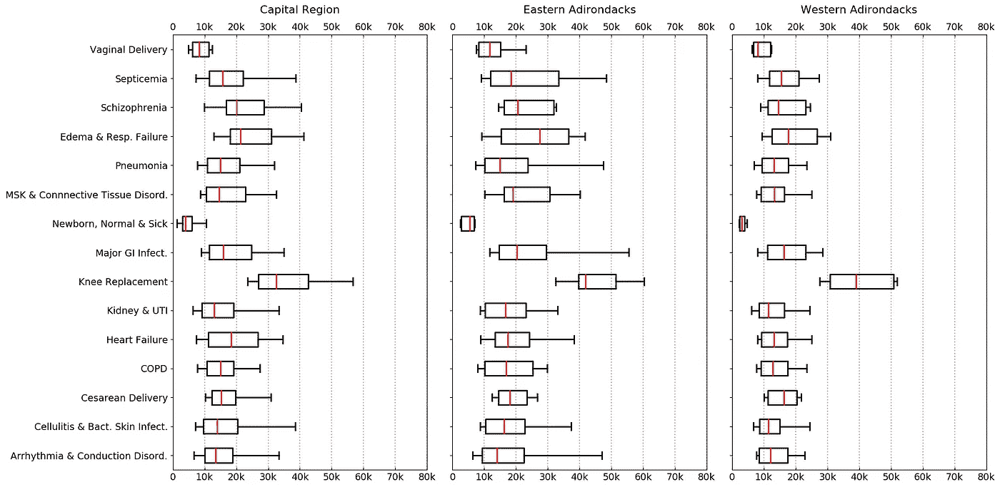
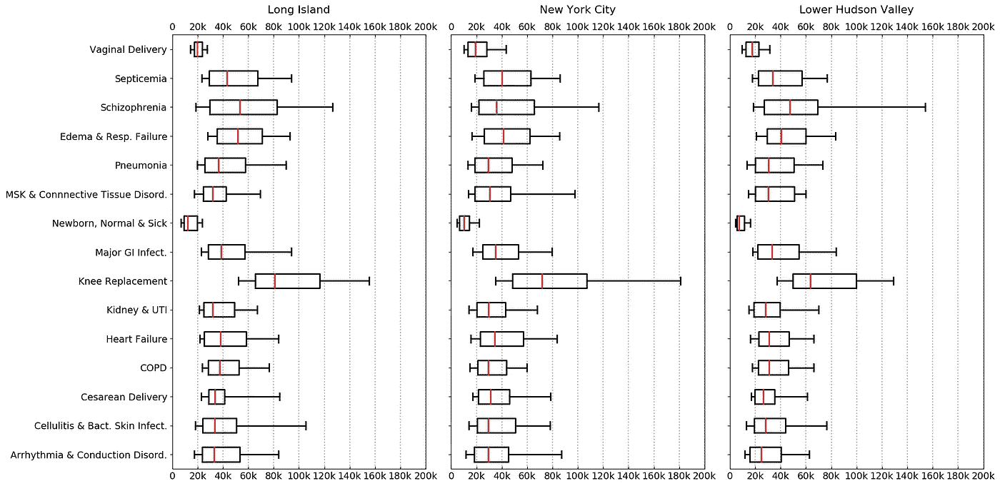
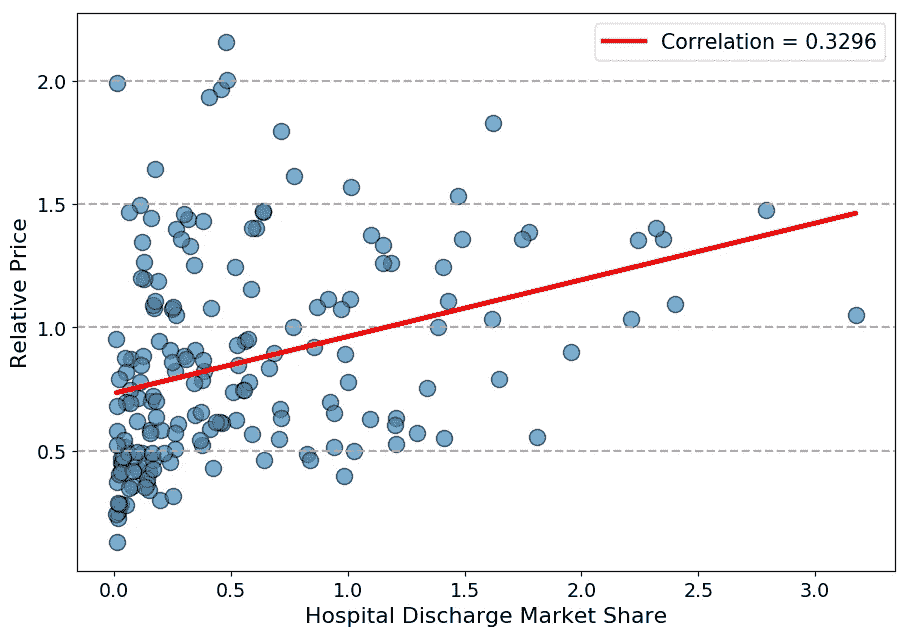
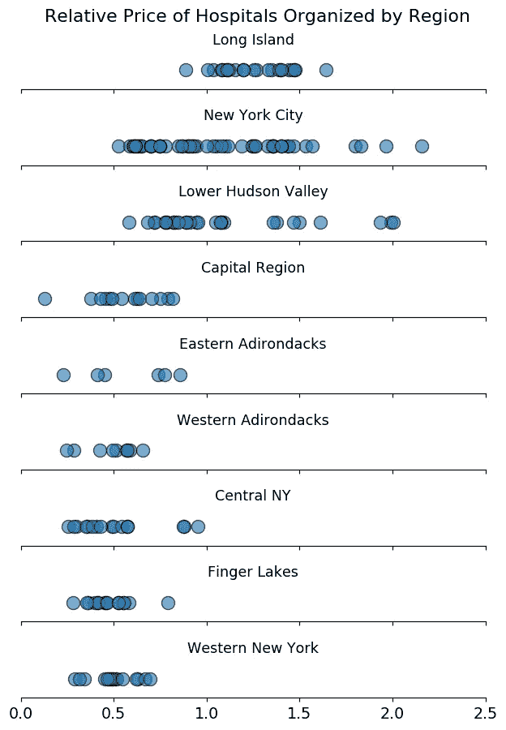
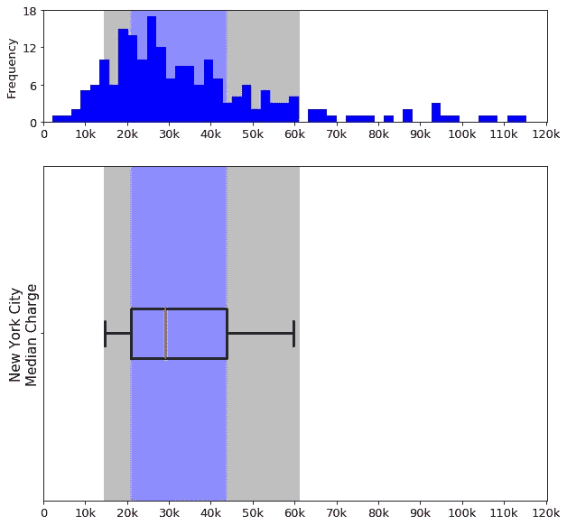

# 数据分析显示，纽约州的地区医疗费用可能相差超过 10 万美元

> 原文：<https://towardsdatascience.com/data-analysis-of-new-york-state-regional-healthcare-costs-d72fb579601f?source=collection_archive---------20----------------------->

## 根据你是住在纽约州西部、北部还是南部，医疗费用从几万美元到几十万美元不等。

Photo by [Piron Guillaume](https://unsplash.com/photos/y5hQCIn1c6o?utm_source=unsplash&utm_medium=referral&utm_content=creditCopyText) on [Unsplash](https://unsplash.com/search/photos/healthcare?utm_source=unsplash&utm_medium=referral&utm_content=creditCopyText)

对我们许多人来说，医疗费用是一个谜。没有两个病人是一样的，所以他们的账单也不会一样。了解手术的价格范围有助于消费者进行财务规划。这让他们对自己的共同保险、自付额、共付额和其他医疗保健相关费用有了更好的了解。

如果我们可以只从我们当地社区或地理区域内的医院获得医疗费用，那不是更好吗？不幸的是，这种地方一级的信息很难获得。这部分是因为包含成本信息的文档(数据库表)中可能没有适当的地理位置标签。为了使医疗保健成本与您所在地区的医院相匹配，您需要合并和组合不同来源的信息，这些信息最初并不是设计在一起的。

这正是我在这个分析中所做的。我的目标是按地理区域分离纽约州(NYS)的医疗保健成本信息，并将我的发现报告为最常见医疗条件的价格范围。

为了完成这项任务，我使用了来自 NYS 卫生部的[成本透明度数据集](https://health.data.ny.gov/Health/Hospital-Inpatient-Cost-Transparency-Beginning-200/7dtz-qxmr)，并结合了县和地区级别的地理位置信息，以进行适当的分组。我对这个数据集很熟悉，因为我曾经研究过它[之前](https://medium.com/@mramire6/healthcare-costs-in-new-york-state-b7672ade9492)我绘制了在 NYS 观察到的最常见医疗状况的患者数量、医院成本和定价加价的趋势。

通过这一分析，我发现了纽约西部、北部和南部地区内部和之间医院费用的巨大差异。价格变化可以在几千到几十，有时几十万美元的某些程序，如关节膝关节置换手术。此外，相对于该州的平均水平，纽约西部和北部地区的医院收费较低，而长岛、下哈德逊谷和纽约市的医院收费比该州的平均水平高出 50%，有时甚至高出 100%。这篇文章解释了我的发现。

## 纽约州是如何划分成区域的？

为了实现我的目标，我将地理位置信息合并到成本透明度数据集中，以便根据 NYS 的地理区域对医院进行分组。我根据环境保护部的县和地区名称将 NYS 分为 9 个地区。每家医院都根据其邮政编码被分配到所在的县。然后将每个县与其对应的地区进行匹配。这些地区是:

*   **纽约州西部**:纽约州中部，手指湖，纽约州西部
*   **纽约州北部**:首都区，东阿迪朗达克，西阿迪朗达克
*   纽约南部:纽约市长岛，下哈得孙谷

## 调查了哪些医疗条件？

最初，概要成本透明度数据库表包含 979，862 行条目，每个条目具有多条信息，其中之一是所有患者精细诊断相关组(APR DRG)分类。广义而言，APR DRG 分类是患者被标记为住院的医疗状况。[示例 APR DRG 分类](https://www.health.ny.gov/facilities/hospital/reimbursement/apr-drg/weights/2018-07-01_final_weights.htm)包括膝关节置换手术、慢性阻塞性肺病和心力衰竭等。

根据成本透明度数据集，2016 年患者因 315 种不同的 APR DRG 分类而住院。这意味着，这近 100 万个条目属于这 315 个不同类别中的一个。为了使这个分析有意义，我选择了在 NYS 最有代表性的 APR DRG 分类。因此，我选择了具有以下特征的分类:

1.  病人数量最多，因此在 NYS 接受治疗最多，
2.  在大多数医院都有发现，因此在 NYS 各地都有治疗。

最终，选择了 15 种疾病，这些疾病出现在 88%以上的医院中，总共占 2016 年住院总人数的 33%。根据他们的生理系统，他们被松散地分组，没有特定的顺序:

*   **生殖相关:** 1)阴道分娩，2)剖宫产，3)正常新生儿或有条件的新生儿
*   **呼吸系统:** 4)慢性阻塞性肺病，5)肺水肿&呼吸衰竭，6)肺炎
*   **感染:** 7) 败血症&播散性感染，8)蜂窝组织炎&其他细菌性皮肤感染
*   **肌肉骨骼:** 9) 其他肌肉骨骼系统(MSK) &结缔组织诊断，10)膝关节置换
*   **心血管:**11)**心力衰竭，12)心律失常&传导障碍**
*   **心理:**13)**精神分裂症**
*   **胃肠道:** 14) 主要胃肠道(GI) &腹膜感染
*   **肾脏:** 15) 肾脏&尿路感染(UTI)

## 我如何解读结果？

以个体价值表示的医疗成本用途有限。没有两个病人是一样的，所以他们的账单也不会一样。更确切地说，知道一个程序的潜在价格标签的范围(在这个词的口语意义上不是统计的)对我们的财务计划更有帮助。例如，知道一个程序的中值成本是 15，000 美元是有信息的。但是，如果您还知道价格标签的分布，并且中间的 50%患者的费用在 9，000 美元到 27，000 美元之间，您将对您的共同保险、自付额、共付额和其他医疗保健相关费用的金额有更好的了解。

在我的例子中，短语“中间 50%的患者”指的是医疗费用分布的中心。这被称为四分位距(IQR)。在描述性统计中，使用 IQR 是因为据说它对异常值具有稳健性，换句话说，不受异常值的影响。在医疗保健价格数据集中，异常值可以代表非常昂贵或便宜的病例。使用盒须图绘制 IQR。一个盒须图有三个组成部分:一个盒，盒内的一条线和两条须。方框代表 IQR，中间值内的线，在我的选择中，两个胡须延伸到第 10 和第 90 个百分位数。实际上，我的盒须图占据了 80%的医疗成本。最便宜的 10%案例和最贵的 10%案例被忽略。

*如果你需要一个关于解释盒须图的更详细的解释，我在这篇文章的结尾提供了一个小的部分来做进一步的说明。网上有很多资源可以更好地理解百分位数、四分位数和盒须图。* [*这里有一个*](https://www.mathsisfun.com/data/quartiles.html) *。*

现在，根据我的发现。

# 纽约南部三个地区和该州其他地区的医疗费用相差很大

## 纽约西部

Figure 1: Box and whisker plots showing the IQR, median (red line), 10th and 90th percentiles (whiskers) hospital charges for each of the 15 most common medical conditions (APR DRG classifications) of hospitals within Central NY, the Finger Lakes and Western NY.

除了几个明显的例外，纽约西部的三个地区的医疗费用大致相同。*几乎所有 15 个 4 月 DRG 分类的中位数都严格限制在 9000 美元到 17000 美元之间。三个例外是新生儿护理、阴道分娩和膝关节置换手术。医院新生儿护理费用的中位数徘徊在 3000 美元左右。阴道分娩的平均费用接近 7000 美元。由于剖腹产属于外科手术，因此其费用明显更高是有道理的，平均费用为 12，000 美元，几乎是阴道分娩费用的两倍。*

*令人惊讶的是，膝关节置换手术具有最高的中位数，最大的 IQR 和最广泛的传播，清楚地观察到胡须最长。根据我的分析，膝关节置换手术具有以下价值:*

*   ***纽约州中部** : IQR 从 29000 美元到 48000 美元不等(**)中位数为 37000 美元**)。当考虑第 10 和第 90 百分位时，医院成本分别扩展到 27，000 美元和 80，000 美元。*
*   ***手指湖:** IQR 从 30，000 美元到 42，000 美元不等(**36，000 美元中位数**)。当考虑第 10 和第 90 百分位时，医院费用分别增加到 23，000 美元和 63，000 美元。*
*   ***纽约州西部:** IQR 的房价从 26000 美元到 36000 美元不等(**中位数为 29000 美元**)。当考虑第 10 和第 90 百分位时，医院成本分别扩展到 24，000 美元和 43，000 美元。*

*为了客观地看待这个问题，膝关节置换手术 ***的中位成本高于除精神分裂症*之外的所有剩余 APR DRG 分类的第 90 百分位成本。唯一没有观察到这种趋势的地方是纽约西部。***

## *纽约北部*

**

*Figure 2: Box and whisker plots showing the IQR, median (red line), 10th and 90th percentiles (whiskers) hospital charges for each of the 15 most common medical conditions (APR DRG classifications) of hospitals within the Capital, Eastern and Western Adirondack regions.*

*在纽约州西部地区观察到的类似趋势也在纽约州北部地区观察到。 ***几乎所有 15 个被调查的 4 月 DRG 分类的中位数都在 11，000 美元到 21，000 美元之间。同样，纽约州北部医院的新生儿护理费用中位数在 3000 美元到 5000 美元之间。阴道分娩的费用中位数在 8000 美元至 12000 美元之间，而剖宫产的费用中位数在 15000 美元至 18000 美元之间。****

*与东部阿迪朗达克相比，首都区和西部阿迪朗达克的 IQR 和医疗费用差距较小。败血症、水肿和呼吸衰竭、肺炎、严重胃肠道感染都属于这种情况。例如，东阿迪朗达克地区的水肿和呼吸衰竭的 IQR 为 22，000 美元(从 15，000 美元到 37，000 美元不等；中位数为 27，000 美元)。在首都地区，IQR 为 13，000 美元(从 18，000 美元到 31，000 美元不等；中位数为 21，000 美元)，而西部阿迪朗达克地区的 IQR 为 15，000 美元(从 12，000 美元到 27，000 美元不等；中位数为 17，000 美元)。更高的 IQR 表明医疗成本更加分散。*

*在纽约州西部，膝关节置换手术的住院费用中值最高，IQR 最大，分布最广。*

*   ***首都地区** : IQR 从 27000 美元到 43000 美元不等(**中位数 33000 美元**)。当考虑第 10 和第 90 百分位时，医院费用分别增加到 22，000 美元和 59，000 美元。*
*   ***东部阿迪朗达克:** IQR 从 40000 美元到 51000 美元不等(**)中位数 42000 美元**)。当考虑第 10 和第 90 百分位时，医院费用分别增加到 32，000 美元和 60，000 美元。*
*   ***西阿迪朗达克:** IQR 从 3 万美元到 5.1 万美元不等(**中位数为 3.9 万美元**)。当考虑第 10 和第 90 百分位时，医院费用分别增加到 26，000 美元和 52，000 美元。*

## *纽约南部*

**

*Figure 3: Box and whisker plots showing the IQR, median (red line), 10th and 90th percentiles (whiskers) hospital charges for each of the 15 most common medical conditions (APR DRG classifications) of hospitals within Long Island, New York City and Lower Hudson Valley regions. Note the changes in scale and intervals for healthcare costs. The maximum value in the x-axis now reaches $200,000 and the intervals are in $20,000 increments.*

*在构成纽约州南部的三个地区，医疗保健价格处于不同的联盟。请注意这些图表和纽约州西部/北部图表在比例和间隔上的差异。纽约州西部和北部的最高费用加起来不超过 8 万美元。在纽约州南部，最高费用接近 18 万美元。为了适应这些变化，间隔现在以$20，000 而不是$10，000 的增量表示。*

*纽约南部的东西都贵得多。*

*继续我们对新生儿护理的分析，纽约州南部医院的平均成本在 7000 美元到 12000 美元之间。阴道分娩的费用中位数在 18，000 美元至 20，000 美元之间，而剖宫产的费用中位数在 26，000 美元至 34，000 美元之间。*新生儿护理和阴道分娩是纽约州南部最便宜的两项中间成本。* ***所有其他 APR DRG 分类的中值成本在 24，000 美元到 53，000 美元之间。*** 相比之下，在纽约州西部和北部，所有其他 APR DRG 分类的所有中值成本的大部分都没有超过 20，000 美元。纽约州南部的 IQR 也明显更大，最小的为 6000 美元，最大的为 59000 美元。这再次表明，中间 50%的医疗保健费用广泛分布在数万美元之间。*

*然而，最惊人的费用还是来自膝关节置换手术。在纽约州南部，费用如下:*

*   ***长岛** : IQR 从 6.5 万美元到 11.6 万美元不等(**，中位数 8 万美元**)。当考虑第 10 和第 90 百分位时，医院成本分别扩大到 52，000 美元和 156，000 美元。*
*   ***纽约州:** IQR 从 48000 美元到 107000 美元不等(**中位数为 72000 美元**)。当考虑第 10 和第 90 百分位时，医院成本分别扩大到 34，000 美元和 182，000 美元。*
*   ***下哈得孙谷:** IQR 从 5 万美元到 10 万美元不等(**中位数为 6.3 万美元**)。当考虑第 10 和第 90 百分位时，医院费用分别增加到 37，000 美元和 130，000 美元。*

*I [之前报告过](https://medium.com/@mramire6/healthcare-costs-in-new-york-state-b7672ade9492)膝关节置换手术是 APR DRG 分类中少数几个实际上在 2009 年至 2016 年间患者出院量显著增加且费用增幅最大的手术之一。*

# *哪些医院收费过高？*

*接下来，我想确定哪些医院收费比同行高，以及它们位于哪里。*

*为了比较医院，我为 NYS 的 211 家医院定义了一个新的术语叫做相对价格。医院的相对价格是通过平均所有的 DRG 收费率来计算的。APR DRG 收费比率被确定为医院为特定 APR DRG 分类收费的金额除以 NYS 所有医院的相同 APR DRG 分类的平均收费之间的比率。换句话说，APR DRG 收费比率提供了一家医院在特定条件下的收费是高于还是低于所有医院的信息。*

**医院相对价格比是一项指标，表明一家医院相对于该州所有其他医院的平均收费。**

*相对价格比< 1.0 indicates the hospital charges below the average, a relative price > 1.0 表示医院收费高于平均水平，相对收费= 1.0 表示医院收费与该州的平均水平相同。*

## *市场份额越大的医院收费越高吗？*

*我首先根据医院的出院市场份额来划分医院。他们的出院市场份额是一家医院的住院出院人数除以 NYS 的住院出院总人数。两者呈弱正相关(皮尔逊相关系数= 0.33)，表明市场份额较大的医院与高于均值的收费呈弱相关。*

**

*Figure 4: Relative Price of hospitals (each dot represents a hospital) plotted against its discharge market share.*

*没有多少医院一开始就有很高的市场份额(不出所料，因为 NYS 有 200 多家医院)。但是有许多医院的收费高于 NYS 的平均水平。这些医院的相对价格都在 1.0 以上。现在知道医院收费多了，那医院在哪里呢？*

## *在 NYS 的哪个地区有相对价格较高的医院？*

*我把所有的医院和它们的相对价格比，按它们所属的地区分开。 ***我发现*** ***纽约州北部和西部的所有医院的相对价格比< 1.0，表明他们的收费并没有高于 NYS 的平均水平。****

**

*A relative price ratio > 1 indicates a hospital charges above the median price. A relative price ratio < 1 indicates a hospital charges below the median price.*

*有趣的是，在哈德逊河谷下游和纽约市的许多医院收费也低于州平均水平。但是，哈德逊河谷下游地区确实有一些医院的收费比平均水平高出 50%(相对价格比= 1.5)，在某些情况下，收费比平均水平高出近 100%(相对价格比> 2.0)。*

*纽约市医院运行了所有的价格比率。相当一部分的相对价格比率为 1.0，有些甚至超过 2.0。*

*长岛在这方面很有意思，因为除了一家医院之外，所有医院的相对价格比率都大于 1.0。*

# *摘要*

*智能数据分析与清晰的可视化相结合，有助于更好地了解 NYS 的医疗成本。我的一些主要发现是:*

*   *住院膝关节置换手术一直是最昂贵的医疗条件治疗。长岛医院的费用最高，中位数为 8 万美元。*
*   *医疗条件不同，花费的范围也大相径庭。在一些情况下，如新生儿护理，提供者收费在几千美元之间。在其他像膝关节置换手术提供商收费范围接近 150，000 美元。*
*   *总的来说，纽约州西部医院和纽约州北部医院的医疗费用非常接近。*
*   *纽约州南部(长岛、纽约市和下哈得孙谷地区)的医院对 15 种医疗状况中的 13 种收取 24，000 美元至 53，000 美元，而纽约州西部和北部的医院不超过 21，000 美元。*
*   *医院相对价格与其出院市场份额之间存在弱正相关关系。*
*   *纽约州西部和北部所有医院的收费都低于 NYS 的平均水平。*
*   *绝大多数长岛医院的收费高于该州的平均水平。与此同时，纽约市和下哈德逊河谷地区的医院根据相对价格收取的费用低于、等于或远远高于该州的平均水平。*

*感谢阅读！*

# *代码:*

*使用 pandas、numpy 和 matplotlib 库在 Python 中进行了数据分析。代码可以在我的 github 存储库中找到。附件是我在分析中使用的数据库表。*

*代码: [Github](https://github.com/mramire6/Regional-Healthcare-Costs-New-York-State)*

1.  *[医疗机构一般信息](https://health.data.ny.gov/Health/Health-Facility-General-Information/vn5v-hh5r)*
2.  *[2009–2016 年 NYS 成本透明度](https://health.data.ny.gov/Health/Hospital-Inpatient-Cost-Transparency-Beginning-200/7dtz-qxmr)*
3.  *[NYS 邮政编码和县表](https://www.zip-codes.com/state/ny.asp)*
4.  *[NYS 县及地区](https://www.dec.ny.gov/about/50230.html)*

# *IQRs 和盒须图上的底漆*

*四分位数区域(IQR)通常显示为盒须图。网上有大量解释百分位数和盒须图的资源，但为了简单起见，我附上了我最喜欢的[之一](https://www.mathsisfun.com/data/quartiles.html)。*

*为了理解百分位数，想象一组递增的数字，并将它们分成 4 个大小相等的组。您已经将数字集合分为第 25 个百分位数、第 50 个百分位数和第 75 个百分位数。你的每一组也可以被称为*四分位数*，用于你进行的四分位数划分。正好在你的集合中间的数字叫做*中位数*。如果你想看看你的第 25 和第 75 百分位的界限*(或者第 2 和第 3 四分位)*，你会发现“中间”四分位。中间四分位数内的数字被称为*内四分位数范围(IQR)* 。实际上，IQR 告诉您关于数据集中心的信息。用来传递这些信息的图表被称为盒须图。*

**

*Example box and whisker plot showing the IQR, median, 10th and 90th percentiles labelled. A histogram of the data is charted above it, with shaded regions highlighting the IQR in blue, the 10th to 25th percentile and 75th to 90th percentile. Clearly, some data points are excluded from the box and whisker plot.*

*盒须图——顾名思义——有盒须。这个盒子代表我们上面讨论过的 IQR。触须通常延伸到数据的最小值和最大值(有效地显示数据集的范围)。然而，在我的分析中，我将胡须定义为延伸到第 10 和第 90 个百分点，因为我想避免离群值。*

*左边是直方图下面的方框和须状图。直方图绘制了本例 APR DRG 分类的医疗保健成本的整体分布。请注意直方图中蓝色阴影区域是如何拥有数据集的最高计数(高频)的。如果您将阴影区域从直方图扩展到一个方框和须状图，它将突出显示方框。IQR 的大小会缩小(或拉长)盒子的大小。盒子里面是一条红线，它是中间值，分布的中心点。*

*在这个例子中，左边的胡须延伸到第 10 个百分位数，而右边的延伸到第 90 个百分位数，每个都用灰色阴影表示。注意直方图中有多少数据点没有被灰色阴影区域覆盖。它们位于第 10 个和第 90 个百分位数之外，没有被盒须图和须图捕获。通过将胡须限制在第 10 和第 90 个百分位数，该信息被忽略。*

*我使用盒须图来绘制医疗价格的目的是传达大多数人将会陷入的价格范围。那些极其昂贵的案例位于分布的尾端(注意它们在直方图上的频率计数是 1)，而不是常态。报道它们会分散我想传达的主要信息。*