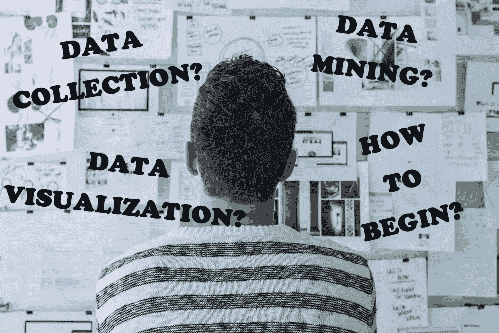
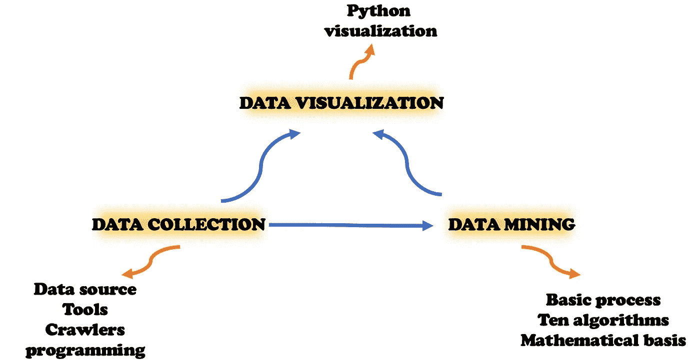
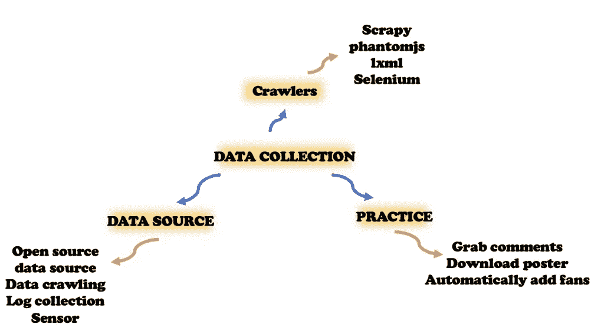
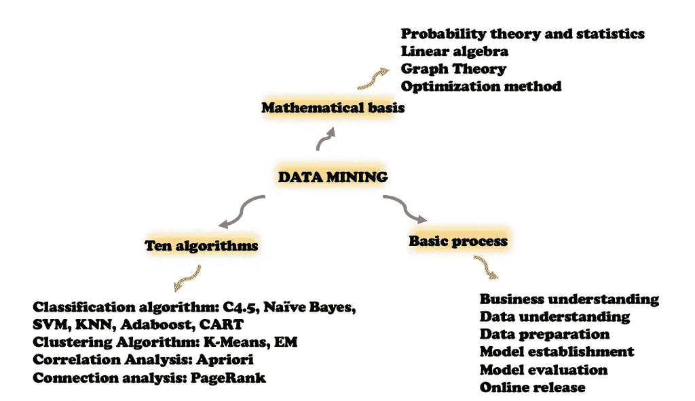
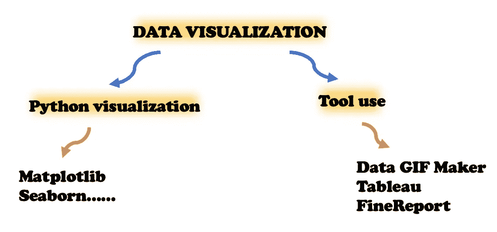

# 数据分析实践指南:如何开始？

> 原文：<https://towardsdatascience.com/data-analysis-practice-guide-how-to-begin-c5e4c3bc46ed?source=collection_archive---------17----------------------->

很多初学者对如何学习数据分析很迷茫。今天我就来介绍一下[数据分析](/top-6-data-analytics-tools-in-2019-4df815ebf82c)的全过程，来解答大家的疑惑，开拓思路。

相信你已经知道数据分析在现代社会的重要性。掌握了数据，就掌握了规律。当你了解了市场数据，并对其进行分析，你就能得到市场规律。当你掌握了产品本身的数据，分析它，你就可以了解产品的用户来源，用户画像等等。数据分析如此重要，既是新时代的“数据结构+算法”，也是企业争夺人才的高地。

# 1.数据分析的流程是怎样的？

数据分析主要分为三步。

*   **数据收集**

那就是拿原材料，没有数据我们无法分析。

*   **数据挖掘**

数据挖掘是整个商业的价值。数据挖掘的核心是挖掘数据的商业价值，也就是我们所说的商业智能。

*   **数据可视化**

简单来说，让我们直观的了解数据分析的结果。

这样说话可能太简单了，我来详细给你介绍一下这三个步骤。

## 1.1 数据收集

在数据收集部分，您通常使用不同的数据源，然后使用工具来收集它们。

在网上，你可以收集各种各样的数据集。还有很多工具可以帮你自动抓取数据。当然，如果你写一个 Python 爬虫，效率会更高。掌握 Python 爬虫的乐趣是无穷的。它不仅可以让你在社交媒体上获得热评，自动下载带有关键词的海报，还可以自动为你的账户添加粉丝，给你自动化的快感。

## 1.2 数据挖掘

第二部分是数据挖掘，可以比作整个数据分析过程的“算法”部分。首先你需要知道它的基本流程，十大算法，以及背后的数学基础。在这一部分，我们会接触到一些概念，如关联分析、Adaboost 算法等。

掌握数据挖掘就像拿着一个水晶球。它用历史数据告诉你未来会发生什么。当然它也会向你展示高可靠性。

## 1.3 数据可视化

第三是[数据可视化](http://www.finereport.com/en/features/data-visualization?utm_source=medium&utm_medium=media&utm_campaign=blog&utm_term=Data%20Analysis%20Practice%20Guide%3A%20How%20to%C2%A0Begin%3F)，这是我们特别感兴趣的非常重要的一步。数据通常是隐式的，尤其是当数据很大时，可视化是理解数据结构和结果表示的好方法。我们如何将数据可视化？有两种方法。

首先是用 Python。在 Python 中清理和挖掘数据的过程中，可以使用 Matplotlib、Seaborn 等第三方库进行渲染。

二是使用第三方工具。如果已经生成了 csv 格式文件，想用所见即所得的方式渲染，可以使用 Data GIF Maker、 [Tableau](https://www.tableau.com/) 、 [FineReport](http://www.finereport.com/en/?utm_source=medium&utm_medium=media&utm_campaign=blog&utm_term=Data%20Analysis%20Practice%20Guide%3A%20How%20to%C2%A0Begin%3F) 等第三方工具。，可以轻松处理数据，帮你做演示。更多关于 aout 数据可视化工具的信息，可以阅读本文[***2019***](/9-data-visualization-tools-that-you-cannot-miss-in-2019-3ff23222a927)你不能错过的 9 款数据可视化工具。

当然这些理论都比较抽象，所以我觉得学习数据分析最好的方法就是在工具中使用，在项目中加深理解。

# 2.实践指南

刚才我们讲了数据分析全景，包括数据采集、数据挖掘、数据可视化。你可能觉得有很多东西，无从下手，或者觉得数据挖掘涉及很多算法，有些很难掌握。其实这些都是不必要的麻烦。

这里介绍一下 **MAS(多维，问，分享)学习法**。用这种方法，学习数据分析就是一个从“思考”到“工具”再到“实践”的过程**。**

**今天我将从更多的角度与大家分享我的学习经验。我们可以
把今天的内容称为“实践指南”。我们把知识变成我们自己的语言，它就真的变成了我们自己的东西。这个转化的过程就是认识的过程。**

**那么如何提高自己的学习能力呢？简单来说，就是“知行合一”。**

**如果说认知是大脑，工具就像我们的手，数据工程师和算法科学家每天都和工具打交道。如果你开始做数据分析项目，脑子里已经想好了数据挖掘的算法模型，请牢记以下两条原则。**

## **2.1 不要重复生产车轮**

**我见过很多有数据收集需求的公司。他们认为一些工具不能满足他们的个人需求，所以他们决定招募人员来做这项工作。发生了什么事？经过一年多的实践，他们投入了大量的资金，发现了大量的 bug，最终选择了第三方工具。这时候，其实有了及时评估的需要，就可以及时挽回损失。比如 [**数据上报**](http://www.finereport.com/en/reporting-tools/data-reporting.html?utm_source=medium&utm_medium=media&utm_campaign=blog&utm_term=Data%20Analysis%20Practice%20Guide%3A%20How%20to%C2%A0Begin%3F) 像 [**FineReport**](http://www.finereport.com/en/?utm_source=medium&utm_medium=media&utm_campaign=blog&utm_term=Data%20Analysis%20Practice%20Guide%3A%20How%20to%C2%A0Begin%3F) 这样的工具可以为各种行业提供解决方案。这也有助于你的需求评估。**

## ****2.2 工具决定效率****

**“不要重复生产轮子”的意思是你首先需要找到一个可以使用的轮子，这是一个工具。那么我们该如何选择呢？**

**这取决于你要做的工作。工具没有好坏，只有适合不适合。除了研究型的工作，大多数情况下，工程师会选择最用户友好的工具。比如 Python 有很多处理数据挖掘的第三方库。这些库有大量的用户和帮助文件来帮助您入门。**

**如果你在寻找合适的数据分析工具，可以参考本文[***2019 年 6 大数据分析工具***](/top-6-data-analytics-tools-in-2019-4df815ebf82c) 。**

**选好工具后，你要做的就是积累“资产”。很多知识点很难记住，也无法按照工具的指示去做，但通常能记住的是故事，做过的项目，做过的题。这些课题和项目是你的第一批“资产”。**

**我们如何快速积累这些“资产”？答案是熟练度。解决问题只是第一步。关键是训练我们工具使用的“熟练程度”。随着熟练度的提高，你的思维认知模式也在逐渐完善，效率自然会提高。**

# **结论**

**认知三部曲，从认知到工具再到实战，是我最想和大家分享的学习建议。而且希望这篇文章对你有帮助！**

# **您可能也会对…感兴趣**

**[*新手如何打造一个很棒的仪表盘？*](/how-can-beginners-create-a-great-dashboard-cf48c0f68cd5)**

**[*开始数据分析师生涯需要学习哪些数据分析工具？*](/what-data-analysis-tools-should-i-learn-to-start-a-career-as-a-data-analyst-af650b54c9e9)**

**[*数据分析工具对比:Excel、R、Python、BI 工具*](/comparison-of-data-analysis-tools-excel-r-python-and-bi-tools-6c4685a8ea6f)**

**[*用数据分析做出成功营销决策的 6 个步骤*](/6-steps-to-make-successful-marketing-decisions-with-data-analysis-aef4905665ed)**

**[*数据分析师需要掌握的 6 项关键技能*](/6-key-skills-that-data-analysts-need-to-master-df1d82257b9)**

**[*我们如何捕捉动态数据并将其可视化？*](/how-can-we-capture-dynamic-data-and-visualize-it-6f27f265db0a)**

**[*自动化数据提取的四种基本方式*](/four-basic-ways-to-automate-data-extraction-3151064dc110)**