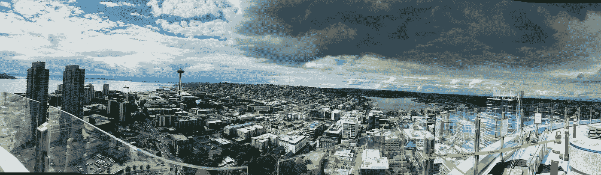
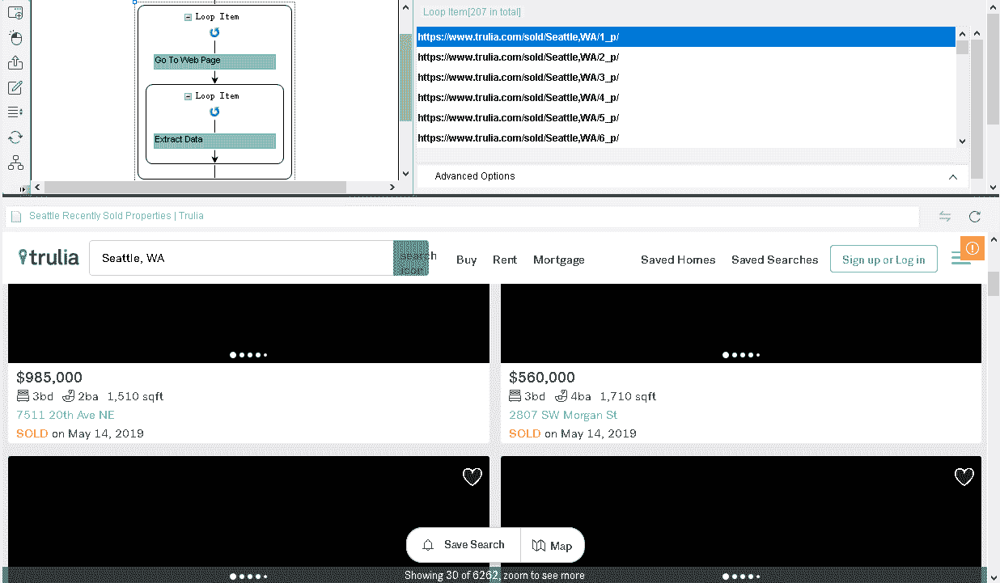
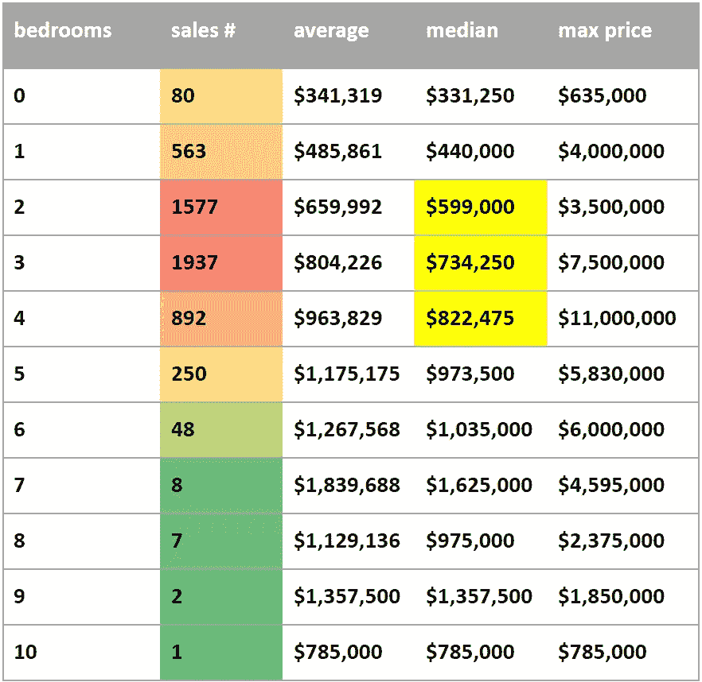
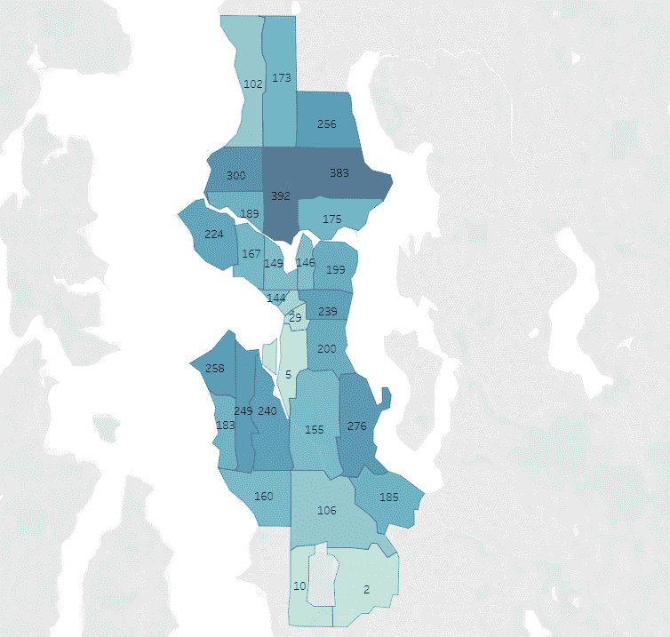
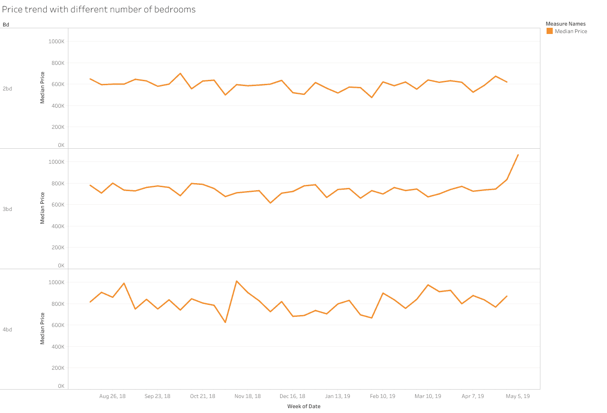
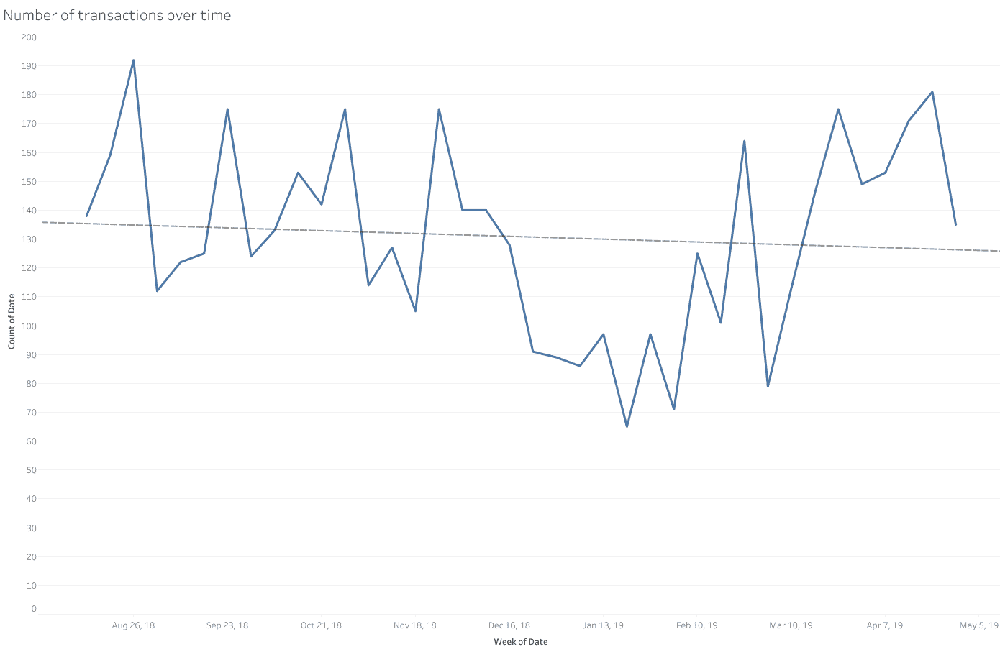

# 数据分析:使用 Python 预测住房市场

> 原文：<https://towardsdatascience.com/data-analysis-predicting-the-housing-market-using-python-eae4f9fbd4e5?source=collection_archive---------8----------------------->

Overlook of Seattle from the top floor of an apartment near Westlake. Photographed by W. Weldon.

自 2008 年房地产泡沫破裂以来，我们进入了衰退，并在 2012 年跌至谷底。房地产市场再次上涨，价格已经超过了 2008 年的峰值。多年来，西雅图的住房市场一直以 85%的年增长率名列增长最快城市的前 3 名。

随着房价推向另一个新的高峰。我对负担能力表示同情，因为在过去的 9 年里，我在西雅图搬了 10 次家，因为房价也会直接影响租赁市场。每个人都想住在一个舒适的地方，尤其是有孩子的家庭。然而，一旦你买了房子，你就有了另一个需要担心的问题。

当抵押贷款还清后，拥有一套房子可能会成为你最大的资产。当房子的价格波动时，因为房子像股票和债券一样是一种投资，它会让人们害怕，因为房子的价值可能会低于抵押贷款余额。在一个完美的风暴场景中，你失去了工作，拖欠月供，你可能会失去房子和欠银行的钱。(他们以低于抵押贷款余额的价格拍卖你的房子。你拥有的钱=抵押贷款余额-出售价格。作为一个被动和脆弱的房主，你怎么能意识到下一场风暴呢？我将分析过去两年的一些房屋销售记录，并告诉你房屋市场的情况。

你买得起房子吗？

使用 [**Octoparse**](https://www.octoparse.com/) ，我在 2018 年和 2019 年刮出了大约 6000 套出售的房屋，数据包括卧室数量、出售价格和邮政编码。以下是步骤:

A.搜集数据

**第一步:**从 [Trulia](https://www.trulia.com/) 中抓取一个 URL 列表。
**第二步:**将列表加载到 Octoparse 中。
**第三步:**从 Octoparse 中选择提取的数据字段。
**第四步:**保存并运行提取。
**第五步:**导出 CSV。
(他们的博客里有更多循序渐进的教程。)

B.使用 Python 分析数据[4]

**步骤 1:** 读取 CSV 文件，将每一行按照售价、卧室数量、平方英尺和出售日期进行分割。
**第二步:**将所有数据存储在元组列表中，列表中的每一项都是标有 price、bd、sqft、date 的值。
**第三步:**我展示的是 2018 年和 2019 年到今天，西雅图一共卖出了 5365 套房子。
**第四步:**找出 2018 年和 2019 年(到今天)卖出了多少套房子。这表明

> 2019 年销售的房屋:2309
> 2018 年销售的房屋:3056

**第五步:**按卧室数量筛选已售房屋。我想看看卧室数量的价格。特别是，不同数量的卧室的平均价格、中间价格和最高价格是多少？这里有一张数据表格。

Home sales in the second half of 2018 and the first half of 2019 by bedroom size

**已售房屋告诉我们什么？**

我使用 Python 来计算卧室的数量和销售价格，以便观察数量和价格之间的关系。我想出了三个卖出价格的数字:平均值、中间值和最高值。

三居室的房子是销售中最受欢迎的，售出了 1937 套。虽然三居室房屋的中值价格为 734，000 美元，但平均值略高于中值，这意味着更多三居室房屋的售价更高(意味着它们更难以承受)。)第二受欢迎的住宅类型是两居室住宅，售出 1577 套，中位数价格为 60 万美元。接下来是 4 居室房屋，售出 892 套，中值价格为 823，000 美元。

Home sales by ZIP codes

**这些地区的家庭收入情况如何？**

在 2018 年和 2019 年(截至今天)，西雅图约有 6000 套出售的房屋。当数据通过邮政编码可视化时，我们可以看到 98103 和 98115 销售的房屋最多，分别为 392 和 383 套。它和那个地区的家庭收入有什么关系？由于这些地区靠近谷歌、亚马逊、Adobe campus 等科技巨头的所在地，但不像市中心那样昂贵，高收入和每天通勤的人需要喜欢住在市中心以北，以便方便地到达 I-5 高速公路。

拥有一套价格在中位数的三居室意味着什么？

我们来分解一下数字。有 36%的售出房屋属于 73.4 万美元的中等类别。这意味着，在 2018 年和 2019 年，大多数房主都可以负担得起 73.4 万美元的中位价格。我计算抵押贷款，看看你到底需要赚多少钱才能买得起中等价位的房子。它如下:

尽管每月都有债务，你希望快乐地生活在 36%的债务收入比中，但你的家庭每年需要赚 190，000 美元才能买得起一套售价 734，000 美元的三居室房屋。你击败了多少收入 19 万美元的人？根据 Pew Research[1]的调查，你属于前 25%的人群，这意味着你在大西雅图地区属于高收入阶层。报告还称，底层 90%的人拥有的收入缩水了 12.8%，而顶层 10%的人拥有美国全部收入的 50%。

Home price over time by the number of bedrooms

**思想？**

从一年前开始，西雅图的房地产市场在价格上相当平稳。对于那些提前买房的人来说，他们的房子正在升值。相比之下，一年内刚买了房子的人，很难说价格何时会再次北上。虽然每周的销售数量略有下降，但看看 2、3、4 居室房屋的中位价格以及你需要多少钱才能买得起一套房子，中产阶级在大都市地区开始节节败退就不足为奇了。收入的增长赶不上房价的上涨。我没有看到蓬勃发展的繁荣，但富人和其他人之间的差距越来越大。我们一直在努力让社会变得平等和文明。然而，从尼克松的禁毒战争，约翰逊的犯罪战争，到特朗普的移民战争，我仍然没有看到美国梦的自由和更大的好处。相反，这些年来，我只看到人们失去了工作和家园。

[1][https://www . pewresearch . org/fact-tank/2018/09/06/are-you-in-the-American-middle-class/](https://www.pewresearch.org/fact-tank/2018/09/06/are-you-in-the-american-middle-class/)

[2][https://www . pewresearch . org/fact-tank/2018/09/06/the-American-middle-class-is-stable-in-size-but-losing-ground-financial-to-upper-income-families/](https://www.pewresearch.org/fact-tank/2018/09/06/the-american-middle-class-is-stable-in-size-but-losing-ground-financially-to-upper-income-families/)

[3][https://www . daily mail . co . uk/news/article-6744515/中产阶级-穷人-美国人-continue-lose-ground-rich-income-wealth-measures . html](https://www.dailymail.co.uk/news/article-6744515/Middle-class-poor-Americans-continue-lose-ground-richest-rich-income-wealth-measures.html)

[4]