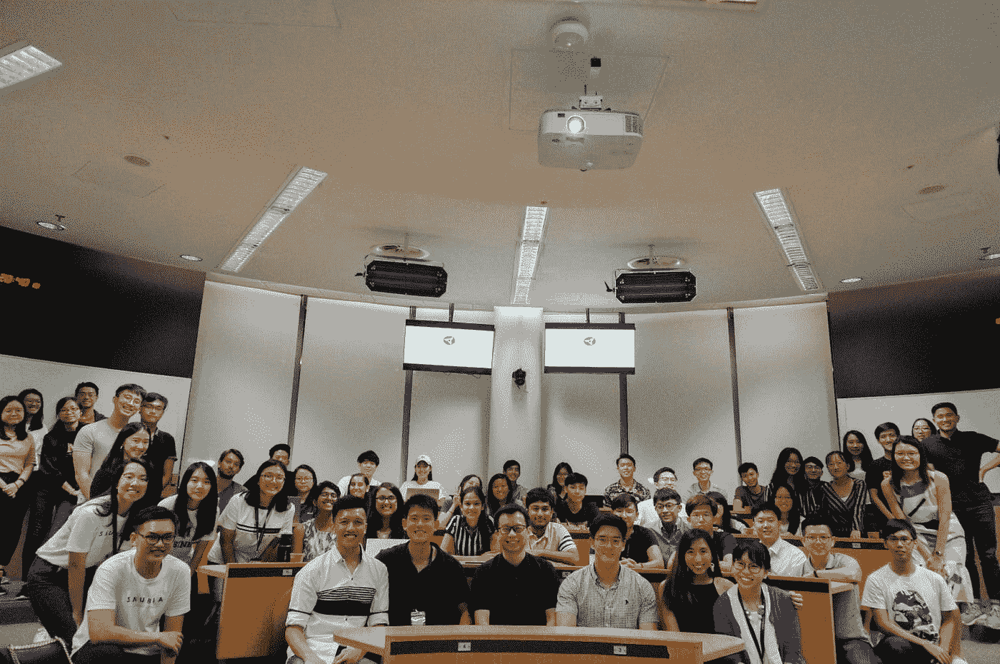
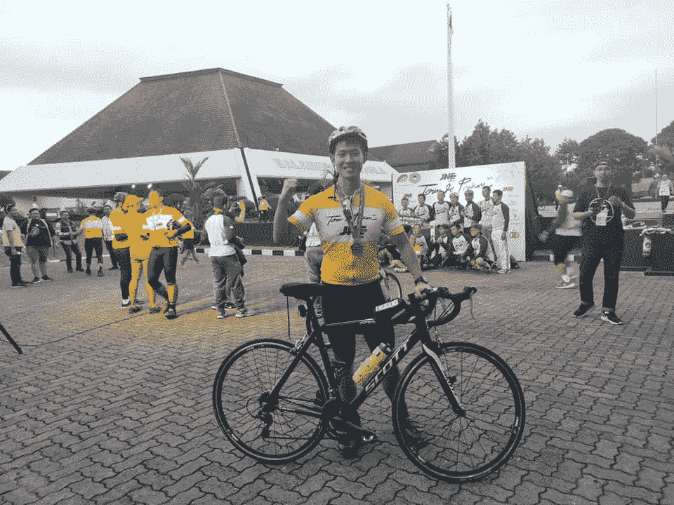

# 数据分析很难…以下是你如何超越的方法

> 原文：<https://towardsdatascience.com/data-analytics-is-hard-here-how-you-can-excel-aa2a99d0fad0?source=collection_archive---------1----------------------->

## 我在 Google、Visa 和 Lazada 担任数据分析师/工程师 3 年来学到了什么

Upskill yourself ([source](https://unsplash.com/photos/6jYoil2GhVk))

我真的很喜欢从事数据工作。从大二开始，我就已经知道，我要把技术作为解决现实商业问题的一种方式。这给了我工作的意义，我希望这对你也一样。

每天我都会挤出每一点时间来阅读和学习。我会报名参加本地数据黑客马拉松，组织与分析相关的活动，向行业领袖学习。我在会议和大学活动中发言，指导我的后辈如何在大型科技公司中成为一名成功的数据分析师。我把自己想象成一名学生，去影响尽可能多的低年级学生，让他们学习并回馈社区。

如果你说这个最终目标听起来太高尚，你是对的！

事实上，作为一名基督徒，我懂得了时间是宝贵的，地球母亲是我们暂时居住的终点站。世界上没有什么是永恒的，包括时间。因此，我们需要创造和传递尽可能多的价值，为与上帝同在的永生做准备。对我来说，我的宗教和数据职业给了我超越、学习和贡献的意义。

在我获准进入谷歌担任数据分析师以开发更好的 ML 模型来打击滥用后，我收到了许多分享我的人生旅程和建议的请求，供我的下级思考。因此，我真的希望这个博客能够满足你的需求，给你一个成功的数据专家的起点。

# **我给有抱负的数据专业人士的最大建议**

众所周知，数据科学和分析已经成为一个快速发展的行业，在过去几年中增长最快。短短几年内，许多大学开始提供数据科学专业，来自世界各地的成千上万的注册者。即使在新加坡，5 年前也没有这样的项目，但现在，这个学位的入学已经变得像进法律和商学院一样难了。

然而，尽管有上升的趋势，兴奋的去向还有很多不确定性。数据科学家的就业市场正变得越来越饱和和虚幻。[许多创业公司开始意识到他们在数据科学方面进展太快，并开始解雇他们的数据科学家。](https://medium.com/@anandr42/the-data-science-delusion-7759f4eaac8e)

因此，为了确保你的未来，你需要迅速成熟起来，让自己与众不同。就像一场战争，你需要开始准备你的军械库。最好的方法，就是多做贡献:多学习，多写作，多说话，多专门化，多放松

## 学习:数据科学的燃料

> 不断尝试你的学习方式(动觉、听觉、视觉)。

当我在学习的时候，我的朋友总是给我一些精选的机器学习材料。但在阅读和听了大量视频后，我意识到我是一个动觉型的人(通过做来学习)，我从听力中保留的很少。知道这一点后，我创建了自己的项目，并记录在 Github 上。令人惊讶的是，这些项目成了我进入 Visa 和 Google 的关键。

同样，也不要盲目遵循朋友建议的常规学习资料。做好你的尽职调查，并始终有一个试错的心态。很快，你会发现你最好的学习方式来提高你的技能。

对我来说，我通常使用来自 Youtube 和研究论文的许多不同种类的资源。我个人喜欢[sendex](https://www.youtube.com/user/sentdex)和 [Computerphile](https://www.youtube.com/user/Computerphile) 。强烈推荐你观看这些视频，更好的是，复制它们。

此外，我还在佐治亚理工学院攻读兼职在线硕士学位，这让我接触到了机器学习和统计方面更深入的技术严谨性。

为了让你快速了解这个令人兴奋的行业，你需要不断地试验、尝试和犯错。

## 写:数据科学的遗产

> 写文章，把你的代码分享给 github，甚至创建一个 Youtube 频道。

在大学期间，我开始为大三学生编写在线教程，以解决他们的大学项目。一旦我形成了这些教程，我就会建立一些小会议来培养一个学习小组，并分享一些机器学习相关的模型。通过分享，我获得了乐趣，并学会了表达自己的想法。

同样，我也相信你写得越多，学到的东西也就越多。每次写一些项目，都会对某个模型/测试/代码评审进行反思。它会让你缩小知识差距，并找出如何提高技能和找到更好的解决方案。

到目前为止，我发现[媒体](https://medium.com/)是写作的最佳渠道之一。它为每个人的写作提供了一个圆滑和标准化的外观，这使你摆脱了处理视觉布局的麻烦。Medium 中的所有内容都已经针对您的读写进行了优化。

更好的是，你还可以注册计量收费墙。这将给策展人分发你的文章和提高你的读者群的机会。到目前为止，我已经发布了 30 篇文章，其中一些文章每篇赚了 300 美元。

老实说，我认为写作的最大好处是你有机会清晰地表达你的学习。不管你是在网上写博客还是制作 youtube 频道都没关系。目标是最大化你学习和提升自己的时间。

## 发言:数据科学的发言人

My dream is to learn and share my thoughts to inspire my fellow juniors. My sharing at SMU

> 教你的同伴或任何会议！

当你说话时，你是在传播你的知识给别人使用。你在提升你自己和你的公司。从长远来看，你会成为更有价值的数据科学家，因为你已经激励你的下属也这样做了。你将与你的同龄人区分开来。

此外，说会给你进一步的学习意义。你学得越多，说得越多。同样，你说得越多，学得越多。

最初，我会给大学、数据会议和青年团体发电子邮件，看看能否分享我在数据科学方面的一些作品。我很幸运，新加坡管理大学(SMU)和新加坡国立大学(新加坡国立大学)的一些学生团体接受了我的请求。

当我谈论我的知识时，我不仅鼓舞了我的下级，也向他们学习，以更好地交流我的想法。

## **专攻:**数据科学的专业知识

> 尝试深入钻研某项数据科学技术，以补充你的优势(商业、社会科学、销售等)

有自己的心态，坚持下去。最常见的误解是，由于对技术专业知识的需求，商科学生会输给 IT 学生。这并不准确。我认识的很多超级分析师都有不同的背景，比如社会科学、商业和经济。他们使用分析来补充他们的专业知识。

因此，保持冷静，利用你的优势，而不是沉迷于最新的分析趋势，如 Random Forest，XGBoost 等

例如，如果你有金融背景，你可以开发自己的股票分析项目。如果你来自运营和库存管理，你可以专注于 JIT(准时制)分析，以最小化瓶颈，最大化效率。当你使用分析工具对你的领域进行数据驱动分析时，天空是无限的。

对我来说，我是软件开发出身。但是我通过开发一个简单的产品，用商业分析来交流我的技能。一天，我问学金融的朋友，他们是如何分析股票的。他们的回答让我吃惊，因为他们花了大部分时间将谷歌金融的每一个数据复制粘贴到一个 excelsheet 中并进行分析。作为回应，我创建了一个简单的程序，使用价值投资方法来抓取网页并产生内在价值。[这已经成为我的旗舰产品，我和 SMU 的同学们分享。](/value-investing-dashboard-with-python-beautiful-soup-and-dash-python-43002f6a97ca)

## **Chill:数据科学的乐趣**

My experience cycling 515 km over 3 days in Java Island Indonesia

> 避免精疲力尽，享受黑客的乐趣

人际关系在生活中很重要。因此，继续和你的朋友一起黑客吧。利用周六学习，周日放松。

此外，加入学习型公司。Visa 和 Google 就是其中的几个。在科技公司工作最大的好处是，你可以学到未来几年需要的关键技能。

对我来说，我很高兴通过在教堂和朋友们一起放松来避免筋疲力尽。每当我有空的时候，我都会健身。我会为马拉松、铁人三项，甚至海外自行车旅行(最近在印度尼西亚爪哇岛三天跑了 515 公里)进行训练。工作很忙，但也很充实，一旦新的星期一开始，我会重新振作起来。索利·迪奥·格洛丽亚。

# 最后…

我真的希望这是一本很棒的读物，是你发展和创新的灵感来源。

请**在下面评论**提出建议和反馈。就像你一样，我也在学习如何成为一名更好的数据科学家和工程师。请帮助我改进，以便我可以在后续的文章发布中更好地帮助您。

谢谢大家，编码快乐:)

# 关于作者

Vincent Tatan 是一名数据和技术爱好者，拥有在 Google LLC、Visa Inc .和 Lazada 实施微服务架构、商业智能和分析管道项目[的相关工作经验。](https://bit.ly/2I8jkWV.?source=post_page---------------------------)

Vincent 是土生土长的印度尼西亚人，在解决问题方面成绩斐然，擅长全栈开发、数据分析和战略规划。

他一直积极咨询 SMU BI & Analytics Club，指导来自不同背景的有抱负的数据科学家和工程师，并为企业开发他们的产品开放他的专业知识。

文森特还在[best top](https://www.besttopcareer.com/mentors-datascience)和 10to8 上开设了他的一对一导师服务，指导你如何在谷歌、Visa 或其他大型科技公司获得你梦想的数据分析师/工程师工作。如果你正在寻找良师益友，请在这里预约你和他的约会。

最后，请通过 [**LinkedIn**](http://www.linkedin.com/in/vincenttatan/?source=post_page---------------------------) **，** [**Medium**](https://medium.com/@vincentkernn?source=post_page---------------------------) **或** [**Youtube 频道**](https://www.youtube.com/user/vincelance1/videos?source=post_page---------------------------) 联系文森特