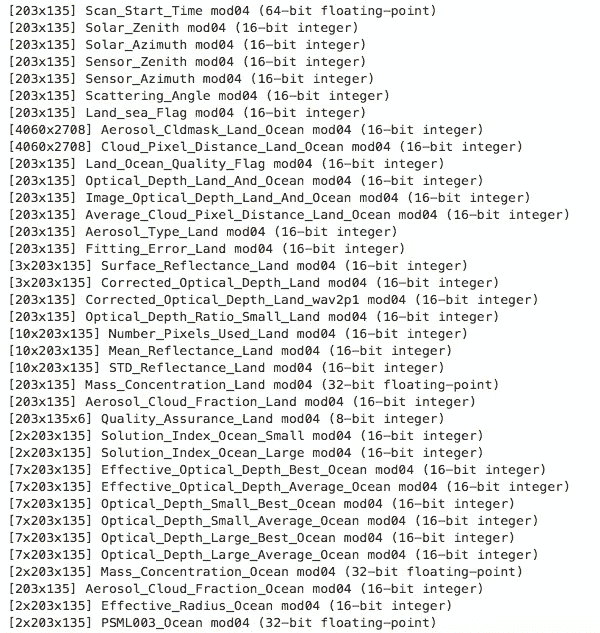
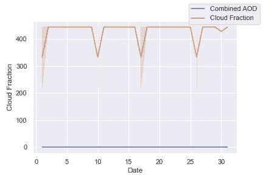

# MODIS 数据的数据分析

> 原文：<https://towardsdatascience.com/data-analytics-with-modis-data-46338cd6e4d2?source=collection_archive---------9----------------------->

Aerosol Optical Depth imagery over the entire world

MODIS(或中分辨率成像光谱仪)是美国宇航局 Terra 和 Aqua 卫星上的成像传感器，绕地球运行，捕捉图像，以了解和研究地球表面的各种现象。你可以从这些图像中提取一大堆产品，从地理定位、云罩、大气产品到陆地和冰冻圈产品到海面温度产品。这些数据可以极大地帮助理解天气的动态变化、风的模式，甚至是人类在某个地区的影响。

## 这有什么大不了的？

当我开始时，我发现最大的问题当然是处理这些地理空间数据。我从事大气气溶胶光学厚度(AOD)的研究，试图了解气溶胶通过吸收或散射阳光来减少日照的作用。对于初学者来说，没有一个关于处理这些数据的*指南*。所以在一个地方编译我找到的那些方法是有意义的，可以对那里的人有所帮助。所以让我们开始吧…

代码可以在[这里](https://github.com/NimishMishra/aod_data_analytics)找到。

## 但是首先我们得到数据

MODIS 数据可以从[这个](https://modis.gsfc.nasa.gov/data/)网站下载。我特别选择了主菜单中的大气产品(因为 AOD 数据应该在那里)，然后被重定向到 [NASA LAADS](https://ladsweb.modaps.eosdis.nasa.gov) 网站。你可以很容易地找到一个 *Find Data* 选项卡，点击它会导向这里:

从下拉列表中，选择记录您正在寻找的产品数据的传感器。我选择了 MODIS Terra 传感器(尽管 MODIS Aqua 传感器同样适用于我们的目的)，并在这里着陆:

看看如何从左侧窗格中的各种收藏中进行选择。我简单地选择了*气溶胶*，它让我有了两个选择——L2 3 公里长的条带和 L2 10 公里长的条带数据。它只是代表了一张地球快照所覆盖的面积(**在这样的项目中，将数据想象成地球的图像总是有帮助的，因为这就是它们的真实面目！**)。因此，根据您是希望处理 3 公里×3 公里的区域还是 10 公里×10 公里的区域，您可以选择所需的集合。

其余的选项非常简单。该菜单要求您输入持续时间、位置，并显示您可以下载的文件(HDF)格式。文件名包含文件的基本信息:

What your file name says!

因为我想分析北印度 AOD 一年的情况，所以我下载了一年中每一天所需地区的 HDF 文件。文件可以在我的 [Github repo](https://github.com/NimishMishra/aod_data_analytics) 中找到。

# 将数据加载到 Python

在经历了许多失败和挫折之后，我遇到了[*gdal*](https://gdal.org)*(地理空间数据抽象库)，事实证明它在处理上述数据时非常有用。然而，事实证明，使用 Python 的默认包管理器`*pip*`来安装 gdal 对我来说更加困难。所以我直接将它安装到我的 Anaconda 环境中；只要做好`*conda install gdal*` 我就好了。*

## *打开单个文件*

*下面的代码打开路径指向的文件。*

*下载的每个文件都有许多附属的子数据集。只是为了看看我们得到了什么，`*GetSubDatasets()*` 可以分别列出不同的数据集，返回一个`*path*` 打开的数据集和一个`*desc*` 的数据集。打印描述会告诉您许多关于您正在处理的数据类型的信息:*

**

*Just a small number in this screen. There are several others to deal with as well*

*基本上这些名字都是不言自明的。附加到描述的是数据集被格式化成的矩阵的大小(在左边)和用于存储数据的数据类型(在右边)。因此，让我们编写一些通用函数来加载我们希望加载的任何特定子数据集。*

*上述函数获取`*FILEPATH*` 并从该文件加载`*SUBDATASET_NAME*` 。例如，要打开文件中的第一个子数据集，只需将`*FILEPATH*` 指向存储 HDF 文件的目录，并将`*Scan_Start_Time mod04(64-bit floating-point)*` 传递给`*SUBDATSET_NAME*` *。*这段代码将打开子数据集，将其作为数组读取(`*subdataset.ReadAsArray()*`)，并返回一个 pandas dataframe，供以后处理。*

## *在您希望的位置获取数据*

*如果您需要整个区域的平均乘积，只需对整个矩阵求平均，这将是当天该区域的 AOD(尽管您需要处理缺失数据)。我们一会儿就会谈到这一点)。但是如果你，只需要提取那张 10 公里 x 10 公里图像的一小部分，**你需要找到图像上最接近你要找的位置的像素。***

*那么你是如何做到这一点的呢？尽管我认为有几种方法可以解决这个问题，但我还是采用了以下方法:*

1.  *打开纬度子数据集，**找到单元格**的行号，它的值最接近我正在寻找的纬度。这个想法来自于这样一种理解，即**纬度子数据集中的每个单元代表图像中该像素的纬度。***
2.  *现在，使用步骤 1 中的行号，我将在经度子数据集中找到像素**的列号，这是离我要寻找的地方最近的。***
3.  *所以现在我有了离我瞄准的位置(地理坐标)最近的像素的行号和列号。我现在可以打开其他子数据集，比如说*Deep _ Blue _ Aerosol _ Optical _ Depth _ 550 _ Land mod 04(16 位整数)*并提取该像素的值。这个值给了我当天使用深蓝检索算法在那个地方测量的 AOD。*我们可能希望有 9 到 25 个像素的平均值，以我们刚刚找到的像素为中心，以防万一，该像素当天的值为空(当天该像素上的数据无法记录)。**

*Finds the latitude pixel*

*上面的代码找到了像素的*行号*，该像素的值(本质上是纬度)是距离我们正在寻找的`*CITY_LATIDUDE*` 最近的*。**

*Finds the longitude pixel*

*经度也有类似的故事。请注意，我不是在整个矩阵中搜索，而是在我刚刚在前面的函数中找到的行号所在的行中搜索(用`*LATITUDE_ROW_NUMBER*`表示)。*

*上面的函数非常简单，给定一个特定的子数据集，latitude 函数找到的行号和 longitude 函数找到的列号，返回子数据集中该像素的乘积值。*

*我们需要做的最后一件事是以某种方式处理要打开的子数据集，找到像素坐标，并获得所需的平均值(基本上是将上述所有内容放在一起):*

*很明显，上面的函数找到了 *lat_row* 和相应的 *lon_column，*决定考虑哪些子数据集，并在 9 个单元格的网格上求平均值(我们的像素在网格的中心)。如下图所示:*

**

*还要注意，在数据集中， *-9999* 的值表示未能记录该位置的数据。所以我简单地放了一个 *0* 在那里。*

## *处理大量数据…*

*上面的*驱动*代码简单地在一个月内迭代所有 HDF 文件，提取*散射角、AOD(深蓝)、云分数、组合(深蓝和暗目标检索算法组合)、*和 A *ngstrom 指数、*将所有内容添加到一个列表中，通过`*pd.Series()*` *、*将所有内容转换成一个序列，并向`*pd.DataFrame()*` *添加一个新列。*最后，我们可以导出当月的。csv 文件供进一步分析。*

## *分析*

*以下两个助手例程将帮助我们绘制每个月的数据以及平均参数，以便我们可以查看其在一段时间内的平均变化。我在`*plot*` 例程中做了几件事情，一个接一个地叠加线条图，检索函数返回的任何内容，从中获取图形(使用`*get_figure()*`)，并将图形保存到文件中，以备将来使用。*

*这里的一切都很明显。我使用一个字典来跟踪哪个月份以什么顺序被处理(例如，根据文件名，四月是第一个被处理的月份)。它只需要创建一个给定的地图，当追加平均的深蓝 AOD T21 数据时，追加对应于日历中月份的整数。这将有助于排序列表，并返回从 1 月到 12 月的时间变化。*

*我将分享一些情节和我从中得到的一些感悟。在这里找到其他人。*

## *大势第一*

**

*上图描绘了平均气溶胶产品的年变化。y 轴报告从深蓝算法中检索的值。为了得到实际值，检索到的值需要用**0.001**(MODIS 使用的缩放因子)进行缩放。*

*上图是全年的平均月 AOD 变化。可以看出，AOD 在夏季上升，在雨季下降，在冬季再次上升*

***2018 年 1 月趋势**(注 MODIS 数据使用 0.001 的比例因子。所以实际值是在数据值乘以比例因子时获得的)*

**

*Variation of Deep Blue AOD and Cloud Fraction over January 2018*

*上图绘制了从深蓝检索算法获得的 AOD 值和获得的云分数数据值。很明显，总的来说，每当云分数高的时候，AOD 往往就低。事实上，这并不低，只是卫星成像传感器无法记录当天的数据。并且在 1 月 2 日左右观察这个峰值。如果你稍微想一想，你就会意识到，新年庆祝活动就是这样！*

**

*Variation of Combined AOD and Cloud Fraction over January 2018*

*这里可以合理地看出，使用暗目标和深蓝的组合 AOD 给出了对 AOD 的有点不正确的估计。据报道，大部分时间 AOD 都在 0 左右。众所周知，事实并非如此，尤其是在新年前后。*

**

*Variation of Deep Blue AOD and Scattering Angle over Januray 2018*

**深蓝 AOD 和散射角都是* ***放大 0.001 倍*** *。这里可以看到 AOD 的一个尖峰信号是如何导致散射角突然增加的，这意味着更多的阳光被阻挡。**

**

*Variation of Deep Blue AOD and Angstrom Exponent over January 2018*

*Angstrom 指数是 AOD 相对于光的各种波长如何变化的量度(称为“光谱相关性”*)。这与气溶胶粒子大小有关。较高的值表示颗粒较粗，而较小的值表示颗粒较细。这里，通常较高的值~ 0.5(500 ***0.001[比例因子** ])表示通常较细的颗粒。一项 PM2.5 研究可以补充这一发现。**

**在**8 月**16】数据中发现了奇怪的结果。由于本月持续的高云量，MODIS 未能检索到 AOD 数据。**

****

**Variation of Deep Blue AOD and Cloud Fraction over August 2018**

**正如所料，其他变量也遭受了类似的后果。**

****

**Variation of Combined AOD and Cloud Fraction over August 2018**

****

**Variation of Deep Blue AOD and Angstrom Exponent over August 2018**

****

**Variation of Deep Blue AOD and Scattering Angle over August 2018**

## **摘要**

**最后，让我们在这里得出一些推论:**

*   ****在**季风**期间**AOD 水平的下降是由于**强日照**，促进了气溶胶的柱状混合。**
*   **冬季**AOD 气温**上升**是由于**日照**减少和**寒冷** **气温**；由于低大气边界层和在陆地附近捕获气溶胶，气溶胶的反向柱状混合。****
*   ******夏季**更强的对流****(主要来自西方扰动和信风)伴随着**更深的大气边界层**导致**夏季坎普尔上空气溶胶聚集**。****
*   ****云量是 AOD 测量中的一个重要因素。较高的云量通常会导致当天没有数据。*在本报告中，这样的日子被* ***替换为所考虑月份的平均值*** *。*****
*   ****美国宇航局的**深蓝检索算法在陆地图像上给出了比暗目标检索**更准确的结果。****
*   ****坎普尔的人们在 2018 年的新年和排灯节前夕确实爆了很多饼干！2018 年 1 月 1 日和排灯节的堪普斯太模糊了，甚至无法记录图像来获取数据，2018 年 1 月 2 日看到了约 1.2 AOD。****
*   ****由于持续的高云量，2018 年 8 月出现了记录 AOD 数据的直接失败。****

****利用 MODIS 数据，你可以做更多的事情。你可以找到森林覆盖数据，研究海洋，等等。我希望这篇文章能帮助你处理任何 MODIS 产品，你可以没有任何麻烦地完成你的学习。****

****祝你今天开心！玩的开心！****