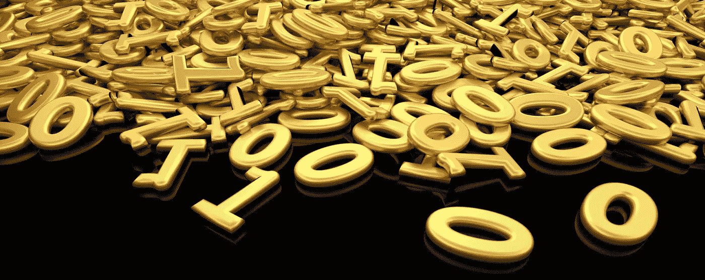
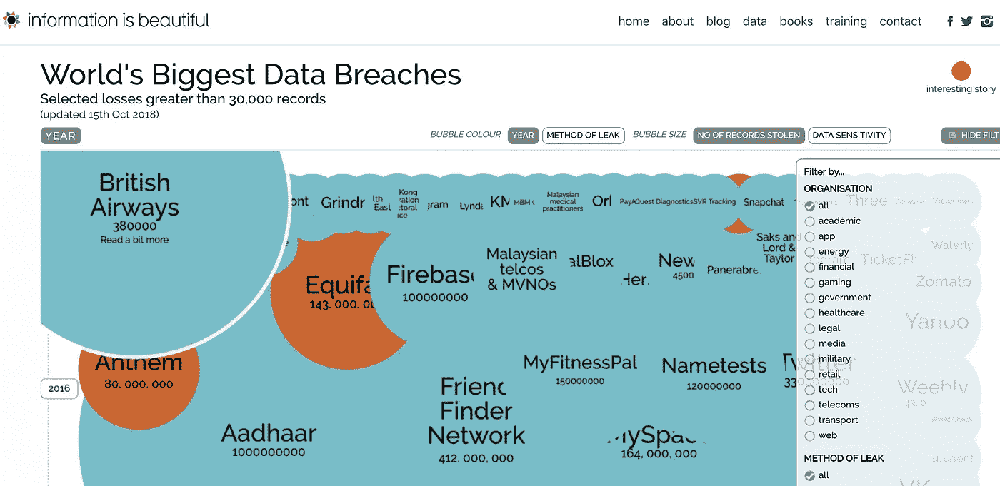

# 数据作为设计的新媒介

> 原文：<https://towardsdatascience.com/data-as-a-new-medium-of-design-1d4cbc7bfea1?source=collection_archive---------21----------------------->

## 第二部分

## 上接“设计流程中的数据科学”，该研究旨在帮助服务设计师在设计流程的所有阶段使用数据，从使用数据进行研究和分析，到使用数据作为创意媒介和工具。

Image from [HSO.com](http://www.hso.com)

企业现在将数据视为原材料，宣称“*数据是新的石油”*，据称这是数学家 Clive Humby 首先说的，他建立了 *Tesco Clubcard* 忠诚度计划(Marr，2018 年)，King 等人(2017 年)将数据称为“当今的货币”。随着这种即将到来的数据商品化趋势，设计师们现在比以往任何时候都更开始使用数据作为一种工具，进一步告知他们的直觉和对用户的定性研究(黄，2016)。

越来越多的设计机构开始将数据整合到为客户设计新服务和产品的过程中。随着数据量的不断增加，开发利用大数据的方法变得至关重要。 [Topp](http://www.topp.se/) (2016)，一家来自瑞典的设计和数据实验室，已经开始超越传统的使用数据的方式，将数据用作收集人口统计见解或监控使用情况的来源。Topp 已经开始使用数据作为设计材料，他们认为这开辟了“创造性和战略性的道路，否则这些道路将会被遗忘。”Topp 举办了一系列研讨会，试验基于设计的构思和用数据绘制草图。有趣的是，他们认为强加人类视角和我们创造叙事的能力使我们能够“从数据中阅读故事”，这意味着激发想法，并给设计师提供不同的视角和观点来工作。他们不相信这些故事需要有统计上的相关性，并把对数据的解释作为整个设计过程中使用数据的基础来讨论。一方面，他们认为你不一定要成为数据科学家才能从数据中获得创造性的见解。然而，另一方面，他们承认，他们通过使用数据作为思维工具产生的想法“如果我们是数据科学家，当然会完全是疯狂的言论”。

已故的汉斯·罗斯林以全球卫生教授的身份开始了他的职业生涯，但他以统计学家的工作以及他在世界各地关于统计力量的演讲和介绍而闻名。他出现在一部名为《统计的快乐》的纪录片中，这部纪录片认为，统计让人们看到了一个我们无法通过任何其他方式获得的世界。“统计数据告诉我们，我们认为和相信的事情实际上是否是真的”(罗斯林，2010)。根据 Claeson 的说法(Watts，2017 年引用)，“汉斯具有简化复杂问题并以幽默的方式呈现它们的独特品质，这让我们倾听、提问并进行更知情的辩论”。这句话说明了当以一种创造性的、平易近人的方式传达给不太熟悉数据的人时，数据会有多么强大。

Pamela Pavliscak (2016)是 UX 研究和战略公司 Change Sciences 的创始人，她的方法部分是民族志，部分是心理学，部分是数据科学，“将未来的愿景转化为有形的日常可能性”(Change Science，无日期)。她将算法作为一种新的设计媒介。她表示，体验设计师越来越依赖于用算法进行设计，并认为设计越来越多地通过使用算法来增强人类体验和创造更好的情感意识。

此外，数据正在成为一种新的艺术形式，因为“数字技术和‘传统’创作实践之间的界限正在消失”(Murray，2014)。数据正在成为艺术的媒介，艺术家们将它比作颜料或画布，许多人认为数据不应该只留给统计学家和企业界，这凸显了数据在各个行业和学科中的重要性(Murray，2014)。一个这样的例子是 [*信息是美丽的*](https://informationisbeautiful.net/) *，*一个创建美丽的交互式数据-可视化和信息图表的组织，基于“跨越艺术、科学、健康和流行的模式和联系，揭示隐藏在我们周围的数据、信息&知识中错综复杂、不可见且有时滑稽可笑的故事”(信息是美丽的，没有日期)。

Data visualisation from [Information is Beautiful](https://informationisbeautiful.net/) (2018)

随着数据不再仅仅为商业关键决策提供信息，而且还融入到艺术、设计甚至音乐创作中，数据作为一种新媒体的崛起引起了一些评论家的坚定判断，他们认为数据的使用“干扰了创造力”，最好留给商业世界处理(PromptCloud，2017)。

# **用数据进行设计时道德的作用**

> “数据本身在最好的情况下是没有意义的，在最坏的情况下是误导性的”——Pardi，2016 年

我们世界的数字化不可否认地被视为一把双刃剑。虽然有些人强调了数字化和数据给我们的社会带来的好处(Sabbagh 等人，2012 年)，但其他人强调了它已经并将继续对社会产生的有害影响(Loebbecke，2015 年)。技术进步将继续快速加速(Treseler，2015)。

Murray (2014)认为，大数据不能保证客观真实，因为数据的优势、无处不在和可塑性也是其弱点，人们越来越担心隐私和安全受到侵犯。他指出了“社会实证主义者视野中的缺陷，这些人将数据视为某种治疗世界疾病的灵丹妙药”。

Zwitter (2014 年)认为，大数据产生了重新思考道德规范的需求，特别是在个人道德责任方面，因为个人失去了理解其潜力和做出明智决定的能力。社交网络数据、可穿戴设备生成的健康数据、电子邮件和手机应用程序的数据都有可能被不道德地滥用。个人不熟悉他们的数字足迹的无意后果。“当大数据集的二次使用可以对过去、现在甚至未来的隐私、保密性和身份的破坏进行逆向工程时，专注于管理个人身份信息的现有隐私保护是不够的”(Richards & King，2014)。新闻和媒体经常报道数据安全漏洞的数量。一个比较突出的例子是，剑桥分析公司非法访问了数百万份脸书个人资料，并设法收集了大量个人数据。他们能够理解甚至试图改变人们的政治观点，这可能影响了最近的美国总统选举(Halpern，2018)。

Pavliscak (2016)提请注意情绪感应应用程序和设备的兴起，并鼓励以极简方式使用数据和基于这些数据创建算法。Halpern (2018)也认识到这种敏感数据的危险，因为它为心理控制奠定了基础，“通过直接诉诸他们的情绪，使用越来越细分和细分的人格类型指定以及基于这些指定的精确定向信息。”

近年来，在数据收集和使用方面受到审查的最著名的组织之一是美国政府机构——国家安全局，也称为 NSA。支持者为其侵入性的电话和互联网记录收集辩护，理由是只收集“唯一”元数据——你给谁打电话，什么时候打，打了多长时间——认为由于对话的实际内容没有被记录，对隐私的威胁无关紧要。这是一个充其量是误导的论点。关于数据的道德使用以及当今元数据如何“告诉你关于某人生活的一切”，最有争议的说法之一可能是美国国家安全局前局长迈克尔·海登将军(2014 年在科尔引用)所说的“我们基于元数据杀人”。这一令人震惊的声明证明了数据不仅可以违反道德标准，还会给人类带来更大的风险。当一组数据因其(元)知识而被用于生死决策时，忽略人的作用也就忽略了移情、价值观、情商和人性的价值。

# **数据解释的不足**

霍华德(Pollack，2012 年引用)说“数据没有给胡说留下任何空间。[……]人们会争论，但你可以给他们看数据。它不会说谎。”然而，Topp (2017)认为，没有人类的解释，数据只是对一个现实的描述。

> *任何数据都没有内在价值，因为所有信息本身都没有意义。为什么？因为信息不会告诉你该怎么做。*“
> ——博·洛托(引自帕迪，2017)

[Pardi](https://medium.com/microsoft-design/if-you-want-to-be-creative-dont-be-data-driven-55db74078eda) (2017)对作为设计师、工程师或任何创造事物的角色，单独依赖数据的危险进行了有趣的观察。他指出，数据只是信息，并不代表客观现实。他提出了一个令人信服的事实，即数据是“由进行处理的个人高度语境化的”，因为不同的人会以不同的方式解释数据，而他们的语境对这种解释有很大的影响。他用的例子如下。

**朗读**课文 **:**

> **w at a e y u ea ing n w？**

如果你读到“你现在在读什么？”，你做了很多人会用同样的“数据”阅读的事情，尽管句子中没有包含一个英语单词。你的大脑填补了空白，因为你与英语的关系，你被提示“大声朗读课文”，这影响了结果。然而，如果你在吃零食，饿了或者坐在餐馆里，你可能会读到“你现在在吃什么？”。

关键在于，数据科学家的角色正是如此——通过解释来理解数据，并将分析转化为可供组织其他部门采取行动的见解。这个例子表明，数据永远不可能是客观事实，因为它依赖于一个或多个个人的主观解释，所有人都从他们的角度和背景来看待数据。与 King 等人(2017 年)类似，Pardi (2017 年)暗示，当想要创造性地使用数据时，以“驱动”为重点的数据驱动并不是一个好方法。然而，他确实相信数据可以支持创造性和创新性的成果。事实应该通知设计者，以便他们可以试验未来的可能性，发现原始数据无法提供的洞察力。

# 参考

Cole，D. (2014) *我们根据元数据杀人*。可从:[https://www . ny books . com/daily/2014/05/10/we-kill-people-based-metadata/](https://www.nybooks.com/daily/2014/05/10/we-kill-people-based-metadata/)(访问时间:2018 年 9 月 27 日)。

黄(2016) *设计师如何利用数据创造出令人惊叹的作品。*可在:[https://www . invision app . com/inside-design/how-designers-can-use-data/](https://www.invisionapp.com/inside-design/how-designers-can-use-data/)(访问时间:2018 年 10 月 10 日)。

King，r .，Churchill，e .，Tan，C. (2017)，*用数据进行设计*。加利福尼亚州塞瓦斯托波尔:奥莱利媒体公司。

Loebbecke，c .和皮科特，A. (2015)，《对数字化和大数据分析引发的社会和商业模式转型的思考:一项研究议程》，*《战略信息系统杂志*，第 24 卷第 3 期，第 149-157 页。

Marr，B. (2018) *这就是为什么数据不是新的石油*。可从:[https://www . Forbes . com/sites/Bernard marr/2018/03/05/heres-why-data-is-not-the-new-](https://www.forbes.com/sites/bernardmarr/2018/03/05/heres-why-data-is-not-the-new-)oil/# b 00 c 0b 23 aa 96(访问时间:2018 年 11 月 13 日)。

Murray，B. (2014) *设计之美:数据与数字艺术的交集*。可从:[https://TechCrunch . com/2015/02/27/beauty-by-design-the-crossover-of-data-and-](https://techcrunch.com/2015/02/27/beauty-by-design-the-intersection-of-data-and-)digital-art/(访问时间:2018 年 9 月 27 日)获取。

如果你想有创造力，就不要被数据驱动。可从:[https://medium . com/Microsoft-design/if-you-want-to-be-creative-don-be-data-driven-](https://medium.com/microsoft-design/if-you-want-to-be-creative-dont-be-data-driven-)55db 74078 EDA(访问时间:2018 年 10 月 4 日)。

Pavliscak，P. (2016) *算法作为设计的新材料*。可从 design.php[获得 https://www . UX matters . com/mt/archives/2016/06/algorithms-as-the-new-material-of-](https://www.uxmatters.com/mt/archives/2016/06/algorithms-as-the-new-material-of-)(访问时间:2018 年 10 月 12 日)。

n . pol lack(2012)*万亿字节革命:Kaggle 如何将数据科学家变成摇滚明星*。可从:[https://www.wired.co.uk/article/the-exabyte-revolution](https://www.wired.co.uk/article/the-exabyte-revolution)(访问时间:2018 年 10 月 12 日)。

PromptCloud (2017) *大数据*。可从:[https://towardsdatascience.com/how-big-](/how-big-)data-can-impact-creative-in-the-near-future-95e0a 626840 a(访问时间:2018 年 9 月 4 日)获得。

Sabbagh，k .、Friedrich，r .、El-Darwiche，b .、Singh，m .和 Ganediwalla，S. (2012)，《数字化影响最大化》，*《全球信息技术报告*，第 121-133 页。

Topp (2016) *数据作为创意素材*。可从:[http://datalab.topp.se/news/2016/6/17/data-as-ideation-tool](http://datalab.topp.se/news/2016/6/17/data-as-ideation-tool)(访问时间:2018 年 10 月 5 日)。

Treseler，M (2015) *作为数据科学家的设计师*。可从:[http://radar . oreilly . com/2015/05/designers-as-data-scientists . html](http://radar.oreilly.com/2015/05/designers-as-data-scientists.html)(访问时间:2018 年 10 月 15 日)。

瓦特，G. (2017)，‘汉斯·罗斯林’，柳叶刀，389 (10070)，第 694 页。
张，b .，克雷茨，g .，伊萨克森，m .，尤比洛斯，j .，乌尔达内塔，g .，Pouwelse，j .和埃佩马，D. (2013)，《理解 spotify 中的用户行为》，*IEEE 会议录*，第 220-224 页。