# 用于深度学习的数据增强

> 原文：<https://towardsdatascience.com/data-augmentation-for-deep-learning-4fe21d1a4eb9?source=collection_archive---------4----------------------->

Photo by [rawpixel.com](https://www.pexels.com/@rawpixel?utm_content=attributionCopyText&utm_medium=referral&utm_source=pexels) from [Pexels](https://www.pexels.com/photo/assorted-plastic-figures-1619844/?utm_content=attributionCopyText&utm_medium=referral&utm_source=pexels)

## 流行的增强包和 PyTorch 示例概述

拥有大型数据集对于深度学习模型的性能至关重要。然而，我们可以通过[增加我们已经拥有的数据](https://bair.berkeley.edu/blog/2019/06/07/data_aug/)来提高模型的性能。深度学习框架通常有内置的数据增强工具，但这些工具可能效率低下或缺乏一些必要的功能。

在这篇文章中，我将概述最流行的图像增强包，专门为机器学习设计的，并演示如何使用这些包与 [PyTorch](https://pytorch.org) 框架。

对于每一个图像增强包，我都介绍了用二进制遮罩和边界框转换图像、流水线转换以及用 PyTorch 进行转换。我正在使用下面的演示图像:

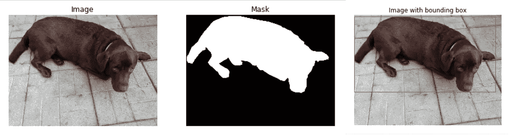

Demo image

这篇文章的完整代码在这个 Jupyter 笔记本中[提供。](https://github.com/Lexie88rus/augmentation-packages-overview/blob/master/data-augmentation-packages-overview.ipynb)

# imgaug 包

[**imgaug**](https://github.com/aleju/imgaug) 是一个强大的图像增强包。它包含:

*   60 多种图像增强器和增强技术(仿射变换、透视变换、对比度变化、高斯噪声、区域缺失、色调/饱和度变化、裁剪/填充、模糊)；
*   使用分段遮罩、边界框、关键点和热图增强图像的功能。该功能使得将包应用于包含图像的数据集以解决分割和对象检测问题变得非常容易；
*   复杂的增强管道；
*   许多增强可视化、转换等辅助功能。

此处提供了 **imgaug** 包的完整文档[。](https://imgaug.readthedocs.io/en/latest/index.html)

## 简单的扩充

用 **imgaug** 包扩充图像就像这样简单:

Augment an image with imgaug

以下是使用 imgaug 软件包增强的几个图像示例:

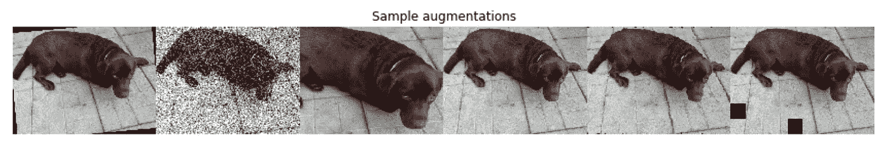

Demonstration of sample augmentations: rotation, gaussian noise, crop, hue and saturation adjustment, elastic transform, coarse dropout

Imgaug 帮助处理带有分割遮罩的**图像。为了训练深度学习模型，我们必须以相同的方式增强图像和掩模。下面是一个使用二进制分割蒙版变换图像的示例:**

Augment an image with mask

以下代码有助于可视化增强图像和增强遮罩:

Visualize the augmented image and mask with imgaug helpers

下图是使用二进制分段遮罩的增强图像示例:

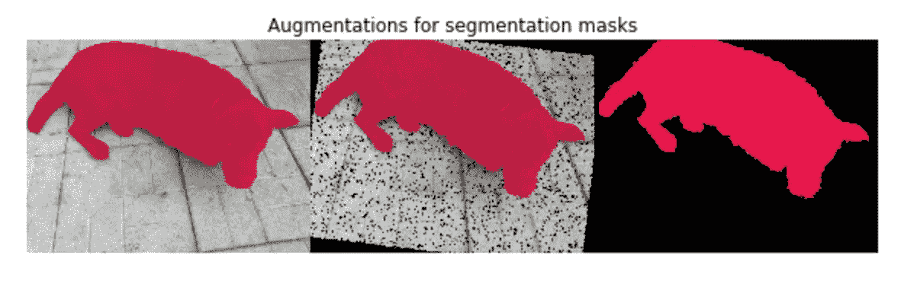

The result of augmentation of an image with a mask

Imgaug 包在对带有边界框的图像应用变换时也很有帮助。用边界框增加图像的示例代码:

Transformation of an image with a bounding box

以下代码示例可用于可视化结果:

Visualize the augmented image and bounding box with imgaug helpers

下图展示了增强图像和边界框与原始图像相比的外观:

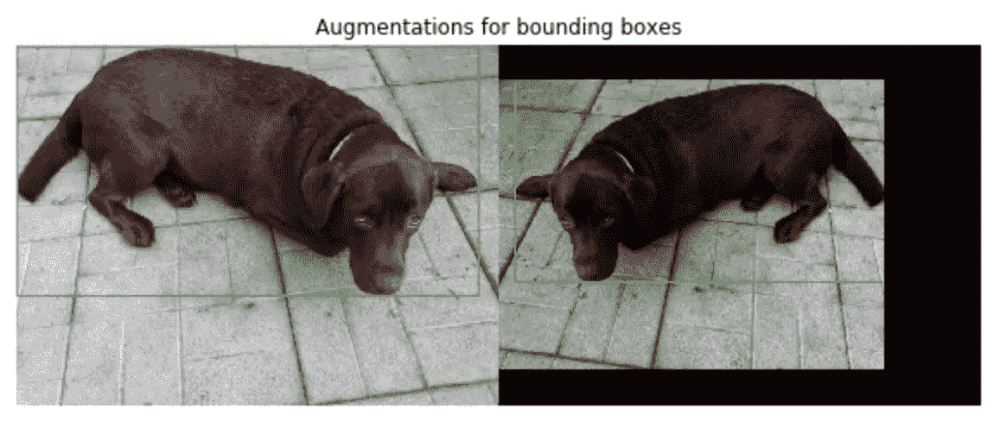

The result of augmentation of an image with a bounding box

示例中的增强边界框看起来不错，但在某些情况下，增强边界框对旋转的图像不起作用。这里有一个例子:

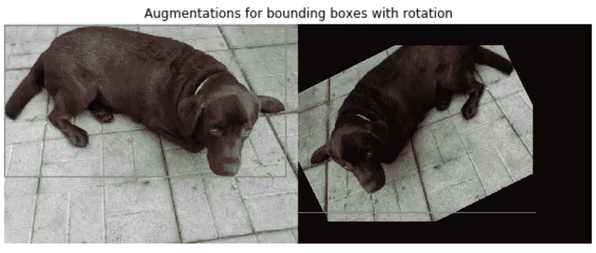

The example of augmented bounding box for rotated image

## 流水线扩充

使用 **imgaug** 包，我们可以构建一个复杂的图像增强管道。来自管道的增强按顺序应用于每个图像，但是我们可以设置:

1.  将增强应用于图像的概率。例如，我们可以用它来对 50%的图像进行水平翻转。
2.  仅对图像应用增强器的子集。例如，应用列表中的 0 到 5 个增强剂。该功能有助于加速数据生成。
3.  以随机顺序应用增强。

让我们看一个复杂增强管道的例子:

Augmentation pipeline example

以下图像取自上述定义的管道:

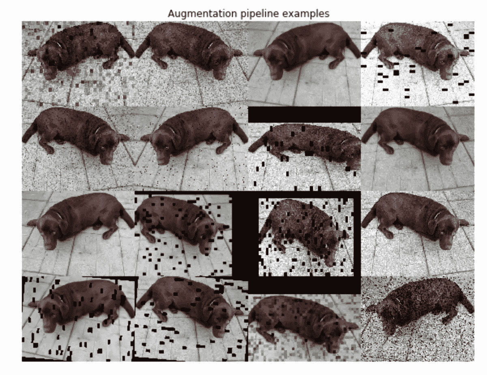

Examples of images sampled from the augmentation pipeline

## 使用 imgaug 和 PyTorch

以下代码示例演示了如何在 PyTorch 数据集中使用 **imgaug** 增强来生成新的增强图像:

Example of using imgaug with PyTorch

# 白蛋白包装

[**albuminations**](https://github.com/albu/albumentations)包是基于 numpy、OpenCV、imgaug 编写的。这是一个非常受欢迎的软件包，由 Kaggle masters 编写，在 Kaggle 比赛中广泛使用。而且，这个包效率很高。你可以在这里找到基准测试结果[，在这里](https://github.com/albu/albumentations#benchmarking-results)找到这个包的完整文档[。](https://albumentations.readthedocs.io/en/latest/)

白蛋白包装能够:

*   超过 60 种像素级和空间级转换；
*   用遮罩、边界框和关键点变换图像；
*   将增强组织到管道中；
*   PyTorch 集成。

## 简单的扩充

来自**白蛋白**包的增强应用于图像，如下所示:

Augment an image with Albumentations

来自**白蛋白**包的增强器产生的图像的几个例子:

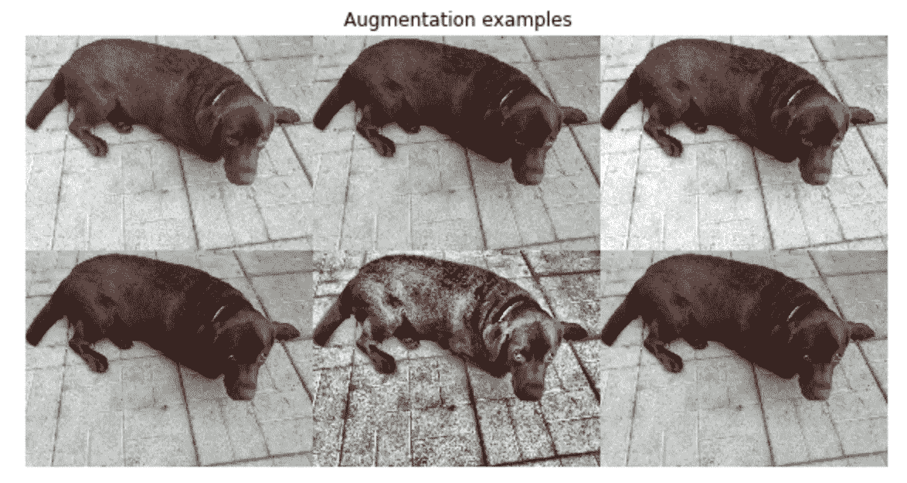

Demonstration of sample augmentations: gaussian noise, elastic transform, random brightness and contrast, random gamma, [CLAHE](https://en.wikipedia.org/wiki/Adaptive_histogram_equalization#Contrast_Limited_AHE), blur

**albuminations**包也可以应用于带有遮罩的图像。这里有一个例子:

Augment an image with mask using Albumentations

下图显示了使用二元分割蒙版的增强图像:

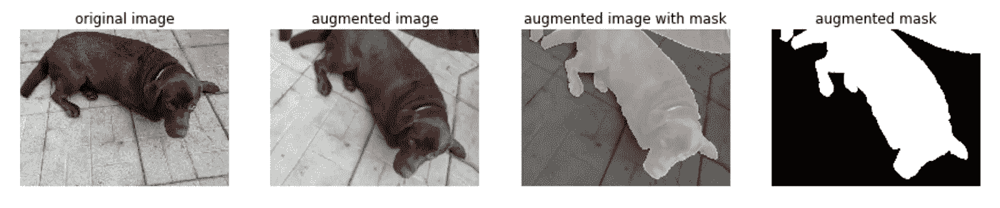

The result of augmentation of an image with a mask

**albuminations**包还提供了用边界框转换图像的功能。这里有一个简单的例子:

Transformation of an image with a bounding box

下面的代码示例演示了如何可视化结果:

Visualize the augmented image and bounding box

这是一个带有边界框的增强图像示例:

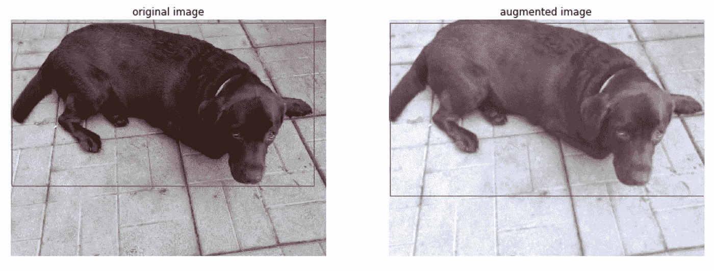

The result of augmentation of an image with a bounding box

## 流水线扩充

Albumentations 包从 numpy、OpenCV 和 imgaug 中提取精华。这就是为什么**albuminations**包中的流水线与 imgaug 中的流水线相似。下面是一个受[Kaggle 内核](https://www.kaggle.com/meaninglesslives/unet-plus-plus-with-efficientnet-encoder)启发的管道示例:

Augmentation pipeline example

以下图像取自上述定义的管道:

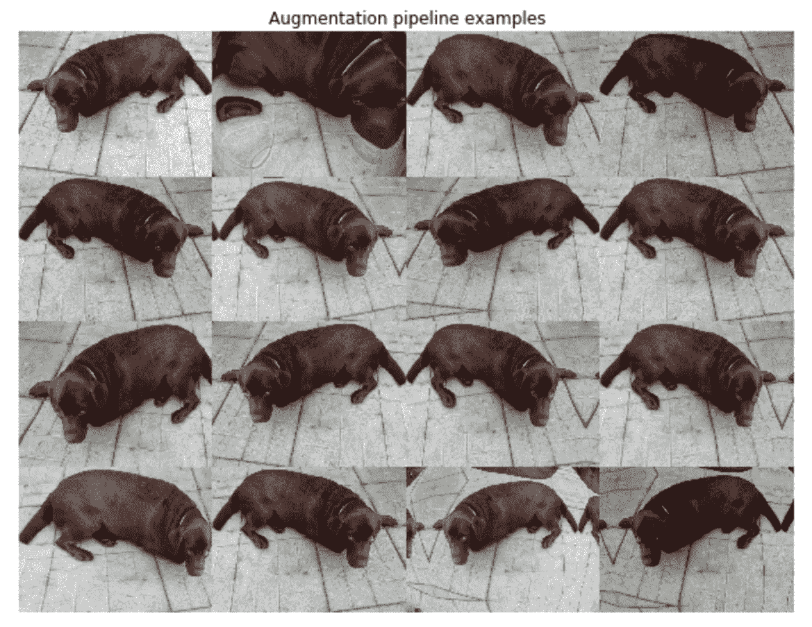

Examples of images sampled from the augmentation pipeline

## PyTorch 集成

当使用 PyTorch 时，你可以毫不费力地从 [torchvision](https://pytorch.org/docs/stable/torchvision/index.html) 迁移到**albuminations**，因为这个包提供了专门的实用程序供 PyTorch 使用。迁移到**albuminations**有助于加快数据生成部分，更快地训练深度学习模型。点击查看从 torchvision 迁移到**albumations**[的详细教程。](https://github.com/albu/albumentations/blob/master/notebooks/migrating_from_torchvision_to_albumentations.ipynb)

PyTorch 集成示例:

PyTorch integration

# 推力增强装置

[**增强器**](https://github.com/mdbloice/Augmentor) 包包含的可能增强比本文之前描述的包更少，但它有其突出的特性，如[尺寸保持旋转](https://github.com/mdbloice/Augmentor#size-preserving-rotations)、[尺寸保持剪切](https://github.com/mdbloice/Augmentor#size-preserving-shearing)和[裁剪](https://github.com/mdbloice/Augmentor#cropping)，更适合机器学习。

增强器包还允许组成增强管道，并与 PyTorch 一起使用。你可以在这里找到**增强器**包[的完整文档。](https://augmentor.readthedocs.io/en/master/)

## 简单的扩充

下面的例子结合了一个简单的**增强器**流水线应用于一个带有遮罩的图像:

Augment an image with Augmenter

这些图像是在上述代码的帮助下生成的:

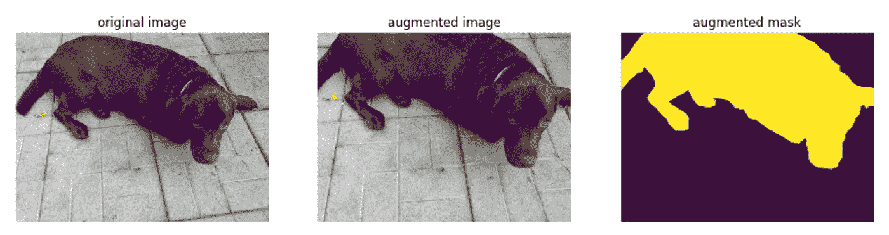

The result of augmentation of an image with a mask

## 使用 PyTorch 增强器

有一些[已知的问题](https://github.com/mdbloice/Augmentor/issues/109)与**增强器**和 PyTorch 有关，但是我们仍然可以一起使用这些库。

这里有一个例子:

Example of using Augmentor package with PyTorch

# 结论

在本文中，我介绍了专门为机器学习设计的最流行的图像增强包的功能。本文中提供的各种代码示例有助于开始在机器学习项目中使用这些包进行分类、分段和对象检测任务。