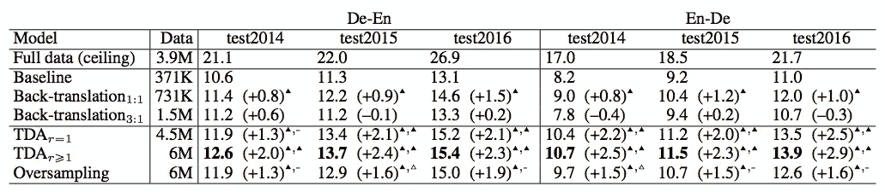

# 自然语言处理中的数据扩充

> 原文：<https://towardsdatascience.com/data-augmentation-in-nlp-2801a34dfc28?source=collection_archive---------2----------------------->

## 文本增强简介

Photo by [Edward Ma](https://unsplash.com/@makcedward?utm_source=medium&utm_medium=referral) on [Unsplash](https://unsplash.com?utm_source=medium&utm_medium=referral)

我们拥有的数据越多，我们能够实现的性能就越好。然而，注释大量的训练数据是非常奢侈的。因此，适当的数据扩充有助于提高模型性能。增强在计算机视觉领域非常流行。通过图像增强库，如 [imgaug](https://github.com/aleju/imgaug) ，可以通过翻转、添加盐等方式轻松增强图像。事实证明，增强是计算机视觉模型成功的支柱之一。

在自然语言处理领域，由于语言的高度复杂性，很难对文本进行扩充。不是每一个词我们都可以用其他词代替，比如 a，an，the。另外，不是每个单词都有同义词。哪怕换一个词，语境也会完全不同。另一方面，在计算机视觉领域生成增强图像相对更容易。即使引入噪声或裁剪掉图像的一部分，该模型仍然可以对图像进行分类。

鉴于我们没有无限的资源来通过人类建立训练数据，作者尝试了不同的方法来实现相同的目标，即生成更多的数据用于模型训练。在这个故事中，我们探索了不同的作者如何通过生成更多的文本数据来增强模型，从而利用增强来刺激 NLP 任务。以下故事将涵盖:

*   宝库
*   单词嵌入
*   回译
*   语境化的单词嵌入
*   文本生成

# 宝库

张等人介绍了用于文本分类的同义词[字符级卷积网络](https://arxiv.org/pdf/1509.01626.pdf)。在实验过程中，他们发现一种有效的文本扩充方法是用同义词替换单词或短语。利用现有的词库有助于在短时间内生成大量数据。张等选取一个词，按几何分布用同义词替换。

# 单词嵌入

王和杨介绍的字相似的算计在[真是让人讨厌！！！:基于词汇和框架语义嵌入的数据增强方法，使用#petpeeve Tweets](https://aclweb.org/anthology/D15-1306) 对恼人的行为进行自动分类。在论文中，王和杨提出利用 k 近邻法和余弦相似度来寻找相似词进行替换。

Imp.: relative improvement to the baseline without data augmentation (Wang and Yang, 2015)

或者，我们可以利用预先训练好的[经典单词嵌入](/3-silver-bullets-of-word-embedding-in-nlp-10fa8f50cc5a)，比如 word2vec、GloVe 和 fasttext 来执行相似性搜索。

Most similar words of “fox” among classical word embeddings models

# 回译

英语是具有大量翻译训练数据的语言之一，而一些语言可能没有足够的数据来训练机器翻译模型。Sennrich 等人使用反向翻译方法来生成更多的训练数据，以提高翻译模型的性能。

假设我们要训练一个翻译英语(源语言)→粤语(目标语言)的模型，而粤语没有足够的训练数据。回译是将目标语言翻译成源语言，并混合源语句和回译语句来训练模型。因此可以增加从源语言到目标语言的训练数据的数量。

Performance result with and without text augmentation (Sennrich et al., 2016)

# 语境化的单词嵌入

Fadaee 等人没有使用静态单词嵌入，而是使用上下文化的单词嵌入来替换目标单词。他们使用这种文本增强来验证用于低资源神经机器翻译的[数据增强中的机器翻译模型。](https://arxiv.org/pdf/1705.00440.pdf)

提出的方法是 TDA，代表翻译数据增强。实验表明，通过利用文本增强，机器翻译模型得到了改进。

Performance result with and without text augmentation (Fadaee et al., 2017)

Kobayashi 提出在[语境扩充中使用双向语言模型:通过具有聚合关系的单词进行数据扩充](https://arxiv.org/pdf/1805.06201.pdf)。在选择目标单词后，模型将通过给出周围的单词来预测可能的替换。由于目标存在于句子的任何位置，双向结构被用来学习左右语境。

Kobayashi 用 CNN 和 RNN 在六个数据集上验证了语言模型方法，结果是肯定的。文本增强有助于进一步改进 NLP 模型结果。

Performance result with and without text augmentation (Kobayashi 2018)

# 文本生成

Kafle 等人介绍了一种不同的方法，通过在[视觉问题回答的数据增强](https://aclweb.org/anthology/W17-3529)中生成增强数据来生成增强数据。与以前的方法不同，Kafle 等人的方法不是替换单个或几个单词，而是生成整个句子。

第一种方法是使用模板扩充，即使用预定义的问题，这些问题可以使用基于规则的方法来生成与模板问题配对的答案。第二种方法利用 LSTM 通过提供图像特征来生成问题。

Performance result with and without text augmentation (Kafle et al. 2017)

# 建议

上述方法旨在解决作者在他们的问题中所面临的问题。如果你了解你的数据，你应该量身定制增强方法。请记住，数据科学的黄金法则是垃圾进垃圾出。

一般来说，你可以在不完全理解你的数据的情况下尝试同义词库方法。由于上述同义词库方法的限制，它可能不会提高很多。

# 关于我

我是湾区的数据科学家。专注于数据科学、人工智能，尤其是 NLP 和平台相关领域的最新发展。欢迎在 [LinkedIn](https://www.linkedin.com/in/edwardma1026) 上与 [me](https://makcedward.github.io/) 联系，或者在 [Medium](http://medium.com/@makcedward/) 或 [Github](https://github.com/makcedward) 上关注我。

# 延伸阅读

*   图像增强库( [imgaug](https://github.com/aleju/imgaug) )
*   文本增强库( [nlpaug](/data-augmentation-library-for-text-9661736b13ff) )
*   [文本的数据扩充](/data-augmentation-library-for-text-9661736b13ff)
*   [音频数据增强](/data-augmentation-for-audio-76912b01fdf6)
*   [声谱图数据增强](/data-augmentation-for-speech-recognition-e7c607482e78)

# 参考

*   X.张、赵军、李乐存。[用于文本分类的字符级卷积网络](https://arxiv.org/pdf/1509.01626.pdf)。2015
*   W.王燕和杨丹。[真讨厌！！！:一种基于词汇和框架语义嵌入的数据增强方法，使用#petpeeve Tweets](https://aclweb.org/anthology/D15-1306) 对恼人的行为进行自动分类。2015
*   R.森里奇，b .哈多和一棵桦树。[用单语数据改进神经机器翻译模型](https://arxiv.org/pdf/1511.06709.pdf)。2016
*   米（meter 的缩写））法达伊，a .比萨沙，c .蒙兹。[低资源神经机器翻译的数据扩充](https://arxiv.org/pdf/1705.00440.pdf)。2017
*   南小林。[语境扩充:通过具有聚合关系的词语进行数据扩充](https://arxiv.org/pdf/1805.06201.pdf)。2018
*   K.卡弗尔、优素福·胡辛和卡南。[视觉问答的数据扩充](https://aclweb.org/anthology/W17-3529)。2017
*   C.库伦贝。[利用 NLP 云 API 简化文本数据扩充](https://arxiv.org/ftp/arxiv/papers/1812/1812.04718.pdf)。2018