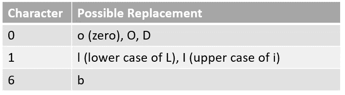
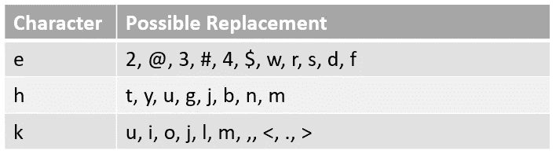

# 文本数据扩充库

> 原文：<https://towardsdatascience.com/data-augmentation-library-for-text-9661736b13ff?source=collection_archive---------8----------------------->


Photo by [Edward Ma](https://unsplash.com/@makcedward?utm_source=medium&utm_medium=referral) on [Unsplash](https://unsplash.com?utm_source=medium&utm_medium=referral)

在前面的[故事](/data-augmentation-in-nlp-2801a34dfc28)中，您了解了为 NLP 任务模型生成更多训练数据的不同方法。在这个故事中，我们将学习如何只用几行代码就能做到这一点。

> 在自然语言处理领域，由于语言的高度复杂性，对文本进行扩充是非常困难的。不是每一个词我们都可以用其他词来代替，比如 a，an，the。另外，不是每个单词都有同义词。即使改变一个单词，上下文也会完全不同。另一方面，在计算机视觉领域生成增强图像相对容易。即使引入噪声或裁剪掉图像的一部分，模型仍然可以对图像进行分类。

# nlpaug 简介

在计算机视觉项目中使用 imgaug 后，我在想我们是否可以有一个类似的库来生成合成数据。因此，我通过使用现有的库和预先训练的模型来重新实现那些研究论文。nlpaug 的基本要素包括:

*   OCR 增强器、QWERTY 增强器和随机字符增强器
*   `Word` : WordNet 增强器、word2vec 增强器、GloVe 增强器、fasttext 增强器、BERT 增强器、随机单词字符
*   `Flow`:序列增强器，有时是增强器

直观来看，`Character Augmenters`和`Word Augmenters`分别专注于字符级和单词级的操控。`Flow`像管弦乐队一样控制增强流。您可以访问 [github](https://github.com/makcedward/nlpaug) 获取库。

# 性格；角色；字母

在字符级别扩充数据。可能的场景包括图像到文本和聊天机器人。在从图像中识别文本的过程中，我们需要光学字符识别(OCR)模型来实现，但是 OCR 会引入一些错误，如识别“0”和“0”。在聊天机器人中，我们仍然会有打字错误，尽管大多数应用程序都有单词纠正功能。为了克服这个问题，你可以让你的模型在在线预测之前“看到”那些可能的结果。

## 光学字符识别

当处理 NLP 问题时，OCR 结果可能是您的 NLP 问题的输入之一。例如，“0”可能被识别为“O”或“O”。如果你正在使用[单词袋](/3-basic-approaches-in-bag-of-words-which-are-better-than-word-embeddings-c2cbc7398016)或经典[单词嵌入](/3-silver-bullets-of-word-embedding-in-nlp-10fa8f50cc5a)作为一个特征，你将会遇到麻烦，因为你周围的词汇(OOV)现在和将来都是如此。如果你使用最先进的模型，比如伯特[和 GPT](/how-bert-leverage-attention-mechanism-and-transformer-to-learn-word-contextual-relations-5bbee1b6dbdb)和[的话，OOV 问题似乎就解决了，因为 word 将被拆分成子 word。然而，一些信息丢失了。](/combining-supervised-learning-and-unsupervised-learning-to-improve-word-vectors-d4dea84ec36b)

`OCRAug`旨在模拟 OCR 错误。它会用预定义的映射表替换目标字符。



增强的例子

```
Original:
The quick brown fox jumps over the lazy dog
Augmented Text:
The quick brown fox jumps over the lazy **d0g**
```

## QWERTY 键盘

你可能参与的另一个项目是聊天机器人或其他信息渠道，如电子邮件。虽然拼写检查将被执行，但一些拼写错误仍然存在。可能会伤害到你之前提到的 NLP 模型。

`QWERTYAug`旨在模拟关键字距离误差。它会将目标字符替换为 1 个关键字距离。您可以配置是否包括数字或特殊字符。



增强的例子

```
Original:
The quick brown fox jumps over the lazy dog
Augmented Text:
**Tne 2uick hrown Gox jumpQ ovdr tNe <azy d8g**
```

## 随机字符

根据不同的研究，噪声注入有时可能有助于推广您的 NLP 模型。我们可能会在您的单词中添加一些干扰，例如从您的单词中添加或删除一个字符。

`RandomCharAug`旨在给你的数据注入噪音。与`OCRAug`和`QWERTYAug`不同，它支持插入、替换和插入。

插入增强的例子

```
Original:
The quick brown fox jumps over the lazy dog
Augmented Text:
**T(he quicdk browTn Ffox jumpvs 7over kthe clazy 9dog**
```

# 单词

除了字符增强，单词水平也很重要。我们利用 word2vec (Mikolov 等人，2013)、GloVe (Pennington 等人，2014)、fasttext (Joulin 等人，2016)、BERT(Devlin 等人，2018)和 wordnet 来插入和替换相似的单词。`Word2vecAug`、`GloVeAug`和`FasttextAug`使用单词嵌入来寻找最相似的一组单词来替换原来的单词。另一方面，`BertAug`利用语言模型预测可能的目标词。`WordNetAug`用统计的方式找到一组相似的单词。

## 单词嵌入(word2vec、GloVe、fasttext)

经典的嵌入使用静态向量来表示单词。理想情况下，如果向量彼此靠近，这个词的意思是相似的。其实要看训练数据。比如 [word2vec](/3-silver-bullets-of-word-embedding-in-nlp-10fa8f50cc5a) 中的“兔子”类似于“狐狸”，而 [GloVe](/3-silver-bullets-of-word-embedding-in-nlp-10fa8f50cc5a) 中的“nbc”类似于“狐狸”。


Most similar words of “fox” among classical word embeddings models

有时，您希望用相似的单词替换单词，以便 NLP 模型不依赖于单个单词。`Word2vecAug`、`GloVeAug`和`FasttextAug`被设计成基于预先训练的向量来提供“相似”的单词。

除了替换之外，插入还有助于在数据中加入噪声。它从词汇中随机挑选单词。

插入增强的例子

```
Original:
The quick brown fox jumps over the lazy dog
Augmented Text:
The quick **Bergen-Belsen** brown fox jumps over **Tiko** the lazy dog
```

替代增强示例

```
Original:
The quick brown fox jumps over the lazy dog
Augmented Text:
The quick **gray** fox jumps over to lazy dog
```

## 语境化的单词嵌入

因为经典的单词嵌入使用静态向量来表示同一个单词。它可能不适合某些场景。因为“福克斯”可以代表动物和广播公司。为了解决这个问题，引入了上下文化单词嵌入来考虑周围的单词，以生成不同上下文下的向量。

`BertAug`旨在提供此功能来执行插入和替换。与以前的单词嵌入不同，插入是由 [BERT](/how-bert-leverage-attention-mechanism-and-transformer-to-learn-word-contextual-relations-5bbee1b6dbdb) 语言模型预测的，而不是随机选取一个单词。替换使用周围的单词作为特征来预测目标单词。

插入增强的例子

```
Original:
The quick brown fox jumps over the lazy dog
Augmented Text:
the **lazy** quick brown fox **always** jumps over the lazy dog
```

替代增强示例

```
Original:
The quick brown fox jumps over the lazy dog
Augmented Text:
the quick **thinking** fox jumps over the lazy dog
```

# 同义词

除了神经网络方法之外，同义词库也可以达到类似的目的。同义词的局限性在于有些词可能没有相似的词。来自一个很棒的 NLTK 库的 WordNet 帮助找到同义词。

`WordNetAug`提供了替换功能来替换目标单词。不是纯粹地寻找同义词，一些初步的检查确保目标单词可以被替换。这些规则是:

*   不要选择限定词(例如，a、an、the)
*   不要选择没有同义词的词。

增强的例子

```
Original:
The quick brown fox jumps over the lazy dog
Augmented Text:
The quick brown fox parachute over the lazy blackguard
```

## 随机词

到目前为止，我们没有在单词级引入删除。`RandomWordAug`可以帮助随机删除一个单词。

增强的例子

```
Original:
The quick brown fox jumps over the lazy dog
Augmented Text:
The fox jumps over the lazy dog
```

# 流动

到此为止，上述增强器都可以单独调用。如果你想把多个增强器组合在一起呢？为了使用多个增强器，有时会引入****管道来连接增强器。一个文本可以通过不同的增强器产生不同的数据。****

## ****时序****

*您可以向该流程添加任意数量的增强器，然后`Sequential`逐个执行它们。例如，你可以将`RandomCharAug`和`RandomWordAug`组合在一起。*

## ****有时****

*如果您不想一直执行同一组增强器，`sometimes`每次都会选择一些增强器。*

# *建议*

*上述方法旨在解决作者在他们的问题中所面临的问题。如果你了解你的数据，你应该量身定做增强方法。请记住，数据科学的黄金法则是垃圾进垃圾出。*

*一般来说，您可以在不完全理解数据的情况下尝试同义词库方法。由于上述同义词库方法的限制，它可能不会提高很多。*

# *关于我*

*我是湾区的数据科学家。专注于数据科学、人工智能，尤其是 NLP 和平台相关领域的最新发展。欢迎在 [LinkedIn](https://www.linkedin.com/in/edwardma1026) 上与 [me](https://makcedward.github.io/) 联系，或者在 [Medium](http://medium.com/@makcedward/) 或 [Github](https://github.com/makcedward) 上关注我。*

# *延伸阅读*

*   *图像增强库( [imgaug](https://github.com/aleju/imgaug) )*
*   *文本增强库( [nlpaug](https://github.com/makcedward/nlpaug) )*
*   *[NLP 中的数据扩充](/data-augmentation-in-nlp-2801a34dfc28)*
*   *[音频数据增强](/data-augmentation-for-audio-76912b01fdf6)*
*   *[声谱图数据增强](/data-augmentation-for-speech-recognition-e7c607482e78)*
*   *你的自然语言处理模型能够防止恶意攻击吗？*
*   *[NLP 中的数据扩充:来自 Kaggle Master 的最佳实践](https://neptune.ai/blog/data-augmentation-nlp)*

# *参考*

*   *X.张、赵军、李乐存。[用于文本分类的字符级卷积网络](https://arxiv.org/pdf/1509.01626.pdf)。2015*
*   *W.王燕和杨丹。[真讨厌！！！:基于词汇和框架语义嵌入的数据增强方法，使用#petpeeve Tweets](https://aclweb.org/anthology/D15-1306) 对恼人的行为进行自动分类。2015*
*   *南小林。[语境扩充:通过具有聚合关系的词语进行数据扩充](https://arxiv.org/pdf/1805.06201.pdf)。2018*
*   *C.库伦贝。[利用 NLP 云 API 简化文本数据扩充](https://arxiv.org/ftp/arxiv/papers/1812/1812.04718.pdf)。2018*