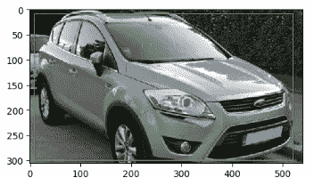

# python 中的数据扩充技术

> 原文：<https://towardsdatascience.com/data-augmentation-techniques-in-python-f216ef5eed69?source=collection_archive---------1----------------------->

## 使用 imgaug 一瞥 Python 中的数据扩充技术

*在本文中，我们将使用 imgaug 库*探索 Python 中不同的数据扩充技术


# 什么是图像增强？

图像增强是一种非常强大的技术，用于在现有图像中人工创建变化，以扩展现有图像数据集。这从代表可能图像的综合集合的现有图像数据集中创建新的和不同的图像。

这是通过应用不同的变换技术来实现的，如缩放现有图像、将现有图像旋转几度、剪切或裁剪现有图像集等。

# 为什么我们需要图像增强？

深度学习卷积神经网络(CNN)需要大量的图像来有效地训练模型。**这有助于通过更好地概括来提高模型的性能，从而减少过度拟合**。大多数用于分类和对象检测数据集的流行数据集具有几千到几百万个图像。

泛化指的是在训练过程中根据以前见过的数据，对照以前从未见过的测试或验证数据来评估模型的性能。

**CNN 由于其方差属性，即使在不同大小、方向或不同照明下可见，也可以对对象进行分类。**因此，我们可以利用图像的小数据集，通过放大或缩小、垂直或水平翻转或改变亮度(只要对对象有意义)，将对象转换为不同的大小。这样我们就创建了一个丰富多样的数据集。

> 图像增强从一小组图像中创建一组丰富多样的图像，用于图像分类、对象检测或图像分割。

在仔细理解问题域之后，需要应用增加训练数据集大小的增强策略。

*如果我们正在对不同类型的汽车进行分类，那么通过垂直翻转汽车来应用图像增强对于问题域是没有用的，或者当我们正在对手写数字进行图像分类时，垂直翻转数字 6 不会增加价值*

# 什么时候应用图像增强？

图像增强可以在我们训练模型之前作为预处理步骤来应用，或者可以实时应用。

## 离线或预处理增强

扩充作为预处理步骤被应用以增加数据集的大小。当我们想要扩展一个小的训练数据集时，通常会这样做。

在较小的数据集上生成增强是有帮助的，但是在应用于较大的数据集时，我们需要考虑磁盘空间

## 在线或实时增强

顾名思义，增强是实时应用的。这通常适用于较大的数据集，因为我们不需要将增强的图像保存在磁盘上。

在这种情况下，我们以小批量的方式应用转换，然后将其提供给模型。

在线增强模型将在每个时期看到不同的图像。在离线增强中，增强图像是训练集的一部分，它根据历元数多次查看增强图像。

该模型通过在线增强进行更好的概括，因为它在使用在线数据增强进行训练的过程中看到了更多的样本。

我们将使用 ***imgaug*** 类来演示图像增强。

imgaug 支持多种数据增强技术

# 基本数据扩充技术

*   **翻转**:垂直或水平翻转图像
*   **旋转**:将图像旋转指定的角度。
*   **剪切**:像平行四边形一样移动图像的一部分
*   **裁剪**:对象以不同的比例出现在图像的不同位置
*   **放大，缩小**
*   **改变亮度或对比度**

我们现在将使用 imgaug 库来探索这些数据扩充技术

# 伊姆高格

imgaug 是一个用于图像增强以及关键点/界标、边界框、热图和分割图的库。

## 安装库

```
pip install imgaug
```

在某些情况下，我们得到一个 Shapely 错误，在这种情况下，我们可以尝试以下命令

```
pip install imgaug — upgrade — no-deps
```

我们将拍摄一张图像，并使用基本的数据增强技术对其进行转换。

## 导入所需的库

```
import imageio
import imgaug as ia
import imgaug.augmenters as iaa
import numpy as np
import pandas as pd
import matplotlib.pyplot as plt
import matplotlib.patches as patches
import matplotlib
%matplotlib inline
```

## 显示原始图像

我们使用 **imageio** 显示原始图像

```
image = imageio.imread(“.\\car2.jpeg”)
ia.imshow(image)
```


Original Image

## 旋转图像

我们可以通过指定旋转度数来旋转图像。我们将图像旋转-50 度到 30 度

```
**rotate=iaa.Affine(rotate=(-50, 30))
rotated_image=rotate.augment_image(image)**
ia.imshow(rotated_image)
```


Image rotated by -50 to 30 degrees

## 向图像添加噪声

我们将从高斯分布采样的不同噪声值按元素添加到图像中。

```
**gaussian_noise=iaa.AdditiveGaussianNoise(10,20)**
**noise_image=gaussian_noise.augment_image(image)**
ia.imshow(noise_image)
```


Adding Gaussian noise

## 裁剪图像

裁剪会移除图像两侧的像素列/行。在下面的例子中，我们将图像的一边裁剪 30%

```
**crop = iaa.Crop(percent=(0, 0.3)) # crop image
corp_image=crop.augment_image(image)**
ia.imshow(corp_image)
```


cropped one side of the image by 30%

## 剪切图像

将图像剪切 0 到 40 度

```
shear = iaa.Affine(shear=(0,40))
shear_image=shear.augment_image(image)
ia.imshow(shear_image)
```


Sheared image by 0 to 45 degrees

## 翻转图像

我们可以垂直或水平翻转图像。 **Fliplr** 水平翻转图像

```
#flipping image horizontally
flip_hr=iaa.Fliplr(p=1.0)
flip_hr_image= flip_hr.augment_image(image)
ia.imshow(flip_hr_image)
```


Flipping image horizontally

**翻转**垂直翻转图像

```
flip_vr=iaa.Flipud(p=1.0)
flip_vr_image= flip_vr.augment_image(image)
ia.imshow(flip_vr_image)
```


Flipping image vertically

## 改变图像的亮度

我们使用 **GammaContrast** 通过缩放像素值来调整图像亮度。范围`gamma=(0.5, 2.0)`内的值似乎是合理的。我们可以使用**s 形对比度**或**线性对比度**来改变图像的亮度

```
image = imageio.imread(“.\\img Aug\\car2.jpeg”)
contrast=iaa.GammaContrast(gamma=2.0)
contrast_image =contrast.augment_image(image)
ia.imshow(contrast_image) 
```


adding contrast to the image

## 缩放图像

我们可以使用缩放来放大或缩小图像。我们将下面的图像缩放到图像高度/宽度的 150%到 80%。我们可以独立缩放每个轴

```
image = imageio.imread("C:\\Data\\img Aug\\car2.jpeg")
scale_im=iaa.Affine(scale={"x": (1.5, 1.0), "y": (1.5, 1.0)})
scale_image =scale_im.augment_image(image)
ia.imshow(scale_image)
```


scaling image 150% to 80% of its height/width.

## 用于目标检测的增强

我们绘制物体检测的包围盒。当我们放大图像时，我们希望边界框也相应地更新。

imgaug 提供了对边界框的支持。当我们旋转、剪切或裁剪图像时，对象周围的边界框也会相应地更新。

**从 imgaug 导入边界框**

```
from imgaug.augmentables.bbs import BoundingBox, BoundingBoxesOnImage
```

**初始化原图像周围的包围盒**

```
bbs = BoundingBoxesOnImage([
 BoundingBox(x1=10, x2=520, y1=10, y2=300)
], shape=image.shape)
```

在原始图像的顶部显示边界框

```
ia.imshow(bbs.draw_on_image(image, size=2))
```



在下面的代码中，我们使用 translate_percentage 移动图像，增大边界框并将其应用到图像上

```
move=iaa.Affine(translate_percent={"x": 0.1}, scale=0.8)
image_aug, bbs_aug = move(image=image, bounding_boxes=bbs)
ia.imshow(bbs_aug.draw_on_image(image_aug, size=2))
```


bounding box on the augmented image

## 在应用图像增强后处理图像外部的边界框

边界框有时可能会超出图像，我们需要额外的代码来处理这种情况

我们旋转图像，并尝试在对象周围绘制边界框

```
rotate_bb=iaa.Affine(rotate=(-50, 30))
image_aug, bbs_aug = rotate_bb(image=image, bounding_boxes=bbs)
ia.imshow(bbs_aug.draw_on_image(image_aug, size=2))
```


部分边界框位于图像之外。在下面的代码中，我们将

*   将边框完全或部分移出图像
*   裁剪部分在外的边界框，使它们完全在图像内

我们创建一个填充函数，用 1 个像素的白色和 1 个像素的黑色边框填充图像:

```
**def pad(image, by)**:
    image_border1 = ia.pad(image, top=1, right=1, bottom=1, left=1,
                           mode="constant", cval=255)
    image_border2 = ia.pad(image_border1, top=by-1, right=by-1,
                           bottom=by-1, left=by-1,
                           mode="constant", cval=0)
    return image_border2
```

然后，我们在图像上绘制边界框。我们首先通过边界像素扩展图像平面，然后标记图像平面内的边界框

```
def draw_bbs(image, bbs, border):
    GREEN = [0, 255, 0]
    ORANGE = [255, 140, 0]
    RED = [255, 0, 0]
    **image_border = pad(image, border)**
    for bb in bbs.bounding_boxes:
       ** if bb.is_fully_within_image(image.shape):**
            color = GREEN
        **elif bb.is_partly_within_image(image.shape):**
            color = ORANGE
        else:
            color = RED
        **image_border = bb.shift(left=border, top=border)\
                         .draw_on_image(image_border, size=2, color=color)**return image_border
```

我们现在对图像应用相同的旋转，并绘制边界框

```
rotate=iaa.Affine(rotate=(-50, 30))
image_aug, bbs_aug = rotate(image=image, bounding_boxes=bbs)image_after = draw_bbs(image_aug, bbs_aug.remove_out_of_image().clip_out_of_image(), 100)
ia.imshow(image_after)
```


***在下一篇文章中，我们将探讨用于图像增强的 Keras imagedata generator***

# 参考资料:

 [## imgaug - imgaug 0.3.0 文档

### imgaug 是一个用于机器学习实验中图像增强的库。它支持大范围的增强…

imgaug.readthedocs.io](https://imgaug.readthedocs.io/en/latest/index.html) 

[https://blog . keras . io/building-powerful-image-class ification-models-using-very-little-data . html](https://blog.keras.io/building-powerful-image-classification-models-using-very-little-data.html)

[https://nano nets . com/blog/data-augmentation-how-to-use-deep-learning-when-you-have-limited-data-part-2/](https://nanonets.com/blog/data-augmentation-how-to-use-deep-learning-when-you-have-limited-data-part-2/)

[https://github . com/lexie 88 RUS/augmentation-packages-overview/blob/master/data-augmentation-packages-overview . ipynb](https://github.com/Lexie88rus/augmentation-packages-overview/blob/master/data-augmentation-packages-overview.ipynb)

[https://link . springer . com/content/pdf/10.1186% 2fs 40537-019-0197-0 . pdf](https://link.springer.com/content/pdf/10.1186%2Fs40537-019-0197-0.pdf)