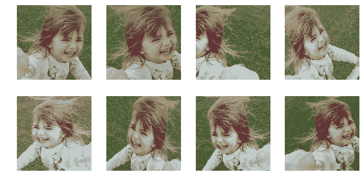
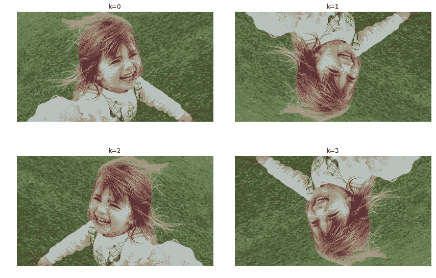

# 使用 fastai 的数据增强

> 原文：<https://towardsdatascience.com/data-augmentations-in-fastai-84979bbcefaa?source=collection_archive---------5----------------------->

## 介绍

数据扩充指的是对数据集中的图像随机应用各种变换。这些转换有助于在我们的数据集中引入更多种类。让我们看看这是什么意思。

考虑一个构建面锁的例子。当你为锁取样时，你现在拍一些照片，你就完成了。然而，当用户想要解锁他的手机时，他并不总是处于相同的照明中(亮度)。或者，用户不会总是以相同的角度面对相机(翘曲)。可能他的照片因为某种原因(抖动)显得模糊。在训练数据时，我们需要考虑这些情况。这正是数据增强带给我们的。

我们从这样一幅图像开始

我们最终得到了一堆像这样的照片

我们所做的是，不是每次都给模型提供相同的图片，而是做一些小的随机变换(一点旋转、缩放、平移等)，这些变换不会改变图像内部的内容(对于人眼而言)，但会改变其像素值。用数据扩充训练的模型将更好地概括。在训练样本数量相对较少的情况下，数据扩充也很有用。

## 工作

[全 jupyter 笔记本。](https://www.kaggle.com/dipam7/data-augmentation-in-fastai?scriptVersionId=13445701)

在这篇短文中，我们不会过多关注实现这些转换的代码。相反，我们将可视化各种可用的转换，以理解当我们执行数据扩充时在幕后发生了什么。

我们从查看 fastai 库中的缺省值开始。这些缺省值是以这样一种方式设置的，它们可以很好地用于大多数任务。

然而，我们可以根据应用程序的性质改变其中的一些(例如`do_flip`)。

`get transforms`返回两个转换列表的元组:一个用于训练集，一个用于验证集。但是，我们不想修改验证集中的图片，所以第二个列表仅限于调整图片的大小。

我们使用一个小助手功能来绘制网格。函数如下所示。

`**kwargs`意味着我们可以传递任意数量的命名参数(并且我们事先不知道数量)。要传递的一些有用的参数可以是`size`，这样所有的图像都是相同的大小，以及`padding`，以决定如何处理图像中丢失的像素。

现在我们已经把所有的部分都准备好了，让我们来看看我们能做的一些很酷的转换。

## 随机缩放/裁剪

随机裁剪或缩放图像。

## 辐状的

我们在转换中引入的随机性可以通过两种方式实现。

在第一种方法中，我们可以传递一个图像将被变换的概率。基于该概率，图像将被变换或不被变换。在下一个变换中，我们以 50%的概率将图像旋转 30 度。

在第二种方式中，我们不是传递概率，而是传递一系列值(这里是度数)。然后图像将在两个浮动之间随机旋转一个角度。

我们也可以把上面提到的 2 种方法结合起来！

## 聪明

这个转换需要一个名为`change.`的参数，设置`change`为 0 将把我们的图像转换成黑色，设置为 1 将把它变成白色

## 对比

与亮度类似，对比度可以使用`scale`参数进行设置。

## 有两个平面的

该变换结合了翻转(水平或垂直)和 90 度倍数的旋转。

## 翻转 _lr(镜像)

水平翻转图像。

## 振动

这种变换通过用来自邻域的像素随机替换图像的像素来改变图像的像素，从而导致抖动。

## 对称翘曲

更改查看图像的角度。

这些是计算机视觉项目的一些最佳增强。您可以阅读 fastai 文档了解更多信息。

一个有趣的研究领域是其他领域的数据扩充，例如声音数据。

编辑:

## [混淆:超越经验风险最小化](https://arxiv.org/abs/1710.09412)

Mixup 是一个巧妙的数据增强小技巧。在 mixup 中，我们不是提供网络原始图像，而是获取 2 幅图像，并对它们进行线性组合，如下所示:

`new_image = t * image1 + (1-t) * image2`

其中 t 是介于 0 和 1 之间的浮点数。那么我们分配给该图像的目标是原始目标的相同组合:

`new_target = t * target1 + (1-t) * target2`

看看下面的图片

狗还是猫？这里的正确答案是 70%狗，30%猫！

当执行 mixup 时，实验表明跨类(而不是同一个类)执行通常是个好主意。此外，mixup 一次应用于一个小批量，而不是整个数据集(同样工作良好)。

使用 mixup 的主要优点是它可以用几行代码实现，几乎没有任何计算开销。mixup 所做的是，它迫使你的神经网络偏向于你的类之间的简单线性行为。它使你的神经网络在对抗敌对样本时更加强健，并帮助它[更好地调整。](https://becominghuman.ai/regularization-in-neural-networks-3b9687e1a68c)

在 fastai 中，使用 mixup 非常简单:

`learner = Learner(data, model, metrics=[accuracy]).mixup()`

在我目前看到的例子中，通常是和[混合精度训练](https://becominghuman.ai/mixed-precision-training-using-fastai-435145d3178b)一起使用。阅读[这篇研究论文](https://arxiv.org/abs/1710.09412)了解更多信息。

这就是本文的全部内容。

如果你想了解更多关于深度学习的知识，可以看看我在这方面的系列文章:

 [## 深度学习系列

### 我所有关于深度学习的文章的系统列表

medium.com](https://medium.com/@dipam44/deep-learning-series-30ad108fbe2b) 

~快乐学习。