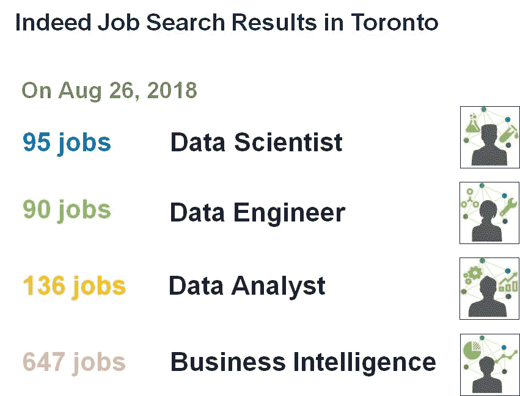
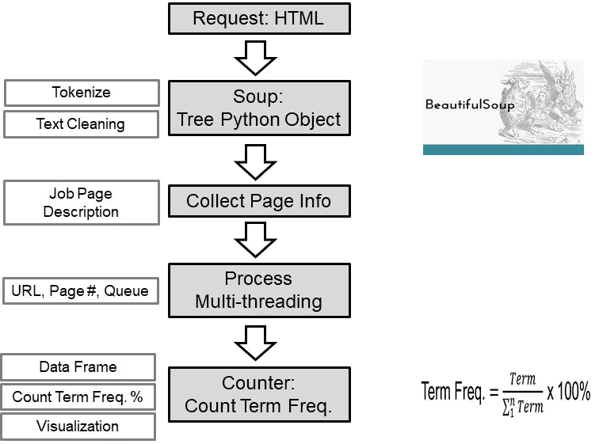
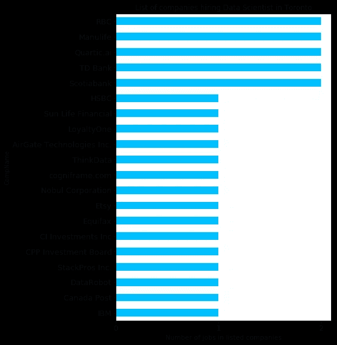
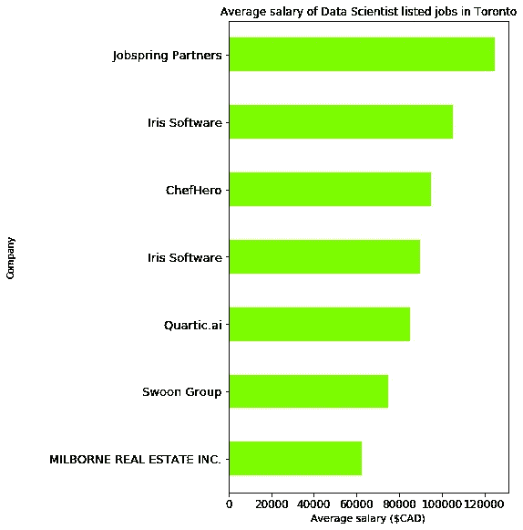
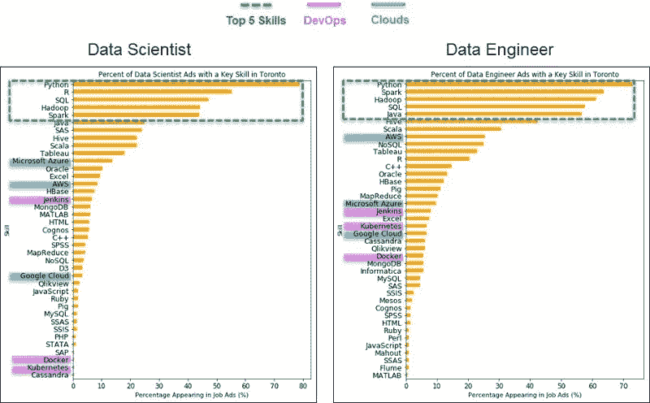
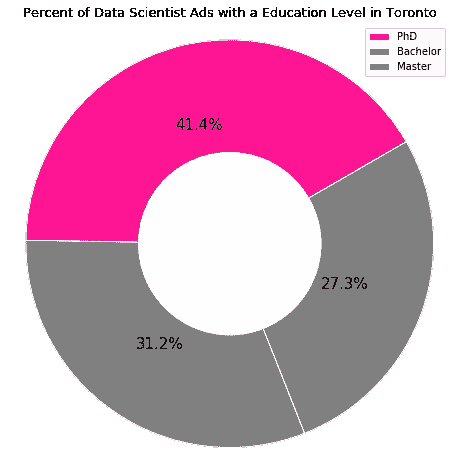
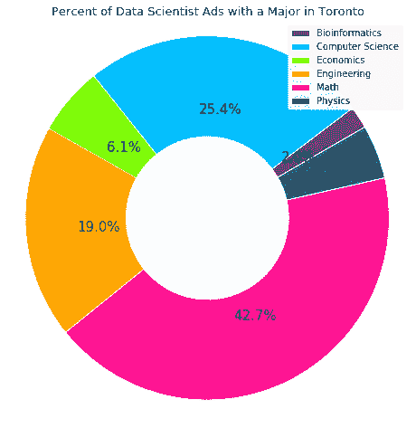

# 多伦多的数据职业市场洞察

> 原文：<https://towardsdatascience.com/data-career-market-insights-in-toronto-indeed-ca-1e50cdb88458?source=collection_archive---------27----------------------->

Figure 0\. Indeed Job Search Results on Related Data Career

这是在多伦多寻找梦想职业的绝佳时机。多伦多正在成为大恐龙数码、微软、亚马逊等软件公司的热点(即人工智能中心)。他们希望招聘以下职位的人才，如数据科学家、数据工程师、数据分析师和商业智能角色。对于应届毕业生和转行者来说，最常见的问题是:我如何才能实现我梦想的职业？

在许多情况下，大多数人会去像 Indeed.ca 这样的求职网站，输入一些关键词(例如，职位、一些工具等)。)检索求职结果。然后，人们一个接一个地查看职位描述，尽可能多地提交申请。不对！

有几个原因让你不应该这样做:

1.浪费的努力和时间:你在浪费自己的时间，也在浪费招聘公司的时间，去过滤大量不相关的简历，这些简历可能甚至不适合他们正在看的东西。

2.**你想最大化获得面试的机会**:你想象过自己不带武器去打仗吗？同样，你必须至少具备招聘经理需要考虑的基本必备工具。

那么我们能做什么呢？不要担心，我们可以通过使用 Python 库(漂亮的汤)有策略地让事情变得简单一点。有了这个库，我们可以创建一个 web scraper 函数来从 Indeed.ca 检索您在多伦多的工作搜索结果。这将有助于我们战略性地提交工作申请，并在未来的工作提交中优先考虑您学习所需工具集的目标。

在我们开始之前，让我们先从 5 个关键问题开始了解一些想法:

1.哪些公司希望聘用这些人才(如数据科学家、数据工程师等)。)

2.这些不同角色的平均工资是多少？

3.这些不同角色所需的前 5 项必备技能是什么？

4.这些不同的角色要求或推荐的教育水平是什么？

5.这些不同角色的首选教育背景(研究领域)是什么？

好了，这里是一个快速概述的数据角力管道，为真正的工作刮刀功能，我建立了回答这 5 个关键问题:

Figure 1\. Indeed Scraper Data Pipeline

第一步。连接到职务搜索 URL 页面

第二步。标记化，解析单词，然后做一些文本清理。

第三步。创建主要功能，以收集职位页面描述(职位，地点，工资等)。)

第四步。遍历每个页面的 URL 和存储的信息。

第五步。创建字典来获取所需的技能、教育水平等。计算每个特定术语的频率，然后将结果可视化！

让我们深入探讨从结果中获得的 5 个重要见解。

**A .数据科学家职位的招聘公司和平均薪酬列表:**

首先，各行各业都有数据科学家的工作。大多数工作都在 ***金融或保险公司*** 像道明、丰业银行、阳光人寿金融等。其他职业也有类似的趋势。只不过，不同的公司在招聘人才。

Figure 2\. List of Hiring Companies

其次，据报道，多伦多数据科学家的平均年薪为 91，000 美元。然而，这一薪资比 Indeed.ca 的平均薪资低了 5%。这是因为一些调查还包括了高级数据科学家的薪资。实际上，入门级数据科学家的平均年薪应该在 ***80 到 85K*** 之间。

Figure 3\. Average Salaries of a Data Scientist in Toronto

**B .数据科学家与数据工程师的比较:**

Figure 4\. Bar Charts Comparison between Data Scientist vs. Data Engineer

该图代表了每个职业要求最高的五项技能、DevOps 和云工具。以下是基于共性(相似性)和差异的两个职位之间的总结。

**通用性**:

在列出的前 5 项技能中，数据科学家和数据工程师都需要了解像 ***Python、Spark、Hadoop 和 SQL*** 这样的工具。其中 Python 和 SQL 是基本工具，而 Spark 和 Hadoop 对于拥有大数据存储的公司来说是必不可少的。

**差异**:

对于数据科学家角色，招聘公司更专注于查看 ***其他数据分析工具和数据可视化经验(即 SAS、Tableau 等。*)**。另一方面，数据工程师的角色主要集中在类似 ***云平台(AWS)和 DevOps (Jenkins，Kubernetes，Docker)*** 的工具上。

这种差异主要有两个原因。首先，数据工程师创建通向由数据科学家创建的生产 ML 模型的数据管道。他们需要具备 DevOps 工具经验。这有助于他们以最有效的方式在不同的修复和发布之间实现模型/代码部署生命周期的敏捷实践。其次，由于灵活性和成本效益，大多数初创公司或大公司都使用 AWS 等云平台，而不是内部解决方案(内部数据仓库)。不过，这在很大程度上取决于其他因素，如公司的业务/战略路线图、系统架构和环境。

**C .数据科学家的教育要求和背景**

关于教育水平，数据科学家是大多数招聘公司倾向于聘用具有博士学位的申请人的唯一职业(左图)。对于其他职业，如数据工程师、数据分析师和商业智能角色，学士学位教育足以胜任工作。

Figure 5\. Education Levels of Data Scientist Job Posted on Indeed.ca

此外，许多求职者会想知道什么样的教育背景或研究领域对数据科学家来说是理想的？从分析来看，似乎大多数招聘公司都希望应聘者来自科学、技术、工程和数学等科学、技术、工程和数学领域。特别是对于数据科学家来说，很多公司希望应聘者有数学背景，其次是计算机科学、工程等等。

Figure 6\. Educational Backgrounds Posted on Data Scientist Positions from Indeed.ca

**那么，这为什么会成为数据科学家的一种趋势呢？**

我通过自己的研究从出版的期刊、数据科学会议和与数据科学家导师的闲聊中收集了一些见解。让我们从一个问题开始，为什么大多数招聘公司都想要博士级别的候选人。

首先，随着人工智能(AI)趋势的复苏，有很多公司有兴趣建立自己的人工智能/深度学习(DL)研究和产品开发团队。他们想要拥有先进的人工智能和人工智能算法知识的人。不要只使用 R 和 Python 中已有的库和包。这些数据科学家必须能够从零开始调整和实现新的算法，以解决特定的业务问题并构建数据产品。

第二，数学似乎是许多公司希望雇佣的最著名的学科，其次是计算机科学和工程学位。这与数据科学家角色的性质密切相关。作为数据科学家，必须能够很好地理解不同领域的数学，如线性代数、微积分和统计。因为所有的 ML 算法都是关于理解如何将这些算法应用于数据集，并为解决特定的业务问题制定独特的解决方案。还有，数据科学家一定要做好编程。这就是为什么许多公司希望应聘者拥有计算机科学或工程学位的原因。大多数代码/模型开发都是在 Python/R 上完成的，作为一名数据科学家，在生产环境中编写高效且可扩展的代码对于完成工作来说至关重要。

感谢阅读这篇文章。我希望许多读者会对此感兴趣。我强烈鼓励其他行业的读者考虑学习 Python，并为您的行业市场洞察力构建一个 web scraper 函数