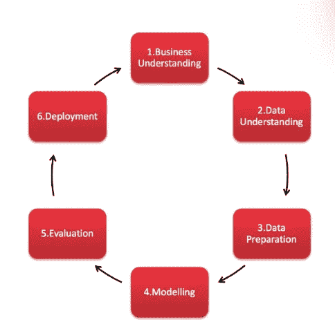

# R 降价中缺失值的数据清理、检测和插补—第 2 部分

> 原文：<https://towardsdatascience.com/data-cleaning-and-detecting-missing-values-from-australian-open-tennis-data-in-r-part-2-b4f6f32beffd?source=collection_archive---------12----------------------->

使用 2000 年至 2018 年男子巡回赛的澳大利亚网球公开赛数据在 R 中进行数据清洗和转换变量。


Photo by [The Creative Exchange](https://unsplash.com/photos/cpIgNaazQ6w?utm_source=unsplash&utm_medium=referral&utm_content=creditCopyText) on [Unsplash](https://unsplash.com/search/photos/cleaning?utm_source=unsplash&utm_medium=referral&utm_content=creditCopyText)

今天是第 4 天，标志着我的# 29 Day 数据科学项目训练营和我在数据科学中学到的东西的继续。这是一个清洗和预处理 2000 年至 2019 年澳大利亚网球公开赛网球数据的教程指南，以使用 r 预测谁可能获胜。昨天，我们合并了多个 csv 文件，并子集化了您可能会关注的数据[此处](https://medium.com/@wendy_wong7/predicting-who-will-win-the-2019-australian-tennis-open-in-the-mens-tour-merging-and-filtering-2eabffd633e9)来自博客帖子。

# 什么是 CRISP-DM 方法论？

如果你在[大会](https://generalassemb.ly/?utm_source=google&utm_medium=cpc&utm_campaign=Google_Brand_SYD_9B_General-Assembly&gclid=CjwKEAjwrpGuBRCkqeXpn-rt5hsSJAC9rxrPngSFB9v5nBfVzpynEhorCQgkk0ivBqj6RD-cuTCsdhoCLH7w_wcB)上一堂数据分析课，在你的大学上一门数据科学算法的数据科学课程，选修一门感兴趣的 IT 选修课，学习一门在线课程，或者你可能为你的教授做一个数据挖掘项目，你会遇到 CRISP-DM 的数据挖掘原理。

CRISP-DM 是数据挖掘的跨行业流程**。这也是我在悉尼大会上学到的一个规定的分析工作流程，当你在政府部门咨询时，这些原则会被用在数据科学项目中。**

这是 CRISP-DM 方法的工作流程，用于指导您解决数据分析和数据科学问题。您可以回顾 2018 年欧洲智能视觉展的每个步骤。



Source: [Smart Vision 2018](https://www.sv-europe.com/crisp-dm-methodology/)

# 商业理解

这不是一个商业问题，但问题陈述的范围是根据 2000 年至 2018 年的数据预测今年澳大利亚网球公开赛决赛的冠军。

# 数据理解

以前，我们获得了一个数据字典，并通过分析数据的整体结构来研究数据。

以下是变量的数据字典:

```
ATP = Tournament number (men)
WTA = Tournament number (women)
Location = Venue of tournament
Tournament = Name of tounament (including sponsor if relevant)
Data = Date of match (note: prior to 2003 the date shown for all matches played in a single tournament is the start date)
Series = Name of ATP tennis series (Grand Slam, Masters, International or International Gold)
Tier = Tier (tournament ranking) of WTA tennis series.
Court = Type of court (outdoors or indoors)
Surface = Type of surface (clay, hard, carpet or grass)
Round = Round of match
Best of = Maximum number of sets playable in match
Winner = Match winner
Loser = Match loser
WRank = ATP Entry ranking of the match winner as of the start of the tournament
LRank = ATP Entry ranking of the match loser as of the start of the tournament
WPts = ATP Entry points of the match winner as of the start of the tournament
LPts = ATP Entry points of the match loser as of the start of the tournament
W1 = Number of games won in 1st set by match winner
L1 = Number of games won in 1st set by match loser
W2 = Number of games won in 2nd set by match winner
L2 = Number of games won in 2nd set by match loser
W3 = Number of games won in 3rd set by match winner
L3 = Number of games won in 3rd set by match loser
W4 = Number of games won in 4th set by match winner
L4 = Number of games won in 4th set by match loser
W5 = Number of games won in 5th set by match winner
L5 = Number of games won in 5th set by match loser
Wsets = Number of sets won by match winner
Lsets = Number of sets won by match loser
Comment = Comment on the match (Completed, won through retirement of loser, or via Walkover)
```

# 数据准备—数据清理

通过分类变量的编码、转换变量和缺失值的检测，对数据进行了清理。我们已经合并了原始数据，并使用 StringAsfactors =FALSE 将“aus_open.csv”数据帧读入 R 中，以确保所有变量不会自动作为因子读取。

```
###################################
# Pre-Processing the Training Data
###################################

# Exported aust_open.csv file was exported and a new column was created in Excel to extract the year from the data with non-standardised formatting

a <- read.csv("aus_open.csv",stringsAsFactors = FALSE,header = TRUE)
```

# 探索性数据分析

使用 Hadley Wickham 的 **dplyr** 包，我使用函数 glimpse()探索了数据的结构。

```
#############################
# Exploratory Data Analysis
#############################

glimpse(a)  # view the structure of the training data
```

# 描述统计学

下面提供了描述性统计的输出，是所有数值变量和缺失值的汇总。

```
summary(a) # descriptive statistics
      ATP      Location          Tournament            Date          
 Min.   :6   Length:2413        Length:2413        Length:2413       
 1st Qu.:6   Class :character   Class :character   Class :character  
 Median :6   Mode  :character   Mode  :character   Mode  :character  
 Mean   :6                                                           
 3rd Qu.:6                                                           
 Max.   :6                                                           

      Year         Series             Court             Surface         
 Min.   :2000   Length:2413        Length:2413        Length:2413       
 1st Qu.:2004   Class :character   Class :character   Class :character  
 Median :2009   Mode  :character   Mode  :character   Mode  :character  
 Mean   :2009                                                           
 3rd Qu.:2014                                                           
 Max.   :2018                                                           

    Round              Best.of     Winner             Loser          
 Length:2413        Min.   :5   Length:2413        Length:2413       
 Class :character   1st Qu.:5   Class :character   Class :character  
 Mode  :character   Median :5   Mode  :character   Mode  :character  
                    Mean   :5                                        
                    3rd Qu.:5                                        
                    Max.   :5                                        

     WRank           LRank                 W1             L1           
 Min.   :  1.00   Length:2413        Min.   :    0   Length:2413       
 1st Qu.: 10.00   Class :character   1st Qu.:    7   Class :character  
 Median : 28.00   Mode  :character   Median :  860   Mode  :character  
 Mean   : 46.97                      Mean   : 1863                     
 3rd Qu.: 65.00                      3rd Qu.: 2145                     
 Max.   :768.00                      Max.   :16790                     
                                     NA's   :128                       
       W2              L2              W3              L3       
 Min.   :0.000   Min.   :0.000   Min.   :0.000   Min.   :0.000  
 1st Qu.:6.000   1st Qu.:3.000   1st Qu.:6.000   1st Qu.:2.000  
 Median :6.000   Median :4.000   Median :6.000   Median :4.000  
 Mean   :5.687   Mean   :4.027   Mean   :5.743   Mean   :3.903  
 3rd Qu.:6.000   3rd Qu.:6.000   3rd Qu.:6.000   3rd Qu.:6.000  
 Max.   :7.000   Max.   :7.000   Max.   :7.000   Max.   :7.000  
 NA's   :10      NA's   :10      NA's   :33      NA's   :33     
       W4              L4              W5               L5        
 Min.   :0.000   Min.   :0.000   Min.   : 0.000   Min.   : 0.000  
 1st Qu.:6.000   1st Qu.:2.000   1st Qu.: 6.000   1st Qu.: 2.000  
 Median :6.000   Median :4.000   Median : 6.000   Median : 4.000  
 Mean   :5.753   Mean   :3.734   Mean   : 5.883   Mean   : 3.813  
 3rd Qu.:6.000   3rd Qu.:6.000   3rd Qu.: 6.000   3rd Qu.: 6.000  
 Max.   :7.000   Max.   :7.000   Max.   :21.000   Max.   :19.000  
 NA's   :346     NA's   :346     NA's   :1440     NA's   :1440    
     Wsets            Lsets        Comment         
 Min.   : 0.000   Min.   : 0.0   Length:2413       
 1st Qu.: 3.000   1st Qu.: 0.0   Class :character  
 Median : 3.000   Median : 1.0   Mode  :character  
 Mean   : 4.192   Mean   : 1.7                     
 3rd Qu.: 6.000   3rd Qu.: 2.0                     
 Max.   :22.000   Max.   :20.0                     
 NA's   :1444     NA's   :1444
```

# 转换和编码分类变量

从上面的结构可以看出，一些数据属性没有转换成正确的数据类型。这是我最喜欢的部分转换变量的机会！开始了…

```
# Transform character variables into numeric variables a$W1 <- as.numeric(a$W1)
a$L1 <- as.numeric(a$L1)
a$WRank <- as.numeric(a$WRank)
a$LRank <- as.numeric(a$LRank)

##########################################################
# encoding categorical features
##########################################################

# Convert categorical variables into factors to represent their levels
a$Location <- factor(a$Location)
a$Tournament <- factor(a$Tournament)
a$Series <- factor(a$Series)
a$Court <- factor(a$Court)
a$Surface <- factor(a$Surface)
a$Best.of <- factor(a$Best.of)
a$Round <- factor(a$Round)
a$Winner <- factor(a$Winner)
a$Loser <- factor(a$Loser)
a$Comment <- factor(a$Comment)

glimpse(a)  # check that structure of categorical variables have converted with levels
```

# #为两级以上的分类变量创建虚拟变量

```
library(dummies)

Round <- dummy(a$Round)
Best.of <- dummy(a$Best.of)
Winner <- dummy(a$Winner)
Loser <- dummy(a$Loser)
Comment <- dummy(a$Comment)

head(a)   # check that the values are been converted to dummy variables
str(a)
```

# 总结描述性统计数据，并检查转换变量的结构

```
# Descriptive statistics
summary(a)# View the structure of the transformed variables the 'dplyr' way

 > glimpse(a)Observations: 2,413
Variables: 27
$ ATP        <int> 6, 6, 6, 6, 6, 6, 6, 6, 6, 6, 6, 6, 6, 6, 6, 6, 6, 6, ...
$ Location   <fct> Melbourne, Melbourne, Melbourne, Melbourne, Melbourne,...
$ Tournament <fct> Australian Open, Australian Open, Australian Open, Aus...
$ Date       <chr> "1/17/00", "1/17/00", "1/17/00", "1/17/00", "1/17/00",...
$ Year       <int> 2000, 2000, 2000, 2000, 2000, 2000, 2000, 2000, 2000, ...
$ Series     <fct> Grand Slam, Grand Slam, Grand Slam, Grand Slam, Grand ...
$ Court      <fct> Outdoor, Outdoor, Outdoor, Outdoor, Outdoor, Outdoor, ...
$ Surface    <fct> Hard, Hard, Hard, Hard, Hard, Hard, Hard, Hard, Hard, ...
$ Round      <fct> 1st Round, 1st Round, 1st Round, 1st Round, 1st Round,...
$ Best.of    <fct> 5, 5, 5, 5, 5, 5, 5, 5, 5, 5, 5, 5, 5, 5, 5, 5, 5, 5, ...
$ Winner     <fct> Agassi A., Alami K., Arazi H., Behrend T., Bjorkman J....
$ Loser      <fct> Puerta M., Manta L., Alonso J., Meligeni F., Stoltenbe...
$ WRank      <dbl> 1, 35, 41, 106, 76, 151, 39, 54, 30, 64, 98, 29, 34, 6...
$ LRank      <dbl> 112, 107, 111, 28, 81, 57, 22, 66, 51, 155, 119, 257, ...
$ W1         <dbl> 6, 6, 6, 6, 6, 7, 3, 7, 7, 7, 6, 6, 6, 6, 6, 7, 6, 6, ...
$ L1         <dbl> 2, 4, 3, 2, 7, 6, 6, 6, 6, 6, 4, 7, 7, 4, 3, 6, 4, 3, ...
$ W2         <int> 6, 7, 7, 4, 6, 6, 6, 6, 6, 5, 6, 7, 6, 6, 6, 6, 7, 6, ...
$ L2         <int> 2, 6, 6, 6, 4, 1, 1, 4, 4, 7, 4, 6, 3, 4, 3, 3, 6, 3, ...
$ W3         <int> 6, 7, 6, 6, 6, 6, 6, NA, 6, 6, 7, 1, 7, 7, 4, 7, 4, 6,...
$ L3         <int> 3, 5, 2, 7, 4, 4, 4, NA, 4, 3, 6, 6, 5, 6, 6, 6, 6, 2,...
$ W4         <int> NA, NA, NA, 6, 0, NA, 7, NA, NA, 7, NA, 6, 6, NA, 7, N...
$ L4         <int> NA, NA, NA, 3, 6, NA, 6, NA, NA, 5, NA, 3, 1, NA, 6, N...
$ W5         <int> NA, NA, NA, 6, 6, NA, NA, NA, NA, NA, NA, 6, NA, NA, N...
$ L5         <int> NA, NA, NA, 0, 4, NA, NA, NA, NA, NA, NA, 1, NA, NA, N...
$ Wsets      <int> 3, 3, 3, 3, 3, 3, 3, 2, 3, 3, 3, 3, 3, 3, 3, 3, 3, 3, ...
$ Lsets      <int> 0, 0, 0, 2, 2, 0, 1, 0, 0, 1, 0, 2, 1, 0, 1, 0, 2, 0, ...
$ Comment    <fct> Completed, Completed, Completed, Completed, Completed,...
```

# 检测缺失值

我们将尝试一些方法来检测缺失值，例如计算每列缺失值的数量、求和并取平均值。

```
# Sum the number of missing values> sum(is.na(a)) 
[1] 6810# average of the missing values in each column> mean(is.na(a)) 
[1] 0.1045264# Count the number of missing values per column> colSums(is.na(a))        ATP   Location Tournament       Date       Year     Series      Court 
         0          0          0          0          0          0          0 
   Surface      Round    Best.of     Winner      Loser      WRank      LRank 
         0          0          0          0          0          0          5 
        W1         L1         W2         L2         W3         L3         W4 
       128        131         10         10         33         33        346 
        L4         W5         L5      Wsets      Lsets    Comment 
       346       1440       1440       1444       1444          0
```

# 获取缺失值的百分比

在检测缺失值时，5%是每列的可接受阈值。输出确认了 L4、W4、L5、W5、Wsets 和 Lsets 列的缺失值大于 5%,可以删除或估算。

```
sapply(a, function(df){
  sum(is.na(df) ==TRUE)/length(df);
 })
        ATP    Location  Tournament        Date        Year      Series 
0.000000000 0.000000000 0.000000000 0.000000000 0.000000000 0.000000000 
      Court     Surface       Round     Best.of      Winner       Loser 
0.000000000 0.000000000 0.000000000 0.000000000 0.000000000 0.000000000 
      WRank       LRank          W1          L1          W2          L2 
0.000000000 0.002072109 0.053046001 0.054289266 0.004144219 0.004144219 
         W3          L3          W4          L4          W5          L5 
0.013675922 0.013675922 0.143389971 0.143389971 0.596767509 0.596767509 
      Wsets       Lsets     Comment 
0.598425197 0.598425197 0.000000000
```

我们通过 install . packages(“Amelia”)将 **Amelia 包**安装到控制台中，以帮助绘制可视化缺失值的地图。从该图中，我们观察到从以下各列中检测到缺失值:

*   Lsets —失败者集合
*   Wsets —获胜者集合
*   W5——第五盘的获胜者
*   第五盘输了
*   l4——第四盘输了
*   W4——第四盘的赢家


Plot of the percentage of missing values

# 为什么我没有删除所有丢失的值？

我试过了，但是最后一行代码帮助我创建了一个向量来删除 NAs，但是它也删除了我 50%以上的训练数据，所以它没有帮助！

view(a)# view missing values
complete . cases(a)# view missing values
which(complete . cases(a))# view 哪个行有全行值位于
哪个(！complete.cases(a)) #查看哪一行的值为 l

na_vec na_vec < -哪个(！complete.cases(a)) #创建 NA 值的向量

移除 na 行的[-na_vec] # vector。

# **如何估算缺失数据？—数字变量**

绘制估算数据是为了理解原始数据的分布。我遵循的估算技术来自作者 Michy Alice 的博客。这些是步骤:

```
# Impute missing values with "pmm" - predicted mean matching. m=5 imputed data sets is defaultimputed_Data <- mice(a.mis, m=5, maxit = 50, method = 'pmm', seed = 500)
summary(imputed_Data)

# inspect that missing data has been imputed
imputed_Data$imp$Lsets

# check imputed method
imputed_Data$meth# Plot the imputed data and inspect the distributionxyplot(imputed_Data,WRank ~ W1+L1+W2+L2+W3+L3+W4+L4+L5+W5+LRank,pch=18,cex=1)
```


# 探索性数据分析

# ggplot 数值变量的密度图

我使用 ggplot 来检查缺失值少于 5%的数值属性，以便通过密度图进行可视化。


Lsets had > 5% of missing values.

```
p1 <- ggplot(a, aes(x=a$Year)) + geom_histogram() + ggtitle(" Histogram of Year")
p1

p2 <- ggplot(a, aes(x=a$WRank)) + geom_histogram()+ ggtitle(" Histogram of Winner's Ranking")
p2

p3 <- ggplot(a, aes(x=a$LRank)) + geom_histogram()+ ggtitle(" Histogram of Loser's Ranking")
p3

p4 <- ggplot(a, aes(x=a$W1)) + geom_histogram()+ ggtitle(" Histogram of Winner in the first set")
p4

p5 <- ggplot(a, aes(x=a$L1)) + geom_histogram()+ ggtitle(" Histogram of Loser in the first set")
p5

p6 <- ggplot(a, aes(x=a$W2)) + geom_histogram()+ ggtitle(" Histogram of Winner in the second set")
p6

p7 <- ggplot(a, aes(x=a$L2)) + geom_histogram()+ ggtitle(" Histogram of Loser in the second set")
p7

p8 <- ggplot(a, aes(x=a$W3)) + geom_histogram()+ ggtitle(" Histogram of Winner in the third set")
p8

p9 <- ggplot(a, aes(x=a$L3)) + geom_histogram()+ ggtitle(" Histogram of Loser in the third set")
p9
```

# 可视化已被虚拟编码或一次性编码的分类变量

```
p16 <- plot(x = a$Comment,
     main = "Distribution of Comment", xlab = "Comment",
     ylab = "count")
p16

p17 <- plot(x= a$Winner,main = "Distribution of Winner", xlab = "Winner",
     ylab = "count")
p17

p18 <- plot( x = a$Loser, main = "Distribution of Loser", xlab = "Loser",
      ylab = "Count")
p18

p19 <- plot( x = a$Best.of, main = "Distribution of Best.of", xlab = "Best Of",
      ylab = "Count")
p19

p20 <- plot( x = a$Round, main = "Distribution of Tennis Round", xlab = "Round",
      ylab = "Count")
p20
```

这是估算数字数据的密度图:

密度图(估算数据)

关键:洋红色(估算数据)和蓝色(观察数据)


Density plot of the imputed data containing numeric variables

```
# View the data as individual points
stripplot(imputed_Data, pch = 20, cex = 1.2)
```


Stripplot of the individual imputed variables containing numeric variables

这个预处理和 EDA 的 R 脚本**在 [Github](https://github.com/wendy-wong/wendywong.github.io/blob/master/AustOpen.R) 上分享。**

**R Markdown 脚本**也保存在 [Github](https://github.com/wendy-wong/wendywong.github.io/blob/master/Aus_Open.Rmd) 中，并且可以通过命令 Knit to html 查看为 Html 文件，这在网络浏览器上对所有数据属性的绘图特别有用。

***给自己的提示:*

*1。使用 R Markdown 时，根据下面的截图，在` `{r cars}下面插入 R 代码，确切地说是第 23 行:*


*2。其次，我将与* ***图表*** *和* ***图*** *相关的第二段 R 代码插入到``` `{r pressure，echo=FALSE}部分下面，代码插入到第 214 行。*


在我们可视化了 R 中的数据之后，我们希望使用其他分析工具，比如 Tableau，来探索和可视化澳大利亚网球公开赛的数据。

快乐编码，我们将在第 3 部分继续 Tableau 的下一篇文章！