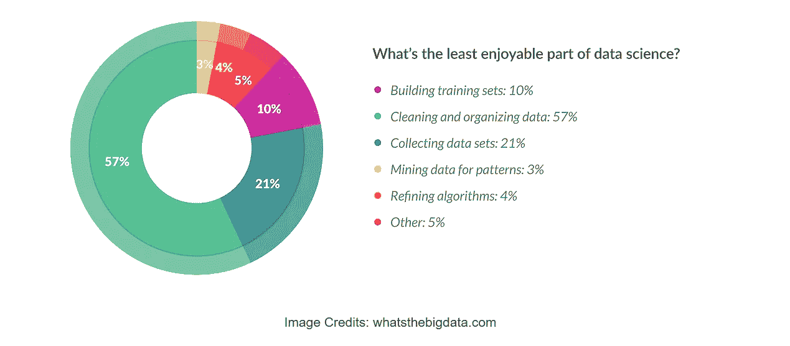
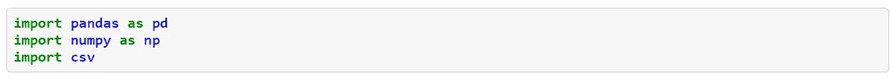
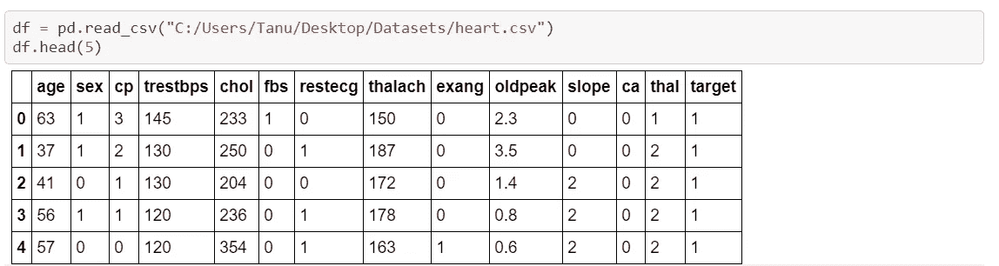
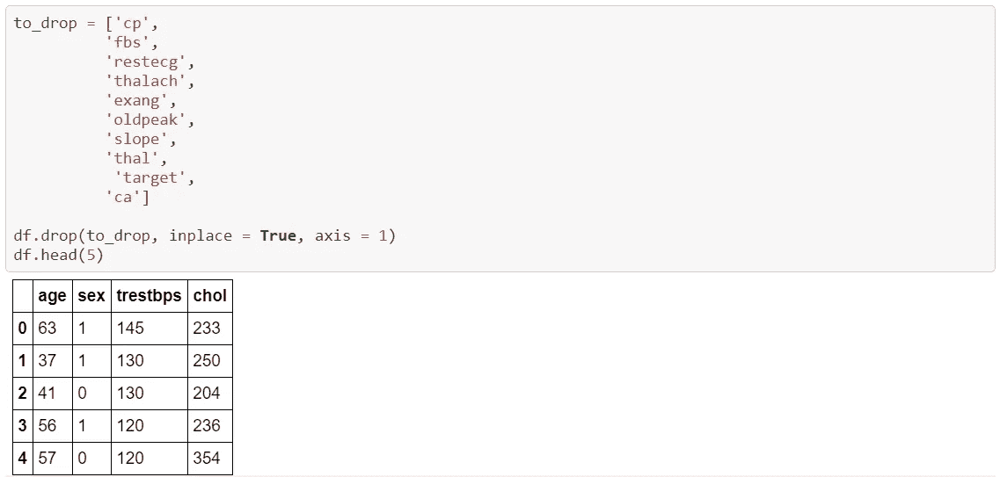
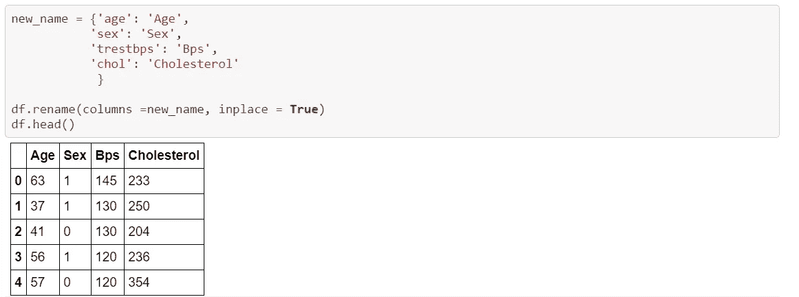
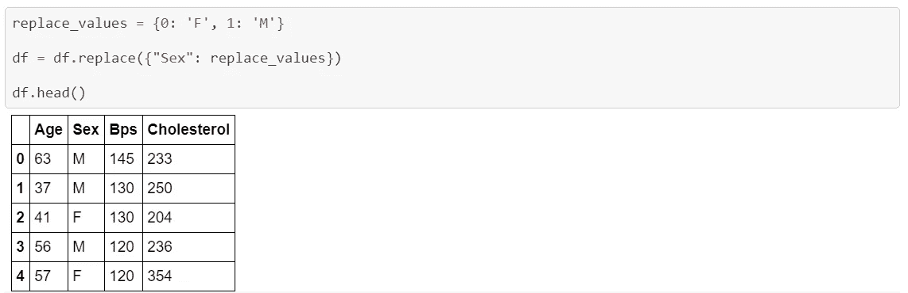

# 使用 Python 和 Pandas 库进行数据清理

> 原文：<https://towardsdatascience.com/data-cleaning-with-python-using-pandas-library-c6f4a68ea8eb?source=collection_archive---------1----------------------->

## 就数据科学而言，数据清理和组织占总权重的 57%

**整个数据清理过程分为如下所示的子任务。**

1.  *导入所需的库。*
2.  *从不同的源(Kaggle)获取数据集并显示数据集。*
3.  *删除不使用或不相关的列。*
4.  *根据我们的方便重命名列名。*
5.  *替换行的值并使其更有意义。*

尽管这个教程很小，但它是一个从小事开始，以后再动手做的好方法。我将确保所有没有 python 编程经验或者不知道什么是数据科学或数据清理的人都能很容易地理解本教程。我一开始并不了解 python，所以即使对我来说，这也是一个很好的起点。python 的一个特点是代码是不言自明的，你的关注点不应该是代码做了什么，因为代码很大程度上说明了它做了什么，而应该告诉你为什么选择这样做，这个" **why** 因素比" **what** 因素更重要。而且完整的源代码可以在我的 [**GitHub**](https://github.com/Tanu-N-Prabhu/Python/blob/master/Data_Cleaning.ipynb) 上找到。

# 步骤 1:导入所需的库。

这一步包括导入所需的库，它们是[熊猫](https://pandas.pydata.org/)、 [numpy](https://www.numpy.org/) 和 [CSV](https://docs.python.org/3/library/csv.html) 。谈到数据科学，这些是必要的库。

# 步骤 2:从不同的来源获取数据集并显示数据集。

这一步包括从不同的来源获取数据集，数据集的链接如下。

[数据集下载](https://www.kaggle.com/ronitf/heart-disease-uci)

注意:如果你使用 [**Jupyter 笔记本**](https://jupyter.org/) 来练习本教程，那么阅读 CSV 文件应该没有问题。但是如果你像我一样是一个谷歌迷，那么你应该使用 [**谷歌 Colab**](https://colab.research.google.com/notebooks/welcome.ipynb) 这是我认为最好的，用于实践数据科学，然后你必须遵循一些步骤来加载或读取 CSV 文件。所以这篇[文章](/3-ways-to-load-csv-files-into-colab-7c14fcbdcb92)帮你解决这个问题。我个人推荐大家通读这篇文章。我按照第二步阅读了那篇文章中的 CSV 文件。选择最好的一个，开始工作。

# 步骤 3:删除未使用或不相关的列

这一步包括删除不相关的列，如 cp、fbs、thalach 等等，代码基本上是不言自明的。

# 步骤 4:为了方便起见，重命名列名。

这一步包括重命名列名，因为许多列名有点混乱，难以理解。

# 步骤 5:如有必要，替换行的值。

这一步包括替换不完整的值或使值更具可读性，例如这里的**性别**字段由值 **1** 和 **0** 组成，其中 **1** 为男性，而 **0** 为女性，但对于第三人来说，这通常看起来不明确，因此将值更改为可理解的值是一个好主意。

以上是总体简单的数据清理过程，显然这不是行业级别的实际清理过程，但这是一个良好的开端，所以让我们从小数据集开始，然后再处理大型数据集，这将涉及更多的清理过程。这只是从初学者的角度给出了数据清理过程的一个概念。感谢你们花时间阅读我的文章，请关注更多更新。请在下面的评论区告诉我你对这个教程的看法。另外，如果你对代码有任何疑问，评论区都是你的。祝你有愉快的一天。