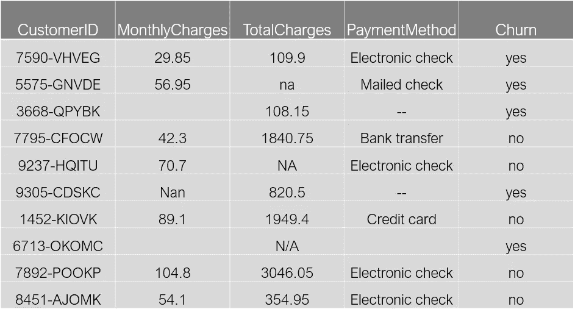
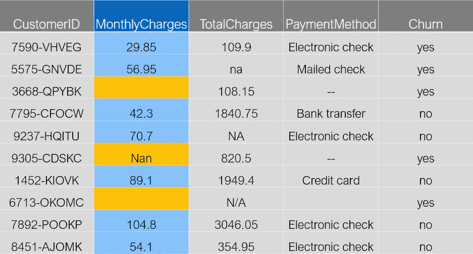
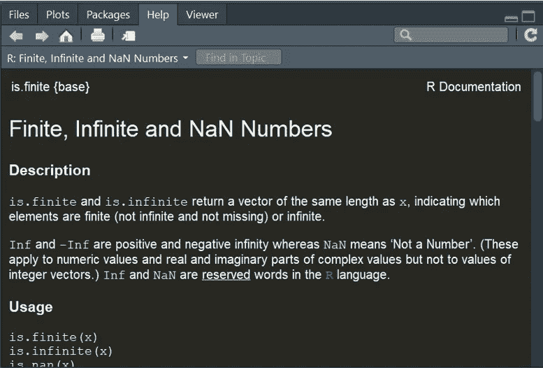
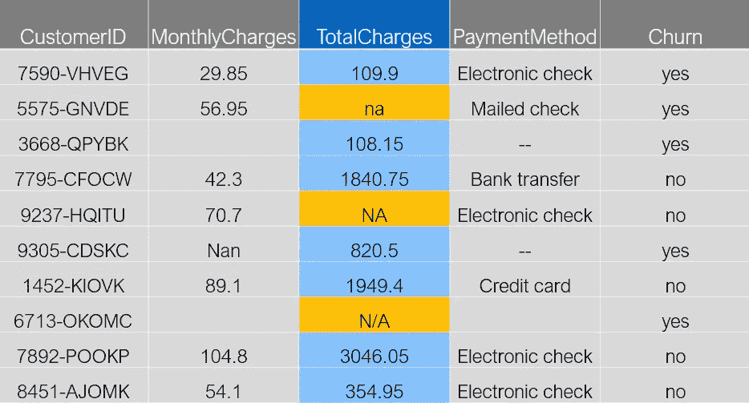
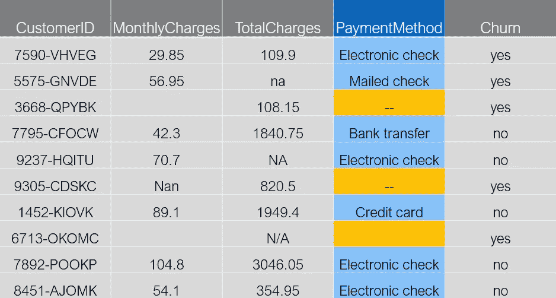

# 用 R 和 Tidyverse 清理数据:检测缺失值

> 原文：<https://towardsdatascience.com/data-cleaning-with-r-and-the-tidyverse-detecting-missing-values-ea23c519bc62?source=collection_archive---------0----------------------->


[](https://www.dataoptimal.com/data-cleaning-with-r/)****数据清洗是数据科学最重要的一个方面。****

**作为一名数据科学家，你可能会花费 80%的时间清理数据。**

**在之前的一篇文章中，我使用 Python 和 Pandas 库完成了许多[数据清理任务。](https://www.dataoptimal.com/data-cleaning-with-python-2018/)**

**这篇文章引起了如此多的关注，我想在 r。**

**在这篇文章中，你将学习如何使用来自 [Tidyverse](https://www.tidyverse.org/) 的 [tidyr](https://tidyr.tidyverse.org/) 和 [dplyr](https://dplyr.tidyverse.org/) 包来检测缺失值。**

**Tidyverse 是数据科学的最佳 R 包集合，所以您应该熟悉它。**

****

# **入门指南**

**开始任何[数据科学项目](https://www.dataoptimal.com/data-science-projects-2018/)的一个好方法就是感受数据。**

**这只是快速查看变量名和预期的变量类型。查看数据的维度也很有用。**

**探索性数据分析(EDA)极其重要，因此它值得拥有自己的博文。在本文中，我们不会讨论完整的 EDA。**

**在我们开始之前，先去我们的 github 页面[获取一份数据。确保将副本放在 R 代码所在的工作目录中。](https://github.com/dataoptimal/posts/tree/master/data%20cleaning%20with%20R%20and%20the%20tidyverse)**

**下面快速浏览一下我们的数据:**

****

**这是一个小型的[客户流失](https://en.wikipedia.org/wiki/Customer_attrition)数据集。**

**为了便于学习，该数据集展示了一些丢失值的真实示例。**

**首先，加载 tidverse 库并读入 csv 文件。**

```
library(tidyverse)# set working directory
path_loc <- "C:/Users/Jonathan/Desktop/data cleaning with R post"
setwd(path_loc)# reading in the data
df <- read_csv("telecom.csv")
```

**通常数据被读入 dataframe，但是 tidyverse 实际上使用了[tibles](https://tibble.tidyverse.org/)。**

**这些类似于数据帧，但也略有不同。要了解更多关于 tibbles 的信息，请查看数据科学的 [R 中的](https://r4ds.had.co.nz/)[这一章](https://r4ds.had.co.nz/tibbles.html)。**

**我喜欢使用`glimpse`函数来查看变量名和类型。**

```
# taking a quick look
glimpse(df)> glimpse(df)
Observations: 10
Variables: 5
$ customerID     chr "7590-VHVEG", "5575-GNVDE", "3668-QPYBK", "7...
$ MonthlyCharges dbl 29.85, 56.95, NA, 42.30, 70.70, NaN, 89.10, ...
$ TotalCharges   chr "109.9", "na", "108.15", "1840.75", NA, "820...
$ PaymentMethod  chr "Electronic check", "Mailed check", "--", "B...
$ Churn          chr "yes", "yes", "yes", "no", "no", "yes", "no"...
```

**我们可以看到有 5 个变量。**

*   **`customerID`**
*   **`MonthlyCharges`**
*   **`TotalCharges`**
*   **`PaymentMethod`**
*   **`Churn`**

**还有对每个变量类型的描述:**

*   **`customerID: chr`代表字符，字符串的别称**
*   **`MonthlyCharges: dbl`代表 double，是一种数值类型**
*   **`TotalCharges: chr`性格**
*   **`PaymentMethod: chr`人物**
*   **`Churn: chr`人物**

**有 10 个观察值，这意味着有 10 行数据。**

**现在我们已经快速地熟悉了数据，让我们回顾一些基本的数据操作。**

# **数据操作的语法:dplyr**

**在我们开始处理缺失值之前，让我们先来看一下 [dplyr 库](https://dplyr.tidyverse.org/)。**

**这只是一个快速介绍，所以请务必查看官方的 [dplyr 文档](https://dplyr.tidyverse.org/reference/index.html)以及来自数据科学的 [R 的](https://r4ds.had.co.nz/)[第 5 章数据转换](https://r4ds.had.co.nz/transform.html)。**

**这个库使用了“数据操作语法”,这基本上意味着有一组带有逻辑动词名称的函数来完成你想做的事情。**

**例如，也许您想只查看顾客。您可以过滤流失率值等于“是”的数据。**

**我们可以使用 dplyr 中的`filter`函数快速完成这项工作。**

```
# filter on customers that churned
df %>%
  filter(Churn=="yes") # A tibble: 5 x 5
  customerID MonthlyCharges TotalCharges PaymentMethod    Churn
  chr                  dbl  chr          chr              chr
1 7590-VHVEG           29.8 109.9        Electronic check yes
2 5575-GNVDE           57.0 na           Mailed check     yes
3 3668-QPYBK           NA   108.15       --               yes
4 9305-CDSKC          NaN   820.5        --               yes
5 6713-OKOMC           NA   N/A          NA               yes
```

**看一看，我们可以看到 R 返回了一个有组织的 tibble，其中只包含了客户。**

**如果你不熟悉`%>%`操作员，也被称为“管道操作员”，看看这篇[的博文](https://www.datacamp.com/community/tutorials/pipe-r-tutorial)。**

**管道是 magritter 包中的一个有用的操作符。它允许我们通过消除嵌套括号来组织我们的代码，从而使我们的代码更具可读性。**

**例如，假设我们有以下计算:**

```
# nested functions
log(sin(exp(2))) > log(sin(exp(2)))
[1] -0.1122118
```

**由于所有的括号，这不是很可读。现在让我们看一个管道示例。**

```
# piped functions
2 %>% exp() %>%
  sin() %>%
  log()
```

**显而易见，管道示例可读性更好。**

**好了，回到 dplyr。**

**我们只是使用了 filter 函数来快速过滤掉流失值等于“yes”的行。**

**也许我们也想只选择`customerID`和`TotalCharges`列。我们也可以使用`select`功能快速完成这项工作。**

```
# filter on customers that churned,
# select customerID and TotalCharges columns
df %>%
  filter(Churn=="yes") %>%
  select(customerID, TotalCharges) # A tibble: 5 x 2
  customerID TotalCharges
  chr        chr
1 7590-VHVEG 109.9
2 5575-GNVDE na
3 3668-QPYBK 108.15
4 9305-CDSKC 820.5
5 6713-OKOMC N/A
```

**我们可以看到使用这些 dplyr 函数来操作我们的数据是多么容易。**

**垂直地将函数链接在一起使得我们的代码非常易读。**

**这种编码方式一开始可能看起来有点奇怪，但是经过一点实践之后，它会变得非常有用。**

# **标准缺失值**

**现在我们对管道操作符和 dplyr 稍微熟悉了一些，让我们开始检测丢失的值。**

**我们将从 R 识别的标准缺失值开始。**

**去看看`MonthlyCharges`栏吧。**

**我们可以看到有三个值丢失了。**

****

**有两个空牢房，一个写着“南”。这些显然是缺失的价值观。**

**我们可以看到 R 如何使用`is.na`函数来识别这些。**

**首先让我们打印出该列，然后应用`is.na`。**

```
# looking at MonthlyCharges
df$MonthlyCharges
is.na(df$MonthlyCharges) > df$MonthlyCharges
 [1]  29.85  56.95     NA  42.30  70.70    NaN  89.10     NA 104.80
[10]  54.10
> is.na(df$MonthlyCharges)
 [1] FALSE FALSE  TRUE FALSE FALSE  TRUE FALSE  TRUE FALSE FALSE
```

**我们可以看到，两个缺失的单元格被识别为“NA”，另一个带有 NaN 的缺失值被 R 识别为“Nan”。**

**当我们运行`is.na`函数时，R 识别两种类型的缺失值。我们可以看到这一点，因为当我们运行`is.na`时，会返回三个`TRUE`值。**

**注意“那”和“南”的区别是很重要的。我们可以使用帮助功能来仔细查看这两个值。**

```
# using the help function to learn about NA
help(NA)
```

****

**看一下右下方的窗口，我们可以看到“NA”或“不可用”用于表示缺失值。**

**“NaN”或“非数字”用于数值计算。如果一个值是未定义的，比如 0/0，“NaN”是表示它的合适方式。**

****

**还有一个`is.nan`功能。试着用“NA”和“NaN”来运行它。您将看到它为“NaN”返回 TRUE 值，但为“NA”返回 FALSE 值。**

**另一方面,`is.na`函数更加通用，因此它将检测两种类型的缺失值。**

**让我们继续使用 dplyr 来稍微总结一下我们的数据。**

**我们可以使用`distinct`函数来查看显示在`MonthlyCharges`列中的不同值。**

```
# looking at the distinct values
df %>%
  distinct(MonthlyCharges) # A tibble: 9 x 1
  MonthlyCharges
             dbl
1           29.8
2           57.0
3           NA
4           42.3
5           70.7
6          NaN
7           89.1
8          105.
9           54.1
```

**我们可以看到有 9 个不同的值。有 10 行数据，但是“NA”出现了两次，所以有 9 个不同的值。**

**如果我们想快速计算不同的值，我们可以使用`summarise`函数。**

```
# counting unique values
df %>%
  summarise(n = n_distinct(MonthlyCharges)) # A tibble: 1 x 1
      n
     int
1     9
```

**这将返回一个简单的 tibble，其中有一列我们命名为“n ”,用于计算`MonthlyCharges`列中不同值的数量。**

**我们真正追求的是丢失值的计数。我们可以使用`summarise`函数和`is.na`来计算缺失值。**

```
# counting missing values
df %>%
  summarise(count = sum(is.na(MonthlyCharges)))# A tibble: 1 x 1
  count
     int
1     3
```

**正如我们在上面看到的，缺失值的数量是 3。**

**也许我们想同时做多件事。假设我们想要得到唯一值、缺失值以及`MonthlyCharges`的中值的计数。**

**下面是我们如何使用`summarise`实现这一点:**

```
# counting unique, missing, and median values
df %>% summarise(n = n_distinct(MonthlyCharges),
                 na = sum(is.na(MonthlyCharges)),
                 med = median(MonthlyCharges, na.rm = TRUE)) # A tibble: 1 x 3
      n    na   med
     int   int  dbl
1     9     3  57.0
```

**这产生了我们的汇总数据的一个有组织的小 tibble。**

**既然我们已经确定了缺失值，让我们用`MonthlyCharges`的中值来替换它们。为此，我们可以使用 dplyr 的`mutate`函数。**

```
# mutate missing values
df %>%
  mutate(MonthlyCharges
         = replace(MonthlyCharges,
                   is.na(MonthlyCharges),
                   median(MonthlyCharges, na.rm = TRUE))) # A tibble: 10 x 5
   customerID MonthlyCharges TotalCharges PaymentMethod    Churn
    chr                 dbl  chr          chr              chr
 1 7590-VHVEG           29.8 109.9        Electronic check yes
 2 5575-GNVDE           57.0 na           Mailed check     yes
 3 3668-QPYBK           57.0 108.15       --               yes
 4 7795-CFOCW           42.3 1840.75      Bank transfer    no
 5 9237-HQITU           70.7 NA           Electronic check no
 6 9305-CDSKC           57.0 820.5        --               yes
 7 1452-KIOVK           89.1 1949.4       Credit card      no
 8 6713-OKOMC           57.0 N/A          NA               yes
 9 7892-POOKP          105\.  3046.05      Electronic check no
10 8451-AJOMK           54.1 354.95       Electronic check no
```

**我们可以看到，在三个不同的点上，缺失值被替换为中值 57。**

**只是为了再次检查这是否有效，让我们再次打印出整个 tibble。**

```
df# A tibble: 10 x 5
   customerID MonthlyCharges TotalCharges PaymentMethod    Churn
    chr                 dbl  chr          chr              chr 
 1 7590-VHVEG           29.8 109.9        Electronic check yes
 2 5575-GNVDE           57.0 na           Mailed check     yes
 3 3668-QPYBK           NA   108.15       --               yes
 4 7795-CFOCW           42.3 1840.75      Bank transfer    no
 5 9237-HQITU           70.7 NA           Electronic check no
 6 9305-CDSKC          NaN   820.5        --               yes
 7 1452-KIOVK           89.1 1949.4       Credit card      no
 8 6713-OKOMC           NA   N/A          NA               yes
 9 7892-POOKP          105\.  3046.05      Electronic check no
10 8451-AJOMK           54.1 354.95       Electronic check no
```

**看起来所有丢失的值都回来了。发生了什么事？**

**这引出了重要的一点。dplyr 包不会就地修改数据。**

**基本上，这意味着如果我们用一个管道操作符将一个`mutate`应用于一些数据，它将向我们显示数据的一个修改视图，但这不是一个永久的修改。**

**为了永久地修改数据，我们需要使用赋值操作符`<-`将 mutate 赋值给原始数据。**

**我们会这样做:**

```
# mutate missing values, and modify the dataframe
df <- df %>%
  mutate(MonthlyCharges = replace(MonthlyCharges,
                                  is.na(MonthlyCharges),
                                  median(MonthlyCharges, na.rm = TRUE)))
```

**现在，如果我们再看一下数据，它应该会被修改。**

```
df # A tibble: 10 x 5
   customerID MonthlyCharges TotalCharges PaymentMethod    Churn
    chr                 dbl  chr          chr              chr
 1 7590-VHVEG           29.8 109.9        Electronic check yes
 2 5575-GNVDE           57.0 na           Mailed check     yes
 3 3668-QPYBK           57.0 108.15       --               yes
 4 7795-CFOCW           42.3 1840.75      Bank transfer    no
 5 9237-HQITU           70.7 NA           Electronic check no
 6 9305-CDSKC           57.0 820.5        --               yes
 7 1452-KIOVK           89.1 1949.4       Credit card      no
 8 6713-OKOMC           57.0 N/A          NA               yes
 9 7892-POOKP          105\.  3046.05      Electronic check no
10 8451-AJOMK           54.1 354.95       Electronic check no
```

**这次`MonthlyCharges`列被永久修改。请记住，当您想要使用 dplyr 永久地变更您的数据时，您需要将 mutate 分配给原始数据。**

# **非标准缺失值**

**很多时候，你不会幸运地拥有 R 能马上识别的所有标准缺失值类型。**

**让我们快速浏览下一篇专栏文章`TotalCharges`，了解我的意思。**

****

**我们可以看到有三个不同的缺失值，“na”、“NA”和“N/A”。**

**在前面的例子中我们看到 R 将“na”识别为缺失值，但是“NA”和“N/A”呢？**

**让我们看看这个列，并使用`is.na`来看看 R 是否将所有这些都识别为缺失值。**

```
# looking at missing values
df$TotalCharges
is.na(df$TotalCharges) > is.na(df$TotalCharges)
 [1] FALSE FALSE FALSE FALSE  TRUE FALSE FALSE FALSE FALSE FALSE
```

**查看结果，我们可以看到 R 只将“NA”标识为缺失值。**

**让我们使用`summarise`函数来看看 R 找到了多少个丢失的值。**

```
# counting missing values
df %>%
  summarise(count = sum(is.na(TotalCharges)))# A tibble: 1 x 1
  count
     int
1     1
```

**结果证实 R 只找到一个丢失的值。**

**我们需要用“na”替换“NA”和“N/A ”,以确保 R 将所有这些都识别为缺失值。**

**让我们使用`mutate`函数将这些替换为正确的缺失值类型。请记住，我们需要使用赋值操作符来确保更改是永久性的。**

```
# replacing with standard missing value type, NA
df <- df %>%
  mutate(TotalCharges = replace(TotalCharges, TotalCharges == "na", NA)) %>%
  mutate(TotalCharges = replace(TotalCharges, TotalCharges == "N/A", NA))
```

**如果我们再看一下这一列，我们可以看到所有缺失的值都被 r 正确地识别出来了。**

```
# taking another look
df$TotalCharges
is.na(df$TotalCharges)> df$TotalCharges
 [1] "109.9"   NA        "108.15"  "1840.75" NA        "820.5"
 [7] "1949.4"  NA        "3046.05" "354.95"
> is.na(df$TotalCharges)
 [1] FALSE  TRUE FALSE FALSE  TRUE FALSE FALSE  TRUE FALSE FALSE
```

**现在我们可以看到 R 选择了所有三个丢失的值。**

**在我们替换丢失的值之前，还有另一个问题。**

**r 认为列值是字符。我们可以用`glimpse`函数来确认这一点。**

```
> glimpse(df$TotalCharges)
 chr [1:10] "109.9" NA "108.15" "1840.75" NA "820.5" "1949.4" NA ...
```

**让我们把它们改成数字类型。**

```
# changing to numeric type
df$TotalCharges <- as.numeric(df$TotalCharges)
glimpse(df$TotalCharges) > df$TotalCharges <- as.numeric(df$TotalCharges) 
> glimpse(df$TotalCharges)
 num [1:10] 110 NA 108 1841 NA ...
```

**最后，让我们用中间值替换缺失值。**

```
# replace missing values with median
df <- df %>%
  mutate(TotalCharges = replace(TotalCharges,
                                is.na(TotalCharges),
                                median(TotalCharges, na.rm = T)))
df$TotalCharges> df$TotalCharges
 [1]  109.90  820.50  108.15 1840.75  820.50  820.50 1949.40  820.50
 [9] 3046.05  354.95
```

**更改所有缺失值的一个更简单的方法是在执行任何操作之前将列更改为 numeric。**

**让我们再次导入数据，这样我们就又有丢失的值了。**

```
# importing the data again
df <- read_csv("telecom.csv")
df$TotalCharges> df$TotalCharges
 [1] "109.9"   "na"      "108.15"  "1840.75" NA        "820.5"
 [7] "1949.4"  "N/A"     "3046.05" "354.95"
```

**现在让我们试着将该列改为数字。**

```
# change TotalCharges to numeric type
df$TotalCharges <- as.numeric(df$TotalCharges)
df$TotalCharges> df$TotalCharges <- as.numeric(df$TotalCharges)
Warning message:
NAs introduced by coercion 
> df$TotalCharges
 [1]  109.90      NA  108.15 1840.75      NA  820.50 1949.40      NA
 [9] 3046.05  354.95
```

**这一次，所有不同的缺失值类型都被自动更改。**

**虽然这有点短，但我并不总是喜欢这种解决方案。**

**这对于我们的特定示例是有效的，但是如果您试图检测异常或其他脏数据，这可能不是一个好的解决方案。**

**请务必阅读 R 控制台上类似这样的警告。它可以提供有价值的信息。**

# **更多缺失值**

**到目前为止，我们已经查看了像“NA”这样的标准缺失值和像“n/a”和“N/A”这样的非标准值。**

**还有许多其他方法来表示丢失的数据。**

**也许我是手动输入数据，并选择使用“—”来表示缺少的值。**

**另一方面，也许你更喜欢将单元格留空。**

**让我们了解一下如何检测这些更不常见的缺失值类型。**

**看一看`PaymentMethod`栏目:**

****

**我们可以看到有三个值丢失了。**

**两个用“—”表示，一个只是一个空单元格。**

**看看 R 对这些怎么看:**

```
# looking at PaymentMethod
df$PaymentMethod
is.na(df$PaymentMethod) > is.na(df$PaymentMethod)
 [1] FALSE FALSE FALSE FALSE FALSE FALSE FALSE  TRUE FALSE FALSE
```

**r 只是为了识别一个丢失的值，即空单元格。**

**让我们继续使用 mutate 将“—”改为 NA。**

```
# replacing "--" with NA
df <- df %>%
  mutate(PaymentMethod = replace(PaymentMethod, PaymentMethod ==  "--", NA))
is.na(df$PaymentMethod)
df$PaymentMethod> df$PaymentMethod
 [1] "Electronic check" "Mailed check"     NA
 [4] "Bank transfer"    "Electronic check" NA
 [7] "Credit card"      NA                 "Electronic check"
[10] "Electronic check"
```

**现在我们可以看到所有三个缺失的值都显示出来了。**

**到目前为止，我们要么不考虑缺失值，要么用中间值代替它们。**

**如何处理字符类型列中的缺失值？**

**因为`PaymentMethod`列中的所有条目都是字符串，所以没有中间值。**

**让我们将 NAs 转换为一个新的类别，称为“不可用”，而不仅仅是排除丢失的值。**

```
# replace NA with "unavailable"
df <- df %>%
  mutate(PaymentMethod = replace(PaymentMethod, is.na(PaymentMethod), "unavailable"))df$PaymentMethod> df$PaymentMethod
 [1] "Electronic check" "Mailed check"     "unavailable"     
 [4] "Bank transfer"    "Electronic check" "unavailable"     
 [7] "Credit card"      "unavailable"      "Electronic check"
[10] "Electronic check"
```

**现在我们可以看到，我们的三个缺失值 NA 已经被转换为一个新的类别“不可用”。**

**有时值丢失是有原因的，所以保留这些信息以查看它如何影响我们的机器学习模型中的结果是很好的。**

**我们不会在这篇文章中讨论这些细节，但是请记住，丢弃丢失的值可能并不总是一个好主意。**

# **结论**

**在这篇文章中，我们了解了数据科学中最重要的技能之一[数据清理](https://www.dataoptimal.com/data-cleaning-with-r/)。**

**具体来说，我们着眼于检测不同类型的缺失值。**

**我们还学习了如何替换数字和字符类型的缺失值。**

**您可能会花费高达 80%的时间来清理数据，因此这是一项非常有价值的技能。**

**有关使用 Python 清理数据和检测缺失值的信息，请查看[这篇文章](https://www.dataoptimal.com/data-cleaning-with-python-2018/)。**