# 使用哈密顿动力学的数据聚类

> 原文：<https://towardsdatascience.com/data-clustering-using-hamiltonian-dynamics-eb310f30cc94?source=collection_archive---------12----------------------->

## 平面和曲面数据的灵活聚类算法简介。

想象一下，你最终得到了一份数据科学的工作，它需要手动检查、标记和分类添加到数据集的每一个新数据。这样的工作会是一个枯燥乏味的工作！此外，今天收集的数据量超过了大西洋的水量。这不可能由一个人完成，更不用说有一大群数据科学家了。解决办法？您可能听说过数据聚类。这是将数据分组并将其分类到组和簇中的自动化过程。

一个集群可以被认为是数据的集合，这些数据彼此之间有许多相似之处，并且它们与其他集群中的对象不同。在本文中，以简化的方式解释了一种依赖于哈密顿动力学的聚类算法。在数据科学中使用哈密顿动力学并不新鲜，例如在 MCMC 采样中就使用了这种方法。在下一节中，我将非常简单地解释我所说的哈密尔顿动力学以及这种类型的聚类背后的基本思想。在[(卡萨格兰德、萨萨诺、&阿斯托尔菲，2012](https://ieeexplore.ieee.org/document/6244703) )中提出了使用哈密顿动力学进行数据聚类的想法。

许多聚类算法基于欧几里德距离的思想，而这里的思想是使用水平曲线来定义聚类的边界。巧合的是，这些边界是哈密顿系统的解。为了说明这一点，考虑将房屋按各自的街区分类的问题。基于距离的算法将通过找到所述房屋与邻近的其他房屋之间的平均距离来识别所述房屋的邻近区域。水平集方法类似于通过周围的街道来定义社区，并测试房子是否在社区的街道回路内。

与其他聚类算法不同，这种方法最大的优点是不需要事先知道聚类数。不仅如此，算法的几何性质和哈密顿动力学允许我们从其他几何信息中获益，如几何矩来分类和聚类，甚至建模时变聚类。遗憾的是，本文没有涉及动态集群的处理。另一个优点是，我们可以在几何对象(如球体)的表面上执行聚类，而无需求助于额外的数据预处理或转换。

# 哈密顿力学

首先，什么是哈密顿动力学？要回答这个问题，我们需要回到牛顿动力学。从高中物理课上，我们知道牛顿第二定律指出力与质量乘以加速度成正比，牛顿第三定律指出作用在物体上的力需要平衡。从这两条定律我们可以推导出运动方程。

如果我们考虑一个质量为 *m* (或一组 *N* 的粒子)沿着轨迹 *x(t)* 运动，那么根据牛顿第二定律，当施加外力 *F* 时，运动方程为

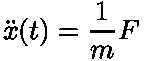

这描述了加速度如何随时间变化。同样，这里的轨迹是用笛卡尔坐标描述的。牛顿动力学的描述很大程度上依赖于所使用的坐标系，当试图用几何约束来模拟系统时，就像球体上的钟摆，这变得非常混乱。此外，当我们想研究一个机械系统的对称性，这样的描述成为一个负担。你可能会想，为什么我们关心对称性？它们对应于系统的守恒量，用于简化运动方程。解决牛顿力学缺点的方法是使用一种不同的公式，它考虑到了约束和对称性。

这就引出了哈密顿动力学，哈密顿动力学从哈密顿最小作用量原理推导出运动方程(与牛顿运动方程相同)，这是一个极值原理。它指出(在给定的时间间隔内)，动力系统在两点之间遵循的轨迹是这样的，动能和势能之间的差的时间积分最小。用数学术语来说，这意味着

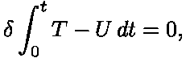

被积函数 *T - U* 称为**拉格朗日**L*L*它的量纲是能量。这意味着积分就是作用。最小化意味着动力学采用从初始位置到终点所需能量最少的路径。此外，轨迹解**欧拉-拉格朗日方程**

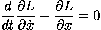

这相当于牛顿方程。这个等式的推导超出了本文的范围，但是好奇的读者可以参考以下书籍中的一本来获得详细而严格的阐述 [(Arnol'd，1978)](https://www.springer.com/gp/book/9780387968902) 或者 [(Abraham，& Marsden，1978)](https://authors.library.caltech.edu/25029/) 。此时，我们需要位置和速度 *(x(t)，v(t))* 来计算拉格朗日量。其中速度 *v(t)* 是位置 *x(t)* 的时间导数。我们用动量代替速度，我们把拉格朗日量写成 *L = p v — H(x，p)* ，其中 *H* 是**哈密顿量**。在哈密尔顿公式中，轨迹求解哈密尔顿方程

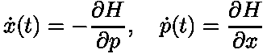

它等价于欧拉-拉格朗日方程，但是它不是一个二阶时间导数的方程，我们有两个只有一阶时间导数的方程。一种类型的哈密顿动力学是所谓的保守系统，这种系统保持哈密顿量 *H* ，并且当将 *H* 视为水平函数时，轨迹定义了水平集。

# 该算法

## 第一步

我们要做的第一件事是定义哈密顿函数 *H* 为

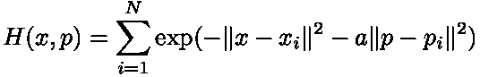

其中 *(x* ᵢ *，p* ᵢ *)* for *i=1，…，N* 是我们采集的数据点。让我们用𝓟.来表示收集的数据集人们可以选择不同的哈密顿量，但这里我们坚持使用高斯函数，因为我们可以将其视为概率密度函数，其中 *N* 个模式位于 *(x* ᵢ *，p* ᵢ *)* 。

## 第二步

算法的第二步是选择参考值 *H* ᵣ，它定义了哈密顿量的水平集。从概率密度函数的观点来看，这可以看作是等密度曲线。

## 第三步

第三步是选择 *i* ᵗʰ数据点 *(x* ᵢ *，p*ᵢ*)*𝓟，我们找到第一条水平曲线𝓢ᵢ.这是通过求解下面的哈密尔顿方程来实现的

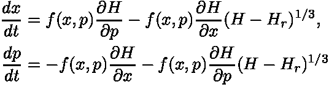

选择 *(x* ᵢ *，p* ᵢ *)* 作为初始条件。这里我们选择函数 *f* 为

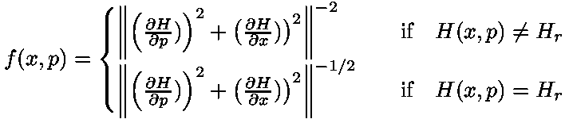

函数 *f* 的思想是，如果轨迹偏离水平曲线，则强制轨迹落在 *H* ᵣ上。当我们到达一个点 *(x* ᵢ *，p* ᵢ *)* 与 *H(x* ᵢ *，p* ᵢ *) = H* ᵣ，那么我们就到达了水平曲线，哈密尔顿方程中右手边的第二项变为零。因此，汉密尔顿方程的解将保持在水平曲线上。

## 第四步

计算出水平曲线𝓢ᵢ后，我们进入第四步，对于𝓟的所有其他数据点，我们检查它们是否在曲线𝓢ᵢ内，这是通过检查绕组数ω *(x* ᵢ *，C* ⱼ *)* ，for *j= i+1，…，N* 是否由沿曲线𝓒ⱼ.的积分定义来完成的数学上是这样的

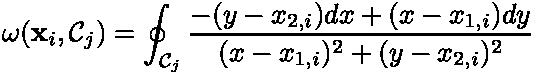

是一个正数。简而言之，缠绕次数给出了闭合曲线围绕其内部某点缠绕的次数。对于这种算法，正的缠绕数表示一个数据点属于一个集合。当绕组数ω *(x* ᵢ *，C* ⱼ *) > 1* 时，我们从集合𝓟.中删除点 *(x* ᵢ *，p* ᵢ *)*

我们重复步骤 3 和 4，直到𝓟成为一个空集。该算法的结果是由水平曲线𝓢ₐ定义的聚类组，对于 *a = 1，…，M* ，其中 *M* 是聚类组的数量。

# 运行中的算法

在所有这些例子中，我们将数据视为 *(x，p)* 空间中的元素，例如，二维图像的像素是一个点 *(x，p)* 。第一个例子是对鸟群使用基于哈密顿的聚类，类似于[(卡萨格兰德，萨萨诺，&阿斯特尔菲，2012)](https://ieeexplore.ieee.org/document/6244703) 中提出的例子。

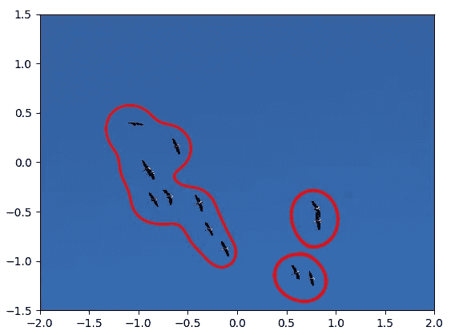

Birds are grouped into three different groups using the algorithm described above.

第二个例子是聚类螺旋。有三个螺旋，我们演示了聚类算法如何识别数据点并相应地将它们分组到螺旋组中。

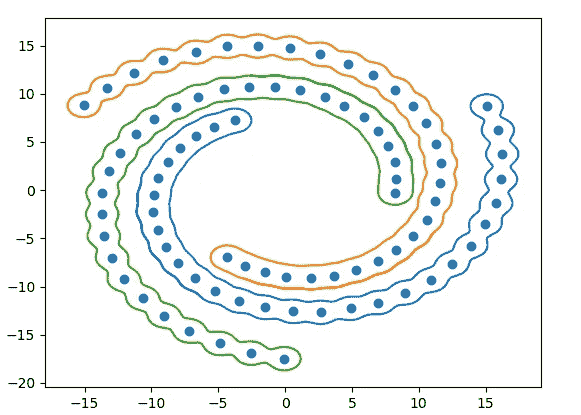

This is a demonstration of how using level sets of a Hamiltonian function can help group points into three distinct spirals.

第三个例子是第二个例子的扩展，它包括在一个球体上聚集一个螺旋。这利用了哈密尔顿函数的对称性，对哈密尔顿函数和哈密尔顿方程进行了修改。该算法的结果如下图所示:

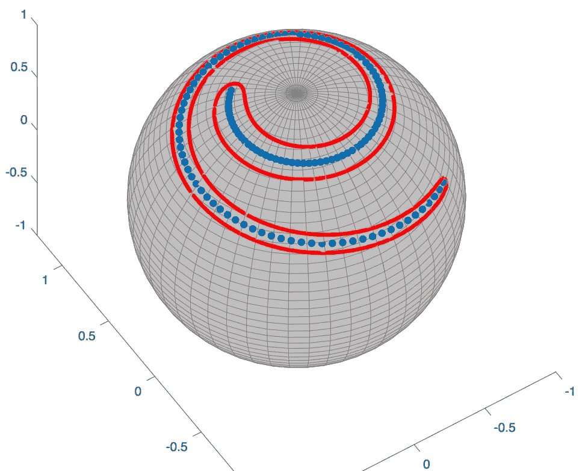

This example demonstrates how Hamiltonian-based clustering can be used for applications when the surface is curved. This does not rely on transforming the points to a suitable space, the algorithm works directly on the surface of the sphere.

# 结论

使用哈密顿动力学不同于其他方法，它严重依赖于微积分和辛几何，这是我有意避免的，复杂的数学带来了一些不同的优势。这种方法仍处于萌芽阶段，有许多研究途径需要探索，以开发数据挖掘算法。一个未探索的领域是守恒量的作用以及它们如何潜在地用于物体识别。我计划在可预见的未来从事这些工作，所以请关注这个空间！

如果你对这里提到的任何事情有疑问，你可以通过 [LinkedIn](http://linkedin.com/in/nader-g-813832148) 联系我。感谢阅读！

# 参考

1.  D.卡萨格兰德、m .萨萨诺和 a .阿斯托尔菲，“基于哈密顿的聚类:数据挖掘和图像处理中的静态和动态聚类算法”，载于《IEEE 控制系统杂志》，第 32 卷，第 4 期，第 74–91 页，2012 年 8 月。

*原载于 https://nadertg.github.io/MechanicsData/*