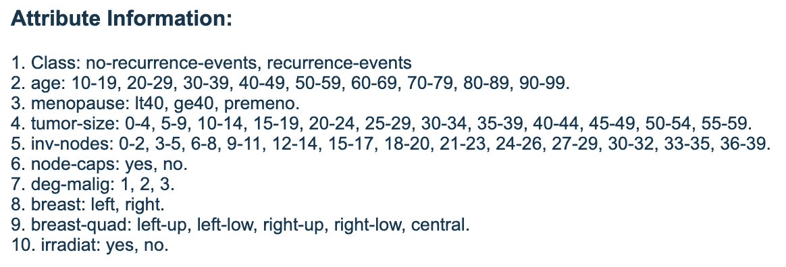

# 数据收集可能不像看起来那么容易

> 原文：<https://towardsdatascience.com/data-collection-might-not-be-as-easy-as-it-might-seem-fac13f233b54?source=collection_archive---------23----------------------->

## 深入探索数据收集流程

Photo by [Milan Seitler](https://unsplash.com/@milanseitler?utm_source=medium&utm_medium=referral) on [Unsplash](https://unsplash.com?utm_source=medium&utm_medium=referral)

我在 GitHub 上的一些最受欢迎的存储库都是关于数据收集的，要么通过网络抓取，要么使用应用编程接口(API)。我的方法一直是找到一个可以获取数据的资源，然后直接开始获取数据。收集完数据后，只需保存，得出见解，就可以了。

但是如果你想共享数据呢？如果有人正在寻找这个数据集，但他们不知道如何着手，该怎么办？如果他们有这个数据集，但不知道每一列的含义，或者如果他们需要更多信息，不知道在哪里浏览，该怎么办？出现这些问题是因为数据共享和可用性很重要，但几乎没有人试图努力使其可复制和易于访问。

这是数据收集最佳实践产生的地方。元数据和数据一样重要，因为没有元数据，数据可能毫无用处。让我们深入探讨一下，这是什么，以及每个人都应该做些什么来使数据收集的过程正确！

# 从弄清楚收集什么开始

Photo by [Edho Pratama](https://unsplash.com/@edhoradic?utm_source=medium&utm_medium=referral) on [Unsplash](https://unsplash.com?utm_source=medium&utm_medium=referral)

一如既往，第一步是寻找已经存在的数据。有人可能已经收集了您想要为他们的问题收集的类似或相同的数据。如果你发现了这样的数据，拿走它(如果他们提供的话),并在你使用该数据进行任何分析的任何时间任何地点适当地引用你的来源。就是这样！

但是，如果你没有找到你需要的数据，你必须自己收集。它可能是你从维基百科的网站上抓取的维基百科页面列表，你可能想要使用 GitHub API 为你的 GitHub 帐户获取的存储库信息，或者从传感器收集的数据。你能收集的东西几乎是无限的。

# 收集数据

Photo by [Markus Spiske](https://unsplash.com/@markusspiske?utm_source=medium&utm_medium=referral) on [Unsplash](https://unsplash.com?utm_source=medium&utm_medium=referral)

无论你决定收集什么，开始收集你的数据。您可以使用 BeautifulSoup 从 HTML 页面中提取信息，根据需要使用 API 的文档访问它们，或者创建一个 Android 应用程序，从传感器中读取数据并将其保存到 CSV 文件中。

一旦你有了你想要的数据，你可能想和其他人分享你的工作。你会希望其他人理解你收集了什么，你为什么收集，也许通过适当引用你的工作来使用你的数据。然后，以其他人可以理解和使用的适当格式保存数据变得至关重要。

# 关于您的数据的数据—元数据

现在，我将告诉你一些我们经常使用但经常忽略的数据。是的，我说的是元数据。这些信息告诉您每一列的含义、度量单位、数据收集时间等等。

让我们用一个例子来理解元数据的重要性。UCI 机器学习库包括一长串数据集，您可以使用这些数据集进行分析和预测。让我们挑选一下[兽癌数据集](https://archive.ics.uci.edu/ml/datasets/Breast+Cancer)。这是数据集的外观:

Breast Cancer Data Set (Data)— UCI Machine Learning

仅仅通过查看数据而没有额外的信息，我们甚至无法弄清楚每一列的含义，更不用说对其进行任何分析了。但就在我展示下图中的列描述时，我们可以使用数据集、提取信息、执行探索性分析和进行预测。

Breast Cancer Data Set (Attributes) — UCI Machine Learning

这就是关于数据的信息非常重要的原因。这一重要步骤可以成就或毁灭你的数据集。

# 但是我们应该收集什么呢？

Photo by [Phad Pichetbovornkul](https://unsplash.com/@sgotty?utm_source=medium&utm_medium=referral) on [Unsplash](https://unsplash.com?utm_source=medium&utm_medium=referral)

仔细想想，您会发现有很多东西可以作为元数据收集，比如收集日期、位置、列描述等等。因此，存在一个统一的元数据标准集合，人们可以从中进行选择，以便其他人可以获得完整的信息。一些常见的例子如下:

## 都柏林核心

[Dublin Core](https://www.dublincore.org/specifications/dublin-core/) 包括一个需要指定的数据元素列表，比如`Date Created`、`Creator`和其他信息。

## 元数据编码和传输标准

[元数据编码和传输标准(METS)](http://www.loc.gov/standards/mets/) 是描述性和结构化数据的元数据标准，表示为可扩展标记语言(XML)。

## 国际标准化组织

ISO 定义了一系列全球通用的标准。标准可能因用途和地区而异。例如，对于表示时间的标准方法——有一个 [ISO 8601](https://www.iso.org/iso-8601-date-and-time-format.html) 标准，它表示如何以一种普遍理解的模式书写日期和时间。

也存在其他标准，但使用情况取决于您试图收集的数据。收集元数据时的基本要点是，如果有人今天或将来某个时候决定处理您的数据，数据和元数据应该足以描述一切。

然而，要做到这一点，除了元数据之外，还有另一个重要信息——出处。

出处包括关于数据收集过程的信息，以及是否对该数据进行了任何转换。在收集数据时，我们跟踪数据收集的时间和方式、测量设备、过程、数据收集器、任何限制以及关于数据处理过程的一切(如果完成)。

# 结论

完整的数据包以及元数据和出处使数据以可用的格式经得起未来的考验。

欢迎分享你的想法、想法和建议。我很乐意收到你的来信。