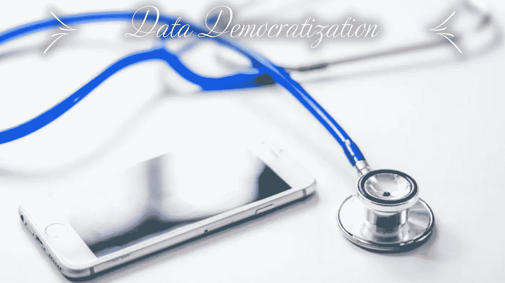

# 数据民主化

> 原文：<https://towardsdatascience.com/data-democratization-918416c0f0e0?source=collection_archive---------24----------------------->

## ***简介、定义、利弊&利弊、结论***

在当今世界，每家企业都受到来自各个角度的数据轰炸。总是有一种持续的压力，那就是使用我们从数据中获得的各种见解来即兴发挥我们的业务绩效。因此，处理后的数据的使用量令人难以置信地激增了对数据民主化的渴望和需求。所以，如果你想知道上面提到的术语对你来说是完全陌生的，让我们深入研究一下。

## “数据民主化”一词的诊断

B 在掌握一些关于**数据民主化**的知识之前，我们需要了解**民主化**是什么意思。我们可以将其定义为*引入民主制度或民主原则*；进一步分解这个术语，我们可以把它解释为*让每个人都能得到某物的行为*。

正如其名，**数据民主化**是使*数据对每个人都可用的过程*，这意味着*没有在数据网关处制造瓶颈的*看门人。它让人们能够更好地理解数据，从而加快决策过程，并为组织发现绝佳的机会。最终的任务是让任何人在需要时随时使用这些数据，在没有障碍的情况下对决策产生重大影响。

数据被 IT 部门“保留”。各种业务单位，如市场营销、销售、行政人员总是需要数据，以便做出重要的商业决策。不用说，他们总是不得不通过各自的 IT 部门来访问所需的数据。这种方式已经存在了很长一段时间，可能几十年了，仍然有人认为这是应该的方式。

## 支持:需要数据民主化

关于数据共享，我们应该开放吗？

数据民主化的拥护者认为，为了获得竞争优势，必须将信息分散到所有的工作团队中。越多具有不同专业知识的人能够访问数据，越多的组织将通过识别重要和关键的业务见解并采取行动而受益。许多德高望重的专业人士认为，数据民主化可以改变许多组织的游戏规则。当数据遍布整个组织时，它使每个级别的个人都能够使用数据并参与决策制定。

## **反对:对数据民主化的担忧**

**或者我们应该对数据共享持保守态度？**

许多组织人员仍然困惑于与非技术人员共享数据可能会导致对数据的误解，从而做出一些糟糕的商业决策。此外，访问数据的用户越多，数据安全风险就越大，从而给维护数据完整性带来更多挑战。

谈到数据，有些数据仍然以筒仓/仓库/归档模式存在；虽然近年来已经进行了几次尝试，并且这些尝试仍在进行中，但是不可否认的现实是，来自不同部门的人们仍然发现很难访问和查看数据。

T 这是另一个不容否认的问题——不同团队之间的重复工作，与集中的分析团队相比，这可能会导致更多的成本以及时间和精力的浪费。

## 是保守还是自由——应该采取什么方法？

F 为了便于讨论，可能会得出这样的结论:宣扬一种方法优于另一种方法是很容易的，但现实表明，极端保守或自由的观点很少适合数据民主化的环境。企业领导应该仔细权衡数据民主化的利弊，以确定哪种方法最有利于他们的组织。

商业领袖应该决定他们的组织应该有多自由或保守——最终，这都归结于他们的商业或组织的成功。但是，他们总是可以在组织内部传播元数据(并保留原始数据)以获得有意义和有影响力的见解，并可以在自己内部保留敏感数据。

例如，如果我们谈论一个治疗糖尿病患者的特定医疗保健中心，不允许分享患者的个人详细信息(从而侵犯他们的隐私)，但总是可以对一般数据进行分析，从而找出糖尿病患者的年龄组或性别比例。

我同意，有时非技术人员或不懂数据的人的看法可能会误导人，但肯定可以尝试在此基础上增加一层额外的审查，以避免任何类型的错误，并确保组织的发展——这就是业务领导者的职责所在。