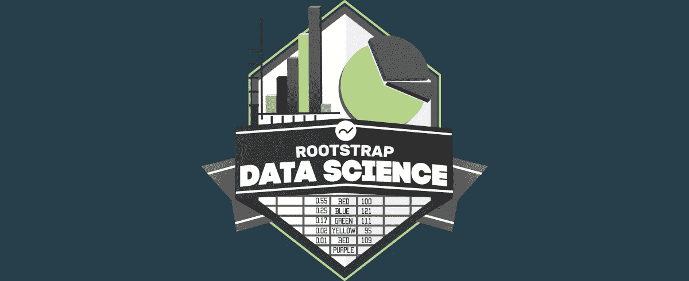
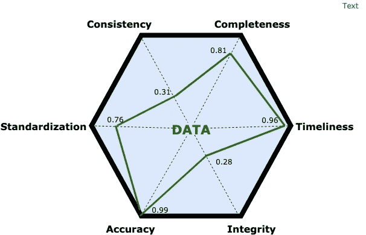

# 数据去神秘化—数据质量

> 原文：<https://towardsdatascience.com/data-demystified-data-quality-d8c699b678a2?source=collection_archive---------16----------------------->

Data Quality

## 从概念上解释它的真正含义，以及它为什么重要

本文概述了一个围绕数据质量组织我们工作的思维框架。参考著名的 [DIKW 金字塔](/rootstrap-dikw-model-32cef9ae6dfb)，数据质量是使我们能够获取原始数据并从原始数据开始使用它来生成信息的促成因素。

在这篇文章中，我们将回顾一些常见的场景，回顾一些理论，最后为面临这个日益普遍的问题的任何人提供一些建议。

## 为什么？

每秒钟产生的数据量几乎让人无法理解。目前的估计表明，每天有 2940 亿封电子邮件和 650 亿条 WhatsApp 信息被发送，所有这些都会留下数据痕迹。世界经济论坛估计，到 2020 年，数字世界有望达到 44 千兆字节。为了让你知道这是什么意思，看一下字节前缀，记住每个前缀都要乘以 1000: kilo、mega、giga、tera、peta、exa、zetta。

并非所有这些数据都是平等的。它以不同的形式出现，起初，它只是噪音。原始数据没有任何隐含的模式或意义。需要解读才有用。软件可以通过以不同的方式组织数据来帮助我们解释数据，无论是结构化的还是非结构化的。

但是软件是人做的，它在现实生活中运行。我们知道这意味着什么:人会犯错，世界会改变，程序有 bug，数据有质量问题。一直，一直，一直。

糟糕的数据质量会导致不准确和缓慢的决策。这不会一蹴而就，因为数据质量往往会随着时间的推移而下降。像其他任何东西一样，它遵循热力学第二定律:一个孤立系统的总熵永远不会随时间减少。

这是我们无法避免的。但是我们可以创建流程来识别问题、处理和提高数据质量，并确保我们在流程的每个阶段都增值。请记住，在处理数据时，我们的目标是生成信息，而不是简单地收集随机噪声。

## 我们在哪里？

第一步是了解我们在哪里，我们想去哪里。我们的衡量标准是什么？我们的商业目标是什么？我们的数据有多好？

为此，我们必须了解以下数据质量标准:

*   *:当数据符合预期时，认为数据是完整的。我们可能有可选的数据，但是缺乏完整性意味着我们错过了我们想要的信息。*
*   ****一致性*** :如果我们在两个或更多不同的地方有关于同一事物的矛盾或冲突的信息，数据被认为是不一致的。*
*   **:信息在预期的时候是否可用？例如，错误发生 5 小时后仍可访问的错误日志报告是不可接受的。**
*   *****完整性*** :这个概念指的是设计良好的数据和系统。例如，在关系数据库中，这意味着没有孤立的记录或语义链接数据之间缺乏链接。**
*   *****准确性:*** 这意味着我们存储的东西应该足够准确，能够反映真实的生活价值。如果我们存储了一个人的错误生日，就会出现准确性问题。**
*   ****在关系模型中，不同的规范化方式是标准。很多时候，您最终会有意识地对数据进行反规范化(例如，为了提高性能)，但是应该使用可以纳入您自己的标准中的客观论据来做出决定。日期格式等其他细节在这里很重要。****

## **我们如何测量这些尺寸？**

**不幸的是，这个问题没有唯一的答案或灵丹妙药。我的建议通常是根据项目的实际情况创建一个算法。该算法可以接受输入并给每个维度打分，例如，在 0 和 1 之间。有多种方法可以处理大量数据并计算这些分数，或者您甚至可以选择数据库中有代表性的部分进行处理。启发式和常识在这里非常有价值。以编程的方式进行测试，可以确保您可以一遍又一遍地运行相同的测试，并比较结果。**

**理想情况下，在专业流程中，您应该得到如下输出:**

****

**Data Score Diagnosis**

**迈出关键的第一步后，我们可以开始给每个维度分配权重。权重很重要，因为它使数据与我们的现实情况更加相关:一些数据质量标准对实现我们的业务目标可能很重要，而其他标准对我们来说可能不太重要。与利益相关者一起完成的这一分析应该有助于突出通向明智决策的途径。它应该与你的优先事项相关联，并阐明你接下来最重要的步骤。**

## **下一步是什么？**

**缩小你的关注点后，你就可以决定你是否真的有问题了。如果你这样做了，你可以在每一个维度上一次做一件事，使用任何最适合这种情况的技术。**

**这方面的一个例子是使用 Python 的 Panda 库来读取和处理文件或关系数据库，创建将增加一个数据质量维度的转换，然后将新数据再次推送到原始数据库。**

**另一种方法可能是通过跟踪代码中的算法来减轻未来的数据问题，或者甚至意识到数据库设计本身需要调整。**

**我们将在下一篇文章中探讨其中的一些技术。但是作为一个概念模型，这应该作为任何系统化数据质量工作的基础。**

# **参考**

1.  **拉塞尔·l·阿科夫，“从数据到智慧”，《应用系统分析杂志》16(1989):3–9。**
2.  **哈兰德·克利夫兰，“作为资源的信息”，《未来学家》，1982 年 12 月，第 34-39 页。**
3.  **Arkady Maydanchim，“数据质量评估”，2007 年 9 月 15 日**
4.  **Bernard Marr，《福布斯》，[“我们每天创造多少数据？”](https://www.forbes.com/sites/bernardmarr/2018/05/21/how-much-data-do-we-create-every-day-the-mind-blowing-stats-everyone-should-read/#2cf97cb160ba)**
5.  **Jeff Desjardins，WeForum，[“每天产生多少数据？”](https://www.weforum.org/agenda/2019/04/how-much-data-is-generated-each-day-cf4bddf29f/)**