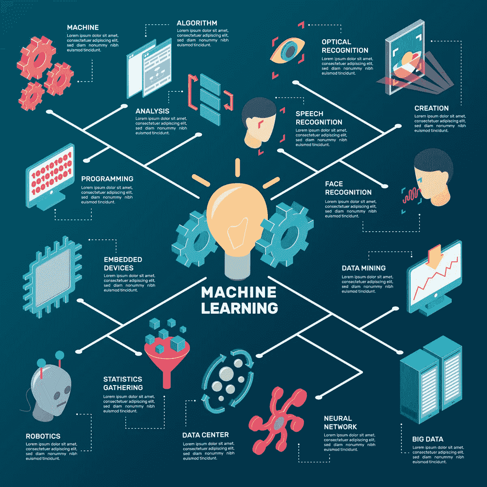
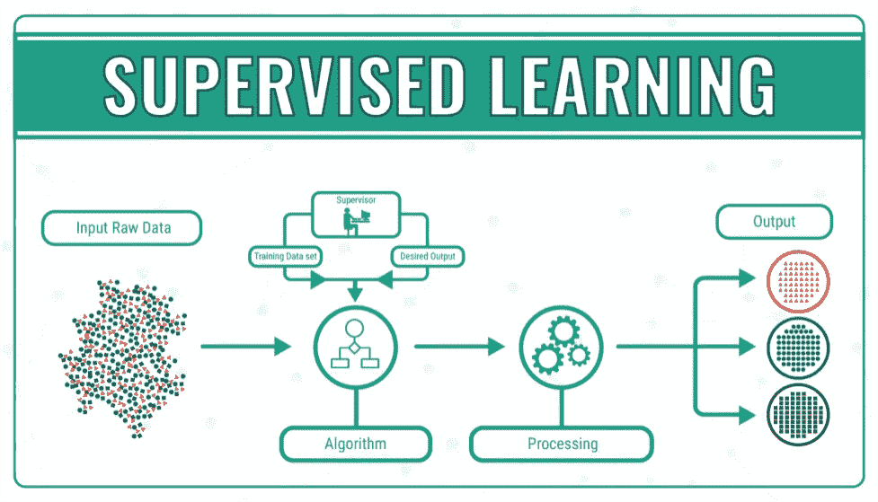
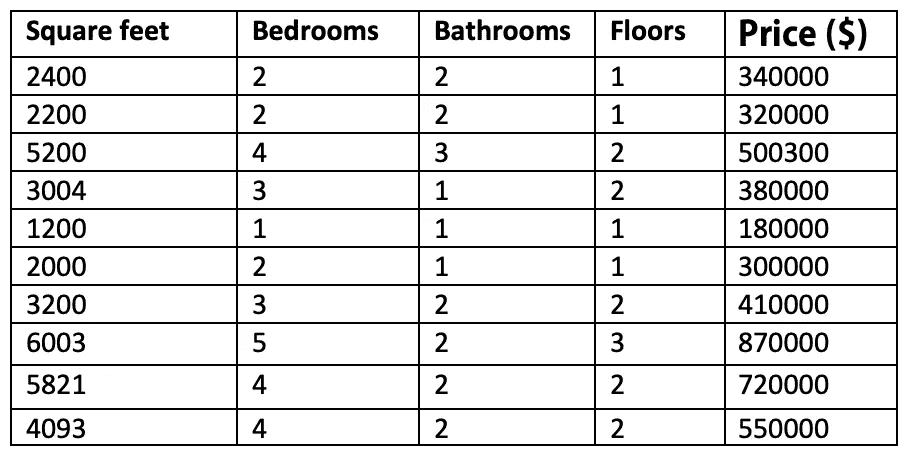

# 数据去神秘化——机器学习

> 原文：<https://towardsdatascience.com/data-demystified-machine-learning-3b40ec435ff2?source=collection_archive---------14----------------------->

## 机器学习领域的鸟瞰图

本文的主要目标是涵盖机器学习的最重要的概念，并展示其前景。读者将具有理解哪种解决方案与特定类型的问题相匹配的眼光，并且在深入到现实生活的项目中之后，应该能够找到更具体的知识。

## 什么是机器学习？

我将从一个 60 年前的定义开始，但今天仍然有效:

> 机器学习是在没有明确编程的情况下赋予计算机学习能力的研究领域。
> 
> 阿瑟·塞缪尔(1959)

这个名字是不言自明的，它的定义也强化了同样的概念。

Machine learning ecosystem

对于那些喜欢更像数学的定义的人，我们可以参考 1998 年的定义:

> 如果一个计算机程序在 T 上的性能(由 P 测量)随着经验 E 而提高，则称该程序从关于某个任务 T 和某个性能测量 P 的经验 E 中学习。
> 
> 汤姆·米切尔(1998)

让我们用一个典型的例子来阐明这些概念:将一封电子邮件分类为垃圾邮件或不是垃圾邮件。我们通常会做的是:

1.  任务是对电子邮件进行分类
2.  体验 **E** 正在观察用户如何手动分类他们的电子邮件，将它们标记为垃圾邮件。
3.  量度 P 是被正确分类为垃圾邮件的电子邮件的百分比。

如果 P 随着时间的推移而提高，我们就有了机器学习。

我们有两个主要类别的机器学习:监督和非监督学习。

# 监督学习

这意味着我们有一个训练集:一个“正确价值观”的列表。我们将接收一个输入(通常是一个向量)，主要目标是训练算法能够使用这些值训练其学习机制，最终能够预测看不见的情况。

Supervised learning through manual categorization

一些例子可能是:

*   根据房产的大小和舒适程度预测其价格。
*   识别图像中的对象
*   根据以前的考试结果预测学生在考试中的分数。

训练集可能很大，但为了简单起见，这是一个真正简单的训练集的样子。

Real Estate properties

每一列代表训练集的一个输入，价格代表输出。我们的目标是创建一个算法，随着时间的推移(经验 **E** )将变得更好，预测价格(**任务 T** )，将误差最小化。

有各种各样的监督学习算法可用，每种算法都有其优点和缺点。没有一种单一的学习算法能最好地解决所有的监督学习问题。

一些最常见的是:

*   线性回归
*   逻辑回归
*   朴素贝叶斯
*   神经网络
*   决策树

# 无监督学习

它也被称为自组织，允许对给定输入的概率密度进行建模。基本上，它试图检测数据中的模式。

假设我们有一个数据集，但没有人告诉我们每个数据点是什么。相反，我们只是被告知，这是一组数据。我们问我们的算法是否能在数据中找到某种结构。

例如，无监督学习算法可能决定数据位于两个不同的群集中。

使用聚类的一个例子是在谷歌新闻中，如果你以前没看过，你可以去 news.google.com 这个网址看看。谷歌新闻所做的是每天查看网上成千上万或成千上万的新故事，并把它们组合成连贯的新闻故事。

无监督学习中最常用的一些算法有:

*   使聚集
*   异常检测
*   一些种类的神经网络，像 Hebbian 学习或生成对抗网络
*   盲信号分离技术

无监督学习允许我们在很少或根本不知道我们的结果应该是什么样的情况下处理问题。我们可以从数据中推导出结构，而不一定知道变量的影响。

# 什么是正确的方法？

没有灵丹妙药。了解多种技术和每种技术可以解决的问题是最重要的技能。

下面，我们可以看到许多不同的问题和算法，你应该进一步研究解决它们。

## 回归和聚类

*   基于大量输入估计数字输出:线性回归
*   基于输入估计类别:逻辑回归
*   将 *n* 个观察值划分为 *k* 个聚类:K-均值
*   发现异常值(异常检测):DBSCAN 算法

## 分类

*   复杂关系，**魔法**:神经网络
*   基于邻近度的组成员关系:K-NN。
*   非连续数据(if/then/else):决策树
*   随机查找最佳分割:随机森林
*   最大间隔分类器(**非常**重要):SVM
*   用新信息逐步更新知识:朴素贝叶斯

## 特征约简

*   可视化高维数据:t 分布随机邻居嵌入
*   将特征空间提取为描述最大方差的分量:主分量分析
*   理解交叉关系矩阵:典型相关分析。
*   区分类别的特征的线性组合:线性判别分析。

# 一些你必须知道的概念

## 神经网络

它们受到我们生物神经元的启发。ANN(人工神经网络)基于称为人工神经元的连接单元或节点的集合，其松散地模拟生物大脑中的神经元。每个连接就像生物大脑中的突触一样，可以将信号从一个人工神经元传输到另一个人工神经元。接收到信号的人工神经元可以对其进行处理，然后向与之相连的其他人工神经元发送信号。

简而言之，神经网络是一个决策者。神经网络的拓扑结构有无限多种，有些种类最适合某些问题。这超出了本文的范围。

## 偏差方差权衡、欠拟合和过拟合

这是一组预测模型的特性，其中在参数估计中具有较低偏差的模型在样本间具有较高的参数估计方差，反之亦然。

偏差是来自学习算法中错误假设的误差。高偏差会导致算法错过特征和目标输出之间的相关关系(欠拟合)。

方差是对训练集中的小波动的敏感性的误差。高方差会导致算法模拟训练数据中的随机噪声，而不是预期的输出(过拟合)。

这种权衡适用于所有形式的监督学习。

## 准确度函数

在分类算法中，准确度定义了正确预测数与输入样本总数之间的比率。

## 精确函数

*正确识别实际阳性的比例是多少？*

## 回忆功能(也称为敏感度)

*实际阳性中有多少比例被正确识别？*

## 特异性函数

*多大比例的实际底片被正确识别？*

## 图书馆

以下库可以说是该领域中最重要的库:

*   熊猫
*   Scikit
*   张量流
*   PySpark
*   NumPy
*   散景
*   克拉斯
*   SciPy

# 摘要

本文概述了机器学习领域的许多不同领域。主要目的是激发兴趣，我们的读者可以更深入地了解这些领域。从字面上看，有成千上万个可能的专业化领域，这项技术正在给未来带来令人兴奋的机会。

# 参考

吴恩达，斯坦福大学的“机器学习”。

密歇根大学应用数据科学课程。

罗纳德·房龙(2018 年 2 月 5 日)。“机器学习解释:理解监督、非监督和强化学习”检索自[https://bigdata-madesimple.com](https://bigdata-madesimple.com/)。

熊猫数据库，从[https://pandas.pydata.org/](https://pandas.pydata.org/)检索

拉吉夫·乔普拉(2018)。《机器学习》，卡纳出版社。